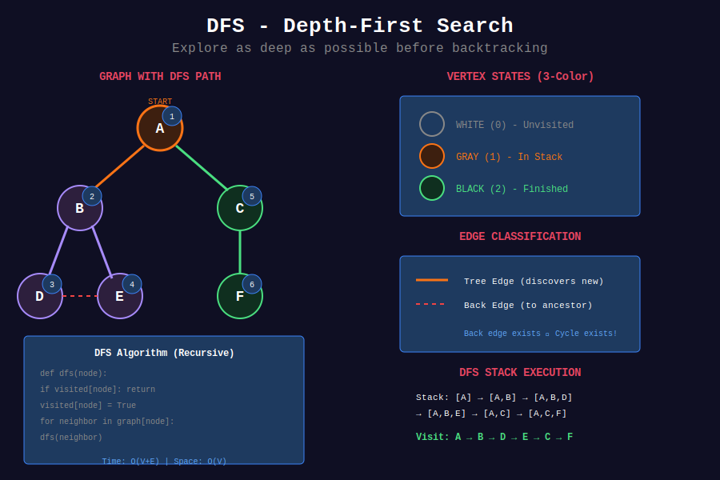
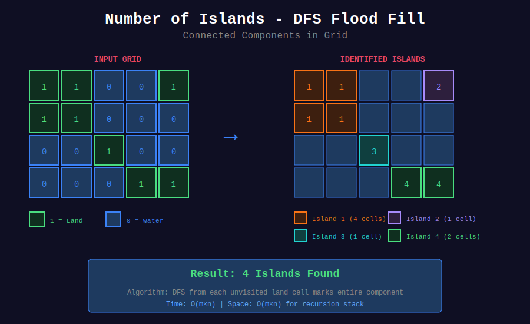

<div align="center">

# 🔍 DFS Problems

<p>
  
  
</p>

</div>

---

## 🧭 Navigation

| ⬅️ Previous | 📂 Current | ➡️ Next |
|:------------|:----------:|--------:|
| [← 02. BFS Problems](../02_bfs_problems/README.md) | **03. DFS Problems** | [04. Shortest Path →](../04_shortest_path/README.md) |

---

## 📐 Mathematical Foundations

### 1️⃣ DFS Time Complexity

$$\boxed{T(V, E) = O(V + E)}$$

**Stack space:** O(V) worst case for path length.

---

### 2️⃣ DFS Vertex States

| State | Meaning |
|-------|---------|
| White (0) | Unvisited |
| Gray (1) | Being processed (in stack) |
| Black (2) | Finished processing |

---

### 3️⃣ Edge Classification

| Edge Type | Condition |
|-----------|-----------|
| **Tree edge** | Discovers new vertex |
| **Back edge** | Points to ancestor (gray vertex) |
| **Forward edge** | Points to descendant |
| **Cross edge** | Points to unrelated vertex |

**Key:** Back edge exists ⟺ Cycle exists.

---

### 4️⃣ Discovery and Finish Times

$$d[u] < d[v] < f[v] < f[u] \text{ (v is descendant of u)}$$

**Parenthesis Theorem:** DFS forms valid nesting.

---

## 🎨 Visual Diagrams

<div align="center">



*DFS Depth-First Exploration with 3-Color States*



*Number of Islands - DFS Flood Fill*

</div>

---

## 💻 Code Implementations

```python
def numIslands(grid: list[list[str]]) -> int:
    """
    Number of Islands (LeetCode 200).
    
    DFS flood fill from each unvisited land cell.
    
    Time: O(mn), Space: O(mn)
    """
    if not grid:
        return 0
    
    m, n = len(grid), len(grid[0])
    count = 0
    
    def dfs(r, c):
        if r < 0 or r >= m or c < 0 or c >= n or grid[r][c] != '1':
            return
        grid[r][c] = '0'  # Mark visited
        dfs(r + 1, c)
        dfs(r - 1, c)
        dfs(r, c + 1)
        dfs(r, c - 1)
    
    for i in range(m):
        for j in range(n):
            if grid[i][j] == '1':
                dfs(i, j)
                count += 1
    
    return count

def pacificAtlantic(heights: list[list[int]]) -> list[list[int]]:
    """
    Pacific Atlantic Water Flow (LeetCode 417).
    
    DFS from ocean borders inward.
    
    Time: O(mn), Space: O(mn)
    """
    m, n = len(heights), len(heights[0])
    pacific = set()
    atlantic = set()
    
    def dfs(r, c, reachable, prev_height):
        if (r, c) in reachable:
            return
        if r < 0 or r >= m or c < 0 or c >= n:
            return
        if heights[r][c] < prev_height:
            return
        
        reachable.add((r, c))
        for dr, dc in [(0, 1), (0, -1), (1, 0), (-1, 0)]:
            dfs(r + dr, c + dc, reachable, heights[r][c])
    
    # DFS from Pacific (top and left borders)
    for c in range(n):
        dfs(0, c, pacific, heights[0][c])
    for r in range(m):
        dfs(r, 0, pacific, heights[r][0])
    
    # DFS from Atlantic (bottom and right borders)
    for c in range(n):
        dfs(m - 1, c, atlantic, heights[m-1][c])
    for r in range(m):
        dfs(r, n - 1, atlantic, heights[r][n-1])
    
    return list(pacific & atlantic)

def longestIncreasingPath(matrix: list[list[int]]) -> int:
    """
    Longest Increasing Path in Matrix (LeetCode 329).
    
    DFS with memoization.
    
    Time: O(mn), Space: O(mn)
    """
    m, n = len(matrix), len(matrix[0])
    memo = {}
    
    def dfs(r, c):
        if (r, c) in memo:
            return memo[(r, c)]
        
        result = 1
        for dr, dc in [(0, 1), (0, -1), (1, 0), (-1, 0)]:
            nr, nc = r + dr, c + dc
            if 0 <= nr < m and 0 <= nc < n and matrix[nr][nc] > matrix[r][c]:
                result = max(result, 1 + dfs(nr, nc))
        
        memo[(r, c)] = result
        return result
    
    return max(dfs(i, j) for i in range(m) for j in range(n))

def cloneGraph(node):
    """
    Clone Graph (LeetCode 133).
    
    DFS with hashmap for visited.
    
    Time: O(V+E), Space: O(V)
    """
    if not node:
        return None
    
    cloned = {}
    
    def dfs(node):
        if node in cloned:
            return cloned[node]
        
        clone = Node(node.val)
        cloned[node] = clone
        
        for neighbor in node.neighbors:
            clone.neighbors.append(dfs(neighbor))
        
        return clone
    
    return dfs(node)

def canVisitAllRooms(rooms: list[list[int]]) -> bool:
    """
    Keys and Rooms (LeetCode 841).
    
    DFS from room 0.
    
    Time: O(V+E), Space: O(V)
    """
    visited = set()
    
    def dfs(room):
        if room in visited:
            return
        visited.add(room)
        for key in rooms[room]:
            dfs(key)
    
    dfs(0)
    return len(visited) == len(rooms)

```

---

## 🏆 LeetCode Problems

### 🟡 Medium

| # | Problem | Pattern | Time | Space |
|:-:|---------|---------|:----:|:-----:|
| 130 | [Surrounded Regions](https://leetcode.com/problems/surrounded-regions/) | Border DFS | O(mn) | O(mn) |
| 133 | [Clone Graph](https://leetcode.com/problems/clone-graph/) | DFS + HashMap | O(V+E) | O(V) |
| 200 | [Number of Islands](https://leetcode.com/problems/number-of-islands/) | Flood Fill | O(mn) | O(mn) |
| 417 | [Pacific Atlantic Water Flow](https://leetcode.com/problems/pacific-atlantic-water-flow/) | Multi-source DFS | O(mn) | O(mn) |
| 547 | [Number of Provinces](https://leetcode.com/problems/number-of-provinces/) | DFS Components | O(n²) | O(n) |
| 695 | [Max Area of Island](https://leetcode.com/problems/max-area-of-island/) | DFS | O(mn) | O(mn) |
| 841 | [Keys and Rooms](https://leetcode.com/problems/keys-and-rooms/) | DFS | O(V+E) | O(V) |

### 🔴 Hard

| # | Problem | Pattern | Time | Space |
|:-:|---------|---------|:----:|:-----:|
| 329 | [Longest Increasing Path](https://leetcode.com/problems/longest-increasing-path-in-a-matrix/) | DFS + Memo | O(mn) | O(mn) |

---

## 📚 References

| Resource | Link |
|----------|------|
| **DFS** | [Wikipedia](https://en.wikipedia.org/wiki/Depth-first_search) |

---

<div align="center">

**Made with ❤️ by [Gaurav Goswami](https://github.com/Gaurav14cs17)**

</div>

---

## 🧭 Navigation

| ⬅️ Previous | 📂 Current | ➡️ Next |
|:------------|:----------:|--------:|
| [← 02. BFS Problems](../02_bfs_problems/README.md) | **03. DFS Problems** | [04. Shortest Path →](../04_shortest_path/README.md) |
