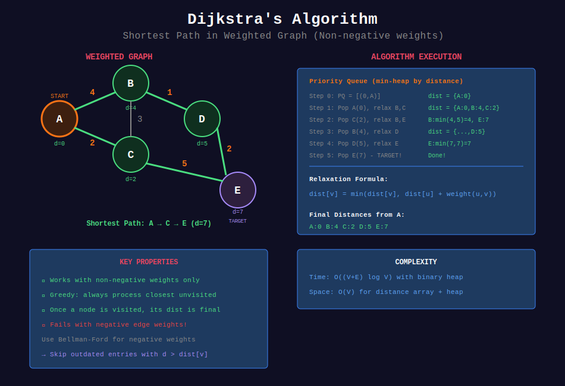
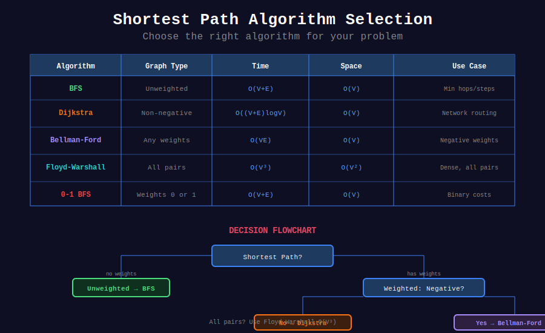

<div align="center">

# 🛤️ Shortest Path Algorithms

<p>
  
  
</p>

</div>

---

## 🧭 Navigation

| ⬅️ Previous | 📂 Current | ➡️ Next |
|:------------|:----------:|--------:|
| [← 03. DFS Problems](../03_dfs_problems/README.md) | **04. Shortest Path** | [05. Topological Sort →](../05_topological_sort/README.md) |

---

## 📐 Mathematical Foundations

### 1️⃣ Algorithm Comparison

| Algorithm | Graph Type | Time | Space |
|-----------|------------|:----:|:-----:|
| BFS | Unweighted | O(V+E) | O(V) |
| Dijkstra | Non-negative | O((V+E) log V) | O(V) |
| Bellman-Ford | Any | O(VE) | O(V) |
| Floyd-Warshall | All pairs | O(V³) | O(V²) |
| A* | Heuristic | O(E) best | O(V) |

---

### 2️⃣ Dijkstra's Algorithm

**Relaxation:**

```math
\text{dist}[v] = \min(\text{dist}[v], \text{dist}[u] + w(u,v))
```

**Correctness:** Greedy choice property - when $u$ is extracted, $\text{dist}[u]$ is optimal.

**Requirement:** All edge weights ≥ 0.

---

### 3️⃣ Bellman-Ford

**Iterate V-1 times:** Each iteration relaxes all edges.

```math
\text{After } k \text{ iterations: shortest paths using } \leq k \text{ edges}
```

**Negative cycle detection:** If any relaxation possible after V-1 iterations.

---

### 4️⃣ Floyd-Warshall

**Recurrence:**

```math
D^{(k)}[i][j] = \min(D^{(k-1)}[i][j], D^{(k-1)}[i][k] + D^{(k-1)}[k][j])
```

**Meaning:** Shortest $i \to j$ using vertices $\{1, \ldots, k\}$ as intermediates.

---

### 5️⃣ 0-1 BFS

**For graphs with edge weights 0 or 1:**

- Weight 0: add to front of deque
- Weight 1: add to back of deque

```math
T = O(V + E)
```

---

## 🎨 Visual Diagrams

<div align="center">



*Dijkstra's Algorithm - Shortest Path in Weighted Graphs*



*Shortest Path Algorithm Selection Guide*

</div>

---

## 💻 Code Implementations

```python
import heapq
from collections import deque

def dijkstra(graph: dict, start: int) -> dict:
    """
    Dijkstra's algorithm for shortest paths.
    
    Time: O((V+E) log V), Space: O(V)
    """
    dist = {start: 0}
    pq = [(0, start)]  # (distance, vertex)
    
    while pq:
        d, u = heapq.heappop(pq)
        
        if d > dist.get(u, float('inf')):
            continue  # Skip outdated entry
        
        for v, weight in graph.get(u, []):
            new_dist = d + weight
            if new_dist < dist.get(v, float('inf')):
                dist[v] = new_dist
                heapq.heappush(pq, (new_dist, v))
    
    return dist

def networkDelayTime(times: list[list[int]], n: int, k: int) -> int:
    """
    Network Delay Time (LeetCode 743).
    
    Dijkstra from source k.
    
    Time: O(E log V), Space: O(V+E)
    """
    graph = {i: [] for i in range(1, n + 1)}
    for u, v, w in times:
        graph[u].append((v, w))
    
    dist = dijkstra(graph, k)
    
    if len(dist) != n:
        return -1
    return max(dist.values())

def findCheapestPrice(n: int, flights: list[list[int]], 
                      src: int, dst: int, k: int) -> int:
    """
    Cheapest Flights Within K Stops (LeetCode 787).
    
    Modified Bellman-Ford with K+1 iterations.
    
    Time: O(K·E), Space: O(V)
    """
    dist = [float('inf')] * n
    dist[src] = 0
    
    for _ in range(k + 1):
        temp = dist.copy()
        for u, v, price in flights:
            if dist[u] != float('inf'):
                temp[v] = min(temp[v], dist[u] + price)
        dist = temp
    
    return dist[dst] if dist[dst] != float('inf') else -1

def bellmanFord(n: int, edges: list, start: int) -> list:
    """
    Bellman-Ford algorithm.
    
    Handles negative weights, detects negative cycles.
    
    Time: O(VE), Space: O(V)
    """
    dist = [float('inf')] * n
    dist[start] = 0
    
    # Relax V-1 times
    for _ in range(n - 1):
        for u, v, w in edges:
            if dist[u] != float('inf') and dist[u] + w < dist[v]:
                dist[v] = dist[u] + w
    
    # Check for negative cycle
    for u, v, w in edges:
        if dist[u] != float('inf') and dist[u] + w < dist[v]:
            return None  # Negative cycle detected
    
    return dist

def floydWarshall(n: int, edges: list) -> list[list[int]]:
    """
    Floyd-Warshall for all-pairs shortest paths.
    
    Time: O(V³), Space: O(V²)
    """
    INF = float('inf')
    dist = [[INF] * n for _ in range(n)]
    
    # Initialize
    for i in range(n):
        dist[i][i] = 0
    for u, v, w in edges:
        dist[u][v] = w
    
    # DP
    for k in range(n):
        for i in range(n):
            for j in range(n):
                dist[i][j] = min(dist[i][j], dist[i][k] + dist[k][j])
    
    return dist

def swimInWater(grid: list[list[int]]) -> int:
    """
    Swim in Rising Water (LeetCode 778).
    
    Modified Dijkstra: minimize max elevation on path.
    
    Time: O(n² log n), Space: O(n²)
    """
    n = len(grid)
    pq = [(grid[0][0], 0, 0)]
    visited = set()
    
    while pq:
        time, r, c = heapq.heappop(pq)
        
        if (r, c) in visited:
            continue
        visited.add((r, c))
        
        if r == n - 1 and c == n - 1:
            return time
        
        for dr, dc in [(0, 1), (0, -1), (1, 0), (-1, 0)]:
            nr, nc = r + dr, c + dc
            if 0 <= nr < n and 0 <= nc < n and (nr, nc) not in visited:
                heapq.heappush(pq, (max(time, grid[nr][nc]), nr, nc))
    
    return -1
```

---

## 🏆 LeetCode Problems

### 🟡 Medium

| # | Problem | Pattern | Time | Space |
|:-:|---------|---------|:----:|:-----:|
| 743 | [Network Delay Time](https://leetcode.com/problems/network-delay-time/) | Dijkstra | O(E log V) | O(V) |
| 787 | [Cheapest Flights](https://leetcode.com/problems/cheapest-flights-within-k-stops/) | Bellman-Ford | O(K·E) | O(V) |
| 1091 | [Shortest Path in Binary Matrix](https://leetcode.com/problems/shortest-path-in-binary-matrix/) | BFS | O(n²) | O(n²) |
| 1514 | [Path with Maximum Probability](https://leetcode.com/problems/path-with-maximum-probability/) | Dijkstra | O(E log V) | O(V) |

### 🔴 Hard

| # | Problem | Pattern | Time | Space |
|:-:|---------|---------|:----:|:-----:|
| 778 | [Swim in Rising Water](https://leetcode.com/problems/swim-in-rising-water/) | Modified Dijkstra | O(n² log n) | O(n²) |
| 882 | [Reachable Nodes In Subdivided Graph](https://leetcode.com/problems/reachable-nodes-in-subdivided-graph/) | Dijkstra | O(E log V) | O(V) |

---

## 📊 Algorithm Selection

```
Shortest Path
     |
     +-- Unweighted → BFS O(V+E)
     |
     +-- Non-negative weights → Dijkstra O((V+E) log V)
     |
     +-- Negative weights → Bellman-Ford O(VE)
     |
     +-- All pairs → Floyd-Warshall O(V³)
     |
     +-- 0-1 weights → 0-1 BFS O(V+E)
```

---

## 📚 References

| Resource | Link |
|----------|------|
| **Dijkstra** | [Wikipedia](https://en.wikipedia.org/wiki/Dijkstra%27s_algorithm) |
| **Bellman-Ford** | [Wikipedia](https://en.wikipedia.org/wiki/Bellman%E2%80%93Ford_algorithm) |
| **Floyd-Warshall** | [Wikipedia](https://en.wikipedia.org/wiki/Floyd%E2%80%93Warshall_algorithm) |

---

<div align="center">

**Made with ❤️ by [Gaurav Goswami](https://github.com/Gaurav14cs17)**

</div>

---

## 🧭 Navigation

| ⬅️ Previous | 📂 Current | ➡️ Next |
|:------------|:----------:|--------:|
| [← 03. DFS Problems](../03_dfs_problems/README.md) | **04. Shortest Path** | [05. Topological Sort →](../05_topological_sort/README.md) |
