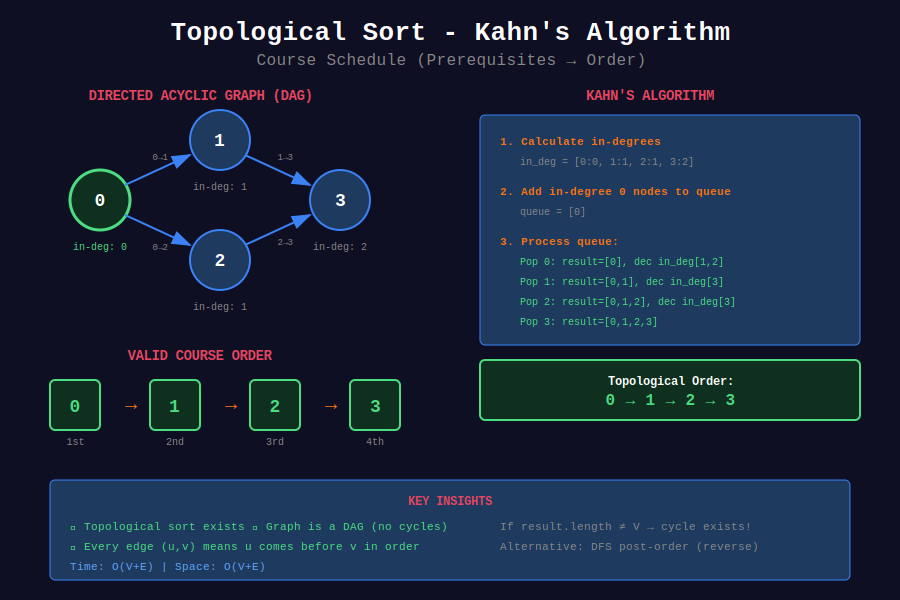

<div align="center">

# 📋 Topological Sort

<p>
  
  
</p>

</div>

---

## 🧭 Navigation

| ⬅️ Previous | 📂 Current | ➡️ Next |
|:------------|:----------:|--------:|
| [← 04. Shortest Path](../04_shortest_path/README.md) | **05. Topological Sort** | [06. Cycle Detection →](../06_cycle_detection/README.md) |

---

## 📐 Mathematical Foundations

### 1️⃣ Definition

**Topological ordering** of DAG $G = (V, E)$:

$$\text{Linear ordering of } V \text{ such that } (u, v) \in E \Rightarrow u \text{ appears before } v$$

**Exists iff:** Graph is a DAG (Directed Acyclic Graph).

---

### 2️⃣ Kahn's Algorithm (BFS)

1. Compute in-degree of all vertices

2. Add all vertices with in-degree 0 to queue

3. Process queue: add to result, decrease neighbors' in-degree

4. If any vertex becomes in-degree 0, add to queue

$$T = O(V + E)$$

---

### 3️⃣ DFS-based Topological Sort

**Post-order DFS gives reverse topological order.**

$$\text{topological order} = \text{reverse}(\text{finish order})$$

---

### 4️⃣ Number of Topological Orders

For DAG with $n$ vertices and $e$ edges:

$$\text{# of orders} \geq 1 \text{ if DAG}$$

Can be exponentially many (e.g., independent vertices).

---

## 🎨 Visual Diagrams

<div align="center">



*Kahn's Algorithm - Topological Sort with In-Degree*

</div>

---

## 💻 Code Implementations

```python
from collections import deque, defaultdict

def topologicalSortKahn(n: int, edges: list[list[int]]) -> list[int]:
    """
    Kahn's Algorithm (BFS-based).
    
    Process vertices with in-degree 0.
    
    Time: O(V+E), Space: O(V+E)
    """
    graph = defaultdict(list)
    in_degree = [0] * n
    
    for u, v in edges:
        graph[u].append(v)
        in_degree[v] += 1
    
    # Start with in-degree 0 vertices
    queue = deque([i for i in range(n) if in_degree[i] == 0])
    result = []
    
    while queue:
        u = queue.popleft()
        result.append(u)
        
        for v in graph[u]:
            in_degree[v] -= 1
            if in_degree[v] == 0:
                queue.append(v)
    
    # Check if valid topological order exists
    return result if len(result) == n else []

def topologicalSortDFS(n: int, edges: list[list[int]]) -> list[int]:
    """
    DFS-based Topological Sort.
    
    Reverse of post-order DFS.
    
    Time: O(V+E), Space: O(V+E)
    """
    graph = defaultdict(list)
    for u, v in edges:
        graph[u].append(v)
    
    # 0: unvisited, 1: visiting, 2: visited
    state = [0] * n
    result = []
    
    def dfs(u):
        if state[u] == 1:  # Cycle detected
            return False
        if state[u] == 2:  # Already processed
            return True
        
        state[u] = 1  # Visiting
        for v in graph[u]:
            if not dfs(v):
                return False
        
        state[u] = 2  # Visited
        result.append(u)
        return True
    
    for i in range(n):
        if state[i] == 0:
            if not dfs(i):
                return []
    
    return result[::-1]

def canFinish(numCourses: int, prerequisites: list[list[int]]) -> bool:
    """
    Course Schedule (LeetCode 207).
    
    Check if valid topological order exists.
    
    Time: O(V+E), Space: O(V+E)
    """
    graph = defaultdict(list)
    in_degree = [0] * numCourses
    
    for course, prereq in prerequisites:
        graph[prereq].append(course)
        in_degree[course] += 1
    
    queue = deque([i for i in range(numCourses) if in_degree[i] == 0])
    count = 0
    
    while queue:
        u = queue.popleft()
        count += 1
        
        for v in graph[u]:
            in_degree[v] -= 1
            if in_degree[v] == 0:
                queue.append(v)
    
    return count == numCourses

def findOrder(numCourses: int, prerequisites: list[list[int]]) -> list[int]:
    """
    Course Schedule II (LeetCode 210).
    
    Return topological order.
    
    Time: O(V+E), Space: O(V+E)
    """
    graph = defaultdict(list)
    in_degree = [0] * numCourses
    
    for course, prereq in prerequisites:
        graph[prereq].append(course)
        in_degree[course] += 1
    
    queue = deque([i for i in range(numCourses) if in_degree[i] == 0])
    result = []
    
    while queue:
        u = queue.popleft()
        result.append(u)
        
        for v in graph[u]:
            in_degree[v] -= 1
            if in_degree[v] == 0:
                queue.append(v)
    
    return result if len(result) == numCourses else []

def alienOrder(words: list[str]) -> str:
    """
    Alien Dictionary (LeetCode 269).
    
    Build graph from word comparisons, topological sort.
    
    Time: O(C) where C = total characters
    """
    # Build graph
    graph = defaultdict(set)
    in_degree = {c: 0 for word in words for c in word}
    
    for i in range(len(words) - 1):
        w1, w2 = words[i], words[i + 1]
        min_len = min(len(w1), len(w2))
        
        # Check for invalid case: prefix comes after
        if len(w1) > len(w2) and w1[:min_len] == w2[:min_len]:
            return ""
        
        for j in range(min_len):
            if w1[j] != w2[j]:
                if w2[j] not in graph[w1[j]]:
                    graph[w1[j]].add(w2[j])
                    in_degree[w2[j]] += 1
                break
    
    # Topological sort
    queue = deque([c for c in in_degree if in_degree[c] == 0])
    result = []
    
    while queue:
        c = queue.popleft()
        result.append(c)
        for neighbor in graph[c]:
            in_degree[neighbor] -= 1
            if in_degree[neighbor] == 0:
                queue.append(neighbor)
    
    return "".join(result) if len(result) == len(in_degree) else ""

```

---

## 🏆 LeetCode Problems

### 🟡 Medium

| # | Problem | Pattern | Time | Space |
|:-:|---------|---------|:----:|:-----:|
| 207 | [Course Schedule](https://leetcode.com/problems/course-schedule/) | Kahn's | O(V+E) | O(V+E) |
| 210 | [Course Schedule II](https://leetcode.com/problems/course-schedule-ii/) | Kahn's | O(V+E) | O(V+E) |
| 310 | [Minimum Height Trees](https://leetcode.com/problems/minimum-height-trees/) | Leaf Removal | O(V) | O(V) |
| 802 | [Find Eventual Safe States](https://leetcode.com/problems/find-eventual-safe-states/) | Reverse Topo | O(V+E) | O(V) |

### 🔴 Hard

| # | Problem | Pattern | Time | Space |
|:-:|---------|---------|:----:|:-----:|
| 269 | [Alien Dictionary](https://leetcode.com/problems/alien-dictionary/) | Topological Sort | O(C) | O(1) |

---

## 📚 References

| Resource | Link |
|----------|------|
| **Topological Sort** | [Wikipedia](https://en.wikipedia.org/wiki/Topological_sorting) |
| **Kahn's Algorithm** | [GeeksforGeeks](https://www.geeksforgeeks.org/topological-sorting-indegree-based-solution/) |

---

<div align="center">

**Made with ❤️ by [Gaurav Goswami](https://github.com/Gaurav14cs17)**

</div>

---

## 🧭 Navigation

| ⬅️ Previous | 📂 Current | ➡️ Next |
|:------------|:----------:|--------:|
| [← 04. Shortest Path](../04_shortest_path/README.md) | **05. Topological Sort** | [06. Cycle Detection →](../06_cycle_detection/README.md) |
