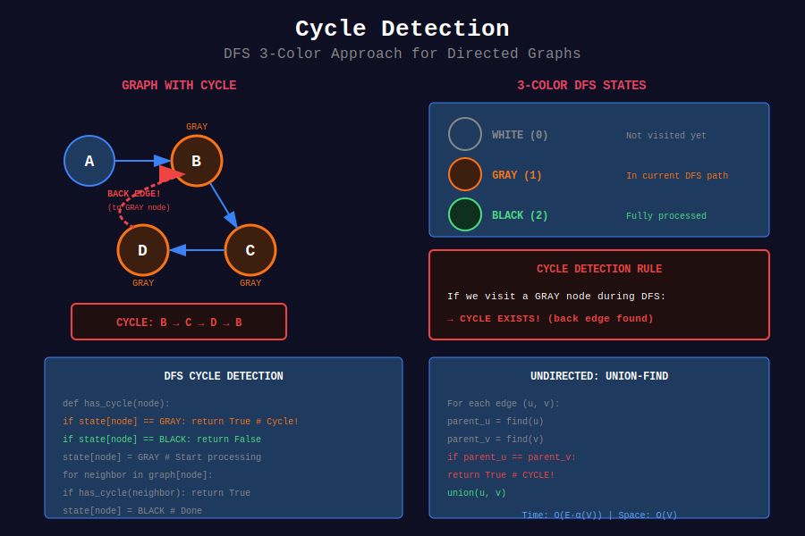

<div align="center">

# 🔄 Cycle Detection

<p>
  
  
</p>

</div>

---

## 🧭 Navigation

| ⬅️ Previous | 📂 Current | ➡️ Next |
|:------------|:----------:|--------:|
| [← 05. Topological Sort](../05_topological_sort/README.md) | **06. Cycle Detection** | [07. MST →](../07_mst/README.md) |

---

## 📐 Mathematical Foundations

### 1️⃣ Cycle in Directed Graph

**DFS with 3 states:**

- White (0): Unvisited

- Gray (1): In current DFS path

- Black (2): Finished

$$\text{Cycle exists} \Leftrightarrow \text{Back edge to gray vertex}$$

---

### 2️⃣ Cycle in Undirected Graph

**DFS:** If we visit a vertex already visited (not parent) → cycle.

**Union-Find:** If two vertices are already in same set → cycle.

---

### 3️⃣ Graph Valid Tree Condition

Graph with $n$ vertices is a tree iff:

1. Connected

2. Has exactly $n - 1$ edges

3. No cycles

$$\text{Tree} \Leftrightarrow |E| = |V| - 1 \land \text{connected}$$

---

### 4️⃣ Finding Cycle Length

Use BFS/DFS with distance tracking:

$$\text{cycle length} = \text{dist}[u] + \text{dist}[v] + 1$$

when back edge $(u, v)$ discovered.

---

## 🎨 Visual Diagrams

<div align="center">



*DFS 3-Color Cycle Detection in Directed Graphs*

</div>

---

## 💻 Code Implementations

```python
from collections import defaultdict

def hasCycleDirected(n: int, edges: list[list[int]]) -> bool:
    """
    Detect cycle in directed graph using DFS.
    
    Three states: 0=unvisited, 1=visiting, 2=visited.
    
    Time: O(V+E), Space: O(V)
    """
    graph = defaultdict(list)
    for u, v in edges:
        graph[u].append(v)
    
    state = [0] * n
    
    def dfs(u):
        if state[u] == 1:  # Back edge - cycle!
            return True
        if state[u] == 2:  # Already processed
            return False
        
        state[u] = 1  # Visiting
        for v in graph[u]:
            if dfs(v):
                return True
        
        state[u] = 2  # Visited
        return False
    
    return any(dfs(i) for i in range(n) if state[i] == 0)

def hasCycleUndirected(n: int, edges: list[list[int]]) -> bool:
    """
    Detect cycle in undirected graph using DFS.
    
    Track parent to avoid false positives.
    
    Time: O(V+E), Space: O(V)
    """
    graph = defaultdict(list)
    for u, v in edges:
        graph[u].append(v)
        graph[v].append(u)
    
    visited = set()
    
    def dfs(u, parent):
        visited.add(u)
        for v in graph[u]:
            if v not in visited:
                if dfs(v, u):
                    return True
            elif v != parent:  # Back edge to non-parent
                return True
        return False
    
    for i in range(n):
        if i not in visited:
            if dfs(i, -1):
                return True
    return False

class UnionFind:
    """Union-Find for cycle detection."""
    def __init__(self, n):
        self.parent = list(range(n))
        self.rank = [0] * n
    
    def find(self, x):
        if self.parent[x] != x:
            self.parent[x] = self.find(self.parent[x])
        return self.parent[x]
    
    def union(self, x, y):
        px, py = self.find(x), self.find(y)
        if px == py:
            return False  # Cycle detected!
        if self.rank[px] < self.rank[py]:
            px, py = py, px
        self.parent[py] = px
        if self.rank[px] == self.rank[py]:
            self.rank[px] += 1
        return True

def validTree(n: int, edges: list[list[int]]) -> bool:
    """
    Graph Valid Tree (LeetCode 261).
    
    Tree: n-1 edges and connected (no cycle).
    
    Time: O(E·α(V)), Space: O(V)
    """
    if len(edges) != n - 1:
        return False
    
    uf = UnionFind(n)
    for u, v in edges:
        if not uf.union(u, v):
            return False
    
    return True

def findRedundantConnection(edges: list[list[int]]) -> list[int]:
    """
    Redundant Connection (LeetCode 684).
    
    Find edge that creates cycle.
    
    Time: O(E·α(V)), Space: O(V)
    """
    n = len(edges)
    uf = UnionFind(n + 1)
    
    for u, v in edges:
        if not uf.union(u, v):
            return [u, v]
    
    return []

def eventualSafeNodes(graph: list[list[int]]) -> list[int]:
    """
    Find Eventual Safe States (LeetCode 802).
    
    Safe = not in any cycle.
    
    Time: O(V+E), Space: O(V)
    """
    n = len(graph)
    # 0=unvisited, 1=visiting, 2=safe
    state = [0] * n
    
    def dfs(u):
        if state[u] != 0:
            return state[u] == 2
        
        state[u] = 1  # Visiting
        for v in graph[u]:
            if not dfs(v):
                return False
        
        state[u] = 2  # Safe
        return True
    
    return [i for i in range(n) if dfs(i)]

```

---

## 🏆 LeetCode Problems

### 🟡 Medium

| # | Problem | Pattern | Time | Space |
|:-:|---------|---------|:----:|:-----:|
| 207 | [Course Schedule](https://leetcode.com/problems/course-schedule/) | Cycle in DAG | O(V+E) | O(V) |
| 261 | [Graph Valid Tree](https://leetcode.com/problems/graph-valid-tree/) | Union-Find | O(E·α) | O(V) |
| 684 | [Redundant Connection](https://leetcode.com/problems/redundant-connection/) | Union-Find | O(E·α) | O(V) |
| 802 | [Find Eventual Safe States](https://leetcode.com/problems/find-eventual-safe-states/) | DFS Coloring | O(V+E) | O(V) |

### 🔴 Hard

| # | Problem | Pattern | Time | Space |
|:-:|---------|---------|:----:|:-----:|
| 685 | [Redundant Connection II](https://leetcode.com/problems/redundant-connection-ii/) | Union-Find | O(E) | O(V) |

---

## 📊 Cycle Detection Selection

```
Cycle Detection
     |
     +-- Directed graph → DFS with 3 states
     |
     +-- Undirected graph → DFS with parent tracking
     |
     +-- Edge-by-edge → Union-Find

```

---

## 📚 References

| Resource | Link |
|----------|------|
| **Cycle Detection** | [GeeksforGeeks](https://www.geeksforgeeks.org/detect-cycle-in-a-graph/) |
| **Union-Find** | [Wikipedia](https://en.wikipedia.org/wiki/Disjoint-set_data_structure) |

---

<div align="center">

**Made with ❤️ by [Gaurav Goswami](https://github.com/Gaurav14cs17)**

</div>

---

## 🧭 Navigation

| ⬅️ Previous | 📂 Current | ➡️ Next |
|:------------|:----------:|--------:|
| [← 05. Topological Sort](../05_topological_sort/README.md) | **06. Cycle Detection** | [07. MST →](../07_mst/README.md) |
