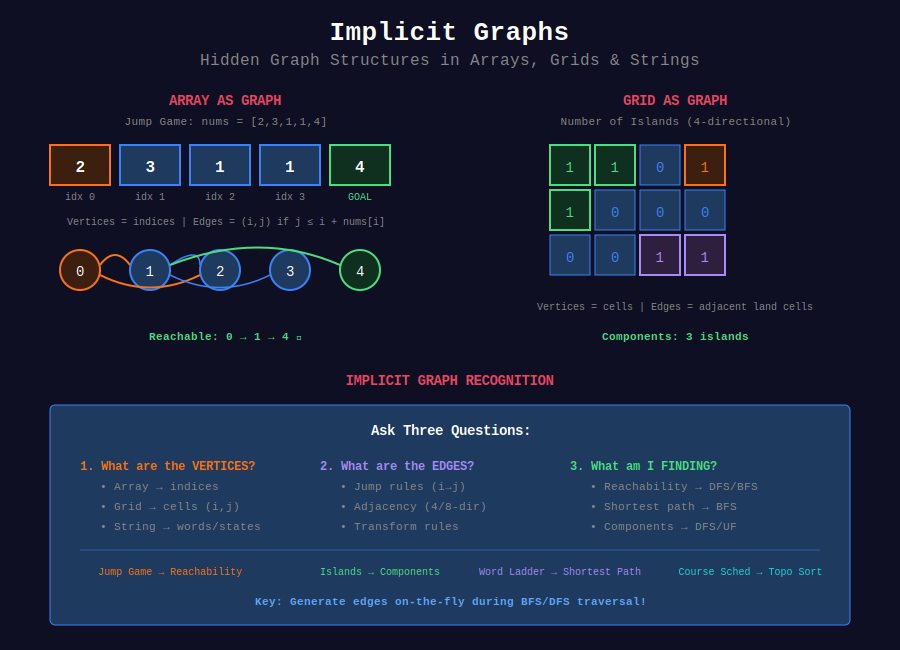

<div align="center">

# 🎭 Implicit Graph Problems

<p>
  
  
  
</p>

**Where Problems Never Say "Graph" But Relationships Create One**

*Master the art of recognizing hidden graphs in arrays, strings, grids, and more*

</div>

---

## 🧭 Navigation

| ⬅️ Previous | 📂 Current | ➡️ Next |
|:------------|:----------:|--------:|
| [← 07. MST](../07_mst/README.md) | **08. Implicit Graphs** | [🏠 Graphs Home](../README.md) |

---

## 📐 Mathematical Foundations

### 1️⃣ Definition: Implicit Graph

**Definition:** An implicit graph $G = (V, E)$ is one where:

- Vertices $V$ are not explicitly enumerated

- Edges $E$ are derived from problem constraints/rules

- Graph structure emerges from entity relationships

**Formal Construction:**

```math
G_{implicit} = (V, E) \text{ where } V = f(\text{input}), E = g(\text{rules})

```

**Example (Jump Game):**

- Input: Array $A = [2, 3, 1, 1, 4]$

- $V = \{0, 1, 2, 3, 4\}$ (indices)

- $E = \{(i, j) : j \leq i + A[i]\}$ (jump rules)

---

### 2️⃣ Reachability in Implicit Graphs

**Theorem:** For array-based implicit graph, reachability from $s$ to $t$ can be determined in $O(n)$ time.

**Proof:**

1. Graph has $|V| = n$ vertices (array indices)

2. Each vertex has at most $n$ outgoing edges

3. $|E| \leq n^2$ worst case

4. BFS/DFS: $O(|V| + |E|) = O(n + n^2) = O(n^2)$

5. With greedy optimization (Jump Game): $O(n)$ ∎

**Reachability Set:**

```math
\text{Reach}(s) = \{v \in V : \exists \text{ path } s \rightsquigarrow v\}

```

---

### 3️⃣ Shortest Path in Unweighted Implicit Graphs

**Theorem:** BFS finds shortest path in unweighted implicit graph.

**Proof:**

- Let $d(v)$ = distance from source to $v$

- BFS visits vertices in order of increasing $d(v)$

- When $v$ is dequeued, $d(v)$ is optimal

- No shorter path can exist (contradicts BFS property) ∎

**Distance Formula:**

```math
d(u, v) = \min\{k : \exists \text{ path of length } k \text{ from } u \text{ to } v\}

```

---

### 4️⃣ Connected Components in Grid Graphs

**Theorem:** Grid with $m \times n$ cells has at most $\lceil \frac{mn}{2} \rceil$ components.

**Proof:**

- Each component needs ≥ 2 cells (or isolated)

- Minimum component size = 1
- Maximum components = $mn$ (all isolated)

- Adjacent cells reduce count

- Checkerboard pattern gives $\lceil \frac{mn}{2} \rceil$ ∎

**Component Definition:**

```math
C_i = \{v \in V : v \text{ is reachable from seed } s_i\}
V = \bigcup_{i=1}^{k} C_i, \quad C_i \cap C_j = \emptyset \text{ for } i \neq j

```

---

### 5️⃣ Topological Sort Existence

**Theorem:** Topological sort exists ⟺ Graph is a DAG (Directed Acyclic Graph).

**Proof (⟸):**

- If DAG, no cycles exist

- Pick vertex with in-degree 0
- Remove and repeat

- Always possible (no cycle to block) ∎

**Proof (⟹):**

- Assume topo sort exists but cycle exists

- Let cycle: $v_1 \to v_2 \to \cdots \to v_k \to v_1$

- In topo order: $v_1$ before $v_2$ before ... before $v_k$ before $v_1$

- Contradiction: $v_1$ both before and after itself ∎

**Topological Order:**

```math
\forall (u, v) \in E : \text{pos}(u) < \text{pos}(v)

```

---

### 6️⃣ State Space Size

**Theorem:** For state space $(x_1, x_2, \ldots, x_k)$ with domains $D_1, D_2, \ldots, D_k$:

```math

|\text{States}| = \prod_{i=1}^{k} |D_i|

```

**Example (Sliding Puzzle 2×3):**

- States = permutations of 6 positions

- $|\text{States}| = 6! = 720$

- With constraints (e.g., parity): $\frac{6!}{2} = 360$

**State Transition Graph:**

```math
E = \{(s, s') : s' \text{ reachable from } s \text{ by one move}\}

```

---

### 7️⃣ Multi-Source BFS Optimality

**Theorem:** Multi-source BFS finds minimum distance to ANY source.

**Proof:**

- Initialize all sources with $d = 0$

- Standard BFS from virtual super-source

- Each vertex $v$ gets $d(v) = \min_{s \in S} d(s, v)$

- BFS guarantees optimality for each source ∎

**Multi-source Distance:**

```math
d_{multi}(v) = \min_{s \in S} d(s, v)

```

---

## 🎨 Visual Diagrams

<div align="center">



*Recognizing Hidden Graph Structures*

</div>

---

## 🎨 Visual Walkthroughs

### Pattern 1: Array as Graph (Jump Game)

```
+----------------------------------------------------------------+
| PROBLEM: Jump Game                                             |
| Input: nums = [2, 3, 1, 1, 4]                                  |
| Question: Can you reach the last index?                        |
+----------------------------------------------------------------+

| STEP 1: IDENTIFY THE GRAPH                                     |
|                                                                 |
| Array Indices (Physical):                                      |
| [2, 3, 1, 1, 4]                                                |
|  0  1  2  3  4                                                 |
|                                                                 |
| Graph Vertices (Logical):                                      |
| V = {0, 1, 2, 3, 4}                                            |
|                                                                 |
| Edge Rules:                                                     |
| (i, j) ∈ E ⟺ j ≤ i + nums[i]                                  |
|                                                                 |
| Build Edge Set:                                                 |
| From 0: can jump to [1, 2] (max 0+2=2)                        |
| From 1: can jump to [2, 3, 4] (max 1+3=4)                     |
| From 2: can jump to [3] (max 2+1=3)                           |
| From 3: can jump to [4] (max 3+1=4)                           |
|                                                                 |
| E = {(0,1), (0,2), (1,2), (1,3), (1,4), (2,3), (3,4)}          |
+----------------------------------------------------------------+

| STEP 2: DRAW THE GRAPH                                         |
|                                                                 |
|         +---+                                                   |
|    START| 0 |                                                   |
|         +-+-+                                                   |
|           |                                                     |
|       +---+----+                                                |
|       ▼        ▼                                                |
|     +---+    +---+                                             |
|     | 1 |----| 2 |                                             |
|     +-+-+    +-+-+                                             |
|       |        |                                                |
|   +---+----+   |                                                |
|   ▼   ▼    ▼   ▼                                                |
| +---++---++---+                                                |
| | 2 || 3 || 4 | ← GOAL                                         |
| +---++-+-++---+                                                |
|       |                                                         |
|       ▼                                                         |
|     +---+                                                       |
|     | 4 | ← GOAL                                               |
|     +---+                                                       |
+----------------------------------------------------------------+

| STEP 3: RECOGNIZE THE PROBLEM TYPE                             |
|                                                                 |
| Question: "Can you reach last index?"                          |
| Graph Question: "Is vertex 4 reachable from vertex 0?"         |
| Problem Type: REACHABILITY                                      |
| Algorithm: DFS or BFS                                           |
+----------------------------------------------------------------+

| STEP 4: SOLUTION (BFS)                                         |
|                                                                 |
| Initialize: queue = [0], visited = {0}                         |
|                                                                 |
| Iteration 1:                                                    |
|   Current = 0                                                   |
|   Neighbors = [1, 2]                                            |
|   queue = [1, 2], visited = {0, 1, 2}                          |
|                                                                 |
| Iteration 2:                                                    |
|   Current = 1                                                   |
|   Neighbors = [3, 4]                                            |
|   Found target 4! ✓                                             |
|                                                                 |
| Answer: TRUE (path exists: 0 → 1 → 4)                          |
+----------------------------------------------------------------+

```

---

### Pattern 2: Dependencies as DAG (Course Schedule)

```
+----------------------------------------------------------------+
| PROBLEM: Course Schedule                                        |
| Input: numCourses = 4, prerequisites = [[1,0],[2,0],[3,1],[3,2]]|
| Question: Can you finish all courses?                          |
+----------------------------------------------------------------+

| STEP 1: IDENTIFY THE GRAPH                                     |
|                                                                 |
| Vertices: V = {0, 1, 2, 3} (courses)                           |
|                                                                 |
| Edge Interpretation:                                            |
| [a, b] means "take course b BEFORE course a"                   |
| [1, 0] → edge: 0 → 1 (0 is prerequisite for 1)                |
|                                                                 |
| Build Edge List:                                                |
| [1,0] → 0 → 1                                                  |
| [2,0] → 0 → 2                                                  |
| [3,1] → 1 → 3                                                  |
| [3,2] → 2 → 3                                                  |
|                                                                 |
| E = {(0,1), (0,2), (1,3), (2,3)}                               |
+----------------------------------------------------------------+

| STEP 2: DRAW THE DIRECTED GRAPH                                |
|                                                                 |
|         +---+                                                   |
|         | 0 | (No prerequisites)                                |
|         +-+-+                                                   |
|           |                                                     |
|      +----+----+                                                |
|      ▼         ▼                                                |
|    +---+    +---+                                              |
|    | 1 |    | 2 |                                              |
|    +-+-+    +-+-+                                              |
|      |        |                                                 |
|      +---+----+                                                 |
|          ▼                                                      |
|        +---+                                                    |
|        | 3 |                                                    |
|        +---+                                                    |
|                                                                 |
| This is a DIRECTED ACYCLIC GRAPH (DAG)                         |
+----------------------------------------------------------------+

| STEP 3: RECOGNIZE THE PROBLEM TYPE                             |
|                                                                 |
| Question: "Can finish all courses?"                            |
| Graph Question: "Does this graph have a cycle?"                |
| Problem Type: CYCLE DETECTION in directed graph                |
| Algorithm: DFS with 3-color marking                            |
|                                                                 |
| Key Insight: Can finish all ⟺ No cycles exist                 |
+----------------------------------------------------------------+

| STEP 4: SOLUTION (DFS Cycle Detection)                         |
|                                                                 |
| Color States:                                                   |
| WHITE (0) = Unvisited                                           |
| GRAY  (1) = Currently being processed (in stack)               |
| BLACK (2) = Fully processed                                     |
|                                                                 |
| DFS from node 0:                                                |
|   color[0] = GRAY                                               |
|   Visit neighbor 1:                                             |
|     color[1] = GRAY                                             |
|     Visit neighbor 3:                                           |
|       color[3] = GRAY                                           |
|       No unvisited neighbors                                    |
|       color[3] = BLACK ✓                                        |
|     color[1] = BLACK ✓                                          |
|   Visit neighbor 2:                                             |
|     color[2] = GRAY                                             |
|     Visit neighbor 3: already BLACK (OK)                        |
|     color[2] = BLACK ✓                                          |
|   color[0] = BLACK ✓                                            |
|                                                                 |
| No GRAY node revisited → No cycle!                             |
| Answer: TRUE (can finish all courses)                          |
+----------------------------------------------------------------+

```

---

### Pattern 3: Grid as Graph (Number of Islands)

```
+----------------------------------------------------------------+
| PROBLEM: Number of Islands                                     |
| Input: grid = [['1','1','0','0','0'],                          |
|                ['1','1','0','0','0'],                          |
|                ['0','0','1','0','0'],                          |
|                ['0','0','0','1','1']]                          |
| Question: How many islands?                                    |
+----------------------------------------------------------------+

| STEP 1: IDENTIFY THE GRAPH                                     |
|                                                                 |
| Vertices: V = {(i,j) : grid[i][j] = '1'}                      |
|          All land cells                                         |
|                                                                 |
| Edge Rules (4-directional):                                    |
| ((i,j), (i',j')) ∈ E ⟺                                        |
|   - Both are land ('1')                                         |
|   - |i-i'| + |j-j'| = 1 (Manhattan distance = 1)              |
|                                                                 |
| Land Cells:                                                     |
| V = {(0,0),(0,1),(1,0),(1,1),(2,2),(3,3),(3,4)}                |
+----------------------------------------------------------------+

| STEP 2: VISUALIZE CONNECTIVITY                                 |
|                                                                 |
| Physical Grid:                                                  |
|   0 1 2 3 4                                                     |
| 0 ■ ■ □ □ □    ■ = land ('1')                                  |
| 1 ■ ■ □ □ □    □ = water ('0')                                 |
| 2 □ □ ■ □ □                                                     |
| 3 □ □ □ ■ ■                                                     |
|                                                                 |
| Graph View (Connected Components):                             |
|                                                                 |
| Island 1:                                                       |
| (0,0)--(0,1)                                                    |
|   |      |                                                      |
| (1,0)--(1,1)                                                    |
|                                                                 |
| Island 2:                                                       |
| (2,2)                                                           |
|                                                                 |
| Island 3:                                                       |
| (3,3)--(3,4)                                                    |
+----------------------------------------------------------------+

| STEP 3: RECOGNIZE THE PROBLEM TYPE                             |
|                                                                 |
| Question: "How many islands?"                                  |
| Graph Question: "How many connected components?"               |
| Problem Type: CONNECTED COMPONENTS                             |
| Algorithm: DFS or BFS (or Union-Find)                          |
+----------------------------------------------------------------+

| STEP 4: SOLUTION (DFS)                                         |
|                                                                 |
| count = 0                                                       |
| visited = set()                                                 |
|                                                                 |
| For each cell (i,j):                                            |
|   If grid[i][j]='1' AND (i,j) not visited:                     |
|     DFS from (i,j) → marks entire island                       |
|     count++                                                     |
|                                                                 |
| Execution:                                                      |
| Start (0,0): DFS visits {(0,0),(0,1),(1,0),(1,1)}              |
| count = 1                                                       |
|                                                                 |
| Start (2,2): DFS visits {(2,2)}                                 |
| count = 2                                                       |
|                                                                 |
| Start (3,3): DFS visits {(3,3),(3,4)}                           |
| count = 3                                                       |
|                                                                 |
| Answer: 3 islands                                               |
+----------------------------------------------------------------+

```

---

### Pattern 4: String Transformations (Word Ladder)

```
+----------------------------------------------------------------+
| PROBLEM: Word Ladder                                            |
| Input: beginWord = "hit", endWord = "cog"                      |
|        wordList = ["hot","dot","dog","lot","log","cog"]        |
| Question: Length of shortest transformation sequence?          |
+----------------------------------------------------------------+

| STEP 1: IDENTIFY THE GRAPH                                     |
|                                                                 |
| Vertices: V = {beginWord} ∪ wordList                           |
|          V = {"hit", "hot", "dot", "dog", "lot", "log", "cog"} |
|                                                                 |
| Edge Rules:                                                     |
| (w1, w2) ∈ E ⟺ w1 and w2 differ by exactly 1 character        |
|                                                                 |
| Check all pairs:                                                |
| "hit" - "hot": h≠h=false, i≠o=true, t=t → 1 diff ✓            |
| "hot" - "dot": h≠d=true, o=o, t=t → 1 diff ✓                  |
| "hot" - "lot": h≠l=true, o=o, t=t → 1 diff ✓                  |
| "dot" - "dog": d=d, o=o, t≠g=true → 1 diff ✓                  |
| "dog" - "cog": d≠c=true, o=o, g=g → 1 diff ✓                  |
| ... (continue for all pairs)                                    |
+----------------------------------------------------------------+

| STEP 2: DRAW THE GRAPH                                         |
|                                                                 |
|            hit (start)                                          |
|             |                                                   |
|             ▼                                                   |
|            hot                                                  |
|           ╱   ╲                                                 |
|          ▼     ▼                                                |
|        dot    lot                                               |
|         |      |                                                |
|         ▼      ▼                                                |
|        dog    log                                               |
|          ╲    ╱                                                 |
|           ▼  ▼                                                  |
|            cog (end)                                            |
|                                                                 |
| This is an UNWEIGHTED UNDIRECTED GRAPH                         |
| Each edge = 1 transformation                                    |
+----------------------------------------------------------------+

| STEP 3: RECOGNIZE THE PROBLEM TYPE                             |
|                                                                 |
| Question: "Shortest transformation sequence?"                  |
| Graph Question: "Shortest path from 'hit' to 'cog'?"          |
| Problem Type: SHORTEST PATH (unweighted)                       |
| Algorithm: BFS                                                  |
|                                                                 |
| Key: BFS guarantees shortest path in unweighted graph!         |
+----------------------------------------------------------------+

| STEP 4: SOLUTION (BFS)                                         |
|                                                                 |
| queue = [("hit", 1)]  # (word, length)                         |
| visited = {"hit"}                                               |
|                                                                 |
| BFS Level 0: "hit" (length=1)                                  |
|   Neighbors: "hot"                                              |
|   queue = [("hot", 2)]                                          |
|                                                                 |
| BFS Level 1: "hot" (length=2)                                  |
|   Neighbors: "dot", "lot"                                       |
|   queue = [("dot", 3), ("lot", 3)]                             |
|                                                                 |
| BFS Level 2: "dot" (length=3)                                  |
|   Neighbors: "dog"                                              |
|   queue = [("lot", 3), ("dog", 4)]                             |
|                                                                 |
| BFS Level 2: "lot" (length=3)                                  |
|   Neighbors: "log"                                              |
|   queue = [("dog", 4), ("log", 4)]                             |
|                                                                 |
| BFS Level 3: "dog" (length=4)                                  |
|   Neighbors: "cog"                                              |
|   Found target! Return 5                                        |
|                                                                 |
| Sequence: hit → hot → dot → dog → cog (5 words)                |
| Answer: 5                                                       |
+----------------------------------------------------------------+

```

---

## 💻 Code Implementations

### Implementation 1: Jump Game (Array Reachability)

```python
def can_jump(nums: List[int]) -> bool:
    """
    Jump Game - Array as implicit graph.
    
    Graph Construction:
    - Vertices: indices {0, 1, ..., n-1}
    - Edge (i,j): exists if j <= i + nums[i]
    
    Problem: Reachability from 0 to n-1
    
    Solution 1: Greedy (Optimal)
    Track the furthest reachable position.
    
    Time: O(n), Space: O(1)
    
    Proof of Correctness:
    - max_reach maintains furthest reachable position
    - If i > max_reach, vertex i is unreachable
    - If max_reach >= n-1, endpoint is reachable
    """
    n = len(nums)
    max_reach = 0
    
    for i in range(n):
        # If current position unreachable, fail
        if i > max_reach:
            return False
        
        # Update furthest reachable position
        # This is like exploring all edges from vertex i
        max_reach = max(max_reach, i + nums[i])
        
        # Early termination: can reach end
        if max_reach >= n - 1:
            return True
    
    return True

def can_jump_bfs(nums: List[int]) -> bool:
    """
    Jump Game - Explicit BFS approach.
    
    Shows graph nature more clearly!
    Less efficient but educational.
    
    Time: O(n^2) worst case, Space: O(n)
    """
    from collections import deque
    
    if len(nums) == 1:
        return True
    
    target = len(nums) - 1
    visited = set([0])
    queue = deque([0])
    
    while queue:
        curr = queue.popleft()
        
        # Try all possible jumps (all edges from curr)
        for next_pos in range(curr + 1, min(curr + nums[curr] + 1, len(nums))):
            if next_pos == target:
                return True
            
            if next_pos not in visited:
                visited.add(next_pos)
                queue.append(next_pos)
    
    return False

```

---

### Implementation 2: Course Schedule (Cycle Detection)

```python
def can_finish(numCourses: int, prerequisites: List[List[int]]) -> bool:
    """
    Course Schedule - DAG cycle detection.
    
    Graph Construction:
    - Vertices: courses {0, 1, ..., n-1}
    - Edge (a,b): prerequisite [b,a] means a→b
    
    Problem: Detect cycle in directed graph
    Can finish all courses ⟺ No cycles exist
    
    Solution: DFS with 3-color marking
    - WHITE (0): Unvisited
    - GRAY  (1): Currently in DFS path (visiting)
    - BLACK (2): Fully processed
    
    Cycle Detection: If we reach a GRAY node, cycle exists!
    
    Time: O(V + E), Space: O(V + E)
    
    Proof: If edge (u,v) in cycle, when processing u (GRAY),
    we'll reach v which is also GRAY → cycle detected.
    """
    from collections import defaultdict
    
    # Build adjacency list
    graph = defaultdict(list)
    for course, prereq in prerequisites:
        graph[course].append(prereq)
    
    # 0=WHITE(unvisited), 1=GRAY(visiting), 2=BLACK(done)
    state = [0] * numCourses
    
    def has_cycle(course):
        """DFS to detect cycle from this course."""
        if state[course] == 1:
            # Found GRAY node in path → cycle!
            return True
        if state[course] == 2:
            # Already processed, no cycle from here
            return False
        
        # Mark as visiting (GRAY)
        state[course] = 1
        
        # Check all prerequisites (neighbors in graph)
        for prereq in graph[course]:
            if has_cycle(prereq):
                return True
        
        # Mark as done (BLACK)
        state[course] = 2
        return False
    
    # Check each course (each connected component)
    for course in range(numCourses):
        if has_cycle(course):
            return False
    
    return True

def find_order(numCourses: int, prerequisites: List[List[int]]) -> List[int]:
    """
    Course Schedule II - Topological sort.
    
    Returns valid course order, or [] if impossible.
    
    Uses DFS post-order traversal for topological ordering.
    
    Time: O(V + E), Space: O(V + E)
    
    Topological Sort Property:
    For every edge (u,v), u appears before v in ordering.
    """
    from collections import defaultdict
    
    graph = defaultdict(list)
    for course, prereq in prerequisites:
        graph[course].append(prereq)
    
    state = [0] * numCourses
    order = []
    
    def dfs(course):
        if state[course] == 1:
            return False  # Cycle detected
        if state[course] == 2:
            return True  # Already processed
        
        state[course] = 1
        
        for prereq in graph[course]:
            if not dfs(prereq):
                return False
        
        state[course] = 2
        # Add to result in post-order (after all prerequisites)
        order.append(course)
        return True
    
    # Process all courses
    for course in range(numCourses):
        if not dfs(course):
            return []  # Cycle exists, impossible
    
    return order  # Already in valid topological order

```

---

### Implementation 3: Number of Islands (Grid Components)

```python
def num_islands(grid: List[List[str]]) -> int:
    """
    Number of Islands - Connected components in grid graph.
    
    Graph Construction:
    - Vertices: All cells (i,j) where grid[i][j] = '1'
    - Edge ((i,j), (i',j')): adjacent land cells
    
    Problem: Count connected components
    
    Solution: DFS from each unvisited land cell
    
    Time: O(m×n), Space: O(m×n)
    
    Each cell visited once → O(V)
    Each edge explored once → O(E)
    Total: O(V + E) = O(m×n)
    """
    if not grid:
        return 0
    
    m, n = len(grid), len(grid[0])
    islands = 0
    
    def dfs(i, j):
        """Mark all cells in current island as visited."""
        # Boundary check and water check
        if (i < 0 or i >= m or j < 0 or j >= n or 
            grid[i][j] != '1'):
            return
        
        # Mark as visited (modify in-place)
        grid[i][j] = '0'
        
        # Explore all 4 neighbors (edges in graph)
        dfs(i + 1, j)  # down
        dfs(i - 1, j)  # up
        dfs(i, j + 1)  # right
        dfs(i, j - 1)  # left
    
    # Try starting DFS from each cell
    for i in range(m):
        for j in range(n):
            if grid[i][j] == '1':
                dfs(i, j)  # Explore entire connected component
                islands += 1  # Found new island
    
    return islands

def num_islands_bfs(grid: List[List[str]]) -> int:
    """
    Number of Islands - BFS version.
    
    Same graph, different traversal.
    BFS explores component level by level.
    
    Time: O(m×n), Space: O(min(m,n))
    """
    from collections import deque
    
    if not grid:
        return 0
    
    m, n = len(grid), len(grid[0])
    islands = 0
    
    def bfs(start_i, start_j):
        """BFS to mark entire island."""
        queue = deque([(start_i, start_j)])
        grid[start_i][start_j] = '0'
        
        directions = [(0,1), (1,0), (0,-1), (-1,0)]
        
        while queue:
            i, j = queue.popleft()
            
            for di, dj in directions:
                ni, nj = i + di, j + dj
                
                if (0 <= ni < m and 0 <= nj < n and 
                    grid[ni][nj] == '1'):
                    grid[ni][nj] = '0'
                    queue.append((ni, nj))
    
    for i in range(m):
        for j in range(n):
            if grid[i][j] == '1':
                bfs(i, j)
                islands += 1
    
    return islands

```

---

### Implementation 4: Word Ladder (String Graph)

```python
def ladder_length(beginWord: str, endWord: str, 
                  wordList: List[str]) -> int:
    """
    Word Ladder - Shortest path in unweighted graph.
    
    Graph Construction:
    - Vertices: All words (beginWord + wordList)
    - Edge (w1,w2): words differ by exactly 1 character
    
    Problem: Shortest path from beginWord to endWord
    
    Solution: BFS (optimal for unweighted shortest path)
    
    Time: O(M^2 × N) where M=word length, N=word count
    Space: O(M × N)
    
    Optimization: Use pattern dictionary for faster neighbor finding
    """
    from collections import deque, defaultdict
    
    word_set = set(wordList)
    if endWord not in word_set:
        return 0
    
    queue = deque([(beginWord, 1)])
    visited = {beginWord}
    
    while queue:
        word, length = queue.popleft()
        
        if word == endWord:
            return length
        
        # Try changing each character (explore all edges)
        for i in range(len(word)):
            for c in 'abcdefghijklmnopqrstuvwxyz':
                next_word = word[:i] + c + word[i+1:]
                
                if next_word in word_set and next_word not in visited:
                    visited.add(next_word)
                    queue.append((next_word, length + 1))
    
    return 0

def ladder_length_optimized(beginWord: str, endWord: str,
                            wordList: List[str]) -> int:
    """
    Word Ladder - Optimized with pattern matching.
    
    Pattern: "hot" → "*ot", "h*t", "ho*"
    All words matching same pattern are neighbors!
    
    Time: O(M^2 × N), Space: O(M^2 × N)
    """
    from collections import deque, defaultdict
    
    if endWord not in wordList:
        return 0
    
    # Build pattern → words mapping
    patterns = defaultdict(list)
    wordList.append(beginWord)
    
    for word in wordList:
        for i in range(len(word)):
            pattern = word[:i] + '*' + word[i+1:]
            patterns[pattern].append(word)
    
    # BFS
    queue = deque([(beginWord, 1)])
    visited = {beginWord}
    
    while queue:
        word, length = queue.popleft()
        
        if word == endWord:
            return length
        
        # Check all patterns this word matches
        for i in range(len(word)):
            pattern = word[:i] + '*' + word[i+1:]
            
            # All words matching pattern are neighbors
            for next_word in patterns[pattern]:
                if next_word not in visited:
                    visited.add(next_word)
                    queue.append((next_word, length + 1))
    
    return 0

```

---

### Implementation 5: Rotting Oranges (Multi-source BFS)

```python
def oranges_rotting(grid: List[List[int]]) -> int:
    """
    Rotting Oranges - Multi-source BFS with time tracking.
    
    Graph Construction:
    - Vertices: All cells (i,j)
    - Edge: Adjacent cells
    - Special: Multiple starting points (all rotten oranges)
    
    Problem: Minimum time for rot to spread to all oranges
    
    Solution: Multi-source BFS
    - Start from ALL rotten oranges simultaneously
    - Track time/level in BFS
    
    Time: O(m×n), Space: O(m×n)
    
    Key: Multi-source BFS = BFS from virtual super-source
    connected to all sources with edge weight 0.
    """
    from collections import deque
    
    if not grid:
        return -1
    
    m, n = len(grid), len(grid[0])
    queue = deque()
    fresh_count = 0
    
    # Initialize: Add all rotten oranges to queue
    for i in range(m):
        for j in range(n):
            if grid[i][j] == 2:
                queue.append((i, j, 0))  # (row, col, time)
            elif grid[i][j] == 1:
                fresh_count += 1
    
    if fresh_count == 0:
        return 0  # No fresh oranges
    
    directions = [(0,1), (1,0), (0,-1), (-1,0)]
    max_time = 0
    
    # Multi-source BFS
    while queue:
        i, j, time = queue.popleft()
        max_time = max(max_time, time)
        
        # Spread rot to neighbors
        for di, dj in directions:
            ni, nj = i + di, j + dj
            
            if (0 <= ni < m and 0 <= nj < n and 
                grid[ni][nj] == 1):
                grid[ni][nj] = 2  # Becomes rotten
                fresh_count -= 1
                queue.append((ni, nj, time + 1))
    
    # Check if all fresh oranges rotted
    return max_time if fresh_count == 0 else -1

```

---

## 🏆 LeetCode Problems by Category

### 🎯 1D Arrays - Movement & Jumps

**Recognition:** Array with movement rules, indices as vertices

| # | Difficulty | Problem | Graph Type |
|:-:|:----------:|---------|------------|
| 55 | 🟡 Medium | [Jump Game](https://leetcode.com/problems/jump-game/) | Reachability |
| 45 | 🟡 Medium | [Jump Game II](https://leetcode.com/problems/jump-game-ii/) | Shortest path |
| 1306 | 🟡 Medium | [Jump Game III](https://leetcode.com/problems/jump-game-iii/) | Bidirectional |
| 1345 | 🔴 Hard | [Jump Game IV](https://leetcode.com/problems/jump-game-iv/) | Multi-edge |
| 1696 | 🟡 Medium | [Jump Game VI](https://leetcode.com/problems/jump-game-vi/) | Max path |
| 1871 | 🟡 Medium | [Jump Game VII](https://leetcode.com/problems/jump-game-vii/) | Range reachability |
| 139 | 🟡 Medium | [Word Break](https://leetcode.com/problems/word-break/) | String reachability |
| 140 | 🔴 Hard | [Word Break II](https://leetcode.com/problems/word-break-ii/) | All paths |
| 198 | 🟡 Medium | [House Robber](https://leetcode.com/problems/house-robber/) | Max path |
| 213 | 🟡 Medium | [House Robber II](https://leetcode.com/problems/house-robber-ii/) | Circular graph |
| 279 | 🟡 Medium | [Perfect Squares](https://leetcode.com/problems/perfect-squares/) | Number graph |
| 403 | 🔴 Hard | [Frog Jump](https://leetcode.com/problems/frog-jump/) | State space |
| 457 | 🟡 Medium | [Circular Array Loop](https://leetcode.com/problems/circular-array-loop/) | Cycle detection |
| 746 | 🟢 Easy | [Min Cost Climbing Stairs](https://leetcode.com/problems/min-cost-climbing-stairs/) | Weighted path |
| 1654 | 🟡 Medium | [Min Jumps to Reach Home](https://leetcode.com/problems/minimum-jumps-to-reach-home/) | State graph |

---

### 🔤 Strings - Transformations

**Recognition:** String transformations, states as vertices

| # | Difficulty | Problem | Graph Type |
|:-:|:----------:|---------|------------|
| 127 | 🔴 Hard | [Word Ladder](https://leetcode.com/problems/word-ladder/) | Shortest path |
| 126 | 🔴 Hard | [Word Ladder II](https://leetcode.com/problems/word-ladder-ii/) | All shortest paths |
| 433 | 🟡 Medium | [Min Genetic Mutation](https://leetcode.com/problems/minimum-genetic-mutation/) | Gene graph |
| 752 | 🟡 Medium | [Open the Lock](https://leetcode.com/problems/open-the-lock/) | State space |
| 753 | 🔴 Hard | [Cracking the Safe](https://leetcode.com/problems/cracking-the-safe/) | Eulerian path |
| 854 | 🔴 Hard | [K-Similar Strings](https://leetcode.com/problems/k-similar-strings/) | Permutation graph |
| 131 | 🟡 Medium | [Palindrome Partitioning](https://leetcode.com/problems/palindrome-partitioning/) | Partition tree |
| 472 | 🔴 Hard | [Concatenated Words](https://leetcode.com/problems/concatenated-words/) | Word graph |
| 691 | 🔴 Hard | [Stickers to Spell Word](https://leetcode.com/problems/stickers-to-spell-word/) | Coverage states |

---

### 🌊 Grids - Spatial Relationships

**Recognition:** 2D grid, cells as vertices, adjacency as edges

| # | Difficulty | Problem | Graph Type |
|:-:|:----------:|---------|------------|
| 200 | 🟡 Medium | [Number of Islands](https://leetcode.com/problems/number-of-islands/) | Components |
| 994 | 🟡 Medium | [Rotting Oranges](https://leetcode.com/problems/rotting-oranges/) | Multi-source BFS |
| 733 | 🟢 Easy | [Flood Fill](https://leetcode.com/problems/flood-fill/) | DFS/BFS |
| 130 | 🟡 Medium | [Surrounded Regions](https://leetcode.com/problems/surrounded-regions/) | Border DFS |
| 417 | 🟡 Medium | [Pacific Atlantic Water Flow](https://leetcode.com/problems/pacific-atlantic-water-flow/) | Reverse BFS |
| 542 | 🟡 Medium | [01 Matrix](https://leetcode.com/problems/01-matrix/) | Multi-source BFS |
| 286 | 🟡 Medium | [Walls and Gates](https://leetcode.com/problems/walls-and-gates/) | Multi-source BFS |
| 695 | 🟡 Medium | [Max Area of Island](https://leetcode.com/problems/max-area-of-island/) | Component size |
| 1091 | 🟡 Medium | [Shortest Path in Binary Matrix](https://leetcode.com/problems/shortest-path-in-binary-matrix/) | 8-dir BFS |
| 1162 | 🟡 Medium | [As Far from Land as Possible](https://leetcode.com/problems/as-far-from-land-as-possible/) | Max distance |
| 827 | 🔴 Hard | [Making A Large Island](https://leetcode.com/problems/making-a-large-island/) | Component merge |
| 934 | 🟡 Medium | [Shortest Bridge](https://leetcode.com/problems/shortest-bridge/) | DFS + BFS |
| 490 | 🟡 Medium | [The Maze](https://leetcode.com/problems/the-maze/) | Directional BFS |
| 505 | 🟡 Medium | [The Maze II](https://leetcode.com/problems/the-maze-ii/) | Dijkstra |
| 778 | 🔴 Hard | [Swim in Rising Water](https://leetcode.com/problems/swim-in-rising-water/) | Binary search+BFS |

---

### 📊 Scheduling - Dependencies

**Recognition:** Prerequisites, dependencies, ordering

| # | Difficulty | Problem | Graph Type |
|:-:|:----------:|---------|------------|
| 207 | 🟡 Medium | [Course Schedule](https://leetcode.com/problems/course-schedule/) | Cycle detection |
| 210 | 🟡 Medium | [Course Schedule II](https://leetcode.com/problems/course-schedule-ii/) | Topological sort |
| 269 | 🔴 Hard | [Alien Dictionary](https://leetcode.com/problems/alien-dictionary/) | Topological sort |
| 310 | 🟡 Medium | [Minimum Height Trees](https://leetcode.com/problems/minimum-height-trees/) | Tree centers |
| 329 | 🔴 Hard | [Longest Increasing Path in Matrix](https://leetcode.com/problems/longest-increasing-path-in-a-matrix/) | DAG longest path |
| 444 | 🟡 Medium | [Sequence Reconstruction](https://leetcode.com/problems/sequence-reconstruction/) | Unique topo sort |
| 802 | 🟡 Medium | [Find Eventual Safe States](https://leetcode.com/problems/find-eventual-safe-states/) | Reverse topo |
| 1136 | 🟡 Medium | [Parallel Courses](https://leetcode.com/problems/parallel-courses/) | Critical path |
| 1203 | 🔴 Hard | [Sort Items by Groups](https://leetcode.com/problems/sort-items-by-groups-respecting-dependencies/) | Double topo sort |
| 2050 | 🔴 Hard | [Parallel Courses III](https://leetcode.com/problems/parallel-courses-iii/) | Weighted critical path |

---

### 👥 Relationships - Grouping

**Recognition:** Merge, group, equations, connections

| # | Difficulty | Problem | Graph Type |
|:-:|:----------:|---------|------------|
| 399 | 🟡 Medium | [Evaluate Division](https://leetcode.com/problems/evaluate-division/) | Weighted graph |
| 547 | 🟡 Medium | [Number of Provinces](https://leetcode.com/problems/number-of-provinces/) | Components |
| 721 | 🟡 Medium | [Accounts Merge](https://leetcode.com/problems/accounts-merge/) | Union-Find |
| 839 | 🟡 Medium | [Similar String Groups](https://leetcode.com/problems/similar-string-groups/) | Components |
| 990 | 🟡 Medium | [Satisfiability of Equality Equations](https://leetcode.com/problems/satisfiability-of-equality-equations/) | Union-Find |
| 947 | 🟡 Medium | [Most Stones Removed](https://leetcode.com/problems/most-stones-removed-with-same-row-or-column/) | Component size |
| 952 | 🔴 Hard | [Largest Component Size by Common Factor](https://leetcode.com/problems/largest-component-size-by-common-factor/) | Factor graph |
| 1202 | 🟡 Medium | [Smallest String With Swaps](https://leetcode.com/problems/smallest-string-with-swaps/) | Component sort |
| 128 | 🟡 Medium | [Longest Consecutive Sequence](https://leetcode.com/problems/longest-consecutive-sequence/) | Chain graph |
| 765 | 🔴 Hard | [Couples Holding Hands](https://leetcode.com/problems/couples-holding-hands/) | Cycle counting |

---

### 🎮 Puzzles - State Space

**Recognition:** Game boards, puzzles, configurations

| # | Difficulty | Problem | Graph Type |
|:-:|:----------:|---------|------------|
| 37 | 🔴 Hard | [Sudoku Solver](https://leetcode.com/problems/sudoku-solver/) | State space DFS |
| 51 | 🔴 Hard | [N-Queens](https://leetcode.com/problems/n-queens/) | State space DFS |
| 52 | 🔴 Hard | [N-Queens II](https://leetcode.com/problems/n-queens-ii/) | State counting |
| 773 | 🔴 Hard | [Sliding Puzzle](https://leetcode.com/problems/sliding-puzzle/) | State BFS |
| 818 | 🔴 Hard | [Race Car](https://leetcode.com/problems/race-car/) | State space |
| 864 | 🔴 Hard | [Shortest Path to Get All Keys](https://leetcode.com/problems/shortest-path-to-get-all-keys/) | State+bitmask |
| 913 | 🔴 Hard | [Cat and Mouse](https://leetcode.com/problems/cat-and-mouse/) | Game theory |
| 301 | 🔴 Hard | [Remove Invalid Parentheses](https://leetcode.com/problems/remove-invalid-parentheses/) | State BFS |
| 1210 | 🔴 Hard | [Minimum Moves to Reach Target with Rotations](https://leetcode.com/problems/minimum-moves-to-reach-target-with-rotations/) | Snake state |
| 1263 | 🔴 Hard | [Minimum Moves to Move a Box](https://leetcode.com/problems/minimum-moves-to-move-a-box-to-their-target-location/) | 4D state |

---

## 🎓 Pattern Recognition Guide

### Quick Recognition Framework

**Step 1: Identify Entities**

- Array problem? → Indices are vertices

- Grid problem? → Cells are vertices

- String problem? → States/words are vertices

- Scheduling? → Tasks are vertices

**Step 2: Find Relationships**

- Can move from i to j? → Edge (i,j)

- Adjacent cells? → Edge between cells

- Transform w1 to w2? → Edge (w1,w2)

- Dependency a→b? → Directed edge

**Step 3: Match Problem Type**

- "Can reach?" → Reachability (DFS/BFS)

- "Minimum steps?" → Shortest path (BFS)

- "Count groups?" → Components (DFS/Union-Find)

- "Valid order?" → Topological sort

- "Has cycle?" → Cycle detection

---

## 🎯 Practice Roadmap

### Phase 1: Foundation (Days 1-5)

**Goal:** Master basic recognition

1. **Jump Game** (#55) - 🎯 **START HERE**
   - Recognize: Array indices = vertices
   - Learn: Reachability with DFS/BFS
   - Time: 15 minutes

2. **Number of Islands** (#200)
   - Recognize: Grid cells = vertices
   - Learn: Connected components
   - Time: 20 minutes

3. **Course Schedule** (#207)
   - Recognize: Tasks = vertices, prerequisites = edges
   - Learn: Cycle detection
   - Time: 25 minutes

4. **Flood Fill** (#733)
   - Recognize: Simple DFS/BFS
   - Learn: Graph traversal basics
   - Time: 10 minutes

5. **Jump Game II** (#45)
   - Recognize: Shortest path problem
   - Learn: BFS optimization
   - Time: 20 minutes

**Milestone:** Can identify graph in 3 different disguises

---

### Phase 2: Pattern Recognition (Days 6-12)

**Goal:** Recognize common patterns quickly

6. **Word Ladder** (#127)
   - Pattern: String transformation = graph
   - Learn: BFS for shortest path
   - Time: 30 minutes

7. **Rotting Oranges** (#994)
   - Pattern: Spreading = multi-source BFS
   - Learn: Time-based BFS
   - Time: 25 minutes

8. **Evaluate Division** (#399) - 🔥 **KEY PROBLEM**
   - Pattern: Equations = weighted graph
   - Learn: Path with weight multiplication
   - Time: 35 minutes

9. **01 Matrix** (#542)
   - Pattern: Distance from multiple sources
   - Learn: Multi-source BFS
   - Time: 25 minutes

10. **Accounts Merge** (#721)
    - Pattern: Grouping by relation
    - Learn: Union-Find
    - Time: 30 minutes

11. **Course Schedule II** (#210)
    - Pattern: Valid ordering
    - Learn: Topological sort
    - Time: 25 minutes

12. **Max Area of Island** (#695)
    - Pattern: Component size
    - Learn: DFS with counting
    - Time: 20 minutes

**Milestone:** Recognize pattern within 2 minutes of reading problem

---

### Phase 3: Advanced Patterns (Days 13-20)

**Goal:** Master complex disguises

13. **Alien Dictionary** (#269)
    - Pattern: Hidden ordering constraints
    - Learn: Derive graph from constraints
    - Time: 40 minutes

14. **Longest Increasing Path** (#329)
    - Pattern: Grid with ordering = DAG
    - Learn: DFS with memoization
    - Time: 35 minutes

15. **Minimum Height Trees** (#310)
    - Pattern: Tree centers
    - Learn: Trim leaves strategy
    - Time: 30 minutes

16. **Surrounded Regions** (#130)
    - Pattern: Border connectivity
    - Learn: Reverse thinking
    - Time: 25 minutes

17. **Pacific Atlantic Water Flow** (#417)
    - Pattern: Dual-source reachability
    - Learn: Reverse BFS from edges
    - Time: 35 minutes

18. **Making A Large Island** (#827)
    - Pattern: Component merging optimization
    - Learn: Label and merge
    - Time: 40 minutes

19. **Sliding Puzzle** (#773)
    - Pattern: State space graph
    - Learn: BFS on configurations
    - Time: 45 minutes

20. **Word Ladder II** (#126) - 🔥 **MASTERY PROBLEM**
    - Pattern: All shortest paths
    - Learn: BFS + DFS combination
    - Time: 50 minutes

**Milestone:** Can transform ANY problem to graph representation

---

### Phase 4: Interview Mastery (Days 21-25)

**Goal:** Speed and confidence

21. **Shortest Bridge** (#934) - Mixed DFS+BFS

22. **Similar String Groups** (#839) - String relationships

23. **Most Stones Removed** (#947) - Clever component analysis

24. **K-Similar Strings** (#854) - Complex state space

25. **Largest Component by Factor** (#952) - Number theory meets graphs

**Practice:**

- Solve in timed conditions (< 25 minutes)

- Explain approach verbally

- Code without hints

- Optimize space complexity

**Mastery Checklist:**

- [ ] Can identify implicit graph in < 3 minutes

- [ ] Know which algorithm for which pattern

- [ ] Can code BFS/DFS/Union-Find from memory

- [ ] Explain graph transformation clearly

- [ ] Recognize all 7 disguise categories

---

## 💭 Common Interview Questions

**Q: How do I know if a problem is secretly a graph?**  
A: Ask yourself: "Are there entities with relationships?" If yes, it's likely a graph. Look for words like "reach", "connect", "transform", "order", "group".

**Q: When should I use BFS vs DFS?**  
A: 

- **BFS** for shortest path in unweighted graphs, level-by-level exploration, minimum steps

- **DFS** for existence checks, all paths, cycle detection, easier to implement with recursion

**Q: Why didn't I recognize this was a graph problem?**  
A: Because problem never said "graph"! Practice the 3-question framework: (1) What are entities? (2) How related? (3) What am I finding?

**Q: Jump Game looks like DP to me. Why graph?**  
A: It CAN be solved with DP, but recognizing it as a graph (reachability) often leads to simpler, more intuitive solutions. Both viewpoints are valid!

**Q: How do I practice recognition?**  
A: For each problem, BEFORE solving, write down: "Vertices = ___", "Edges = ___", "Problem type = ___". This builds pattern recognition muscle.

**Q: I keep using DFS for shortest path and getting wrong answer. Why?**  
A: DFS doesn't guarantee shortest path! It might find a longer path first. Always use BFS for unweighted shortest path.

**Q: When do I need Union-Find vs DFS?**  
A: Union-Find is optimal for:

- Dynamic connectivity (edges added over time)

- Counting components efficiently

- Kruskal's MST
Use DFS when you need to explore the actual structure.

**Q: Array problem or graph problem - how to decide?**  
A: If the problem involves relationships between indices/values, think graph. Pure computation (sum, max) is usually just array manipulation.

**Q: What if I can't build the full graph (too large)?**  
A: That's implicit graphs! You don't build it. Generate edges on-the-fly during BFS/DFS. Example: Word Ladder generates neighbors during search.

**Q: How many graph problems should I solve?**  
A: For interviews: 30-40 problems covering all patterns. Use the roadmap above.

---

## 📚 References

| Resource | Link |
|----------|------|
| **Graph Theory Basics** | [CP-Algorithms](https://cp-algorithms.com/graph/breadth-first-search.html) |
| **Implicit Graphs** | [Codeforces Blog](https://codeforces.com/blog/entry/16221) |
| **BFS/DFS** | [GeeksforGeeks](https://www.geeksforgeeks.org/breadth-first-search-or-bfs-for-a-graph/) |
| **Topological Sort** | [CLRS Chapter 22](https://mitpress.mit.edu/books/introduction-algorithms-third-edition) |
| **Union-Find** | [Princeton Algorithms](https://algs4.cs.princeton.edu/15uf/) |
| **State Space Graphs** | [Wikipedia](https://en.wikipedia.org/wiki/State_space_search) |

---

## 💡 Key Insights

> **Recognition is 80% of the solution!**  
> Once you see the graph, the algorithm becomes obvious.

**The Hidden Graph Principle:**

```
Problem without "graph" keywords + Relationships = Hidden Graph

```

**Universal Recognition Questions:**

1. What are the entities? → **Vertices**

2. How are they related? → **Edges**

3. What am I finding? → **Algorithm**

**Master These Core Patterns:**

- 🎯 Array indices → Reachability/Shortest path

- 🌊 Grid cells → Components/BFS

- 🔤 Strings → Transformations

- 📊 Dependencies → Topological sort/Cycle detection

- 👥 Grouping → Union-Find/Components

- 🎮 States → State space search

---

<div align="center">

### 🎓 Master Implicit Graphs

*"The best programmers don't just solve problems—they recognize patterns."*

**120+ problems where relationships hide graphs**

**Made with ❤️ by [Gaurav Goswami](https://github.com/Gaurav14cs17)**

</div>

---

## 🧭 Navigation

| ⬅️ Previous | 📂 Current | ➡️ Next |
|:------------|:----------:|--------:|
| [← 07. MST](../07_mst/README.md) | **08. Implicit Graphs** | [🏠 Graphs Home](../README.md) |
