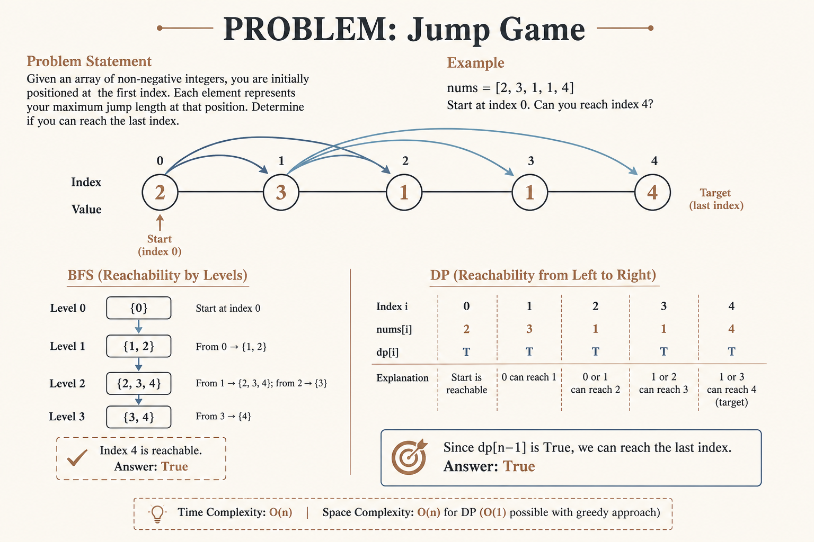
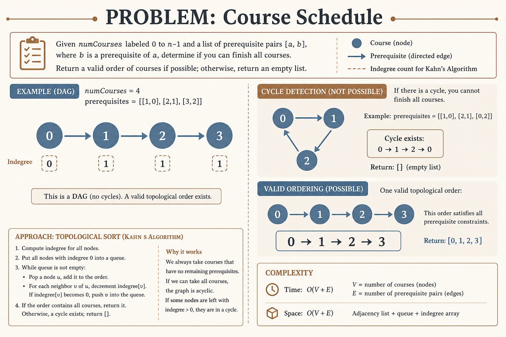
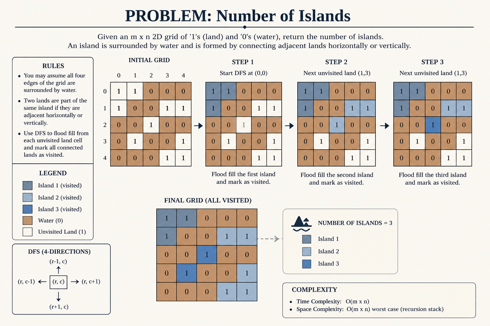
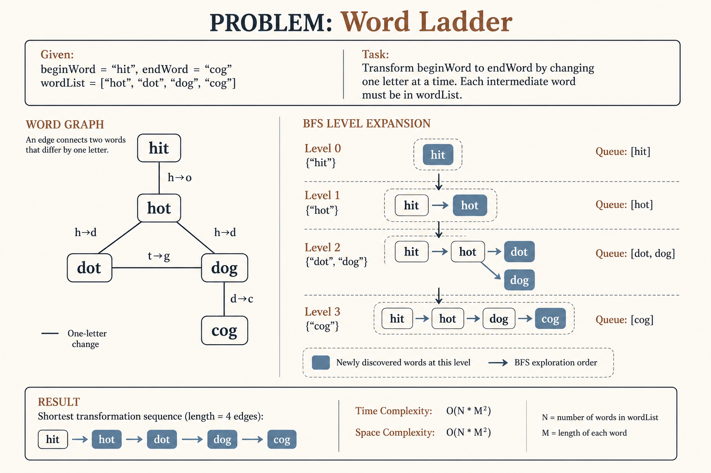
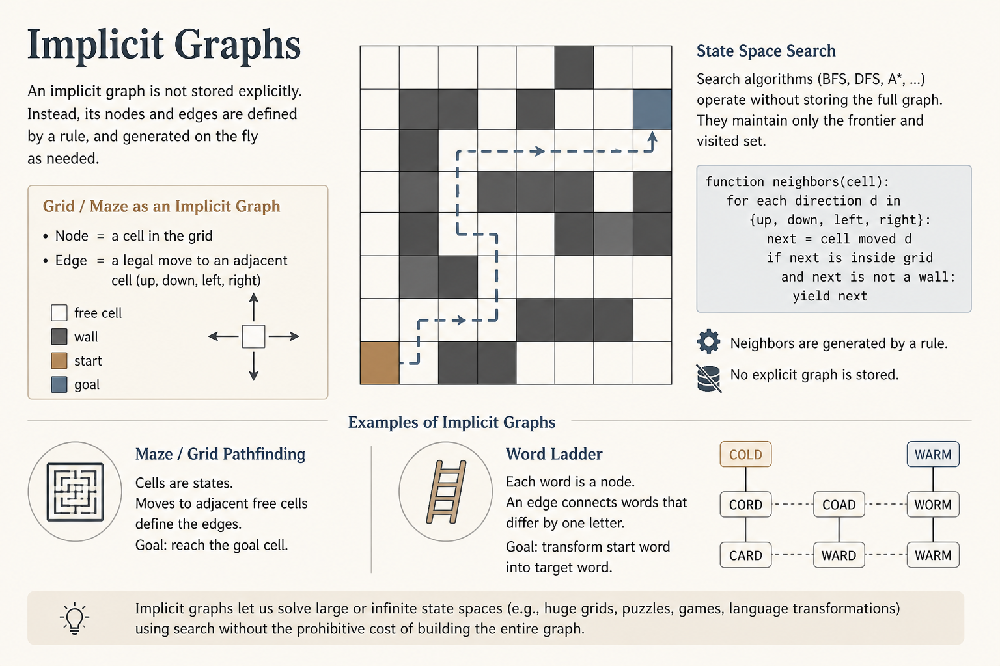

<div align="center">

# 🎭 Implicit Graph Problems

### *Where Problems Never Say "Graph" But Relationships Create One*

<p>
  
  
  
</p>

**Where Problems Never Say "Graph" But Relationships Create One**

*Master the art of recognizing hidden graphs in arrays, strings, grids, and more*

</div>

---

## 📊 Visual Overview

<div align="center">

### PROBLEM: Jump Game


### PROBLEM: Course Schedule


### PROBLEM: Number of Islands


### PROBLEM: Word Ladder


</div>

---

### Pattern 1: Array as Graph (Jump Game)

Each index is a node; an edge to `i + nums[i]` exists when in range. Reachability becomes a path problem (BFS/DFS or greedy).

---

### Pattern 2: Dependencies as DAG (Course Schedule)

Prerequisites form directed edges; a valid schedule exists iff the graph has no cycle (topological sort / Kahn's algorithm).

---

### Pattern 3: Grid as Graph (Number of Islands)

Each cell is a node; edges connect adjacent land cells (`4` or `8` directions). Connected components = islands.

---

## 🎯 At a Glance

| | |
|:---|:---|
| **In one line** | Where Problems Never Say "Graph" But Relationships Create One |
| **Difficulty** | Medium to Hard |
| **Problems** | 120+ |

> **How to use this page:** Start with the visual overview, scan **At a Glance**, then work through theory → walkthroughs → code.


## 🧭 Navigation

| ⬅️ Previous | 📂 Current | ➡️ Next |
|:------------|:----------:|--------:|
| [← 07. MST](../07_mst/README.md) | **08. Implicit Graphs** | [🏠 Graphs Home](../README.md) |


## 📐 Mathematical Foundation
### 1️⃣ Definition: Implicit Graph

**Definition:** An implicit graph $G = (V, E)$ is one where:

- Vertices $V$ are not explicitly enumerated

- Edges $E$ are derived from problem constraints/rules

- Graph structure emerges from entity relationships

**Formal Construction:**

$$G_{implicit} = (V, E) \text{ where } V = f(\text{input}), E = g(\text{rules})$$

**Example (Jump Game):**

- Input: Array $A = [2, 3, 1, 1, 4]$

- $V = \{0, 1, 2, 3, 4\}$ (indices)

- $E = \{(i, j) : j \leq i + A[i]\}$ (jump rules)

---

### 2️⃣ Reachability in Implicit Graphs

**Theorem:** For array-based implicit graph, reachability from $s$ to $t$ can be determined in $O(n)$ time.

**Proof:**

1. Graph has $|V| = n$ vertices (array indices)

2. Each vertex has at most $n$ outgoing edges

3. $|E| \leq n^2$ worst case

4. BFS/DFS: $O(|V| + |E|) = O(n + n^2) = O(n^2)$

5. With greedy optimization (Jump Game): $O(n)$ ∎

**Reachability Set:**

$$\text{Reach}(s) = \{v \in V : \exists \text{ path } s \rightsquigarrow v\}$$

---

### 3️⃣ Shortest Path in Unweighted Implicit Graphs

**Theorem:** BFS finds shortest path in unweighted implicit graph.

**Proof:**

- Let $d(v)$ = distance from source to $v$

- BFS visits vertices in order of increasing $d(v)$

- When $v$ is dequeued, $d(v)$ is optimal

- No shorter path can exist (contradicts BFS property) ∎

**Distance Formula:**

$$d(u, v) = \min\{k : \exists \text{ path of length } k \text{ from } u \text{ to } v\}$$

---

### 4️⃣ Connected Components in Grid Graphs

**Theorem:** Grid with $m \times n$ cells has at most $\lceil \frac{mn}{2} \rceil$ components.

**Proof:**

- Each component needs ≥ 2 cells (or isolated)

- Minimum component size = 1
- Maximum components = $mn$ (all isolated)

- Adjacent cells reduce count

- Checkerboard pattern gives $\lceil \frac{mn}{2} \rceil$ ∎

**Component Definition:**

$$C_i = \{v \in V : v \text{ is reachable from seed } s_i\}
V = \bigcup_{i=1}^{k} C_i, \quad C_i \cap C_j = \emptyset \text{ for } i \neq j$$

---

### 5️⃣ Topological Sort Existence

**Theorem:** Topological sort exists ⟺ Graph is a DAG (Directed Acyclic Graph).

**Proof (⟸):**

- If DAG, no cycles exist

- Pick vertex with in-degree 0
- Remove and repeat

- Always possible (no cycle to block) ∎

**Proof (⟹):**

- Assume topo sort exists but cycle exists

- Let cycle: $v_1 \to v_2 \to \cdots \to v_k \to v_1$

- In topo order: $v_1$ before $v_2$ before ... before $v_k$ before $v_1$

- Contradiction: $v_1$ both before and after itself ∎

**Topological Order:**

$$\forall (u, v) \in E : \text{pos}(u) < \text{pos}(v)$$

---

### 6️⃣ State Space Size

**Theorem:** For state space $(x_1, x_2, \ldots, x_k)$ with domains $D_1, D_2, \ldots, D_k$:

$$|\text{States}| = \prod_{i=1}^{k} |D_i|$$

**Example (Sliding Puzzle 2×3):**

- States = permutations of 6 positions

- $|\text{States}| = 6! = 720$

- With constraints (e.g., parity): $\frac{6!}{2} = 360$

**State Transition Graph:**

$$E = \{(s, s') : s' \text{ reachable from } s \text{ by one move}\}$$

---

### 7️⃣ Multi-Source BFS Optimality

**Theorem:** Multi-source BFS finds minimum distance to ANY source.

**Proof:**

- Initialize all sources with $d = 0$

- Standard BFS from virtual super-source

- Each vertex $v$ gets $d(v) = \min_{s \in S} d(s, v)$

- BFS guarantees optimality for each source ∎

**Multi-source Distance:**

$$d_{multi}(v) = \min_{s \in S} d(s, v)$$


## 💻 Code Implementations

### Implementation 1: Jump Game (Array Reachability)

```python
def can_jump(nums: List[int]) -> bool:
    """
    Jump Game - Array as implicit graph.
    
    Graph Construction:
    - Vertices: indices {0, 1, ..., n-1}
    - Edge (i,j): exists if j <= i + nums[i]
    
    Problem: Reachability from 0 to n-1
    
    Solution 1: Greedy (Optimal)
    Track the furthest reachable position.
    
    Time: O(n), Space: O(1)
    
    Proof of Correctness:
    - max_reach maintains furthest reachable position
    - If i > max_reach, vertex i is unreachable
    - If max_reach >= n-1, endpoint is reachable
    """
    n = len(nums)
    max_reach = 0
    
    for i in range(n):
        # If current position unreachable, fail
        if i > max_reach:
            return False
        
        # Update furthest reachable position
        # This is like exploring all edges from vertex i
        max_reach = max(max_reach, i + nums[i])
        
        # Early termination: can reach end
        if max_reach >= n - 1:
            return True
    
    return True

def can_jump_bfs(nums: List[int]) -> bool:
    """
    Jump Game - Explicit BFS approach.
    
    Shows graph nature more clearly!
    Less efficient but educational.
    
    Time: O(n^2) worst case, Space: O(n)
    """
    from collections import deque
    
    if len(nums) == 1:
        return True
    
    target = len(nums) - 1
    visited = set([0])
    queue = deque([0])
    
    while queue:
        curr = queue.popleft()
        
        # Try all possible jumps (all edges from curr)
        for next_pos in range(curr + 1, min(curr + nums[curr] + 1, len(nums))):
            if next_pos == target:
                return True
            
            if next_pos not in visited:
                visited.add(next_pos)
                queue.append(next_pos)
    
    return False

```

---

### Implementation 2: Course Schedule (Cycle Detection)

```python
def can_finish(numCourses: int, prerequisites: List[List[int]]) -> bool:
    """
    Course Schedule - DAG cycle detection.
    
    Graph Construction:
    - Vertices: courses {0, 1, ..., n-1}
    - Edge (a,b): prerequisite [b,a] means a→b
    
    Problem: Detect cycle in directed graph
    Can finish all courses ⟺ No cycles exist
    
    Solution: DFS with 3-color marking
    - WHITE (0): Unvisited
    - GRAY  (1): Currently in DFS path (visiting)
    - BLACK (2): Fully processed
    
    Cycle Detection: If we reach a GRAY node, cycle exists!
    
    Time: O(V + E), Space: O(V + E)
    
    Proof: If edge (u,v) in cycle, when processing u (GRAY),
    we'll reach v which is also GRAY → cycle detected.
    """
    from collections import defaultdict
    
    # Build adjacency list
    graph = defaultdict(list)
    for course, prereq in prerequisites:
        graph[course].append(prereq)
    
    # 0=WHITE(unvisited), 1=GRAY(visiting), 2=BLACK(done)
    state = [0] * numCourses
    
    def has_cycle(course):
        """DFS to detect cycle from this course."""
        if state[course] == 1:
            # Found GRAY node in path → cycle!
            return True
        if state[course] == 2:
            # Already processed, no cycle from here
            return False
        
        # Mark as visiting (GRAY)
        state[course] = 1
        
        # Check all prerequisites (neighbors in graph)
        for prereq in graph[course]:
            if has_cycle(prereq):
                return True
        
        # Mark as done (BLACK)
        state[course] = 2
        return False
    
    # Check each course (each connected component)
    for course in range(numCourses):
        if has_cycle(course):
            return False
    
    return True

def find_order(numCourses: int, prerequisites: List[List[int]]) -> List[int]:
    """
    Course Schedule II - Topological sort.
    
    Returns valid course order, or [] if impossible.
    
    Uses DFS post-order traversal for topological ordering.
    
    Time: O(V + E), Space: O(V + E)
    
    Topological Sort Property:
    For every edge (u,v), u appears before v in ordering.
    """
    from collections import defaultdict
    
    graph = defaultdict(list)
    for course, prereq in prerequisites:
        graph[course].append(prereq)
    
    state = [0] * numCourses
    order = []
    
    def dfs(course):
        if state[course] == 1:
            return False  # Cycle detected
        if state[course] == 2:
            return True  # Already processed
        
        state[course] = 1
        
        for prereq in graph[course]:
            if not dfs(prereq):
                return False
        
        state[course] = 2
        # Add to result in post-order (after all prerequisites)
        order.append(course)
        return True
    
    # Process all courses
    for course in range(numCourses):
        if not dfs(course):
            return []  # Cycle exists, impossible
    
    return order  # Already in valid topological order

```

---

### Implementation 3: Number of Islands (Grid Components)

```python
def num_islands(grid: List[List[str]]) -> int:
    """
    Number of Islands - Connected components in grid graph.
    
    Graph Construction:
    - Vertices: All cells (i,j) where grid[i][j] = '1'
    - Edge ((i,j), (i',j')): adjacent land cells
    
    Problem: Count connected components
    
    Solution: DFS from each unvisited land cell
    
    Time: O(m×n), Space: O(m×n)
    
    Each cell visited once → O(V)
    Each edge explored once → O(E)
    Total: O(V + E) = O(m×n)
    """
    if not grid:
        return 0
    
    m, n = len(grid), len(grid[0])
    islands = 0
    
    def dfs(i, j):
        """Mark all cells in current island as visited."""
        # Boundary check and water check
        if (i < 0 or i >= m or j < 0 or j >= n or 
            grid[i][j] != '1'):
            return
        
        # Mark as visited (modify in-place)
        grid[i][j] = '0'
        
        # Explore all 4 neighbors (edges in graph)
        dfs(i + 1, j)  # down
        dfs(i - 1, j)  # up
        dfs(i, j + 1)  # right
        dfs(i, j - 1)  # left
    
    # Try starting DFS from each cell
    for i in range(m):
        for j in range(n):
            if grid[i][j] == '1':
                dfs(i, j)  # Explore entire connected component
                islands += 1  # Found new island
    
    return islands

def num_islands_bfs(grid: List[List[str]]) -> int:
    """
    Number of Islands - BFS version.
    
    Same graph, different traversal.
    BFS explores component level by level.
    
    Time: O(m×n), Space: O(min(m,n))
    """
    from collections import deque
    
    if not grid:
        return 0
    
    m, n = len(grid), len(grid[0])
    islands = 0
    
    def bfs(start_i, start_j):
        """BFS to mark entire island."""
        queue = deque([(start_i, start_j)])
        grid[start_i][start_j] = '0'
        
        directions = [(0,1), (1,0), (0,-1), (-1,0)]
        
        while queue:
            i, j = queue.popleft()
            
            for di, dj in directions:
                ni, nj = i + di, j + dj
                
                if (0 <= ni < m and 0 <= nj < n and 
                    grid[ni][nj] == '1'):
                    grid[ni][nj] = '0'
                    queue.append((ni, nj))
    
    for i in range(m):
        for j in range(n):
            if grid[i][j] == '1':
                bfs(i, j)
                islands += 1
    
    return islands

```

---

### Implementation 4: Word Ladder (String Graph)

```python
def ladder_length(beginWord: str, endWord: str, 
                  wordList: List[str]) -> int:
    """
    Word Ladder - Shortest path in unweighted graph.
    
    Graph Construction:
    - Vertices: All words (beginWord + wordList)
    - Edge (w1,w2): words differ by exactly 1 character
    
    Problem: Shortest path from beginWord to endWord
    
    Solution: BFS (optimal for unweighted shortest path)
    
    Time: O(M^2 × N) where M=word length, N=word count
    Space: O(M × N)
    
    Optimization: Use pattern dictionary for faster neighbor finding
    """
    from collections import deque, defaultdict
    
    word_set = set(wordList)
    if endWord not in word_set:
        return 0
    
    queue = deque([(beginWord, 1)])
    visited = {beginWord}
    
    while queue:
        word, length = queue.popleft()
        
        if word == endWord:
            return length
        
        # Try changing each character (explore all edges)
        for i in range(len(word)):
            for c in 'abcdefghijklmnopqrstuvwxyz':
                next_word = word[:i] + c + word[i+1:]
                
                if next_word in word_set and next_word not in visited:
                    visited.add(next_word)
                    queue.append((next_word, length + 1))
    
    return 0

def ladder_length_optimized(beginWord: str, endWord: str,
                            wordList: List[str]) -> int:
    """
    Word Ladder - Optimized with pattern matching.
    
    Pattern: "hot" → "*ot", "h*t", "ho*"
    All words matching same pattern are neighbors!
    
    Time: O(M^2 × N), Space: O(M^2 × N)
    """
    from collections import deque, defaultdict
    
    if endWord not in wordList:
        return 0
    
    # Build pattern → words mapping
    patterns = defaultdict(list)
    wordList.append(beginWord)
    
    for word in wordList:
        for i in range(len(word)):
            pattern = word[:i] + '*' + word[i+1:]
            patterns[pattern].append(word)
    
    # BFS
    queue = deque([(beginWord, 1)])
    visited = {beginWord}
    
    while queue:
        word, length = queue.popleft()
        
        if word == endWord:
            return length
        
        # Check all patterns this word matches
        for i in range(len(word)):
            pattern = word[:i] + '*' + word[i+1:]
            
            # All words matching pattern are neighbors
            for next_word in patterns[pattern]:
                if next_word not in visited:
                    visited.add(next_word)
                    queue.append((next_word, length + 1))
    
    return 0

```

---

### Implementation 5: Rotting Oranges (Multi-source BFS)

```python
def oranges_rotting(grid: List[List[int]]) -> int:
    """
    Rotting Oranges - Multi-source BFS with time tracking.
    
    Graph Construction:
    - Vertices: All cells (i,j)
    - Edge: Adjacent cells
    - Special: Multiple starting points (all rotten oranges)
    
    Problem: Minimum time for rot to spread to all oranges
    
    Solution: Multi-source BFS
    - Start from ALL rotten oranges simultaneously
    - Track time/level in BFS
    
    Time: O(m×n), Space: O(m×n)
    
    Key: Multi-source BFS = BFS from virtual super-source
    connected to all sources with edge weight 0.
    """
    from collections import deque
    
    if not grid:
        return -1
    
    m, n = len(grid), len(grid[0])
    queue = deque()
    fresh_count = 0
    
    # Initialize: Add all rotten oranges to queue
    for i in range(m):
        for j in range(n):
            if grid[i][j] == 2:
                queue.append((i, j, 0))  # (row, col, time)
            elif grid[i][j] == 1:
                fresh_count += 1
    
    if fresh_count == 0:
        return 0  # No fresh oranges
    
    directions = [(0,1), (1,0), (0,-1), (-1,0)]
    max_time = 0
    
    # Multi-source BFS
    while queue:
        i, j, time = queue.popleft()
        max_time = max(max_time, time)
        
        # Spread rot to neighbors
        for di, dj in directions:
            ni, nj = i + di, j + dj
            
            if (0 <= ni < m and 0 <= nj < n and 
                grid[ni][nj] == 1):
                grid[ni][nj] = 2  # Becomes rotten
                fresh_count -= 1
                queue.append((ni, nj, time + 1))
    
    # Check if all fresh oranges rotted
    return max_time if fresh_count == 0 else -1

```



Problem without "graph" keywords + Relationships = Hidden Graph


**Universal Recognition Questions:**

1. What are the entities? → **Vertices**

2. How are they related? → **Edges**

3. What am I finding? → **Algorithm**

**Master These Core Patterns:**

- 🎯 Array indices → Reachability/Shortest path

- 🌊 Grid cells → Components/BFS

- 🔤 Strings → Transformations

- 📊 Dependencies → Topological sort/Cycle detection

- 👥 Grouping → Union-Find/Components

- 🎮 States → State space search

---

<div align="center">

### 🎓 Master Implicit Graphs

*"The best programmers don't just solve problems—they recognize patterns."*

**120+ problems where relationships hide graphs**

**Made with ❤️ by [Gaurav Goswami](https://github.com/Gaurav14cs17)**

</div>

---

---
