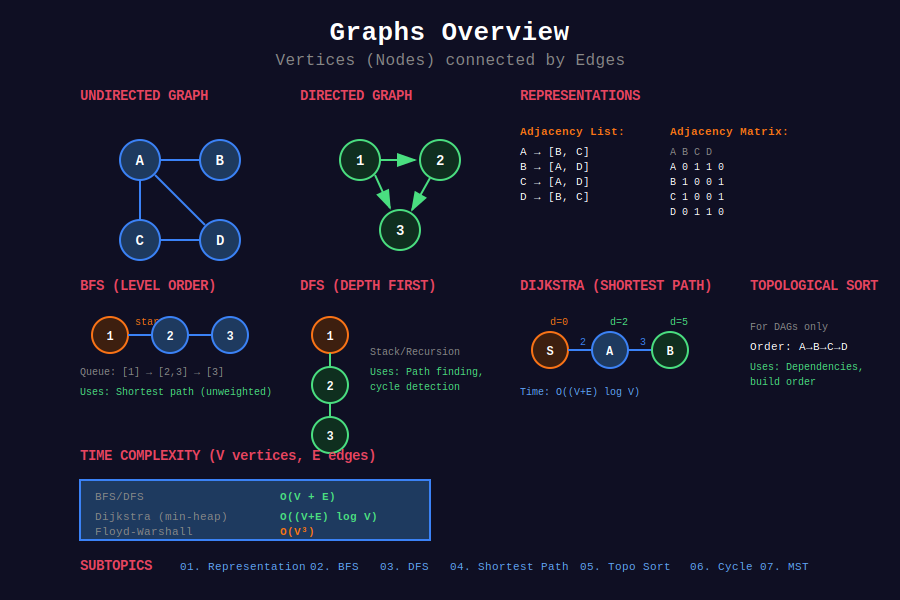

<div align="center">

# 🕸️ Graphs



<p>
  
  
  
</p>

**Vertices and edges - the foundation of network algorithms**

[⬅️ Previous: Heaps](../09_heaps/README.md) | [🏠 Home](../README.md) | [Next: Tries ➡️](../11_tries/README.md)

</div>

---

## 📐 Mathematical Foundation

### 1️⃣ Graph Definition

```math
G = (V, E)

```

- $V$: Set of vertices (nodes)

- $E$: Set of edges $\subseteq V \times V$

---

### 2️⃣ Graph Properties

| Property | Definition |
|----------|------------|
| **Directed** | Edges have direction: $(u, v) \neq (v, u)$ |
| **Undirected** | Edges are symmetric: $(u, v) = (v, u)$ |
| **Weighted** | Edges have weights: $w: E \rightarrow \mathbb{R}$ |
| **Connected** | Path exists between any two vertices |
| **Acyclic** | No cycles exist |

---

### 3️⃣ Degree

**Undirected graph:**

```math
\deg(v) = |\{e \in E : v \in e\}|

```

**Handshaking Lemma:**

```math
\sum_{v \in V} \deg(v) = 2|E|

```

**Directed graph:**

```math
\text{in-deg}(v) + \text{out-deg}(v) = \text{total degree}

```

---

### 4️⃣ Space Complexity

| Representation | Space | Edge Lookup | Iterate Neighbors |
|----------------|:-----:|:-----------:|:-----------------:|
| Adjacency Matrix | O(V²) | O(1) | O(V) |
| Adjacency List | O(V+E) | O(deg) | O(deg) |
| Edge List | O(E) | O(E) | O(E) |

---

### 5️⃣ BFS Complexity

```math
\boxed{T = O(V + E), \quad S = O(V)}

```

**Proof:** Each vertex enqueued once, each edge examined once.

---

### 6️⃣ DFS Complexity

```math
\boxed{T = O(V + E), \quad S = O(V)}

```

**Space:** O(V) for recursion stack in worst case.

---

### 7️⃣ Shortest Path Algorithms

| Algorithm | Graph Type | Time | Space |
|-----------|------------|:----:|:-----:|
| BFS | Unweighted | O(V+E) | O(V) |
| Dijkstra | Non-negative weights | O((V+E) log V) | O(V) |
| Bellman-Ford | Any weights | O(VE) | O(V) |
| Floyd-Warshall | All pairs | O(V³) | O(V²) |

---

### 8️⃣ Dijkstra's Correctness

**Relaxation:**

```math
\text{dist}[v] = \min(\text{dist}[v], \text{dist}[u] + w(u,v))

```

**Invariant:** When vertex $u$ is extracted from priority queue, $\text{dist}[u]$ is optimal.

---

### 9️⃣ Bellman-Ford

**Detects negative cycles:**

```math
\text{If any relaxation after } V-1 \text{ iterations} \Rightarrow \text{negative cycle}

```

---

### 🔟 Topological Sort

**Exists iff graph is DAG (Directed Acyclic Graph).**

**Kahn's Algorithm:** Process vertices with in-degree 0.

```math
\text{Order: } v_1, v_2, \ldots, v_n \text{ where } (v_i, v_j) \in E \Rightarrow i < j

```

---

## 📂 Subtopics Navigation

| # | Topic | Problems | Link |
|:-:|-------|:--------:|------|
| 1 | Graph Representation | 5+ | [📖 Go →](./01_graph_representation/README.md) |
| 2 | BFS Problems | 10+ | [📖 Go →](./02_bfs_problems/README.md) |
| 3 | DFS Problems | 10+ | [📖 Go →](./03_dfs_problems/README.md) |
| 4 | Shortest Path | 8+ | [📖 Go →](./04_shortest_path/README.md) |
| 5 | Topological Sort | 6+ | [📖 Go →](./05_topological_sort/README.md) |
| 6 | Cycle Detection | 5+ | [📖 Go →](./06_cycle_detection/README.md) |
| 7 | Minimum Spanning Tree | 5+ | [📖 Go →](./07_mst/README.md) |

---

## 🏆 LeetCode Problems

### 🟢 Easy

| # | Problem | Pattern | Time | Space |
|:-:|---------|---------|:----:|:-----:|
| 997 | [Find the Town Judge](https://leetcode.com/problems/find-the-town-judge/) | In/Out Degree | O(E) | O(V) |

### 🟡 Medium

| # | Problem | Pattern | Time | Space |
|:-:|---------|---------|:----:|:-----:|
| 133 | [Clone Graph](https://leetcode.com/problems/clone-graph/) | BFS/DFS | O(V+E) | O(V) |
| 200 | [Number of Islands](https://leetcode.com/problems/number-of-islands/) | DFS/BFS | O(mn) | O(mn) |
| 207 | [Course Schedule](https://leetcode.com/problems/course-schedule/) | Topological Sort | O(V+E) | O(V+E) |
| 210 | [Course Schedule II](https://leetcode.com/problems/course-schedule-ii/) | Topological Sort | O(V+E) | O(V+E) |
| 261 | [Graph Valid Tree](https://leetcode.com/problems/graph-valid-tree/) | Union-Find/DFS | O(V+E) | O(V) |
| 286 | [Walls and Gates](https://leetcode.com/problems/walls-and-gates/) | Multi-source BFS | O(mn) | O(mn) |
| 310 | [Minimum Height Trees](https://leetcode.com/problems/minimum-height-trees/) | Topological | O(V) | O(V) |
| 323 | [Number of Connected Components](https://leetcode.com/problems/number-of-connected-components-in-an-undirected-graph/) | Union-Find | O(V+E) | O(V) |
| 399 | [Evaluate Division](https://leetcode.com/problems/evaluate-division/) | DFS/Union-Find | O(Q·E) | O(V) |
| 417 | [Pacific Atlantic Water Flow](https://leetcode.com/problems/pacific-atlantic-water-flow/) | Multi-source DFS | O(mn) | O(mn) |
| 542 | [01 Matrix](https://leetcode.com/problems/01-matrix/) | Multi-source BFS | O(mn) | O(mn) |
| 547 | [Number of Provinces](https://leetcode.com/problems/number-of-provinces/) | Union-Find/DFS | O(n²) | O(n) |
| 684 | [Redundant Connection](https://leetcode.com/problems/redundant-connection/) | Union-Find | O(E·α) | O(V) |
| 721 | [Accounts Merge](https://leetcode.com/problems/accounts-merge/) | Union-Find | O(n log n) | O(n) |
| 743 | [Network Delay Time](https://leetcode.com/problems/network-delay-time/) | Dijkstra | O(E log V) | O(V) |
| 785 | [Is Graph Bipartite?](https://leetcode.com/problems/is-graph-bipartite/) | BFS/DFS Coloring | O(V+E) | O(V) |
| 787 | [Cheapest Flights Within K Stops](https://leetcode.com/problems/cheapest-flights-within-k-stops/) | Bellman-Ford | O(K·E) | O(V) |
| 802 | [Find Eventual Safe States](https://leetcode.com/problems/find-eventual-safe-states/) | Reverse Topo | O(V+E) | O(V) |
| 841 | [Keys and Rooms](https://leetcode.com/problems/keys-and-rooms/) | DFS | O(V+E) | O(V) |
| 886 | [Possible Bipartition](https://leetcode.com/problems/possible-bipartition/) | Bipartite Check | O(V+E) | O(V) |
| 994 | [Rotting Oranges](https://leetcode.com/problems/rotting-oranges/) | Multi-source BFS | O(mn) | O(mn) |
| 1091 | [Shortest Path in Binary Matrix](https://leetcode.com/problems/shortest-path-in-binary-matrix/) | BFS | O(n²) | O(n²) |
| 1129 | [Shortest Path with Alternating Colors](https://leetcode.com/problems/shortest-path-with-alternating-colors/) | BFS | O(V+E) | O(V) |

### 🔴 Hard

| # | Problem | Pattern | Time | Space |
|:-:|---------|---------|:----:|:-----:|
| 127 | [Word Ladder](https://leetcode.com/problems/word-ladder/) | BFS | O(M²·N) | O(M²·N) |
| 269 | [Alien Dictionary](https://leetcode.com/problems/alien-dictionary/) | Topological Sort | O(C) | O(1) |
| 329 | [Longest Increasing Path in Matrix](https://leetcode.com/problems/longest-increasing-path-in-a-matrix/) | DFS + Memo | O(mn) | O(mn) |
| 332 | [Reconstruct Itinerary](https://leetcode.com/problems/reconstruct-itinerary/) | Eulerian Path | O(E log E) | O(E) |
| 778 | [Swim in Rising Water](https://leetcode.com/problems/swim-in-rising-water/) | Dijkstra/Binary | O(n² log n) | O(n²) |
| 815 | [Bus Routes](https://leetcode.com/problems/bus-routes/) | BFS | O(N·S) | O(N·S) |
| 1192 | [Critical Connections](https://leetcode.com/problems/critical-connections-in-a-network/) | Tarjan's | O(V+E) | O(V+E) |

---

## 📊 Graph Algorithm Selection

```
Graph Problem
     |
     +-- Shortest path (unweighted) → BFS
     |
     +-- Shortest path (weighted, no negative) → Dijkstra
     |
     +-- Shortest path (negative weights) → Bellman-Ford
     |
     +-- All pairs shortest path → Floyd-Warshall
     |
     +-- Connectivity → Union-Find or DFS
     |
     +-- Cycle detection → DFS with coloring
     |
     +-- Ordering dependencies → Topological Sort
     |
     +-- Minimum Spanning Tree → Kruskal's or Prim's

```

---

---

## 💡 Key Insights & Pro Tips

> **🎯 BFS vs DFS:** BFS for shortest path (unweighted). DFS for connectivity, cycles, topological sort!

> **⚡ Adjacency List > Matrix:** O(V+E) vs O(V²) for sparse graphs. Use list unless dense!

> **🔄 Union-Find = Connectivity:** For "are these connected?" or cycle detection, Union-Find is O(α(n)) ≈ O(1)!

> **📊 Dijkstra Needs Non-Negative:** Negative weights? Use Bellman-Ford! All pairs? Floyd-Warshall!

> **🌊 Multi-Source BFS:** Multiple starting points? Add all to queue initially, run BFS once!

---

## 🧮 Quick Pattern Reference

| Pattern in Problem | Algorithm | Technique | Example |
|-------------------|-----------|-----------|---------|
| "shortest path unweighted" | BFS | Level-order traversal | #1091, #286 |
| "shortest path weighted" | Dijkstra | Priority queue | #743, #778 |
| "negative weights" | Bellman-Ford | Relax V-1 times | #787 |
| "all pairs shortest" | Floyd-Warshall | DP 3 loops | - |
| "connected components" | Union-Find / DFS | Track visited | #323, #547 |
| "cycle detection" | DFS coloring | White/Gray/Black | #207 |
| "ordering dependencies" | Topological Sort | Kahn's or DFS | #207, #210 |
| "minimum spanning tree" | Kruskal / Prim | Greedy MST | Union-Find |
| "is bipartite?" | 2-coloring BFS/DFS | Alternate colors | #785, #886 |
| "island problems" | DFS/BFS on grid | 4-directional | #200, #695 |

---

## 🎯 Must-Solve Problems (Top 25)

| # | Problem | Category | Difficulty | Why Important |
|:-:|---------|----------|------------|---------------|
| 1 | [Number of Islands](https://leetcode.com/problems/number-of-islands/) | DFS/BFS | 🟡 Medium | Classic grid traversal |
| 2 | [Clone Graph](https://leetcode.com/problems/clone-graph/) | BFS/DFS | 🟡 Medium | Graph basics |
| 3 | [Course Schedule](https://leetcode.com/problems/course-schedule/) | Topo Sort | 🟡 Medium | Cycle detection |
| 4 | [Course Schedule II](https://leetcode.com/problems/course-schedule-ii/) | Topo Sort | 🟡 Medium | Build order |
| 5 | [Number of Connected Components](https://leetcode.com/problems/number-of-connected-components-in-an-undirected-graph/) | Union-Find | 🟡 Medium | Connectivity |
| 6 | [Graph Valid Tree](https://leetcode.com/problems/graph-valid-tree/) | Union-Find | 🟡 Medium | Tree properties |
| 7 | [Pacific Atlantic Water Flow](https://leetcode.com/problems/pacific-atlantic-water-flow/) | Multi-DFS | 🟡 Medium | Grid problem |
| 8 | [Rotting Oranges](https://leetcode.com/problems/rotting-oranges/) | Multi-BFS | 🟡 Medium | Simultaneous spread |
| 9 | [Walls and Gates](https://leetcode.com/problems/walls-and-gates/) | Multi-BFS | 🟡 Medium | Distance from sources |
| 10 | [01 Matrix](https://leetcode.com/problems/01-matrix/) | Multi-BFS | 🟡 Medium | Nearest 0 distance |
| 11 | [Is Graph Bipartite?](https://leetcode.com/problems/is-graph-bipartite/) | 2-Coloring | 🟡 Medium | Bipartite check |
| 12 | [Network Delay Time](https://leetcode.com/problems/network-delay-time/) | Dijkstra | 🟡 Medium | Shortest path weighted |
| 13 | [Cheapest Flights](https://leetcode.com/problems/cheapest-flights-within-k-stops/) | Bellman-Ford | 🟡 Medium | Constrained shortest |
| 14 | [Redundant Connection](https://leetcode.com/problems/redundant-connection/) | Union-Find | 🟡 Medium | Cycle in undirected |
| 15 | [Accounts Merge](https://leetcode.com/problems/accounts-merge/) | Union-Find | 🟡 Medium | Grouping |
| 16 | [Min Height Trees](https://leetcode.com/problems/minimum-height-trees/) | Topological | 🟡 Medium | Tree centers |
| 17 | [Shortest Path Binary Matrix](https://leetcode.com/problems/shortest-path-in-binary-matrix/) | BFS | 🟡 Medium | 8-directional BFS |
| 18 | [Keys and Rooms](https://leetcode.com/problems/keys-and-rooms/) | DFS | 🟡 Medium | Reachability |
| 19 | [Word Ladder](https://leetcode.com/problems/word-ladder/) | BFS | 🔴 Hard | Transform BFS |
| 20 | [Alien Dictionary](https://leetcode.com/problems/alien-dictionary/) | Topo Sort | 🔴 Hard | Custom ordering |
| 21 | [Longest Increasing Path](https://leetcode.com/problems/longest-increasing-path-in-a-matrix/) | DFS + Memo | 🔴 Hard | Grid DP |
| 22 | [Reconstruct Itinerary](https://leetcode.com/problems/reconstruct-itinerary/) | Eulerian Path | 🔴 Hard | Path construction |
| 23 | [Critical Connections](https://leetcode.com/problems/critical-connections-in-a-network/) | Tarjan's | 🔴 Hard | Bridges |
| 24 | [Swim in Rising Water](https://leetcode.com/problems/swim-in-rising-water/) | Dijkstra | 🔴 Hard | Min-max path |
| 25 | [Bus Routes](https://leetcode.com/problems/bus-routes/) | BFS | 🔴 Hard | Hypergraph BFS |

---

## 📚 References & Learning Resources

### 📖 Books & Courses

| Resource | Description | Link |
|----------|-------------|------|
| **CLRS Chapter 22-25** | Graph algorithms | [MIT Press](https://mitpress.mit.edu/books/introduction-algorithms) |
| **Princeton Algorithms Part II** | Graph algorithms course | [Coursera](https://www.coursera.org/learn/algorithms-part2) |
| **Algorithm Design Manual** | Graph chapter | [Springer](https://www.algorist.com/) |
| **Competitive Programming 3** | Chapter 4 - Graphs | [Book](https://cpbook.net/) |

### 🌐 Online Tutorials

| Resource | Description | Link |
|----------|-------------|------|
| **GeeksforGeeks** | Graph algorithms | [Tutorial](https://www.geeksforgeeks.org/graph-data-structure-and-algorithms/) |
| **LeetCode Explore** | Graph card | [Course](https://leetcode.com/explore/learn/card/graph/) |
| **VisuAlgo** | Interactive graph algorithms | [Website](https://visualgo.net/en/dfsbfs) |
| **InterviewBit** | Graph problems | [Tutorial](https://www.interviewbit.com/courses/programming/topics/graph-data-structure/) |
| **CP-Algorithms** | Advanced graph algorithms | [Website](https://cp-algorithms.com/graph/breadth-first-search.html) |

### 📺 Video Resources

| Resource | Topic | Link |
|----------|-------|------|
| **Abdul Bari** | Graph complete playlist | [YouTube](https://www.youtube.com/watch?v=pcKY4hjDrxk&list=PLDN4rrl48XKpZkf03iYFl-O29szjTrs_O) |
| **NeetCode** | Graph algorithms | [YouTube](https://www.youtube.com/playlist?list=PLot-Xpze53ldBT_7QA8NVot219jFNr_GI) |
| **MIT OCW** | Graph algorithms lecture | [Lecture](https://ocw.mit.edu/courses/6-006-introduction-to-algorithms-fall-2011/) |
| **William Fiset** | Graph theory playlist | [YouTube](https://www.youtube.com/playlist?list=PLDV1Zeh2NRsDGO4--qE8yH72HFL1Km93P) |
| **Tushar Roy** | Graph algorithms | [YouTube](https://www.youtube.com/playlist?list=PLrmLmBdmIlpswNrpLSMFwzLYAWztyJ5l0) |
| **Back To Back SWE** | Graph problems | [YouTube](https://www.youtube.com/playlist?list=PLiQ766zSC5jMW0kE6TYTe0V-l-8xJhEcG) |

### 📝 Practice Platforms

| Platform | Focus | Link |
|----------|-------|------|
| **LeetCode** | Graph tag | [Problems](https://leetcode.com/tag/graph/) |
| **HackerRank** | Graph challenges | [Practice](https://www.hackerrank.com/domains/algorithms?filters%5Bsubdomains%5D%5B%5D=graph-theory) |
| **Codeforces** | Graph problems | [Problemset](https://codeforces.com/problemset?tags=graphs) |
| **SPOJ** | Graph practice | [Practice](https://www.spoj.com/problems/tag/graph-theory) |

### 🔬 Advanced Topics

| Topic | Description | Link |
|-------|-------------|------|
| **Tarjan's Algorithm** | Strongly connected components | [CP-Algorithms](https://cp-algorithms.com/graph/strongly-connected-components.html) |
| **Kosaraju's Algorithm** | SCC alternative | [Tutorial](https://www.geeksforgeeks.org/strongly-connected-components/) |
| **Floyd-Warshall** | All pairs shortest path | [Tutorial](https://www.geeksforgeeks.org/floyd-warshall-algorithm-dp-16/) |
| **A* Search** | Heuristic shortest path | [Wikipedia](https://en.wikipedia.org/wiki/A*_search_algorithm) |
| **Network Flow** | Max flow algorithms | [CP-Algorithms](https://cp-algorithms.com/graph/edmonds_karp.html) |
| **Eulerian Path** | Circuit problems | [Tutorial](https://www.geeksforgeeks.org/eulerian-path-and-circuit/) |

### 🎯 Problem Collections

| Collection | Focus | Link |
|-----------|-------|------|
| **NeetCode 150** | Essential graph | [List](https://neetcode.io/practice) |
| **Blind 75** | Core problems | [List](https://www.teamblind.com/post/New-Year-Gift---Curated-List-of-Top-75-LeetCode-Questions-to-Save-Your-Time-OaM1orEU) |
| **Grind 75** | Structured prep | [Guide](https://www.techinterviewhandbook.org/grind75) |
| **Striver's SDE Sheet** | Must-do graph | [Sheet](https://takeuforward.org/interviews/strivers-sde-sheet-top-coding-interview-problems/) |

### 📊 Visualization Tools

| Tool | Purpose | Link |
|------|---------|------|
| **VisuAlgo** | Graph algorithms | [Website](https://visualgo.net/en/dfsbfs) |
| **Algorithm Visualizer** | Graph visualizations | [Website](https://algorithm-visualizer.org/) |
| **CS Animations** | Graph algorithms | [Website](https://www.cs.usfca.edu/~galles/visualization/Algorithms.html) |
| **Graph Online** | Draw and analyze | [Website](https://graphonline.ru/en/) |

### 🏆 Competition Resources

| Resource | Topic | Link |
|----------|-------|------|
| **USACO Guide** | Graph algorithms guide | [Guide](https://usaco.guide/gold/intro-dp) |
| **TopCoder** | Graph tutorials | [Tutorials](https://www.topcoder.com/thrive/articles/) |
| **Codeforces EDU** | Graph courses | [Course](https://codeforces.com/edu/course/2) |

---

## 🎖️ Interview Success Tips

### Common Mistakes to Avoid

❌ **Don't:**
- Use adjacency matrix for sparse graphs (O(V²) space!)

- Forget to track visited nodes (infinite loops!)

- Use Dijkstra with negative weights (wrong results!)

- Confuse directed vs undirected graphs

- Forget to check if graph is connected

✅ **Do:**
- Choose right representation: adjacency list for sparse

- Always track visited to avoid cycles

- Know when to use each shortest path algorithm

- Handle edge cases: disconnected graphs, self-loops

- Master both BFS and DFS thoroughly

### Optimization Checklist

```
[ ] Is the graph sparse? Use adjacency list!
[ ] Need shortest path? Unweighted→BFS, Weighted→Dijkstra!
[ ] Have negative weights? Use Bellman-Ford!
[ ] Checking connectivity? Union-Find is O(α(n))!
[ ] Need ordering? Use topological sort on DAG!
[ ] Detecting cycles? DFS with coloring!
[ ] Multiple starting points? Multi-source BFS!

```

---

## 🌟 Motivational Corner

> "Graphs model the real world — social networks, maps, dependencies. Master graphs, master algorithms!"

**Progress Tracker:**
- 🥉 **Bronze:** Solve 15 graph problems + master BFS/DFS

- 🥈 **Silver:** Solve 30 problems + shortest paths + topological sort

- 🥇 **Gold:** Solve 50 problems + Union-Find + advanced algorithms

- 💎 **Platinum:** Master all patterns + MST + network flow

**Remember:** Most graph problems reduce to BFS, DFS, or Union-Find! 🚀

---

<div align="center">

### 🌟 If this helped you, give it a ⭐ on GitHub! 🌟

**Made with ❤️ for the coding community by [Gaurav Goswami](https://github.com/Gaurav14cs17)**

[⬅️ Previous: Heaps](../09_heaps/README.md) | [🏠 Home](../README.md) | [Next: Tries ➡️](../11_tries/README.md)

---

*Last Updated: December 2025*  
*Licensed under MIT*  
*Happy Coding! 💻✨*

</div>
