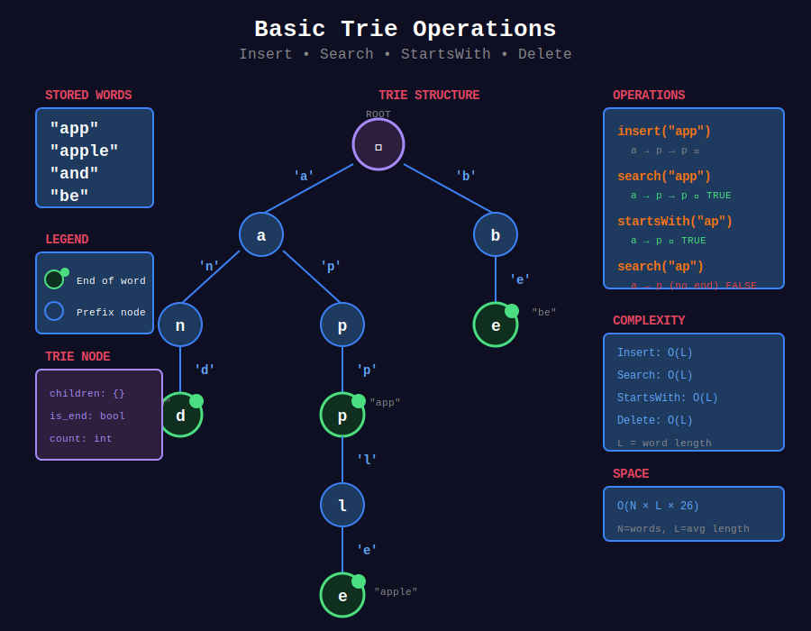

<div align="center">

# 📦 Basic Trie Operations



<p>
  
  
</p>

</div>

---

## 🧭 Navigation

| ⬅️ Previous | 📂 Current | ➡️ Next |
|:------------|:----------:|--------:|
| [🏠 Tries Home](../README.md) | **01. Basic Trie** | [02. Word Search →](../02_word_search/README.md) |

---

## 📐 Mathematical Foundations

### 1️⃣ Trie Structure

```
Root (empty)
+-- 'a'
|   +-- 'p'
|   |   +-- 'p' [end: "app"]
|   |   |   +-- 'l'
|   |   |       +-- 'e' [end: "apple"]
|   +-- 'n'
|       +-- 'd' [end: "and"]
+-- 'b'
    +-- 'e' [end: "be"]

```

---

### 2️⃣ Operations Complexity

| Operation | Time | Space |
|-----------|:----:|:-----:|
| Insert | O(L) | O(L) new nodes |
| Search | O(L) | O(1) |
| StartsWith | O(L) | O(1) |
| Delete | O(L) | O(1) |

Where $L$ = length of word.

---

### 3️⃣ Space Analysis

**Per node:** O(ALPHABET_SIZE) or O(1) with hash map.

**Total:** O(N × L × ALPHABET_SIZE) worst case.

---

### 4️⃣ Trie Invariants

1. Root is always empty (no character)
2. Each edge labeled with character
3. Path from root = prefix
4. `is_end` marks complete words

---

## 💻 Code Implementations

```python
class TrieNode:
    """Trie node with children and end marker."""
    def __init__(self):
        self.children = {}  # char -> TrieNode
        self.is_end = False
        self.count = 0  # Optional: count words with this prefix

class Trie:
    """
    Trie (Prefix Tree) implementation.
    
    Efficient for prefix-based operations.
    """
    def __init__(self):
        self.root = TrieNode()
    
    def insert(self, word: str) -> None:
        """
        Insert word into trie.
        
        Time: O(L), Space: O(L)
        """
        node = self.root
        for char in word:
            if char not in node.children:
                node.children[char] = TrieNode()
            node = node.children[char]
            node.count += 1  # Count prefixes
        node.is_end = True
    
    def search(self, word: str) -> bool:
        """
        Return True if word exists in trie.
        
        Time: O(L), Space: O(1)
        """
        node = self._find_node(word)
        return node is not None and node.is_end
    
    def startsWith(self, prefix: str) -> bool:
        """
        Return True if any word starts with prefix.
        
        Time: O(L), Space: O(1)
        """
        return self._find_node(prefix) is not None
    
    def countWordsWithPrefix(self, prefix: str) -> int:
        """
        Count words starting with prefix.
        
        Time: O(L)
        """
        node = self._find_node(prefix)
        return node.count if node else 0
    
    def _find_node(self, prefix: str) -> TrieNode:
        """Helper: find node for prefix."""
        node = self.root
        for char in prefix:
            if char not in node.children:
                return None
            node = node.children[char]
        return node
    
    def delete(self, word: str) -> bool:
        """
        Delete word from trie.
        
        Time: O(L)
        """
        def _delete(node, word, depth):
            if depth == len(word):
                if not node.is_end:
                    return False
                node.is_end = False
                return len(node.children) == 0
            
            char = word[depth]
            if char not in node.children:
                return False
            
            should_delete = _delete(node.children[char], word, depth + 1)
            
            if should_delete:
                del node.children[char]
                return len(node.children) == 0 and not node.is_end
            
            return False
        
        return _delete(self.root, word, 0)

def replaceWords(dictionary: list[str], sentence: str) -> str:
    """
    Replace Words (LeetCode 648).
    
    Replace words with shortest root in dictionary.
    
    Time: O(dict + sentence), Space: O(dict)
    """
    trie = Trie()
    for root in dictionary:
        trie.insert(root)
    
    def find_root(word):
        node = trie.root
        for i, char in enumerate(word):
            if char not in node.children:
                return word
            node = node.children[char]
            if node.is_end:
                return word[:i + 1]
        return word
    
    words = sentence.split()
    return ' '.join(find_root(word) for word in words)

```

---

## 🏆 LeetCode Problems

### 🟡 Medium

| # | Problem | Pattern | Time | Space |
|:-:|---------|---------|:----:|:-----:|
| 208 | [Implement Trie](https://leetcode.com/problems/implement-trie-prefix-tree/) | Basic Ops | O(L) | O(L) |
| 648 | [Replace Words](https://leetcode.com/problems/replace-words/) | Prefix Match | O(n×L) | O(dict) |
| 720 | [Longest Word in Dictionary](https://leetcode.com/problems/longest-word-in-dictionary/) | Trie + BFS | O(n×L) | O(n×L) |

---

## 📚 References

| Resource | Link |
|----------|------|
| **Trie** | [Wikipedia](https://en.wikipedia.org/wiki/Trie) |

---

<div align="center">

**Made with ❤️ by [Gaurav Goswami](https://github.com/Gaurav14cs17)**

</div>

---

## 🧭 Navigation

| ⬅️ Previous | 📂 Current | ➡️ Next |
|:------------|:----------:|--------:|
| [🏠 Tries Home](../README.md) | **01. Basic Trie** | [02. Word Search →](../02_word_search/README.md) |
