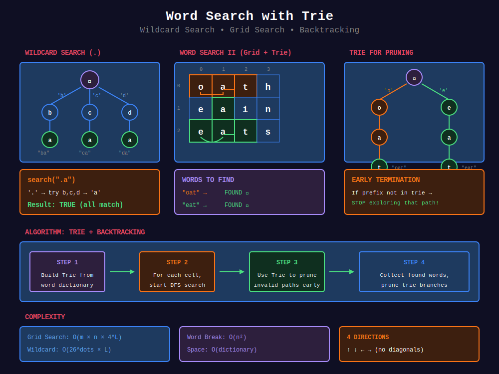

<div align="center">

# 🔍 Word Search with Trie



<p>
  
  
</p>

</div>

---

## 🧭 Navigation

| ⬅️ Previous | 📂 Current | ➡️ Next |
|:------------|:----------:|--------:|
| [← 01. Basic Trie](../01_basic_trie/README.md) | **02. Word Search** | [03. Autocomplete →](../03_autocomplete/README.md) |

---

## 📐 Mathematical Foundations

### 1️⃣ Wildcard Search

**Problem:** Search with '.' matching any character.

**Approach:** DFS through trie, branch at '.' to all children.

$$T = O(26^{\text{dots}} \times L)$$

---

### 2️⃣ Word Search II Complexity

**Grid search with Trie:**

$$T = O(m \times n \times 4^L)$$

Where:

- $m \times n$ = grid size

- $L$ = max word length

- 4 = directions

**Optimization:** Prune trie branches after finding words.

---

### 3️⃣ Trie + Backtracking

**Key insight:** Trie enables early termination.

$$\text{If prefix not in trie} \Rightarrow \text{stop exploring}$$

---

## 💻 Code Implementations

```python
class TrieNode:
    def __init__(self):
        self.children = {}
        self.word = None  # Store complete word

class WordDictionary:
    """
    Word Dictionary with Wildcard (LeetCode 211).
    
    '.' matches any character.
    """
    def __init__(self):
        self.root = TrieNode()
    
    def addWord(self, word: str) -> None:
        node = self.root
        for char in word:
            if char not in node.children:
                node.children[char] = TrieNode()
            node = node.children[char]
        node.word = word
    
    def search(self, word: str) -> bool:
        """
        Search with wildcards.
        
        Time: O(L) best, O(26^L) worst with all dots.
        """
        def dfs(node, i):
            if i == len(word):
                return node.word is not None
            
            char = word[i]
            if char == '.':
                # Try all children
                for child in node.children.values():
                    if dfs(child, i + 1):
                        return True
                return False
            else:
                if char not in node.children:
                    return False
                return dfs(node.children[char], i + 1)
        
        return dfs(self.root, 0)

def findWords(board: list[list[str]], words: list[str]) -> list[str]:
    """
    Word Search II (LeetCode 212).
    
    Find all words from dictionary in grid.
    
    Time: O(m×n×4^L), Space: O(dict)
    """
    # Build trie
    root = TrieNode()
    for word in words:
        node = root
        for char in word:
            if char not in node.children:
                node.children[char] = TrieNode()
            node = node.children[char]
        node.word = word
    
    m, n = len(board), len(board[0])
    result = []
    
    def dfs(r, c, node):
        char = board[r][c]
        if char not in node.children:
            return
        
        next_node = node.children[char]
        
        # Found a word
        if next_node.word:
            result.append(next_node.word)
            next_node.word = None  # Avoid duplicates
        
        # Mark visited
        board[r][c] = '#'
        
        # Explore neighbors
        for dr, dc in [(0, 1), (0, -1), (1, 0), (-1, 0)]:
            nr, nc = r + dr, c + dc
            if 0 <= nr < m and 0 <= nc < n and board[nr][nc] != '#':
                dfs(nr, nc, next_node)
        
        # Restore
        board[r][c] = char
        
        # Prune: remove leaf nodes
        if not next_node.children:
            del node.children[char]
    
    for i in range(m):
        for j in range(n):
            dfs(i, j, root)
    
    return result

def wordBreak(s: str, wordDict: list[str]) -> bool:
    """
    Word Break with Trie (LeetCode 139).
    
    Check if string can be segmented.
    
    Time: O(n²), Space: O(dict + n)
    """
    # Build trie
    root = TrieNode()
    for word in wordDict:
        node = root
        for char in word:
            if char not in node.children:
                node.children[char] = TrieNode()
            node = node.children[char]
        node.word = word
    
    n = len(s)
    dp = [False] * (n + 1)
    dp[0] = True
    
    for i in range(n):
        if not dp[i]:
            continue
        
        node = root
        for j in range(i, n):
            if s[j] not in node.children:
                break
            node = node.children[s[j]]
            if node.word:
                dp[j + 1] = True
    
    return dp[n]

```

---

## 🏆 LeetCode Problems

### 🟡 Medium

| # | Problem | Pattern | Time | Space |
|:-:|---------|---------|:----:|:-----:|
| 139 | [Word Break](https://leetcode.com/problems/word-break/) | Trie + DP | O(n²) | O(n) |
| 211 | [Add and Search Words](https://leetcode.com/problems/design-add-and-search-words-data-structure/) | Wildcard DFS | O(26^L) | O(L) |

### 🔴 Hard

| # | Problem | Pattern | Time | Space |
|:-:|---------|---------|:----:|:-----:|
| 140 | [Word Break II](https://leetcode.com/problems/word-break-ii/) | Trie + Backtrack | O(2^n) | O(n) |
| 212 | [Word Search II](https://leetcode.com/problems/word-search-ii/) | Trie + Grid DFS | O(m×n×4^L) | O(dict) |

---

## 📊 Word Search Pattern

```
Word Search Problem
        |
        +-- Single word in grid → Simple DFS
        |
        +-- Multiple words → Trie + DFS
        |
        +-- Wildcards → Trie + Branching
        |
        +-- Word segmentation → Trie + DP

```

---

## 📚 References

| Resource | Link |
|----------|------|
| **Word Search II** | [LeetCode](https://leetcode.com/problems/word-search-ii/) |

---

<div align="center">

**Made with ❤️ by [Gaurav Goswami](https://github.com/Gaurav14cs17)**

</div>

---

## 🧭 Navigation

| ⬅️ Previous | 📂 Current | ➡️ Next |
|:------------|:----------:|--------:|
| [← 01. Basic Trie](../01_basic_trie/README.md) | **02. Word Search** | [03. Autocomplete →](../03_autocomplete/README.md) |
