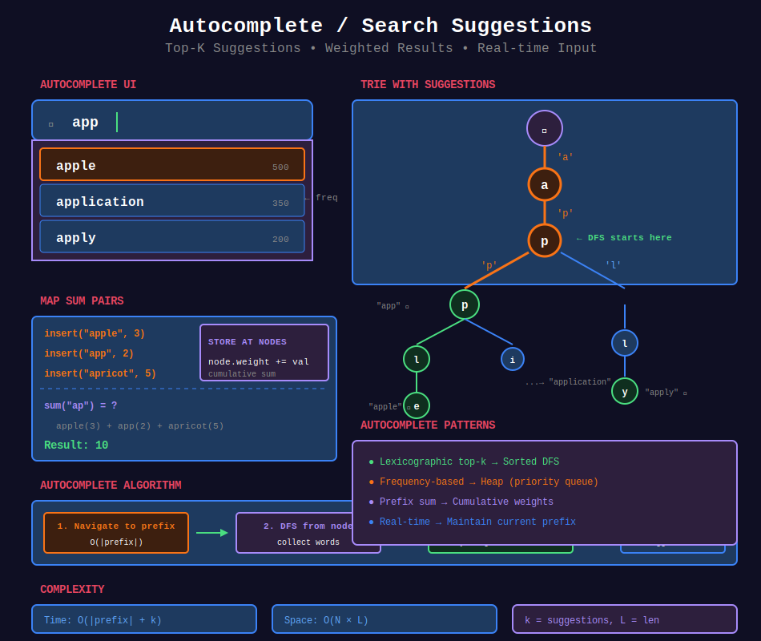

<div align="center">

# ⌨️ Autocomplete / Search Suggestions



<p>
  
  
</p>

</div>

---

## 🧭 Navigation

| ⬅️ Previous | 📂 Current | ➡️ Next Topic |
|:------------|:----------:|--------:|
| [← 02. Word Search](../02_word_search/README.md) | **03. Autocomplete** | [🏠 Tries Home](../README.md) → [Segment Trees](../../12_segment_trees/README.md) |

---

## 📐 Mathematical Foundations

### 1️⃣ Autocomplete Complexity

**Find all words with prefix $P$:**

$$T = O(|P| + k)$$

Where $k$ = number of matching words.

---

### 2️⃣ Top-K Suggestions

**Approach 1:** Store all words at each node → O(N×L) space.

**Approach 2:** DFS from prefix node, collect first k → O(|P| + k) time.

---

### 3️⃣ Weighted Autocomplete

**Store frequency/weight at nodes:**

$$\text{suggestion}(prefix) = \text{top-k by weight}$$

Use heap for top-k selection.

---

### 4️⃣ Map Sum Pattern

**Sum of values for all words with prefix:**

$$\text{mapSum}(prefix) = \sum_{\text{word starts with prefix}} \text{value}[word]$$

---

## 💻 Code Implementations

```python
import heapq

class TrieNode:
    def __init__(self):
        self.children = {}
        self.is_end = False
        self.word = None
        self.weight = 0  # For weighted suggestions

class AutocompleteTrie:
    """
    Trie with autocomplete functionality.
    """
    def __init__(self):
        self.root = TrieNode()
    
    def insert(self, word: str, weight: int = 1) -> None:
        node = self.root
        for char in word:
            if char not in node.children:
                node.children[char] = TrieNode()
            node = node.children[char]
        node.is_end = True
        node.word = word
        node.weight = weight
    
    def autocomplete(self, prefix: str, limit: int = 3) -> list[str]:
        """
        Get top suggestions for prefix.
        
        Time: O(|prefix| + k)
        """
        node = self._find_node(prefix)
        if not node:
            return []
        
        results = []
        self._collect_words(node, results, limit)
        return results[:limit]
    
    def _find_node(self, prefix: str) -> TrieNode:
        node = self.root
        for char in prefix:
            if char not in node.children:
                return None
            node = node.children[char]
        return node
    
    def _collect_words(self, node: TrieNode, results: list, limit: int):
        """DFS to collect words."""
        if len(results) >= limit:
            return
        
        if node.is_end:
            results.append(node.word)
        
        # Lexicographic order: sorted children
        for char in sorted(node.children.keys()):
            if len(results) >= limit:
                return
            self._collect_words(node.children[char], results, limit)

def suggestedProducts(products: list[str], searchWord: str) -> list[list[str]]:
    """
    Search Suggestions System (LeetCode 1268).
    
    Return top 3 lexicographically smallest for each prefix.
    
    Time: O(n×L + m×L), Space: O(n×L)
    """
    # Build trie
    trie = AutocompleteTrie()
    for product in products:
        trie.insert(product)
    
    result = []
    prefix = ""
    
    for char in searchWord:
        prefix += char
        suggestions = trie.autocomplete(prefix, 3)
        result.append(suggestions)
    
    return result

class MapSum:
    """
    Map Sum Pairs (LeetCode 677).
    
    Sum values for keys with given prefix.
    """
    def __init__(self):
        self.root = TrieNode()
        self.map = {}  # Store original values
    
    def insert(self, key: str, val: int) -> None:
        """
        Insert key-value pair.
        
        Handle updates by tracking delta.
        """
        delta = val - self.map.get(key, 0)
        self.map[key] = val
        
        node = self.root
        for char in key:
            if char not in node.children:
                node.children[char] = TrieNode()
            node = node.children[char]
            node.weight += delta
    
    def sum(self, prefix: str) -> int:
        """
        Return sum of values with prefix.
        
        Time: O(|prefix|)
        """
        node = self.root
        for char in prefix:
            if char not in node.children:
                return 0
            node = node.children[char]
        return node.weight

class AutocompleteSystem:
    """
    Design Search Autocomplete System (LeetCode 642).
    
    Return top 3 hottest sentences with current prefix.
    """
    def __init__(self, sentences: list[str], times: list[int]):
        self.root = TrieNode()
        self.current = ""
        
        for sentence, count in zip(sentences, times):
            self._insert(sentence, count)
    
    def _insert(self, sentence: str, count: int):
        node = self.root
        for char in sentence:
            if char not in node.children:
                node.children[char] = TrieNode()
            node = node.children[char]
        node.is_end = True
        node.word = sentence
        node.weight -= count  # Negative for max-heap behavior
    
    def input(self, c: str) -> list[str]:
        if c == '#':
            self._insert(self.current, 1)
            self.current = ""
            return []
        
        self.current += c
        node = self.root
        
        for char in self.current:
            if char not in node.children:
                return []
            node = node.children[char]
        
        # Collect all completions with weights
        heap = []
        self._collect(node, heap)
        
        # Get top 3
        result = []
        while heap and len(result) < 3:
            weight, word = heapq.heappop(heap)
            result.append(word)
        
        return result
    
    def _collect(self, node: TrieNode, heap: list):
        if node.is_end:
            heapq.heappush(heap, (node.weight, node.word))
        
        for child in node.children.values():
            self._collect(child, heap)

```

---

## 🏆 LeetCode Problems

### 🟡 Medium

| # | Problem | Pattern | Time | Space |
|:-:|---------|---------|:----:|:-----:|
| 677 | [Map Sum Pairs](https://leetcode.com/problems/map-sum-pairs/) | Prefix Sum | O(L) | O(n×L) |
| 1268 | [Search Suggestions System](https://leetcode.com/problems/search-suggestions-system/) | Trie + DFS | O(n×L) | O(n×L) |

### 🔴 Hard

| # | Problem | Pattern | Time | Space |
|:-:|---------|---------|:----:|:-----:|
| 642 | [Design Search Autocomplete](https://leetcode.com/problems/design-search-autocomplete-system/) | Trie + Heap | O(L + k log k) | O(n×L) |

---

## 📊 Autocomplete Patterns

```
Autocomplete
     |
     +-- Lexicographic top-k → Trie + Sorted DFS
     |
     +-- Frequency-based → Trie + Heap
     |
     +-- Prefix sum → Store cumulative weights
     |
     +-- Real-time input → Maintain current prefix

```

---

## 📚 References

| Resource | Link |
|----------|------|
| **Autocomplete** | [GeeksforGeeks](https://www.geeksforgeeks.org/auto-complete-feature-using-trie/) |

---

<div align="center">

**Made with ❤️ by [Gaurav Goswami](https://github.com/Gaurav14cs17)**

</div>

---

## 🧭 Navigation

| ⬅️ Previous | 📂 Current | ➡️ Next Topic |
|:------------|:----------:|--------:|
| [← 02. Word Search](../02_word_search/README.md) | **03. Autocomplete** | [🏠 Tries Home](../README.md) → [Segment Trees](../../12_segment_trees/README.md) |
