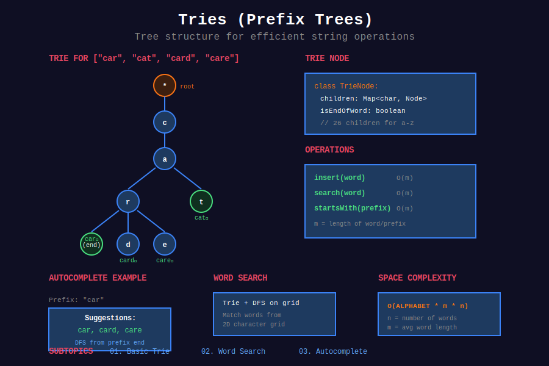

<div align="center">

# 🌳 Tries (Prefix Trees)



<p>
  
  
  
</p>

**Tree-based data structure for efficient string operations**

[⬅️ Previous: Graphs](../10_graphs/README.md) | [🏠 Home](../README.md) | [Next: Segment Trees ➡️](../12_segment_trees/README.md)

</div>

---

## 📐 Mathematical Foundation

### 1️⃣ Trie Definition

A **Trie** (prefix tree) is a tree where:

- Each node represents a character

- Root represents empty string

- Path from root to node represents a prefix

- Words are marked with end-of-word flag

---

### 2️⃣ Time Complexity

| Operation | Time | Space |
|-----------|:----:|:-----:|
| Insert word | O(L) | O(L) |
| Search word | O(L) | O(1) |
| Search prefix | O(L) | O(1) |
| Delete word | O(L) | O(1) |
| Autocomplete | O(L + k) | O(k) |

Where $L$ = length of word, $k$ = number of results.

---

### 3️⃣ Space Complexity

**Worst case:** O(ALPHABET_SIZE × L × N)

Where:

- ALPHABET_SIZE = 26 for lowercase letters

- L = average word length

- N = number of words

**Optimization:** Use hash maps instead of arrays for sparse children.

---

### 4️⃣ Trie vs Hash Set

| Operation | Trie | Hash Set |
|-----------|:----:|:--------:|
| Insert | O(L) | O(L) avg |
| Search | O(L) | O(L) avg |
| Prefix search | O(L) | O(N×L) |
| Autocomplete | O(L+k) | O(N×L) |
| Space | Higher | Lower |

**Use Trie when:** Prefix operations needed.

---

### 5️⃣ Compressed Trie (Radix Tree)

**Optimization:** Merge nodes with single child.

```math
\text{Space: } O(\text{total characters in all words})

```

---

### 6️⃣ Trie for XOR Problems

**XOR Trie:** Store numbers as binary strings (MSB to LSB).

**Maximum XOR:** Greedily pick opposite bit at each level.

```math
\text{For each bit, prefer } 1 \oplus \text{current_bit} = 1

```

---

## 📂 Subtopics Navigation

| # | Topic | Problems | Link |
|:-:|-------|:--------:|------|
| 1 | Basic Trie | 5+ | [📖 Go →](./01_basic_trie/README.md) |
| 2 | Word Search | 5+ | [📖 Go →](./02_word_search/README.md) |
| 3 | Autocomplete | 5+ | [📖 Go →](./03_autocomplete/README.md) |

---

## 🎯 Key Patterns

### Basic Trie Implementation

```python
class TrieNode:
    def __init__(self):
        self.children = {}
        self.is_end = False

class Trie:
    """
    Trie (Prefix Tree) implementation.
    
    All operations: O(L) where L = word length.
    """
    def __init__(self):
        self.root = TrieNode()
    
    def insert(self, word: str) -> None:
        """Insert word into trie."""
        node = self.root
        for char in word:
            if char not in node.children:
                node.children[char] = TrieNode()
            node = node.children[char]
        node.is_end = True
    
    def search(self, word: str) -> bool:
        """Return True if word is in trie."""
        node = self._find_node(word)
        return node is not None and node.is_end
    
    def startsWith(self, prefix: str) -> bool:
        """Return True if any word starts with prefix."""
        return self._find_node(prefix) is not None
    
    def _find_node(self, prefix: str) -> TrieNode:
        """Find node for given prefix."""
        node = self.root
        for char in prefix:
            if char not in node.children:
                return None
            node = node.children[char]
        return node

```

### Word Dictionary with Wildcard

```python
class WordDictionary:
    """
    Trie with wildcard search.
    
    '.' matches any single character.
    """
    def __init__(self):
        self.root = TrieNode()
    
    def addWord(self, word: str) -> None:
        node = self.root
        for char in word:
            if char not in node.children:
                node.children[char] = TrieNode()
            node = node.children[char]
        node.is_end = True
    
    def search(self, word: str) -> bool:
        def dfs(node, i):
            if i == len(word):
                return node.is_end
            
            char = word[i]
            if char == '.':
                for child in node.children.values():
                    if dfs(child, i + 1):
                        return True
                return False
            else:
                if char not in node.children:
                    return False
                return dfs(node.children[char], i + 1)
        
        return dfs(self.root, 0)

```

---

## 🏆 LeetCode Problems

### 🟡 Medium

| # | Problem | Pattern | Time | Space |
|:-:|---------|---------|:----:|:-----:|
| 208 | [Implement Trie](https://leetcode.com/problems/implement-trie-prefix-tree/) | Basic Trie | O(L) | O(L) |
| 211 | [Design Add and Search Words](https://leetcode.com/problems/design-add-and-search-words-data-structure/) | Wildcard DFS | O(L) / O(26^L) | O(L) |
| 421 | [Maximum XOR of Two Numbers](https://leetcode.com/problems/maximum-xor-of-two-numbers-in-an-array/) | XOR Trie | O(n×32) | O(n×32) |
| 648 | [Replace Words](https://leetcode.com/problems/replace-words/) | Prefix Match | O(n×L) | O(dict) |
| 677 | [Map Sum Pairs](https://leetcode.com/problems/map-sum-pairs/) | Trie + Sum | O(L) | O(n×L) |
| 720 | [Longest Word in Dictionary](https://leetcode.com/problems/longest-word-in-dictionary/) | Trie + BFS | O(n×L) | O(n×L) |
| 1268 | [Search Suggestions System](https://leetcode.com/problems/search-suggestions-system/) | Trie + DFS | O(n×L) | O(n×L) |

### 🔴 Hard

| # | Problem | Pattern | Time | Space |
|:-:|---------|---------|:----:|:-----:|
| 212 | [Word Search II](https://leetcode.com/problems/word-search-ii/) | Trie + Backtracking | O(m×n×4^L) | O(dict) |
| 336 | [Palindrome Pairs](https://leetcode.com/problems/palindrome-pairs/) | Trie + Reverse | O(n×L²) | O(n×L) |
| 472 | [Concatenated Words](https://leetcode.com/problems/concatenated-words/) | Trie + DP | O(n×L²) | O(n×L) |
| 745 | [Prefix and Suffix Search](https://leetcode.com/problems/prefix-and-suffix-search/) | Double Trie | O(L) | O(n×L²) |

---

## 📊 Trie Pattern Decision

```
String Problem
     |
     +-- Prefix matching → Trie
     |
     +-- Autocomplete → Trie + DFS
     |
     +-- Wildcard search → Trie + Backtracking
     |
     +-- Maximum XOR → Binary Trie
     |
     +-- Dictionary lookup only → Hash Set

```

---

## 📚 References

| Resource | Link |
|----------|------|
| **Trie** | [Wikipedia](https://en.wikipedia.org/wiki/Trie) |
| **Radix Tree** | [Wikipedia](https://en.wikipedia.org/wiki/Radix_tree) |
| **XOR Trie** | [GeeksforGeeks](https://www.geeksforgeeks.org/maximum-xor-of-two-numbers-in-an-array/) |

---

<div align="center">

**Made with ❤️ by [Gaurav Goswami](https://github.com/Gaurav14cs17)**

[⬅️ Previous: Graphs](../10_graphs/README.md) | [🏠 Home](../README.md) | [Next: Segment Trees ➡️](../12_segment_trees/README.md)

</div>
