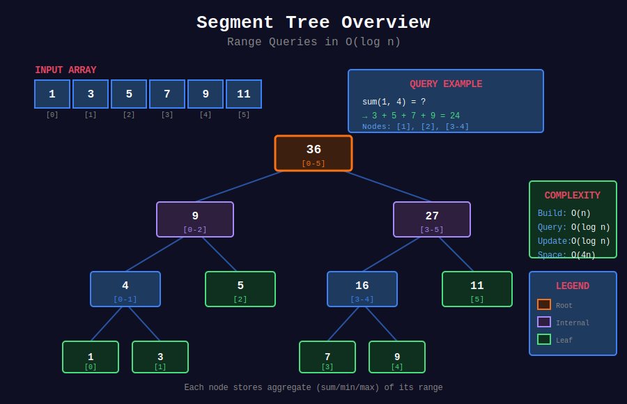
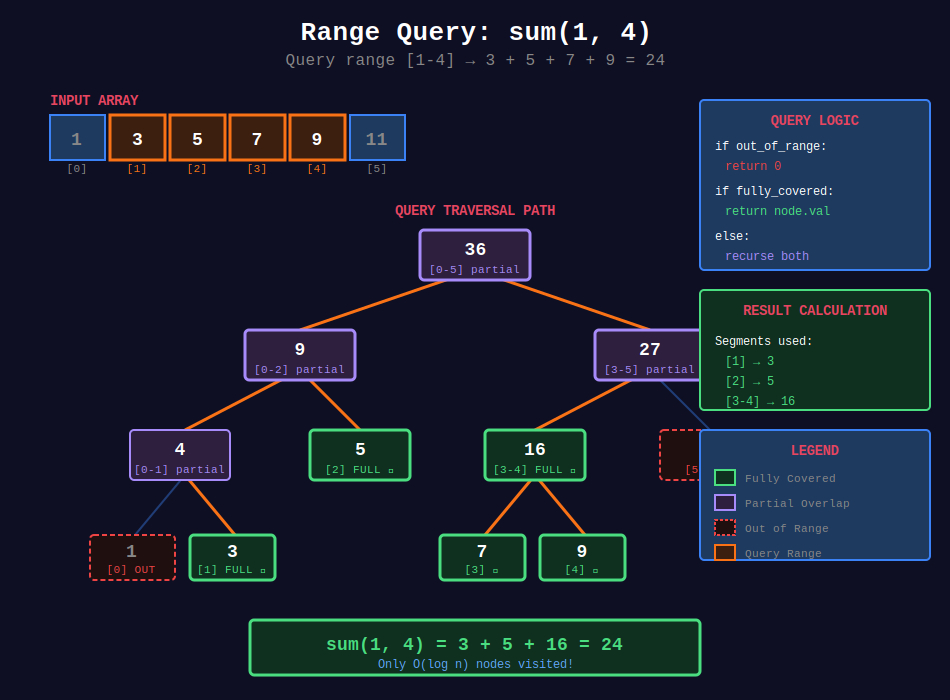
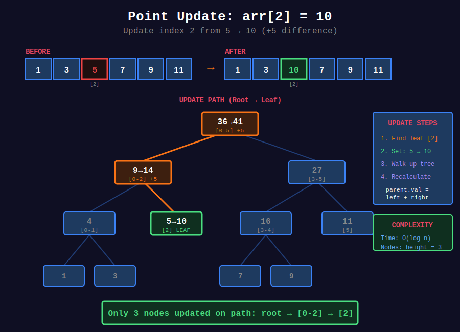
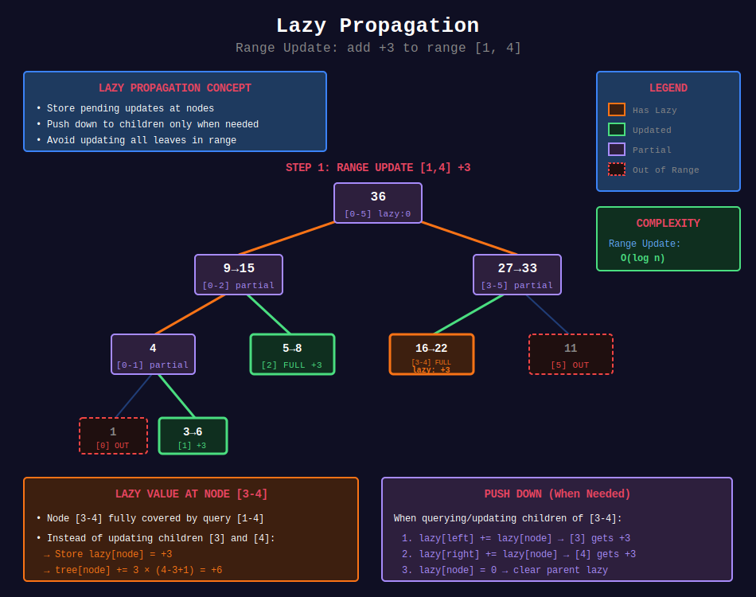
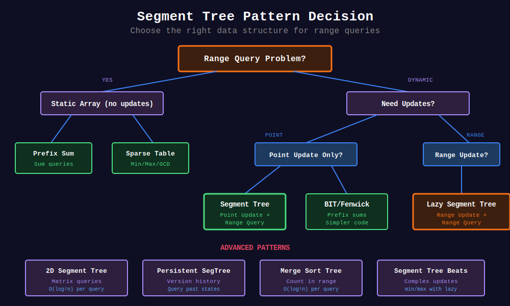

<div align="center">

# 🌲 Segment Trees

<p>
  
  
  
</p>

**Efficient range queries and point updates in O(log n)**

[⬅️ Previous: Tries](../11_tries/README.md) | [🏠 Home](../README.md) | [Next: Union-Find ➡️](../13_union_find/README.md)

</div>

---

## 📊 Visual Overview

<div align="center">

</div>

---

## 📐 Mathematical Foundation

### 1️⃣ Segment Tree Definition

A **Segment Tree** is a binary tree where:
- Each leaf represents a single array element
- Each internal node represents a range [l, r]
- Node value = aggregate of children (sum, min, max, etc.)

---

### 2️⃣ Tree Structure

<div align="center">

</div>

For array of size $n$:

$$
\text{Tree size} \leq 4n
$$

**Node indices (1-indexed):**

$$
\text{left child} = 2i, \quad \text{right child} = 2i + 1
\text{parent} = \lfloor i/2 \rfloor
$$

---

### 3️⃣ Time Complexity

| Operation | Time |
|-----------|:----:|
| Build | O(n) |
| Point Update | O(log n) |
| Range Query | O(log n) |
| Range Update (lazy) | O(log n) |

**Space:** O(4n) = O(n)

---

### 4️⃣ Range Query Decomposition

<div align="center">

</div>

Query [L, R] decomposes into O(log n) disjoint segments.

$$
\text{query}(L, R) = \bigoplus_{i} \text{segment}_i
$$

Where $\oplus$ is the associative operation (sum, min, max, gcd, etc.).

---

### 5️⃣ Point Update Operation

<div align="center">

</div>

Update propagates from leaf to root, updating all ancestors.

---

### 6️⃣ Lazy Propagation

<div align="center">

</div>

**Deferred updates:** Store pending updates at nodes, push down when needed.

$$
\text{lazy}[node] = \text{pending operation for subtree}
$$

**Push down before:**
- Querying children
- Updating children

---

### 7️⃣ Merge Function Requirements

Segment tree works when merge function is **associative**:

$$
f(f(a, b), c) = f(a, f(b, c))
$$

**Examples:**
- Sum: $f(a, b) = a + b$
- Min: $f(a, b) = \min(a, b)$
- Max: $f(a, b) = \max(a, b)$
- GCD: $f(a, b) = \gcd(a, b)$

---

## 🎯 Key Implementations

### Basic Segment Tree (Range Sum)

```python
class SegmentTree:
    """
    Segment Tree for range sum queries and point updates.
    
    Build: O(n), Query: O(log n), Update: O(log n)
    """
    def __init__(self, arr: list[int]):
        self.n = len(arr)
        self.tree = [0] * (4 * self.n)
        self._build(arr, 1, 0, self.n - 1)
    
    def _build(self, arr, node, start, end):
        if start == end:
            self.tree[node] = arr[start]
        else:
            mid = (start + end) // 2
            self._build(arr, 2 * node, start, mid)
            self._build(arr, 2 * node + 1, mid + 1, end)
            self.tree[node] = self.tree[2 * node] + self.tree[2 * node + 1]
    
    def update(self, idx: int, val: int):
        """Point update: arr[idx] = val."""
        self._update(1, 0, self.n - 1, idx, val)
    
    def _update(self, node, start, end, idx, val):
        if start == end:
            self.tree[node] = val
        else:
            mid = (start + end) // 2
            if idx <= mid:
                self._update(2 * node, start, mid, idx, val)
            else:
                self._update(2 * node + 1, mid + 1, end, idx, val)
            self.tree[node] = self.tree[2 * node] + self.tree[2 * node + 1]
    
    def query(self, left: int, right: int) -> int:
        """Range sum query: sum(arr[left:right+1])."""
        return self._query(1, 0, self.n - 1, left, right)
    
    def _query(self, node, start, end, left, right):
        if right < start or end < left:
            return 0  # Out of range
        if left <= start and end <= right:
            return self.tree[node]  # Fully contained
        
        mid = (start + end) // 2
        left_sum = self._query(2 * node, start, mid, left, right)
        right_sum = self._query(2 * node + 1, mid + 1, end, left, right)
        return left_sum + right_sum
```

### Segment Tree with Lazy Propagation

```python
class LazySegmentTree:
    """
    Segment Tree with lazy propagation for range updates.
    
    Range Update: O(log n), Range Query: O(log n)
    """
    def __init__(self, arr: list[int]):
        self.n = len(arr)
        self.tree = [0] * (4 * self.n)
        self.lazy = [0] * (4 * self.n)
        self._build(arr, 1, 0, self.n - 1)
    
    def _build(self, arr, node, start, end):
        if start == end:
            self.tree[node] = arr[start]
        else:
            mid = (start + end) // 2
            self._build(arr, 2 * node, start, mid)
            self._build(arr, 2 * node + 1, mid + 1, end)
            self.tree[node] = self.tree[2 * node] + self.tree[2 * node + 1]
    
    def _push_down(self, node, start, end):
        """Propagate lazy value to children."""
        if self.lazy[node] != 0:
            mid = (start + end) // 2

            # Update children
            self.tree[2 * node] += self.lazy[node] * (mid - start + 1)
            self.tree[2 * node + 1] += self.lazy[node] * (end - mid)

            # Propagate lazy
            self.lazy[2 * node] += self.lazy[node]
            self.lazy[2 * node + 1] += self.lazy[node]

            # Clear current lazy
            self.lazy[node] = 0
    
    def range_update(self, left: int, right: int, val: int):
        """Add val to all elements in [left, right]."""
        self._range_update(1, 0, self.n - 1, left, right, val)
    
    def _range_update(self, node, start, end, left, right, val):
        if right < start or end < left:
            return
        
        if left <= start and end <= right:
            self.tree[node] += val * (end - start + 1)
            self.lazy[node] += val
            return
        
        self._push_down(node, start, end)
        mid = (start + end) // 2
        self._range_update(2 * node, start, mid, left, right, val)
        self._range_update(2 * node + 1, mid + 1, end, left, right, val)
        self.tree[node] = self.tree[2 * node] + self.tree[2 * node + 1]
    
    def query(self, left: int, right: int) -> int:
        return self._query(1, 0, self.n - 1, left, right)
    
    def _query(self, node, start, end, left, right):
        if right < start or end < left:
            return 0
        
        if left <= start and end <= right:
            return self.tree[node]
        
        self._push_down(node, start, end)
        mid = (start + end) // 2
        return (self._query(2 * node, start, mid, left, right) +
                self._query(2 * node + 1, mid + 1, end, left, right))
```

### Range Min/Max Query

```python
class RangeMinQuery:
    """Segment Tree for range minimum queries."""
    
    def __init__(self, arr: list[int]):
        self.n = len(arr)
        self.tree = [float('inf')] * (4 * self.n)
        self._build(arr, 1, 0, self.n - 1)
    
    def _build(self, arr, node, start, end):
        if start == end:
            self.tree[node] = arr[start]
        else:
            mid = (start + end) // 2
            self._build(arr, 2 * node, start, mid)
            self._build(arr, 2 * node + 1, mid + 1, end)
            self.tree[node] = min(self.tree[2 * node], self.tree[2 * node + 1])
    
    def query(self, left: int, right: int) -> int:
        return self._query(1, 0, self.n - 1, left, right)
    
    def _query(self, node, start, end, left, right):
        if right < start or end < left:
            return float('inf')
        if left <= start and end <= right:
            return self.tree[node]
        
        mid = (start + end) // 2
        return min(
            self._query(2 * node, start, mid, left, right),
            self._query(2 * node + 1, mid + 1, end, left, right)
        )
```

---

## 🏆 LeetCode Problems

### 🟡 Medium

| # | Problem | Pattern | Time | Space |
|:-:|---------|---------|:----:|:-----:|
| 307 | [Range Sum Query - Mutable](https://leetcode.com/problems/range-sum-query-mutable/) | Point Update | O(log n) | O(n) |
| 1649 | [Create Sorted Array](https://leetcode.com/problems/create-sorted-array-through-instructions/) | Count Inversions | O(n log n) | O(n) |

### 🔴 Hard

| # | Problem | Pattern | Time | Space |
|:-:|---------|---------|:----:|:-----:|
| 218 | [The Skyline Problem](https://leetcode.com/problems/the-skyline-problem/) | Coordinate Compression | O(n log n) | O(n) |
| 315 | [Count of Smaller Numbers](https://leetcode.com/problems/count-of-smaller-numbers-after-self/) | Inversions | O(n log n) | O(n) |
| 327 | [Count of Range Sum](https://leetcode.com/problems/count-of-range-sum/) | Range Count | O(n log n) | O(n) |
| 493 | [Reverse Pairs](https://leetcode.com/problems/reverse-pairs/) | Inversions | O(n log n) | O(n) |
| 699 | [Falling Squares](https://leetcode.com/problems/falling-squares/) | Range Max | O(n log n) | O(n) |
| 715 | [Range Module](https://leetcode.com/problems/range-module/) | Interval Tree | O(n log n) | O(n) |
| 732 | [My Calendar III](https://leetcode.com/problems/my-calendar-iii/) | Range Update | O(n log n) | O(n) |
| 850 | [Rectangle Area II](https://leetcode.com/problems/rectangle-area-ii/) | Sweep + Segtree | O(n² log n) | O(n) |

---

## 📊 Segment Tree Pattern Decision

<div align="center">

</div>

```
Range Query Problem
        |
        +-- Static array → Sparse Table / Prefix Sum
        |
        +-- Point update + Range query → Basic Segment Tree
        |
        +-- Range update + Range query → Lazy Propagation
        |
        +-- 2D queries → 2D Segment Tree
        |
        +-- Persistence needed → Persistent Segment Tree
```

---

## 📈 Visual Representation

```
Array: [1, 3, 5, 7, 9, 11]

Segment Tree (Sum):
                36 [0-5]
               /          \
         9 [0-2]          27 [3-5]
         /    \           /      \
    4 [0-1]  5[2]    16[3-4]   11[5]
    /    \           /    \
  1[0]  3[1]      7[3]   9[4]
```

---

## 📚 References

| Resource | Link |
|----------|------|
| **Segment Tree** | [Wikipedia](https://en.wikipedia.org/wiki/Segment_tree) |
| **CP-Algorithms** | [Segment Tree](https://cp-algorithms.com/data_structures/segment_tree.html) |
| **Lazy Propagation** | [GeeksforGeeks](https://www.geeksforgeeks.org/lazy-propagation-in-segment-tree/) |

---

<div align="center">

**Made with ❤️ by [Gaurav Goswami](https://github.com/Gaurav14cs17)**

[⬅️ Previous: Tries](../11_tries/README.md) | [🏠 Home](../README.md) | [Next: Union-Find ➡️](../13_union_find/README.md)

</div>
