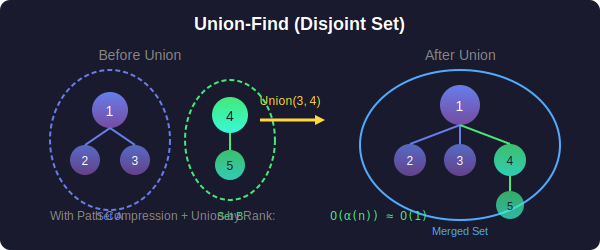

<div align="center">

# 🔗 Union-Find (Disjoint Set Union)



<p>
  
  
  
</p>

**Efficient connected component management with near O(1) operations**

[⬅️ Previous: Segment Trees](../12_segment_trees/README.md) | [🏠 Home](../README.md) | [Next: Sorting ➡️](../14_sorting/README.md)

</div>

---

## 📐 Mathematical Foundation

### 1️⃣ Disjoint Set Definition

A **Disjoint Set** data structure maintains:

- Collection of non-overlapping sets

- Each set has a representative (root)

**Operations:**

- `find(x)`: Find representative of set containing x

- `union(x, y)`: Merge sets containing x and y

---

### 2️⃣ Time Complexity

With **path compression** and **union by rank**:

$$\text{Amortized time per operation} = O(\alpha(n))$$

Where $\alpha(n)$ is the **inverse Ackermann function**:

$$\alpha(n) \leq 4 \text{ for all practical } n$$

Effectively **O(1)** per operation!

---

### 3️⃣ Path Compression

**Optimization:** Point all nodes directly to root during find.

$$\text{parent}[x] = \text{find}(\text{parent}[x])$$

---

### 4️⃣ Union by Rank

**Optimization:** Attach smaller tree under larger tree.

$$\text{If rank}[root_x] < \text{rank}[root_y]: \text{parent}[root_x] = root_y$$

This keeps tree height logarithmic.

---

### 5️⃣ Number of Components

$$\text{components} = \text{initial count} - \text{successful unions}$$

---

## 🎯 Key Implementations

### Standard Union-Find

```python
class UnionFind:
    """
    Union-Find with path compression and union by rank.
    
    Find/Union: O(α(n)) ≈ O(1) amortized
    """
    def __init__(self, n: int):
        self.parent = list(range(n))
        self.rank = [0] * n
        self.components = n
    
    def find(self, x: int) -> int:
        """Find root with path compression."""
        if self.parent[x] != x:
            self.parent[x] = self.find(self.parent[x])
        return self.parent[x]
    
    def union(self, x: int, y: int) -> bool:
        """Union by rank. Returns True if merged."""
        root_x, root_y = self.find(x), self.find(y)
        
        if root_x == root_y:
            return False
        
        # Attach smaller tree under larger
        if self.rank[root_x] < self.rank[root_y]:
            root_x, root_y = root_y, root_x
        
        self.parent[root_y] = root_x
        if self.rank[root_x] == self.rank[root_y]:
            self.rank[root_x] += 1
        
        self.components -= 1
        return True
    
    def connected(self, x: int, y: int) -> bool:
        """Check if x and y are in same set."""
        return self.find(x) == self.find(y)
    
    def get_components(self) -> int:
        """Return number of disjoint sets."""
        return self.components

```

### Union-Find with Size

```python
class UnionFindSize:
    """Union-Find tracking component sizes."""
    
    def __init__(self, n: int):
        self.parent = list(range(n))
        self.size = [1] * n
    
    def find(self, x: int) -> int:
        if self.parent[x] != x:
            self.parent[x] = self.find(self.parent[x])
        return self.parent[x]
    
    def union(self, x: int, y: int) -> bool:
        root_x, root_y = self.find(x), self.find(y)
        
        if root_x == root_y:
            return False
        
        # Attach smaller to larger
        if self.size[root_x] < self.size[root_y]:
            root_x, root_y = root_y, root_x
        
        self.parent[root_y] = root_x
        self.size[root_x] += self.size[root_y]
        return True
    
    def get_size(self, x: int) -> int:
        """Size of component containing x."""
        return self.size[self.find(x)]

```

### Weighted Union-Find

```python
class WeightedUnionFind:
    """
    Union-Find with edge weights (for problems like Evaluate Division).
    
    Tracks ratio/weight from each node to its root.
    """
    def __init__(self, n: int):
        self.parent = list(range(n))
        self.weight = [1.0] * n  # weight[x] = x / parent[x]
    
    def find(self, x: int) -> int:
        if self.parent[x] != x:
            root = self.find(self.parent[x])
            self.weight[x] *= self.weight[self.parent[x]]
            self.parent[x] = root
        return self.parent[x]
    
    def union(self, x: int, y: int, ratio: float) -> bool:
        """Union x and y where x/y = ratio."""
        root_x, root_y = self.find(x), self.find(y)
        
        if root_x == root_y:
            return False
        
        # weight[x] = x/root_x, weight[y] = y/root_y
        # x/y = ratio => root_y/root_x = weight[x]/(ratio * weight[y])
        self.parent[root_y] = root_x
        self.weight[root_y] = self.weight[x] / (ratio * self.weight[y])
        return True
    
    def query(self, x: int, y: int) -> float:
        """Return x/y if in same component, -1 otherwise."""
        if self.find(x) != self.find(y):
            return -1.0
        return self.weight[y] / self.weight[x]

```

---

## 🏆 LeetCode Problems

### 🟡 Medium

| # | Problem | Pattern | Time | Space |
|:-:|---------|---------|:----:|:-----:|
| 130 | [Surrounded Regions](https://leetcode.com/problems/surrounded-regions/) | Grid UF | O(mn·α) | O(mn) |
| 200 | [Number of Islands](https://leetcode.com/problems/number-of-islands/) | Grid UF | O(mn·α) | O(mn) |
| 261 | [Graph Valid Tree](https://leetcode.com/problems/graph-valid-tree/) | Cycle Check | O(E·α) | O(V) |
| 323 | [Number of Connected Components](https://leetcode.com/problems/number-of-connected-components-in-an-undirected-graph/) | Basic UF | O(E·α) | O(V) |
| 399 | [Evaluate Division](https://leetcode.com/problems/evaluate-division/) | Weighted UF | O(Q·α) | O(V) |
| 547 | [Number of Provinces](https://leetcode.com/problems/number-of-provinces/) | Basic UF | O(n²·α) | O(n) |
| 684 | [Redundant Connection](https://leetcode.com/problems/redundant-connection/) | Cycle Edge | O(E·α) | O(V) |
| 721 | [Accounts Merge](https://leetcode.com/problems/accounts-merge/) | String UF | O(n·α) | O(n) |
| 990 | [Satisfiability of Equality](https://leetcode.com/problems/satisfiability-of-equality-equations/) | Equality UF | O(n·α) | O(26) |
| 1319 | [Number of Operations to Make Network Connected](https://leetcode.com/problems/number-of-operations-to-make-network-connected/) | Count Extra | O(E·α) | O(V) |

### 🔴 Hard

| # | Problem | Pattern | Time | Space |
|:-:|---------|---------|:----:|:-----:|
| 685 | [Redundant Connection II](https://leetcode.com/problems/redundant-connection-ii/) | Directed UF | O(E) | O(V) |
| 765 | [Couples Holding Hands](https://leetcode.com/problems/couples-holding-hands/) | Cycle Count | O(n·α) | O(n) |
| 839 | [Similar String Groups](https://leetcode.com/problems/similar-string-groups/) | String UF | O(n²·L) | O(n) |
| 1568 | [Minimum Number of Days to Disconnect Island](https://leetcode.com/problems/minimum-number-of-days-to-disconnect-island/) | Articulation | O(mn) | O(mn) |

---

## 📊 Union-Find Pattern Decision

```
Connectivity Problem
        |
        +-- Count components → Track components
        |
        +-- Detect cycle → Union returns false
        |
        +-- Dynamic connectivity → Union-Find
        |
        +-- Weighted edges → Weighted Union-Find
        |
        +-- Grid connectivity → Virtual node for borders

```

---

## 📚 References

| Resource | Link |
|----------|------|
| **Disjoint Set** | [Wikipedia](https://en.wikipedia.org/wiki/Disjoint-set_data_structure) |
| **Union-Find** | [CP-Algorithms](https://cp-algorithms.com/data_structures/disjoint_set_union.html) |
| **Inverse Ackermann** | [Wikipedia](https://en.wikipedia.org/wiki/Ackermann_function#Inverse) |

---

<div align="center">

**Made with ❤️ by [Gaurav Goswami](https://github.com/Gaurav14cs17)**

[⬅️ Previous: Segment Trees](../12_segment_trees/README.md) | [🏠 Home](../README.md) | [Next: Sorting ➡️](../14_sorting/README.md)

</div>
