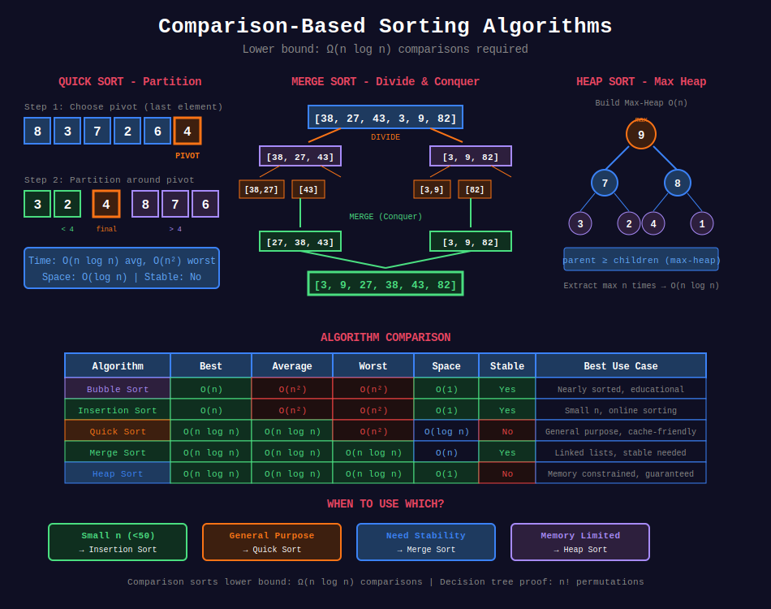

<div align="center">

# ⚖️ Comparison-Based Sorting



<p>
  
  
</p>

</div>

---

## 🧭 Navigation

| ⬅️ Previous | 📂 Current | ➡️ Next |
|:------------|:----------:|--------:|
| [🏠 Sorting Home](../README.md) | **01. Comparison Sorts** | [02. Non-Comparison Sorts →](../02_non_comparison_sorts/README.md) |

---

## 📐 Mathematical Foundations

### 1️⃣ Lower Bound Proof

**Theorem:** Comparison sorts require $\Omega(n \log n)$ comparisons.

**Proof:**
- Decision tree has $n!$ leaves (permutations)
- Tree height $h \geq \log\_2(n!)$
- Stirling: $\log\_2(n!) = \Theta(n \log n)$ ∎

---

### 2️⃣ Quick Sort Partition Invariant

After `partition(arr, low, high)`:

```math
\forall i \in [low, pivot): arr[i] \leq arr[pivot]
\forall i \in (pivot, high]: arr[i] > arr[pivot]
```

---

### 3️⃣ Merge Sort Correctness

**Invariant:** Merged array is sorted at each step.

**Proof by induction:**
- Base: Single element is sorted
- Inductive: Merging two sorted arrays produces sorted array ∎

---

### 4️⃣ Heap Sort

**Build max-heap:** O(n)
**Extract max n times:** O(n log n)

```math
T = O(n) + O(n \log n) = O(n \log n)
```

---

## 💻 Code Implementations

```python
def quickSort(arr: list[int], low: int, high: int) -> None:
    """
    Quick Sort with randomized pivot.
    
    Time: O(n log n) avg, O(n²) worst
    Space: O(log n)
    """
    if low < high:
        pivot = partition(arr, low, high)
        quickSort(arr, low, pivot - 1)
        quickSort(arr, pivot + 1, high)

def partition(arr: list[int], low: int, high: int) -> int:
    """Lomuto partition."""
    import random

    # Randomize pivot to avoid worst case
    rand_idx = random.randint(low, high)
    arr[rand_idx], arr[high] = arr[high], arr[rand_idx]
    
    pivot = arr[high]
    i = low - 1
    
    for j in range(low, high):
        if arr[j] <= pivot:
            i += 1
            arr[i], arr[j] = arr[j], arr[i]
    
    arr[i + 1], arr[high] = arr[high], arr[i + 1]
    return i + 1

def mergeSort(arr: list[int]) -> list[int]:
    """
    Merge Sort (stable, O(n log n)).
    
    Time: O(n log n)
    Space: O(n)
    """
    if len(arr) <= 1:
        return arr
    
    mid = len(arr) // 2
    left = mergeSort(arr[:mid])
    right = mergeSort(arr[mid:])
    
    return merge(left, right)

def merge(left: list[int], right: list[int]) -> list[int]:
    """Merge two sorted arrays."""
    result = []
    i = j = 0
    
    while i < len(left) and j < len(right):
        if left[i] <= right[j]:  # <= for stability
            result.append(left[i])
            i += 1
        else:
            result.append(right[j])
            j += 1
    
    result.extend(left[i:])
    result.extend(right[j:])
    return result

def heapSort(arr: list[int]) -> None:
    """
    Heap Sort (in-place, O(n log n)).
    
    Time: O(n log n)
    Space: O(1)
    """
    n = len(arr)
    
    # Build max-heap
    for i in range(n // 2 - 1, -1, -1):
        heapify(arr, n, i)
    
    # Extract elements one by one
    for i in range(n - 1, 0, -1):
        arr[0], arr[i] = arr[i], arr[0]
        heapify(arr, i, 0)

def heapify(arr: list[int], n: int, i: int) -> None:
    """Maintain max-heap property."""
    largest = i
    left = 2 * i + 1
    right = 2 * i + 2
    
    if left < n and arr[left] > arr[largest]:
        largest = left
    if right < n and arr[right] > arr[largest]:
        largest = right
    
    if largest != i:
        arr[i], arr[largest] = arr[largest], arr[i]
        heapify(arr, n, largest)

def sortList(head: 'ListNode') -> 'ListNode':
    """
    Sort Linked List (LeetCode 148).
    
    Merge sort for linked list.
    
    Time: O(n log n), Space: O(log n)
    """
    if not head or not head.next:
        return head
    
    # Find middle
    slow, fast = head, head.next
    while fast and fast.next:
        slow = slow.next
        fast = fast.next.next
    
    mid = slow.next
    slow.next = None
    
    left = sortList(head)
    right = sortList(mid)
    
    return mergeLists(left, right)

def mergeLists(l1: 'ListNode', l2: 'ListNode') -> 'ListNode':
    """Merge two sorted linked lists."""
    dummy = ListNode(0)
    current = dummy
    
    while l1 and l2:
        if l1.val <= l2.val:
            current.next = l1
            l1 = l1.next
        else:
            current.next = l2
            l2 = l2.next
        current = current.next
    
    current.next = l1 or l2
    return dummy.next
```

---

## 🏆 LeetCode Problems

### 🟡 Medium

| # | Problem | Pattern | Time | Space |
|:-:|---------|---------|:----:|:-----:|
| 147 | [Insertion Sort List](https://leetcode.com/problems/insertion-sort-list/) | Insertion Sort | O(n²) | O(1) |
| 148 | [Sort List](https://leetcode.com/problems/sort-list/) | Merge Sort | O(n log n) | O(log n) |
| 215 | [Kth Largest Element](https://leetcode.com/problems/kth-largest-element-in-an-array/) | Quickselect | O(n) avg | O(1) |
| 912 | [Sort an Array](https://leetcode.com/problems/sort-an-array/) | Merge/Quick | O(n log n) | O(n) |

### 🔴 Hard

| # | Problem | Pattern | Time | Space |
|:-:|---------|---------|:----:|:-----:|
| 315 | [Count Smaller After Self](https://leetcode.com/problems/count-of-smaller-numbers-after-self/) | Merge Sort | O(n log n) | O(n) |
| 493 | [Reverse Pairs](https://leetcode.com/problems/reverse-pairs/) | Merge Sort | O(n log n) | O(n) |

---

## 📚 References

| Resource | Link |
|----------|------|
| **Quick Sort** | [Wikipedia](https://en.wikipedia.org/wiki/Quicksort) |
| **Merge Sort** | [Wikipedia](https://en.wikipedia.org/wiki/Merge_sort) |

---

<div align="center">

**Made with ❤️ by [Gaurav Goswami](https://github.com/Gaurav14cs17)**

</div>

---

## 🧭 Navigation

| ⬅️ Previous | 📂 Current | ➡️ Next |
|:------------|:----------:|--------:|
| [🏠 Sorting Home](../README.md) | **01. Comparison Sorts** | [02. Non-Comparison Sorts →](../02_non_comparison_sorts/README.md) |
