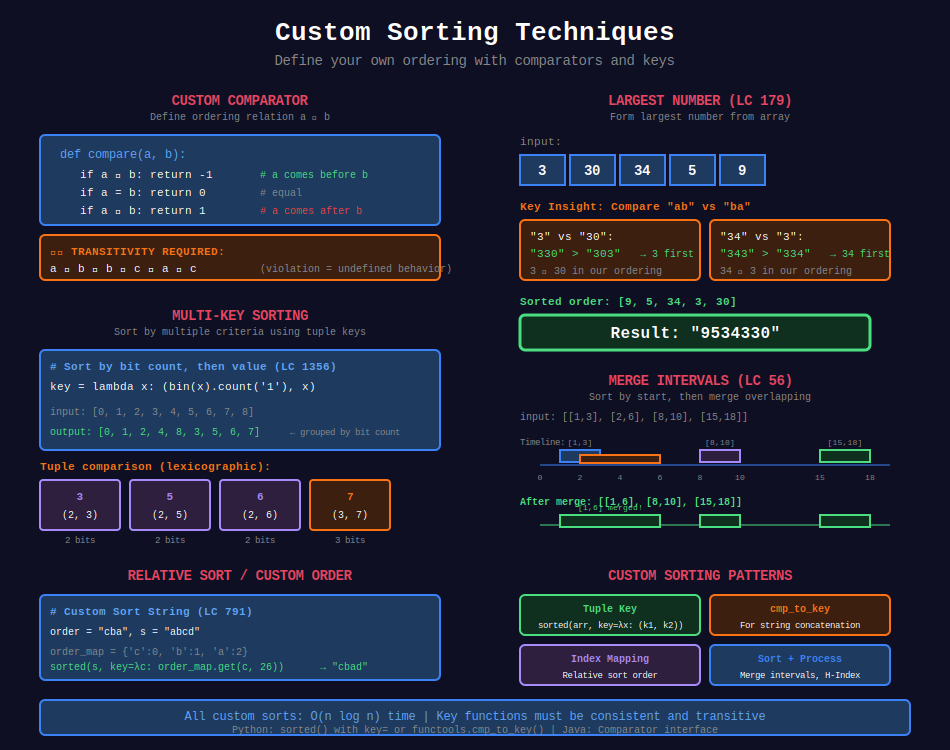

<div align="center">

# 🎨 Custom Sorting



<p>
  
  
</p>

</div>

---

## 🧭 Navigation

| ⬅️ Previous | 📂 Current | ➡️ Next Topic |
|:------------|:----------:|--------:|
| [← 02. Non-Comparison Sorts](../02_non_comparison_sorts/README.md) | **03. Custom Sorting** | [🏠 Sorting Home](../README.md) → [Searching](../../15_searching/README.md) |

---

## 📐 Mathematical Foundations

### 1️⃣ Custom Comparator

**Define ordering relation** $\prec$ such that:

```math
a \prec b \Leftrightarrow \text{key}(a) < \text{key}(b)

```

Or use comparator function:

```math
\text{cmp}(a, b) = \begin{cases}
-1 & a \prec b \\
0 & a = b \\
1 & a \succ b
\end{cases}

```

---

### 2️⃣ Transitivity Requirement

Comparator must be transitive:

```math
a \prec b \land b \prec c \Rightarrow a \prec c

```

Violation causes undefined behavior!

---

### 3️⃣ Largest Number Problem

**Key insight:** Compare $a + b$ vs $b + a$ as strings.

```math
a \prec b \Leftrightarrow ab > ba \text{ (string comparison)}

```

**Example:** "3" vs "30" → "330" > "303" → 3 comes first.

---

### 4️⃣ Multi-Key Sorting

**Sort by multiple criteria:**

```math
\text{key}(x) = (\text{key}_1(x), \text{key}_2(x), \ldots)

```

Python: Use tuple as sort key.

---

## 💻 Code Implementations

```python
from functools import cmp_to_key

def largestNumber(nums: list[int]) -> str:
    """
    Largest Number (LeetCode 179).
    
    Custom comparator: compare ab vs ba.
    
    Time: O(n log n), Space: O(n)
    """
    def compare(a, b):
        if a + b > b + a:
            return -1
        elif a + b < b + a:
            return 1
        return 0
    
    # Convert to strings
    strs = [str(num) for num in nums]
    
    # Sort with custom comparator
    strs.sort(key=cmp_to_key(compare))
    
    # Handle edge case: all zeros
    if strs[0] == '0':
        return '0'
    
    return ''.join(strs)

def mergeIntervals(intervals: list[list[int]]) -> list[list[int]]:
    """
    Merge Intervals (LeetCode 56).
    
    Sort by start, merge overlapping.
    
    Time: O(n log n), Space: O(n)
    """
    intervals.sort(key=lambda x: x[0])
    
    merged = [intervals[0]]
    
    for start, end in intervals[1:]:
        if start <= merged[-1][1]:
            merged[-1][1] = max(merged[-1][1], end)
        else:
            merged.append([start, end])
    
    return merged

def customSortString(order: str, s: str) -> str:
    """
    Custom Sort String (LeetCode 791).
    
    Sort s based on order in 'order'.
    
    Time: O(n log n), Space: O(n)
    """
    order_map = {c: i for i, c in enumerate(order)}
    
    # Characters not in order get high priority (end)
    return ''.join(sorted(s, key=lambda c: order_map.get(c, 26)))

def relativeSortArray(arr1: list[int], arr2: list[int]) -> list[int]:
    """
    Relative Sort Array (LeetCode 1122).
    
    Sort arr1 based on order in arr2.
    
    Time: O(n log n), Space: O(n)
    """
    order_map = {num: i for i, num in enumerate(arr2)}
    
    # Elements not in arr2 sorted in ascending order at end
    return sorted(arr1, key=lambda x: (order_map.get(x, len(arr2)), x))

def sortPeople(names: list[str], heights: list[int]) -> list[str]:
    """
    Sort people by height (descending).
    
    Time: O(n log n), Space: O(n)
    """
    return [name for name, _ in sorted(zip(names, heights), 
                                        key=lambda x: -x[1])]

def sortByBits(arr: list[int]) -> list[int]:
    """
    Sort Integers by The Number of 1 Bits (LeetCode 1356).
    
    Primary: bit count, Secondary: value.
    
    Time: O(n log n), Space: O(n)
    """
    return sorted(arr, key=lambda x: (bin(x).count('1'), x))

def frequencySort(s: str) -> str:
    """
    Sort Characters By Frequency (LeetCode 451).
    
    Sort by frequency (descending).
    
    Time: O(n log n), Space: O(n)
    """
    from collections import Counter
    
    freq = Counter(s)
    
    # Sort by frequency descending
    chars = sorted(freq.keys(), key=lambda c: -freq[c])
    
    return ''.join(c * freq[c] for c in chars)

def hIndex(citations: list[int]) -> int:
    """
    H-Index (LeetCode 274).
    
    Sort and find h where h papers have >= h citations.
    
    Time: O(n log n), Space: O(1)
    """
    citations.sort(reverse=True)
    
    h = 0
    for i, c in enumerate(citations):
        if c >= i + 1:
            h = i + 1
        else:
            break
    
    return h

```

---

## 🏆 LeetCode Problems

### 🟢 Easy

| # | Problem | Pattern | Time | Space |
|:-:|---------|---------|:----:|:-----:|
| 1122 | [Relative Sort Array](https://leetcode.com/problems/relative-sort-array/) | Custom Key | O(n log n) | O(n) |
| 1356 | [Sort Integers by Bits](https://leetcode.com/problems/sort-integers-by-the-number-of-1-bits/) | Multi-Key | O(n log n) | O(n) |

### 🟡 Medium

| # | Problem | Pattern | Time | Space |
|:-:|---------|---------|:----:|:-----:|
| 56 | [Merge Intervals](https://leetcode.com/problems/merge-intervals/) | Sort + Merge | O(n log n) | O(n) |
| 179 | [Largest Number](https://leetcode.com/problems/largest-number/) | Custom Cmp | O(n log n) | O(n) |
| 274 | [H-Index](https://leetcode.com/problems/h-index/) | Sort | O(n log n) | O(1) |
| 451 | [Sort Characters by Frequency](https://leetcode.com/problems/sort-characters-by-frequency/) | Frequency | O(n log n) | O(n) |
| 791 | [Custom Sort String](https://leetcode.com/problems/custom-sort-string/) | Custom Order | O(n log n) | O(n) |

---

## 📊 Custom Sorting Patterns

```
Custom Sort
     |
     +-- Multiple keys → Tuple key
     |
     +-- String concatenation → cmp_to_key
     |
     +-- Relative order → Index mapping
     |
     +-- After sort merge → Sort then iterate

```

---

## 📚 References

| Resource | Link |
|----------|------|
| **Python Sorting** | [Python Docs](https://docs.python.org/3/howto/sorting.html) |
| **cmp_to_key** | [Python Docs](https://docs.python.org/3/library/functools.html#functools.cmp_to_key) |

---

<div align="center">

**Made with ❤️ by [Gaurav Goswami](https://github.com/Gaurav14cs17)**

</div>

---

## 🧭 Navigation

| ⬅️ Previous | 📂 Current | ➡️ Next Topic |
|:------------|:----------:|--------:|
| [← 02. Non-Comparison Sorts](../02_non_comparison_sorts/README.md) | **03. Custom Sorting** | [🏠 Sorting Home](../README.md) → [Searching](../../15_searching/README.md) |
