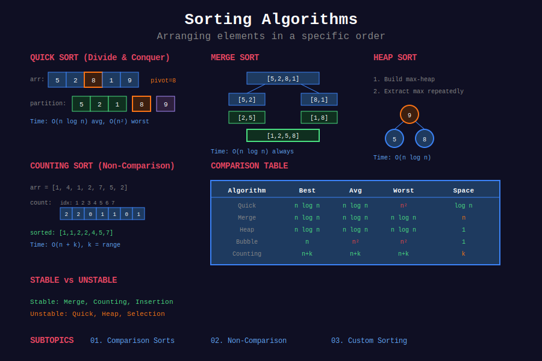

<div align="center">

# 📊 Sorting Algorithms



<p>
  
  
  
</p>

**Fundamental algorithms for ordering data**

[⬅️ Previous: Union-Find](../13_union_find/README.md) | [🏠 Home](../README.md) | [Next: Searching ➡️](../15_searching/README.md)

</div>

---

## 📐 Mathematical Foundation

### 1️⃣ Comparison Sort Lower Bound

**Theorem:** Any comparison-based sort requires:

```math
\boxed{\Omega(n \log n) \text{ comparisons}}
```

**Proof:** 
- $n!$ possible permutations
- Each comparison gives 1 bit of information
- Need $\log\_2(n!) = \Omega(n \log n)$ bits

---

### 2️⃣ Sorting Algorithm Comparison

| Algorithm | Best | Average | Worst | Space | Stable |
|-----------|:----:|:-------:|:-----:|:-----:|:------:|
| Bubble Sort | O(n) | O(n²) | O(n²) | O(1) | ✅ |
| Selection Sort | O(n²) | O(n²) | O(n²) | O(1) | ❌ |
| Insertion Sort | O(n) | O(n²) | O(n²) | O(1) | ✅ |
| Merge Sort | O(n log n) | O(n log n) | O(n log n) | O(n) | ✅ |
| Quick Sort | O(n log n) | O(n log n) | O(n²) | O(log n) | ❌ |
| Heap Sort | O(n log n) | O(n log n) | O(n log n) | O(1) | ❌ |
| Counting Sort | O(n+k) | O(n+k) | O(n+k) | O(k) | ✅ |
| Radix Sort | O(d(n+k)) | O(d(n+k)) | O(d(n+k)) | O(n+k) | ✅ |
| Bucket Sort | O(n+k) | O(n+k) | O(n²) | O(n) | ✅ |

---

### 3️⃣ Stability

**Stable sort:** Equal elements maintain relative order.

```math
a_i = a_j \land i < j \Rightarrow \text{pos}(a_i) < \text{pos}(a_j) \text{ after sort}
```

**Important for:** Multi-key sorting, preserving original order.

---

### 4️⃣ Merge Sort Recurrence

```math
T(n) = 2T(n/2) + O(n)
```

**Solution (Master Theorem):**

```math
T(n) = O(n \log n)
```

---

### 5️⃣ Quick Sort Analysis

**Best/Average case:** Balanced partitions.

```math
T(n) = 2T(n/2) + O(n) = O(n \log n)
```

**Worst case:** Unbalanced partitions (sorted array).

```math
T(n) = T(n-1) + O(n) = O(n^2)
```

---

### 6️⃣ Counting Sort

**When:** Values in range $[0, k]$.

```math
T = O(n + k), \quad S = O(k)
```

**Works when:** $k = O(n)$.

---

### 7️⃣ Radix Sort

**Sort by each digit:** LSD (Least Significant Digit) first.

```math
T = O(d \cdot (n + k))
```

Where $d$ = digits, $k$ = base (usually 10).

---

## 📂 Subtopics Navigation

| # | Topic | Problems | Link |
|:-:|-------|:--------:|------|
| 1 | Comparison Sorts | 8+ | [📖 Go →](./01_comparison_sorts/README.md) |
| 2 | Non-Comparison Sorts | 5+ | [📖 Go →](./02_non_comparison_sorts/README.md) |
| 3 | Custom Sorting | 8+ | [📖 Go →](./03_custom_sorting/README.md) |

---

## 🎯 Key Implementations

### Quick Sort

```python
def quickSort(arr: list[int], low: int, high: int) -> None:
    """
    Quick Sort with Lomuto partition.
    
    Time: O(n log n) avg, O(n²) worst
    Space: O(log n) for recursion
    """
    if low < high:
        pivot = partition(arr, low, high)
        quickSort(arr, low, pivot - 1)
        quickSort(arr, pivot + 1, high)

def partition(arr: list[int], low: int, high: int) -> int:
    """Lomuto partition scheme."""
    pivot = arr[high]
    i = low - 1
    
    for j in range(low, high):
        if arr[j] <= pivot:
            i += 1
            arr[i], arr[j] = arr[j], arr[i]
    
    arr[i + 1], arr[high] = arr[high], arr[i + 1]
    return i + 1
```

### Merge Sort

```python
def mergeSort(arr: list[int]) -> list[int]:
    """
    Merge Sort.
    
    Time: O(n log n)
    Space: O(n)
    """
    if len(arr) <= 1:
        return arr
    
    mid = len(arr) // 2
    left = mergeSort(arr[:mid])
    right = mergeSort(arr[mid:])
    
    return merge(left, right)

def merge(left: list[int], right: list[int]) -> list[int]:
    """Merge two sorted arrays."""
    result = []
    i = j = 0
    
    while i < len(left) and j < len(right):
        if left[i] <= right[j]:
            result.append(left[i])
            i += 1
        else:
            result.append(right[j])
            j += 1
    
    result.extend(left[i:])
    result.extend(right[j:])
    return result
```

---

## 🏆 LeetCode Problems

### 🟢 Easy

| # | Problem | Pattern | Time | Space |
|:-:|---------|---------|:----:|:-----:|
| 88 | [Merge Sorted Array](https://leetcode.com/problems/merge-sorted-array/) | Two Pointers | O(n+m) | O(1) |
| 242 | [Valid Anagram](https://leetcode.com/problems/valid-anagram/) | Counting | O(n) | O(1) |
| 349 | [Intersection of Two Arrays](https://leetcode.com/problems/intersection-of-two-arrays/) | Sort + Two Ptr | O(n log n) | O(n) |
| 976 | [Largest Perimeter Triangle](https://leetcode.com/problems/largest-perimeter-triangle/) | Sort | O(n log n) | O(1) |

### 🟡 Medium

| # | Problem | Pattern | Time | Space |
|:-:|---------|---------|:----:|:-----:|
| 56 | [Merge Intervals](https://leetcode.com/problems/merge-intervals/) | Sort + Merge | O(n log n) | O(n) |
| 75 | [Sort Colors](https://leetcode.com/problems/sort-colors/) | Dutch Flag | O(n) | O(1) |
| 147 | [Insertion Sort List](https://leetcode.com/problems/insertion-sort-list/) | Insertion Sort | O(n²) | O(1) |
| 148 | [Sort List](https://leetcode.com/problems/sort-list/) | Merge Sort | O(n log n) | O(log n) |
| 179 | [Largest Number](https://leetcode.com/problems/largest-number/) | Custom Sort | O(n log n) | O(n) |
| 215 | [Kth Largest Element](https://leetcode.com/problems/kth-largest-element-in-an-array/) | Quickselect | O(n) avg | O(1) |
| 274 | [H-Index](https://leetcode.com/problems/h-index/) | Sort | O(n log n) | O(1) |
| 324 | [Wiggle Sort II](https://leetcode.com/problems/wiggle-sort-ii/) | Sort + Interleave | O(n log n) | O(n) |
| 347 | [Top K Frequent](https://leetcode.com/problems/top-k-frequent-elements/) | Bucket Sort | O(n) | O(n) |
| 451 | [Sort Characters by Frequency](https://leetcode.com/problems/sort-characters-by-frequency/) | Bucket Sort | O(n) | O(n) |
| 912 | [Sort an Array](https://leetcode.com/problems/sort-an-array/) | Merge/Quick | O(n log n) | O(n) |

### 🔴 Hard

| # | Problem | Pattern | Time | Space |
|:-:|---------|---------|:----:|:-----:|
| 164 | [Maximum Gap](https://leetcode.com/problems/maximum-gap/) | Bucket Sort | O(n) | O(n) |
| 315 | [Count of Smaller Numbers After Self](https://leetcode.com/problems/count-of-smaller-numbers-after-self/) | Merge Sort | O(n log n) | O(n) |
| 493 | [Reverse Pairs](https://leetcode.com/problems/reverse-pairs/) | Merge Sort | O(n log n) | O(n) |

---

## 📊 Sorting Algorithm Selection

```
Sorting Problem
     |
     +-- Small n (< 50) → Insertion Sort
     |
     +-- General purpose → Quick Sort / Merge Sort
     |
     +-- Need stability → Merge Sort
     |
     +-- Limited memory → Heap Sort
     |
     +-- Integer range [0, k] → Counting Sort
     |
     +-- Digits/strings → Radix Sort
     |
     +-- Uniform distribution → Bucket Sort
```

---

## 📚 References

| Resource | Link |
|----------|------|
| **Sorting Algorithms** | [Wikipedia](https://en.wikipedia.org/wiki/Sorting_algorithm) |
| **Comparison Lower Bound** | [GeeksforGeeks](https://www.geeksforgeeks.org/lower-bound-on-comparison-based-sorting-algorithms/) |
| **Stability** | [Wikipedia](https://en.wikipedia.org/wiki/Sorting_algorithm#Stability) |

---

<div align="center">

**Made with ❤️ by [Gaurav Goswami](https://github.com/Gaurav14cs17)**

[⬅️ Previous: Union-Find](../13_union_find/README.md) | [🏠 Home](../README.md) | [Next: Searching ➡️](../15_searching/README.md)

</div>
