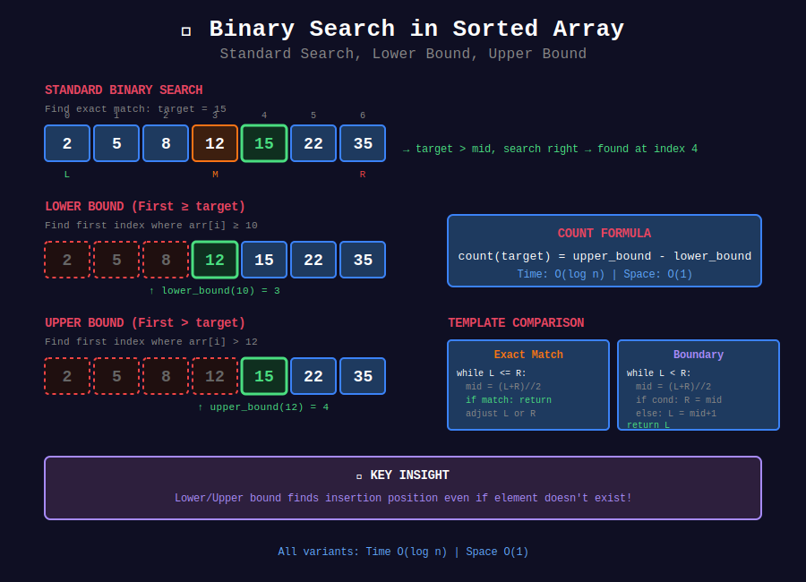
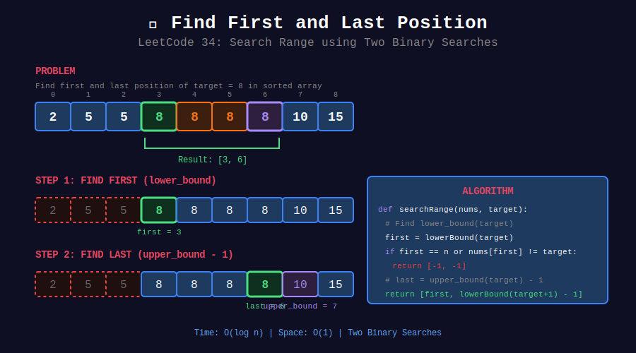

<div align="center">

# 📋 Binary Search in Sorted Array



<p>
  
  
</p>

</div>

---

## 🧭 Navigation

| ⬅️ Previous | 📂 Current | ➡️ Next |
|:------------|:----------:|--------:|
| [🏠 Searching Home](../README.md) | **01. Sorted Array** | [02. BS on Answer →](../02_binary_search_on_answer/README.md) |

---

## 📐 Mathematical Foundations

### 1️⃣ Binary Search Correctness

**Loop invariant:** If target exists, it's in $[left, right]$.

**Termination:** $right - left$ decreases by at least 1 each iteration.

**Correctness:** When loop ends, either target found or $left > right$ (not found).

---

### 2️⃣ Lower Bound Formula

Find smallest index where $arr[i] \geq target$:

$$\text{lower_bound} = \min\{i : arr[i] \geq target\}$$

---

### 3️⃣ Upper Bound Formula

Find smallest index where $arr[i] > target$:

$$\text{upper_bound} = \min\{i : arr[i] > target\}$$

---

### 4️⃣ Count of Element

$$\text{count}(target) = \text{upper_bound} - \text{lower_bound}$$

---

## 📊 Visual: Search Range



---

## 💻 Code Implementations

```python
def binarySearch(nums: list[int], target: int) -> int:
    """
    Standard binary search for exact match.
    
    Time: O(log n), Space: O(1)
    """
    left, right = 0, len(nums) - 1
    
    while left <= right:
        mid = left + (right - left) // 2
        
        if nums[mid] == target:
            return mid
        elif nums[mid] < target:
            left = mid + 1
        else:
            right = mid - 1
    
    return -1

def searchRange(nums: list[int], target: int) -> list[int]:
    """
    Find First and Last Position (LeetCode 34).
    
    Use lower_bound and upper_bound.
    
    Time: O(log n), Space: O(1)
    """
    def lowerBound(target):
        left, right = 0, len(nums)
        while left < right:
            mid = (left + right) // 2
            if nums[mid] < target:
                left = mid + 1
            else:
                right = mid
        return left
    
    first = lowerBound(target)
    
    if first == len(nums) or nums[first] != target:
        return [-1, -1]
    
    last = lowerBound(target + 1) - 1
    return [first, last]

def searchInsert(nums: list[int], target: int) -> int:
    """
    Search Insert Position (LeetCode 35).
    
    Find lower_bound.
    
    Time: O(log n), Space: O(1)
    """
    left, right = 0, len(nums)
    
    while left < right:
        mid = (left + right) // 2
        if nums[mid] < target:
            left = mid + 1
        else:
            right = mid
    
    return left

def mySqrt(x: int) -> int:
    """
    Sqrt(x) (LeetCode 69).
    
    Find largest n where n² <= x.
    
    Time: O(log x), Space: O(1)
    """
    if x < 2:
        return x
    
    left, right = 1, x // 2
    
    while left <= right:
        mid = (left + right) // 2
        square = mid * mid
        
        if square == x:
            return mid
        elif square < x:
            left = mid + 1
        else:
            right = mid - 1
    
    return right

def firstBadVersion(n: int) -> int:
    """
    First Bad Version (LeetCode 278).
    
    Find first True in [F, F, ..., T, T, ...].
    
    Time: O(log n), Space: O(1)
    """
    left, right = 1, n
    
    while left < right:
        mid = (left + right) // 2
        if isBadVersion(mid):
            right = mid
        else:
            left = mid + 1
    
    return left

def singleNonDuplicate(nums: list[int]) -> int:
    """
    Single Element in Sorted Array (LeetCode 540).
    
    All elements appear twice except one.
    Before single: pairs at (even, odd) indices.
    After single: pairs at (odd, even) indices.
    
    Time: O(log n), Space: O(1)
    """
    left, right = 0, len(nums) - 1
    
    while left < right:
        mid = (left + right) // 2
        
        # Ensure mid is even for pair checking
        if mid % 2 == 1:
            mid -= 1
        
        if nums[mid] == nums[mid + 1]:
            # Pair intact, single is on right
            left = mid + 2
        else:
            # Pair broken, single is on left (including mid)
            right = mid
    
    return nums[left]

```

---

## 🏆 LeetCode Problems

### 🟢 Easy

| # | Problem | Pattern | Time | Space |
|:-:|---------|---------|:----:|:-----:|
| 35 | [Search Insert Position](https://leetcode.com/problems/search-insert-position/) | Lower Bound | O(log n) | O(1) |
| 69 | [Sqrt(x)](https://leetcode.com/problems/sqrtx/) | Binary Search | O(log n) | O(1) |
| 278 | [First Bad Version](https://leetcode.com/problems/first-bad-version/) | Boundary | O(log n) | O(1) |
| 704 | [Binary Search](https://leetcode.com/problems/binary-search/) | Standard | O(log n) | O(1) |

### 🟡 Medium

| # | Problem | Pattern | Time | Space |
|:-:|---------|---------|:----:|:-----:|
| 34 | [Find First and Last Position](https://leetcode.com/problems/find-first-and-last-position-of-element-in-sorted-array/) | Two Bounds | O(log n) | O(1) |
| 540 | [Single Element in Sorted Array](https://leetcode.com/problems/single-element-in-a-sorted-array/) | Pair Index | O(log n) | O(1) |

---

## 📚 References

| Resource | Link |
|----------|------|
| **Binary Search** | [Wikipedia](https://en.wikipedia.org/wiki/Binary_search_algorithm) |

---

<div align="center">

**Made with ❤️ by [Gaurav Goswami](https://github.com/Gaurav14cs17)**

</div>

---

## 🧭 Navigation

| ⬅️ Previous | 📂 Current | ➡️ Next |
|:------------|:----------:|--------:|
| [🏠 Searching Home](../README.md) | **01. Sorted Array** | [02. BS on Answer →](../02_binary_search_on_answer/README.md) |
