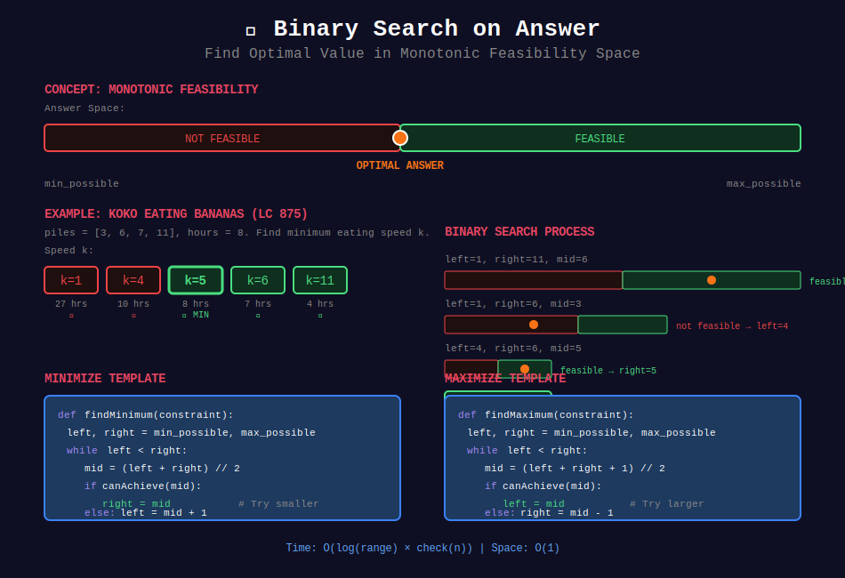
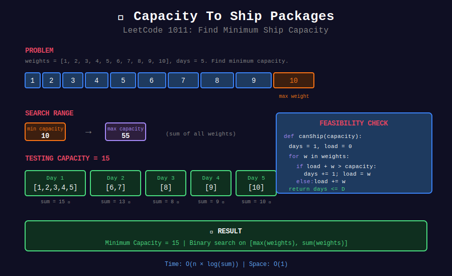

<div align="center">

# 🎯 Binary Search on Answer



<p>
  
  
</p>

</div>

---

## 🧭 Navigation

| ⬅️ Previous | 📂 Current | ➡️ Next |
|:------------|:----------:|--------:|
| [← 01. Sorted Array](../01_binary_search_sorted_array/README.md) | **02. BS on Answer** | [03. 2D Array →](../03_binary_search_2d_array/README.md) |

---

## 📐 Mathematical Foundations

### 1️⃣ Key Insight

**Problem type:** Find minimum/maximum value satisfying constraint.

**Requirement:** Feasibility function is monotonic.

```math
\text{feasible}(x) \text{ is monotonic in } x
```

---

### 2️⃣ Minimize Maximum Pattern

```math
\text{answer} = \min\{x : \text{canAchieve}(x) = \text{true}\}
```

**Example:** Minimum capacity to ship all packages in D days.

---

### 3️⃣ Maximize Minimum Pattern

```math
\text{answer} = \max\{x : \text{canAchieve}(x) = \text{true}\}
```

**Example:** Maximum minimum distance between cows.

---

### 4️⃣ Time Complexity

```math
T = O(\log R \times \text{check}(n))
```

Where $R$ = search range, check() = feasibility check.

---

## 📊 Visual: Ship Packages Problem



---

## 💻 Code Implementations

```python
def minEatingSpeed(piles: list[int], h: int) -> int:
    """
    Koko Eating Bananas (LeetCode 875).
    
    Find minimum eating speed to finish in h hours.
    
    Time: O(n × log(max)), Space: O(1)
    """
    def canFinish(speed):
        hours = sum((pile + speed - 1) // speed for pile in piles)
        return hours <= h
    
    left, right = 1, max(piles)
    
    while left < right:
        mid = (left + right) // 2
        if canFinish(mid):
            right = mid
        else:
            left = mid + 1
    
    return left

def shipWithinDays(weights: list[int], days: int) -> int:
    """
    Capacity To Ship Packages (LeetCode 1011).
    
    Find minimum ship capacity to ship in D days.
    
    Time: O(n × log(sum)), Space: O(1)
    """
    def canShip(capacity):
        day_count = 1
        current_load = 0
        
        for weight in weights:
            if current_load + weight > capacity:
                day_count += 1
                current_load = weight
            else:
                current_load += weight
        
        return day_count <= days
    
    left = max(weights)  # Must carry heaviest
    right = sum(weights)  # All in one day
    
    while left < right:
        mid = (left + right) // 2
        if canShip(mid):
            right = mid
        else:
            left = mid + 1
    
    return left

def splitArray(nums: list[int], k: int) -> int:
    """
    Split Array Largest Sum (LeetCode 410).
    
    Minimize the maximum sum among k subarrays.
    
    Time: O(n × log(sum)), Space: O(1)
    """
    def canSplit(max_sum):
        splits = 1
        current_sum = 0
        
        for num in nums:
            if current_sum + num > max_sum:
                splits += 1
                current_sum = num
            else:
                current_sum += num
        
        return splits <= k
    
    left = max(nums)
    right = sum(nums)
    
    while left < right:
        mid = (left + right) // 2
        if canSplit(mid):
            right = mid
        else:
            left = mid + 1
    
    return left

def minDays(bloomDay: list[int], m: int, k: int) -> int:
    """
    Minimum Number of Days to Make m Bouquets (LeetCode 1482).
    
    Each bouquet needs k adjacent flowers.
    
    Time: O(n × log(max)), Space: O(1)
    """
    if m * k > len(bloomDay):
        return -1
    
    def canMake(day):
        bouquets = 0
        consecutive = 0
        
        for bloom in bloomDay:
            if bloom <= day:
                consecutive += 1
                if consecutive == k:
                    bouquets += 1
                    consecutive = 0
            else:
                consecutive = 0
        
        return bouquets >= m
    
    left, right = min(bloomDay), max(bloomDay)
    
    while left < right:
        mid = (left + right) // 2
        if canMake(mid):
            right = mid
        else:
            left = mid + 1
    
    return left

def smallestDivisor(nums: list[int], threshold: int) -> int:
    """
    Find the Smallest Divisor Given a Threshold (LeetCode 1283).
    
    Minimize divisor so sum of ceil divisions <= threshold.
    
    Time: O(n × log(max)), Space: O(1)
    """
    def sumWithDivisor(divisor):
        return sum((num + divisor - 1) // divisor for num in nums)
    
    left, right = 1, max(nums)
    
    while left < right:
        mid = (left + right) // 2
        if sumWithDivisor(mid) <= threshold:
            right = mid
        else:
            left = mid + 1
    
    return left
```

---

## 🏆 LeetCode Problems

### 🟡 Medium

| # | Problem | Pattern | Time | Space |
|:-:|---------|---------|:----:|:-----:|
| 875 | [Koko Eating Bananas](https://leetcode.com/problems/koko-eating-bananas/) | Min Speed | O(n log m) | O(1) |
| 1011 | [Capacity To Ship](https://leetcode.com/problems/capacity-to-ship-packages-within-d-days/) | Min Capacity | O(n log s) | O(1) |
| 1283 | [Smallest Divisor](https://leetcode.com/problems/find-the-smallest-divisor-given-a-threshold/) | Min Divisor | O(n log m) | O(1) |
| 1482 | [Min Days for Bouquets](https://leetcode.com/problems/minimum-number-of-days-to-make-m-bouquets/) | Min Days | O(n log m) | O(1) |
| 1552 | [Magnetic Force Between Balls](https://leetcode.com/problems/magnetic-force-between-two-balls/) | Max Min Dist | O(n log d) | O(1) |

### 🔴 Hard

| # | Problem | Pattern | Time | Space |
|:-:|---------|---------|:----:|:-----:|
| 410 | [Split Array Largest Sum](https://leetcode.com/problems/split-array-largest-sum/) | Min Max Sum | O(n log s) | O(1) |
| 774 | [Minimize Max Distance to Gas Station](https://leetcode.com/problems/minimize-max-distance-to-gas-station/) | Min Max Dist | O(n log d) | O(1) |

---

## 📊 BS on Answer Template

```python
def binarySearchOnAnswer(constraint):
    left, right = min_possible, max_possible
    
    while left < right:
        mid = (left + right) // 2
        
        if canAchieve(mid):  # Feasibility check
            right = mid       # Try smaller (minimize)
        else:
            left = mid + 1
    
    return left
```

---

## 📚 References

| Resource | Link |
|----------|------|
| **BS on Answer** | [LeetCode Guide](https://leetcode.com/discuss/study-guide/786126/) |

---

<div align="center">

**Made with ❤️ by [Gaurav Goswami](https://github.com/Gaurav14cs17)**

</div>

---

## 🧭 Navigation

| ⬅️ Previous | 📂 Current | ➡️ Next |
|:------------|:----------:|--------:|
| [← 01. Sorted Array](../01_binary_search_sorted_array/README.md) | **02. BS on Answer** | [03. 2D Array →](../03_binary_search_2d_array/README.md) |
