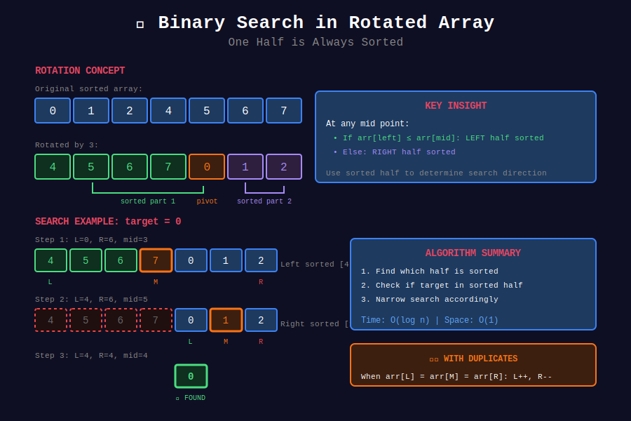
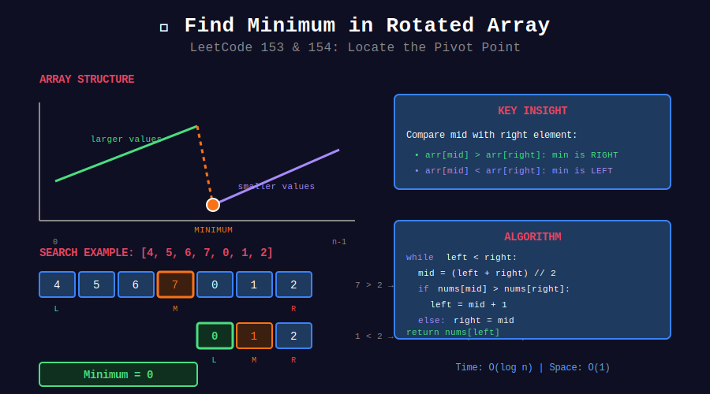

<div align="center">

# 🔄 Binary Search in Rotated Array



<p>
  
  
</p>

</div>

---

## 🧭 Navigation

| ⬅️ Previous | 📂 Current | ➡️ Next |
|:------------|:----------:|--------:|
| [← 03. 2D Array](../03_binary_search_2d_array/README.md) | **04. Rotated Array** | [05. Advanced BS →](../05_binary_search_advanced/README.md) |

---

## 📐 Mathematical Foundations

### 1️⃣ Rotated Array Structure

Original: $[1, 2, 3, 4, 5]$
Rotated by 2: $[4, 5, 1, 2, 3]$

**Key insight:** One half is always sorted.

---

### 2️⃣ Finding Sorted Half

$$
\text{If } arr[left] \leq arr[mid]: \text{left half sorted}
\text{Otherwise: right half sorted}
$$

---

### 3️⃣ Search Logic

1. Determine which half is sorted
2. Check if target is in sorted half
3. Narrow search accordingly

---

### 4️⃣ With Duplicates

Worst case: all elements same except one.

$$
T = O(n) \text{ worst case}
$$

**Handle:** When $arr[left] = arr[mid] = arr[right]$, shrink both ends.

---

## 📊 Visual: Find Minimum



---

## 💻 Code Implementations

```python
def search(nums: list[int], target: int) -> int:
    """
    Search in Rotated Sorted Array (LeetCode 33).
    
    No duplicates.
    
    Time: O(log n), Space: O(1)
    """
    left, right = 0, len(nums) - 1
    
    while left <= right:
        mid = (left + right) // 2
        
        if nums[mid] == target:
            return mid
        
        # Left half is sorted
        if nums[left] <= nums[mid]:
            if nums[left] <= target < nums[mid]:
                right = mid - 1
            else:
                left = mid + 1

        # Right half is sorted
        else:
            if nums[mid] < target <= nums[right]:
                left = mid + 1
            else:
                right = mid - 1
    
    return -1

def searchWithDuplicates(nums: list[int], target: int) -> bool:
    """
    Search in Rotated Sorted Array II (LeetCode 81).
    
    With duplicates.
    
    Time: O(n) worst, O(log n) average
    """
    left, right = 0, len(nums) - 1
    
    while left <= right:
        mid = (left + right) // 2
        
        if nums[mid] == target:
            return True
        
        # Handle duplicates
        if nums[left] == nums[mid] == nums[right]:
            left += 1
            right -= 1
        elif nums[left] <= nums[mid]:
            if nums[left] <= target < nums[mid]:
                right = mid - 1
            else:
                left = mid + 1
        else:
            if nums[mid] < target <= nums[right]:
                left = mid + 1
            else:
                right = mid - 1
    
    return False

def findMin(nums: list[int]) -> int:
    """
    Find Minimum in Rotated Array (LeetCode 153).
    
    No duplicates.
    
    Time: O(log n), Space: O(1)
    """
    left, right = 0, len(nums) - 1
    
    while left < right:
        mid = (left + right) // 2
        
        if nums[mid] > nums[right]:

            # Minimum is in right half
            left = mid + 1
        else:

            # Minimum is in left half (including mid)
            right = mid
    
    return nums[left]

def findMinWithDuplicates(nums: list[int]) -> int:
    """
    Find Minimum in Rotated Array II (LeetCode 154).
    
    With duplicates.
    
    Time: O(n) worst, O(log n) average
    """
    left, right = 0, len(nums) - 1
    
    while left < right:
        mid = (left + right) // 2
        
        if nums[mid] > nums[right]:
            left = mid + 1
        elif nums[mid] < nums[right]:
            right = mid
        else:

            # nums[mid] == nums[right], can't decide
            right -= 1
    
    return nums[left]

def findRotationCount(nums: list[int]) -> int:
    """
    Find rotation count (index of minimum).
    
    Time: O(log n), Space: O(1)
    """
    left, right = 0, len(nums) - 1
    
    # Array not rotated
    if nums[left] <= nums[right]:
        return 0
    
    while left < right:
        mid = (left + right) // 2
        
        if nums[mid] > nums[right]:
            left = mid + 1
        else:
            right = mid
    
    return left
```

---

## 🏆 LeetCode Problems

### 🟡 Medium

| # | Problem | Pattern | Time | Space |
|:-:|---------|---------|:----:|:-----:|
| 33 | [Search in Rotated Array](https://leetcode.com/problems/search-in-rotated-sorted-array/) | Half Sorted | O(log n) | O(1) |
| 81 | [Search in Rotated Array II](https://leetcode.com/problems/search-in-rotated-sorted-array-ii/) | + Duplicates | O(n) worst | O(1) |
| 153 | [Find Minimum in Rotated Array](https://leetcode.com/problems/find-minimum-in-rotated-sorted-array/) | Find Pivot | O(log n) | O(1) |

### 🔴 Hard

| # | Problem | Pattern | Time | Space |
|:-:|---------|---------|:----:|:-----:|
| 154 | [Find Minimum in Rotated Array II](https://leetcode.com/problems/find-minimum-in-rotated-sorted-array-ii/) | + Duplicates | O(n) worst | O(1) |

---

## 📊 Rotated Array Decision

```
Rotated Array
      |
      +-- Search element → Find sorted half
      |
      +-- Find minimum → Compare mid with right
      |
      +-- With duplicates → Shrink when equal
```

---

## 📚 References

| Resource | Link |
|----------|------|
| **Rotated Array** | [GeeksforGeeks](https://www.geeksforgeeks.org/search-an-element-in-a-sorted-and-pivoted-array/) |

---

<div align="center">

**Made with ❤️ by [Gaurav Goswami](https://github.com/Gaurav14cs17)**

</div>

---

## 🧭 Navigation

| ⬅️ Previous | 📂 Current | ➡️ Next |
|:------------|:----------:|--------:|
| [← 03. 2D Array](../03_binary_search_2d_array/README.md) | **04. Rotated Array** | [05. Advanced BS →](../05_binary_search_advanced/README.md) |
