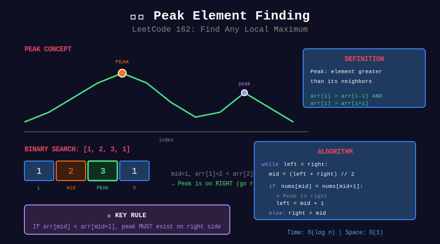
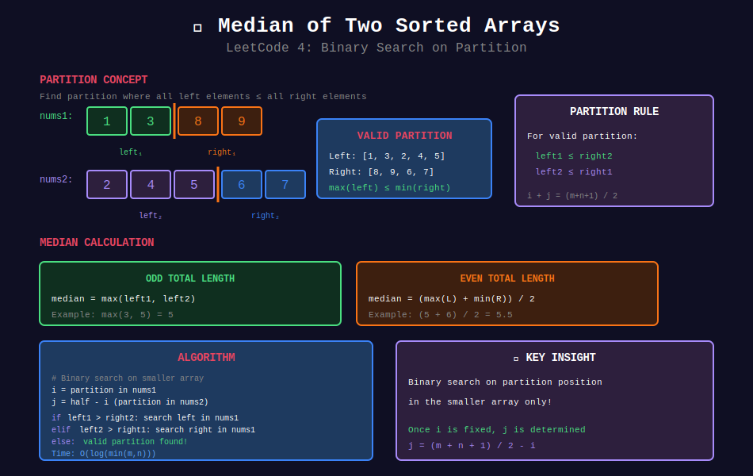
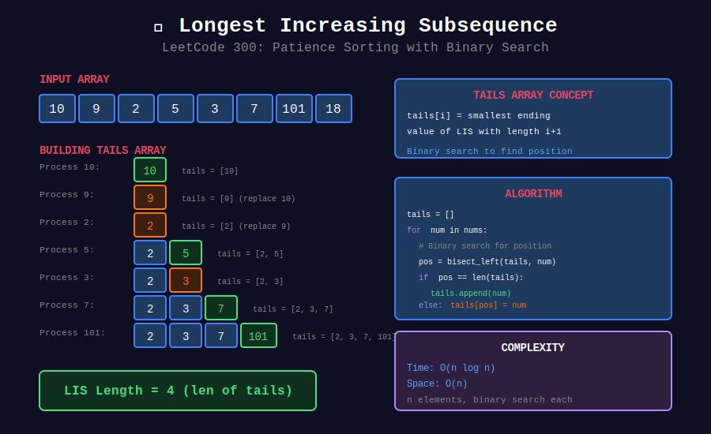

<div align="center">

# 🚀 Advanced Binary Search



<p>
  
  
</p>

</div>

---

## 🧭 Navigation

| ⬅️ Previous | 📂 Current | ➡️ Next Topic |
|:------------|:----------:|--------:|
| [← 04. Rotated Array](../04_binary_search_rotated_array/README.md) | **05. Advanced BS** | [🏠 Searching Home](../README.md) → [Recursion](../../16_recursion/README.md) |

---

## 📐 Mathematical Foundations

### 1️⃣ Peak Finding

**Condition:** $arr[mid] > arr[mid-1]$ and $arr[mid] > arr[mid+1]$

**Key insight:** If $arr[mid] < arr[mid+1]$, peak exists on right.

$$T = O(\log n)$$

---

### 2️⃣ Median of Two Sorted Arrays

**Partition approach:** Find partition where left elements ≤ right elements.

$$\text{left partition:} \quad \max(A[i-1], B[j-1]) \leq \min(A[i], B[j])
T = O(\log(\min(m, n)))$$

---

### 3️⃣ LIS with Binary Search

**Patience sorting:** Maintain smallest tail for each length.

$$\text{tails}[i] = \text{smallest tail of LIS of length } i+1
T = O(n \log n)$$

---

### 4️⃣ Kth Smallest Pair Distance

Binary search on distance, count pairs with distance ≤ mid.

$$T = O(n \log n + n \log D)$$

---

## 📊 Visual: Median of Two Sorted Arrays



---

## 📊 Visual: Longest Increasing Subsequence



---

## 💻 Code Implementations

```python
def findPeakElement(nums: list[int]) -> int:
    """
    Find Peak Element (LeetCode 162).
    
    Peak: greater than neighbors.
    
    Time: O(log n), Space: O(1)
    """
    left, right = 0, len(nums) - 1
    
    while left < right:
        mid = (left + right) // 2
        
        if nums[mid] < nums[mid + 1]:
            # Peak is on the right
            left = mid + 1
        else:
            # Peak is on the left (including mid)
            right = mid
    
    return left

def findMedianSortedArrays(nums1: list[int], nums2: list[int]) -> float:
    """
    Median of Two Sorted Arrays (LeetCode 4).
    
    Binary search on partition.
    
    Time: O(log(min(m,n))), Space: O(1)
    """
    # Ensure nums1 is smaller
    if len(nums1) > len(nums2):
        nums1, nums2 = nums2, nums1
    
    m, n = len(nums1), len(nums2)
    left, right = 0, m
    half = (m + n + 1) // 2
    
    while left <= right:
        i = (left + right) // 2  # Partition in nums1
        j = half - i              # Partition in nums2
        
        left1 = nums1[i - 1] if i > 0 else float('-inf')
        right1 = nums1[i] if i < m else float('inf')
        left2 = nums2[j - 1] if j > 0 else float('-inf')
        right2 = nums2[j] if j < n else float('inf')
        
        if left1 <= right2 and left2 <= right1:
            # Valid partition
            if (m + n) % 2 == 1:
                return max(left1, left2)
            return (max(left1, left2) + min(right1, right2)) / 2
        elif left1 > right2:
            right = i - 1
        else:
            left = i + 1
    
    return 0

def lengthOfLIS(nums: list[int]) -> int:
    """
    Longest Increasing Subsequence (LeetCode 300).
    
    Patience sorting with binary search.
    
    Time: O(n log n), Space: O(n)
    """
    tails = []
    
    for num in nums:
        # Find position to replace or append
        left, right = 0, len(tails)
        while left < right:
            mid = (left + right) // 2
            if tails[mid] < num:
                left = mid + 1
            else:
                right = mid
        
        if left == len(tails):
            tails.append(num)
        else:
            tails[left] = num
    
    return len(tails)

def smallestDistancePair(nums: list[int], k: int) -> int:
    """
    Find K-th Smallest Pair Distance (LeetCode 719).
    
    Binary search on distance, count pairs <= mid.
    
    Time: O(n log n + n log D), Space: O(1)
    """
    nums.sort()
    n = len(nums)
    
    def countPairs(max_dist):
        """Count pairs with distance <= max_dist."""
        count = 0
        left = 0
        for right in range(n):
            while nums[right] - nums[left] > max_dist:
                left += 1
            count += right - left
        return count
    
    left, right = 0, nums[-1] - nums[0]
    
    while left < right:
        mid = (left + right) // 2
        if countPairs(mid) < k:
            left = mid + 1
        else:
            right = mid
    
    return left

def findInMountainArray(target: int, mountain_arr) -> int:
    """
    Find in Mountain Array (LeetCode 1095).
    
    1. Find peak
    2. BS on ascending part
    3. BS on descending part
    
    Time: O(log n), Space: O(1)
    """
    n = mountain_arr.length()
    
    # Find peak
    left, right = 0, n - 1
    while left < right:
        mid = (left + right) // 2
        if mountain_arr.get(mid) < mountain_arr.get(mid + 1):
            left = mid + 1
        else:
            right = mid
    peak = left
    
    # Search in ascending part
    left, right = 0, peak
    while left <= right:
        mid = (left + right) // 2
        val = mountain_arr.get(mid)
        if val == target:
            return mid
        elif val < target:
            left = mid + 1
        else:
            right = mid - 1
    
    # Search in descending part
    left, right = peak + 1, n - 1
    while left <= right:
        mid = (left + right) // 2
        val = mountain_arr.get(mid)
        if val == target:
            return mid
        elif val > target:
            left = mid + 1
        else:
            right = mid - 1
    
    return -1

```

---

## 🏆 LeetCode Problems

### 🟡 Medium

| # | Problem | Pattern | Time | Space |
|:-:|---------|---------|:----:|:-----:|
| 162 | [Find Peak Element](https://leetcode.com/problems/find-peak-element/) | Peak | O(log n) | O(1) |
| 287 | [Find the Duplicate](https://leetcode.com/problems/find-the-duplicate-number/) | Count BS | O(n log n) | O(1) |
| 300 | [Longest Increasing Subsequence](https://leetcode.com/problems/longest-increasing-subsequence/) | Patience | O(n log n) | O(n) |
| 1095 | [Find in Mountain Array](https://leetcode.com/problems/find-in-mountain-array/) | Peak + 2 BS | O(log n) | O(1) |

### 🔴 Hard

| # | Problem | Pattern | Time | Space |
|:-:|---------|---------|:----:|:-----:|
| 4 | [Median of Two Sorted Arrays](https://leetcode.com/problems/median-of-two-sorted-arrays/) | Partition | O(log min) | O(1) |
| 668 | [Kth Smallest in Mult Table](https://leetcode.com/problems/kth-smallest-number-in-multiplication-table/) | BS + Count | O(m log mn) | O(1) |
| 719 | [Kth Smallest Pair Distance](https://leetcode.com/problems/find-k-th-smallest-pair-distance/) | BS + Count | O(n log D) | O(1) |

---

## 📚 References

| Resource | Link |
|----------|------|
| **Binary Search Patterns** | [LeetCode Guide](https://leetcode.com/discuss/study-guide/786126/) |
| **Patience Sorting** | [Wikipedia](https://en.wikipedia.org/wiki/Patience_sorting) |

---

<div align="center">

**Made with ❤️ by [Gaurav Goswami](https://github.com/Gaurav14cs17)**

</div>

---

## 🧭 Navigation

| ⬅️ Previous | 📂 Current | ➡️ Next Topic |
|:------------|:----------:|--------:|
| [← 04. Rotated Array](../04_binary_search_rotated_array/README.md) | **05. Advanced BS** | [🏠 Searching Home](../README.md) → [Recursion](../../16_recursion/README.md) |
