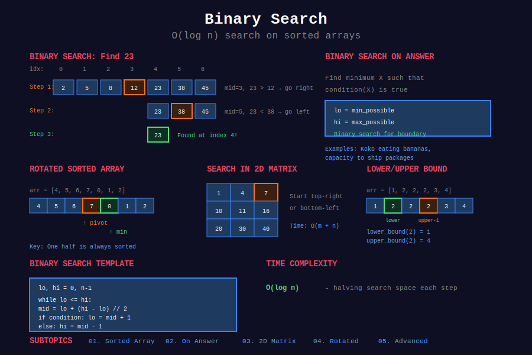

<div align="center">

# 🔍 Binary Search



<p>
  
  
  
</p>

**Divide and conquer search in O(log n) time**

[⬅️ Previous: Sorting](../14_sorting/README.md) | [🏠 Home](../README.md) | [Next: Recursion ➡️](../16_recursion/README.md)

</div>

---

## 📐 Mathematical Foundation

### 1️⃣ Binary Search Invariant

**Loop invariant:** Target is in $[left, right]$ if it exists.

```math
\text{After each iteration: } right - left \text{ decreases by at least half}
```

---

### 2️⃣ Time Complexity

```math
T(n) = T(n/2) + O(1) = O(\log n)
```

**Proof:** Search space halves each iteration.

```math
n \rightarrow n/2 \rightarrow n/4 \rightarrow \ldots \rightarrow 1
```

Number of steps: $\log\_2 n$

---

### 3️⃣ Finding Boundaries

**Lower bound (first occurrence):**

```math
\text{leftmost } i \text{ where } arr[i] \geq target
```

**Upper bound (first greater):**

```math
\text{leftmost } i \text{ where } arr[i] > target
```

---

### 4️⃣ Binary Search Templates

**Template 1: Exact match**
```
while left <= right:
    mid = (left + right) // 2
    if arr[mid] == target: return mid
    elif arr[mid] < target: left = mid + 1
    else: right = mid - 1
return -1
```

**Template 2: Find boundary**
```
while left < right:
    mid = (left + right) // 2
    if condition(mid): right = mid
    else: left = mid + 1
return left
```

---

### 5️⃣ Binary Search on Answer

**Problem:** Find minimum/maximum value satisfying condition.

```math
\text{answer} = \min\{x : \text{feasible}(x) = \text{true}\}
```

**Key insight:** Feasibility is monotonic.

---

### 6️⃣ Rotated Array Analysis

**Pivot:** Point where rotation occurs.

```math
\text{One half is always sorted}
```

Use sorted half to decide search direction.

---

## 📂 Subtopics Navigation

| # | Topic | Problems | Link |
|:-:|-------|:--------:|------|
| 1 | Sorted Array Search | 8+ | [📖 Go →](./01_binary_search_sorted_array/README.md) |
| 2 | Binary Search on Answer | 8+ | [📖 Go →](./02_binary_search_on_answer/README.md) |
| 3 | 2D Array Search | 5+ | [📖 Go →](./03_binary_search_2d_array/README.md) |
| 4 | Rotated Array Search | 6+ | [📖 Go →](./04_binary_search_rotated_array/README.md) |
| 5 | Advanced Binary Search | 8+ | [📖 Go →](./05_binary_search_advanced/README.md) |

---

## 🎯 Key Patterns

### Standard Binary Search

```python
def binarySearch(arr: list[int], target: int) -> int:
    """
    Standard binary search for exact match.
    
    Time: O(log n), Space: O(1)
    """
    left, right = 0, len(arr) - 1
    
    while left <= right:
        mid = left + (right - left) // 2  # Avoid overflow
        
        if arr[mid] == target:
            return mid
        elif arr[mid] < target:
            left = mid + 1
        else:
            right = mid - 1
    
    return -1
```

### Lower Bound (First >= Target)

```python
def lowerBound(arr: list[int], target: int) -> int:
    """
    Find first index where arr[i] >= target.
    
    Time: O(log n)
    """
    left, right = 0, len(arr)
    
    while left < right:
        mid = (left + right) // 2
        if arr[mid] < target:
            left = mid + 1
        else:
            right = mid
    
    return left
```

### Upper Bound (First > Target)

```python
def upperBound(arr: list[int], target: int) -> int:
    """
    Find first index where arr[i] > target.
    
    Time: O(log n)
    """
    left, right = 0, len(arr)
    
    while left < right:
        mid = (left + right) // 2
        if arr[mid] <= target:
            left = mid + 1
        else:
            right = mid
    
    return left
```

---

## 🏆 LeetCode Problems

### 🟢 Easy

| # | Problem | Pattern | Time | Space |
|:-:|---------|---------|:----:|:-----:|
| 35 | [Search Insert Position](https://leetcode.com/problems/search-insert-position/) | Lower Bound | O(log n) | O(1) |
| 69 | [Sqrt(x)](https://leetcode.com/problems/sqrtx/) | Binary Search | O(log n) | O(1) |
| 278 | [First Bad Version](https://leetcode.com/problems/first-bad-version/) | Boundary | O(log n) | O(1) |
| 367 | [Valid Perfect Square](https://leetcode.com/problems/valid-perfect-square/) | Binary Search | O(log n) | O(1) |
| 374 | [Guess Number](https://leetcode.com/problems/guess-number-higher-or-lower/) | Binary Search | O(log n) | O(1) |
| 704 | [Binary Search](https://leetcode.com/problems/binary-search/) | Standard | O(log n) | O(1) |

### 🟡 Medium

| # | Problem | Pattern | Time | Space |
|:-:|---------|---------|:----:|:-----:|
| 33 | [Search in Rotated Sorted Array](https://leetcode.com/problems/search-in-rotated-sorted-array/) | Rotated | O(log n) | O(1) |
| 34 | [Find First and Last Position](https://leetcode.com/problems/find-first-and-last-position-of-element-in-sorted-array/) | Two Bounds | O(log n) | O(1) |
| 74 | [Search a 2D Matrix](https://leetcode.com/problems/search-a-2d-matrix/) | Flatten | O(log mn) | O(1) |
| 81 | [Search in Rotated Array II](https://leetcode.com/problems/search-in-rotated-sorted-array-ii/) | Rotated + Dup | O(n) worst | O(1) |
| 153 | [Find Minimum in Rotated Array](https://leetcode.com/problems/find-minimum-in-rotated-sorted-array/) | Rotated | O(log n) | O(1) |
| 162 | [Find Peak Element](https://leetcode.com/problems/find-peak-element/) | Peak | O(log n) | O(1) |
| 240 | [Search a 2D Matrix II](https://leetcode.com/problems/search-a-2d-matrix-ii/) | Staircase | O(m+n) | O(1) |
| 275 | [H-Index II](https://leetcode.com/problems/h-index-ii/) | Binary Search | O(log n) | O(1) |
| 287 | [Find the Duplicate Number](https://leetcode.com/problems/find-the-duplicate-number/) | Count BS | O(n log n) | O(1) |
| 300 | [Longest Increasing Subsequence](https://leetcode.com/problems/longest-increasing-subsequence/) | Patience Sort | O(n log n) | O(n) |
| 540 | [Single Element in Sorted Array](https://leetcode.com/problems/single-element-in-a-sorted-array/) | Pair Index | O(log n) | O(1) |
| 875 | [Koko Eating Bananas](https://leetcode.com/problems/koko-eating-bananas/) | BS on Answer | O(n log m) | O(1) |
| 1011 | [Capacity To Ship Packages](https://leetcode.com/problems/capacity-to-ship-packages-within-d-days/) | BS on Answer | O(n log s) | O(1) |
| 1095 | [Find in Mountain Array](https://leetcode.com/problems/find-in-mountain-array/) | Peak + BS | O(log n) | O(1) |

### 🔴 Hard

| # | Problem | Pattern | Time | Space |
|:-:|---------|---------|:----:|:-----:|
| 4 | [Median of Two Sorted Arrays](https://leetcode.com/problems/median-of-two-sorted-arrays/) | Partition BS | O(log min) | O(1) |
| 154 | [Find Min in Rotated Array II](https://leetcode.com/problems/find-minimum-in-rotated-sorted-array-ii/) | Rotated + Dup | O(n) worst | O(1) |
| 410 | [Split Array Largest Sum](https://leetcode.com/problems/split-array-largest-sum/) | BS on Answer | O(n log s) | O(1) |
| 668 | [Kth Smallest in Multiplication Table](https://leetcode.com/problems/kth-smallest-number-in-multiplication-table/) | BS + Count | O(m log mn) | O(1) |
| 719 | [Find K-th Smallest Pair Distance](https://leetcode.com/problems/find-k-th-smallest-pair-distance/) | BS + Count | O(n log n + n log d) | O(1) |
| 774 | [Minimize Max Distance to Gas Station](https://leetcode.com/problems/minimize-max-distance-to-gas-station/) | BS on Answer | O(n log d) | O(1) |

---

## 📊 Binary Search Pattern Decision

```
Binary Search Problem
        |
        +-- Exact match → Standard template
        |
        +-- First/Last occurrence → Boundary template
        |
        +-- Rotated array → Find sorted half
        |
        +-- Minimize max / Maximize min → BS on answer
        |
        +-- 2D sorted matrix → Flatten or staircase
        |
        +-- Peak finding → Compare with neighbors
```

---

## 📚 References

| Resource | Link |
|----------|------|
| **Binary Search** | [Wikipedia](https://en.wikipedia.org/wiki/Binary_search_algorithm) |
| **Binary Search Patterns** | [LeetCode Guide](https://leetcode.com/discuss/study-guide/786126/) |
| **Topcoder Tutorial** | [Topcoder](https://www.topcoder.com/community/competitive-programming/tutorials/binary-search) |

---

<div align="center">

**Made with ❤️ by [Gaurav Goswami](https://github.com/Gaurav14cs17)**

[⬅️ Previous: Sorting](../14_sorting/README.md) | [🏠 Home](../README.md) | [Next: Recursion ➡️](../16_recursion/README.md)

</div>
