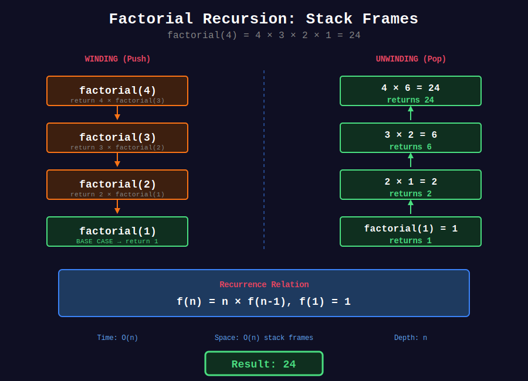
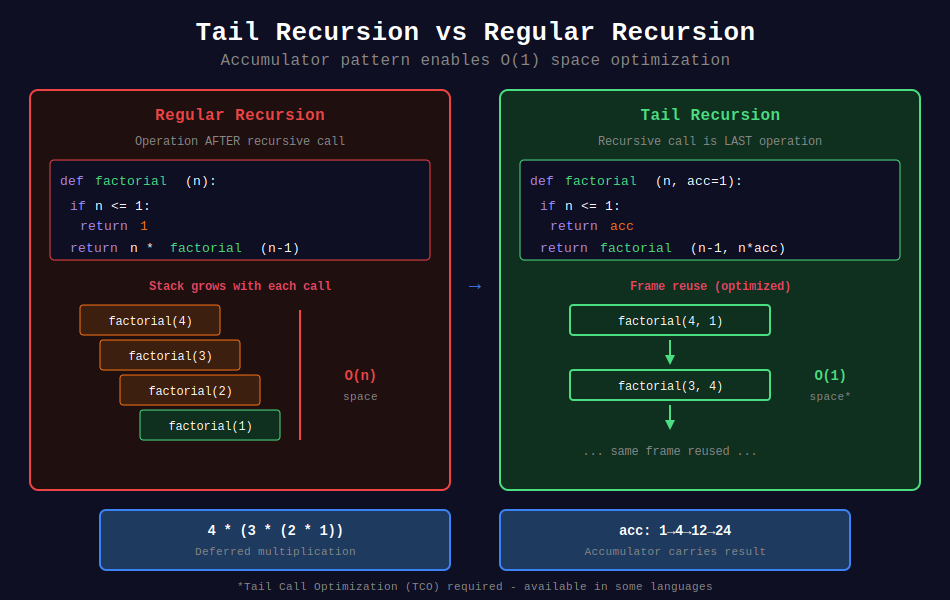
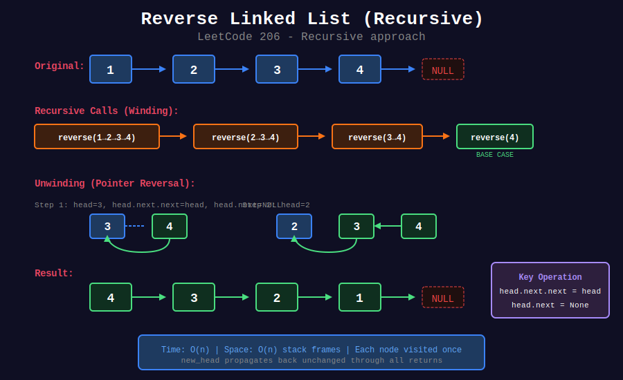

<div align="center">

# 📦 Basic Recursion

<p>
  
  
</p>

</div>

---

## 🧭 Navigation

| ⬅️ Previous | 📂 Current | ➡️ Next |
|:------------|:----------:|--------:|
| [🏠 Recursion Home](../README.md) | **01. Basic Recursion** | [02. Tree Recursion →](../02_tree_recursion/README.md) |

---

## 📊 Visual Diagrams

<p align="center">
  
</p>

<p align="center">
  
</p>

<p align="center">
  
</p>

---

## 📐 Mathematical Foundations

### 1️⃣ Recursion Components

Every recursive function needs:

1. **Base Case:** When to stop

2. **Recursive Case:** How to reduce problem

3. **Progress:** Moving toward base case

---

### 2️⃣ Linear Recursion

One recursive call per function invocation:

```math
T(n) = T(n-1) + O(1) = O(n)

```

**Examples:** Factorial, sum, list traversal.

---

### 3️⃣ Tail Recursion

Recursive call is the last operation:

```python
# Tail recursive
def f(n, acc):
    if n == 0: return acc
    return f(n-1, acc * n)

# NOT tail recursive  
def f(n):
    if n == 0: return 1
    return n * f(n-1)  # Multiplication after call

```

---

### 4️⃣ Stack Frames

Each call creates a stack frame storing:

- Local variables

- Return address

- Parameters

```math
\text{Space} = O(\text{max depth})

```

---

## 💻 Code Implementations

```python
def factorial(n: int) -> int:
    """
    Calculate n! = n × (n-1) × ... × 1
    
    Base case: 0! = 1
    Recursive case: n! = n × (n-1)!
    
    Time: O(n), Space: O(n)
    """
    if n <= 1:
        return 1
    return n * factorial(n - 1)

def reverseString(s: list[str]) -> None:
    """
    Reverse String (LeetCode 344).
    
    Two-pointer recursion.
    
    Time: O(n), Space: O(n)
    """
    def helper(left, right):
        if left >= right:
            return
        s[left], s[right] = s[right], s[left]
        helper(left + 1, right - 1)
    
    helper(0, len(s) - 1)

def reverseList(head: 'ListNode') -> 'ListNode':
    """
    Reverse Linked List (LeetCode 206).
    
    Time: O(n), Space: O(n)
    """
    if not head or not head.next:
        return head
    
    new_head = reverseList(head.next)
    head.next.next = head
    head.next = None
    return new_head

def mergeTwoLists(l1: 'ListNode', l2: 'ListNode') -> 'ListNode':
    """
    Merge Two Sorted Lists (LeetCode 21).
    
    Time: O(n+m), Space: O(n+m)
    """
    if not l1:
        return l2
    if not l2:
        return l1
    
    if l1.val <= l2.val:
        l1.next = mergeTwoLists(l1.next, l2)
        return l1
    else:
        l2.next = mergeTwoLists(l1, l2.next)
        return l2

def myPow(x: float, n: int) -> float:
    """
    Pow(x, n) (LeetCode 50).
    
    Fast exponentiation: x^n = (x^(n/2))²
    
    Time: O(log n), Space: O(log n)
    """
    if n == 0:
        return 1
    if n < 0:
        return 1 / myPow(x, -n)
    
    half = myPow(x, n // 2)
    if n % 2 == 0:
        return half * half
    return half * half * x

def swapPairs(head: 'ListNode') -> 'ListNode':
    """
    Swap Nodes in Pairs (LeetCode 24).
    
    Swap every two adjacent nodes.
    
    Time: O(n), Space: O(n)
    """
    if not head or not head.next:
        return head
    
    first = head
    second = head.next
    
    first.next = swapPairs(second.next)
    second.next = first
    
    return second

```

---

## 🏆 LeetCode Problems

### 🟢 Easy

| # | Problem | Pattern | Time | Space |
|:-:|---------|---------|:----:|:-----:|
| 21 | [Merge Two Sorted Lists](https://leetcode.com/problems/merge-two-sorted-lists/) | Linear | O(n+m) | O(n+m) |
| 206 | [Reverse Linked List](https://leetcode.com/problems/reverse-linked-list/) | Linear | O(n) | O(n) |
| 344 | [Reverse String](https://leetcode.com/problems/reverse-string/) | Two Pointer | O(n) | O(n) |

### 🟡 Medium

| # | Problem | Pattern | Time | Space |
|:-:|---------|---------|:----:|:-----:|
| 24 | [Swap Nodes in Pairs](https://leetcode.com/problems/swap-nodes-in-pairs/) | Linear | O(n) | O(n) |
| 50 | [Pow(x, n)](https://leetcode.com/problems/powx-n/) | Divide | O(log n) | O(log n) |

---

## 📚 References

| Resource | Link |
|----------|------|
| **Recursion Basics** | [GeeksforGeeks](https://www.geeksforgeeks.org/introduction-to-recursion-data-structure-and-algorithm-tutorials/) |

---

<div align="center">

**Made with ❤️ by [Gaurav Goswami](https://github.com/Gaurav14cs17)**

</div>

---

## 🧭 Navigation

| ⬅️ Previous | 📂 Current | ➡️ Next |
|:------------|:----------:|--------:|
| [🏠 Recursion Home](../README.md) | **01. Basic Recursion** | [02. Tree Recursion →](../02_tree_recursion/README.md) |
