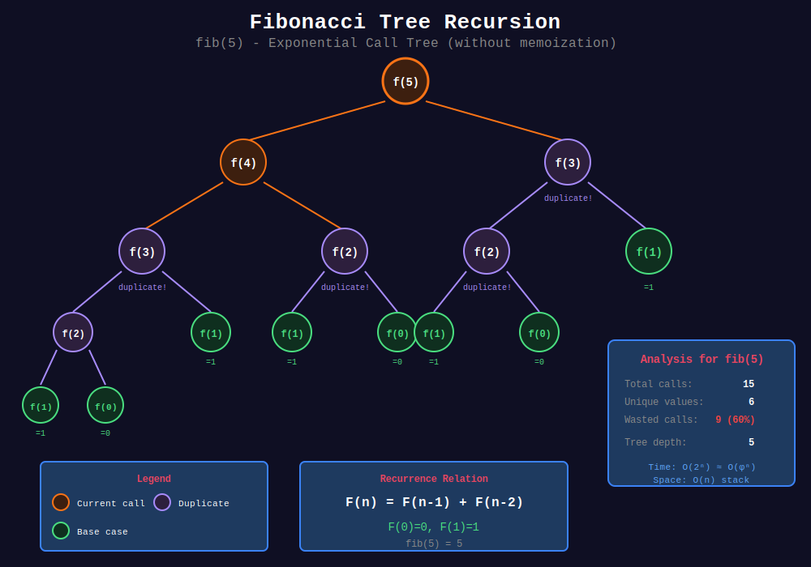
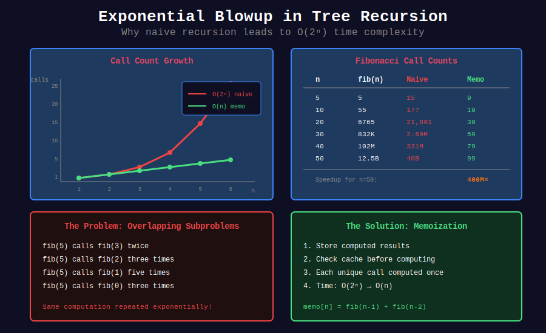
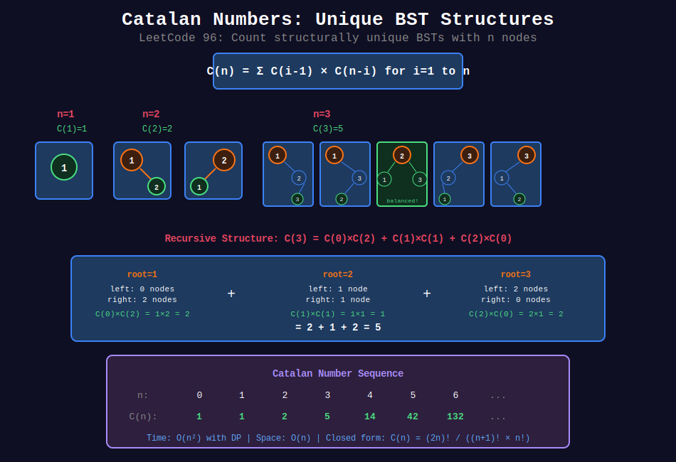

<div align="center">

# 🌳 Tree Recursion

<p>
  
  
</p>

</div>

---

## 🧭 Navigation

| ⬅️ Previous | 📂 Current | ➡️ Next |
|:------------|:----------:|--------:|
| [← 01. Basic Recursion](../01_basic_recursion/README.md) | **02. Tree Recursion** | [03. Memoization →](../03_memoization/README.md) |

---

## 📊 Visual Diagrams

<p align="center">
  
</p>

<p align="center">
  
</p>

<p align="center">
  
</p>

---

## 📐 Mathematical Foundations

### 1️⃣ Tree Recursion Definition

Multiple recursive calls per function:

```math
T(n) = T(n-1) + T(n-2) + \ldots
```

Creates a call tree, not a linear chain.

---

### 2️⃣ Fibonacci Analysis

```math
F(n) = F(n-1) + F(n-2)
```

**Without memoization:**

```math
T(n) = T(n-1) + T(n-2) + O(1) \approx O(\phi^n) \approx O(1.618^n)
```

Where $\phi = \frac{1 + \sqrt{5}}{2}$ (golden ratio).

**With memoization:** O(n)

---

### 3️⃣ Binary Tree Recursion

For binary trees with $n$ nodes:

```math
T(n) = T(left) + T(right) + O(1) = O(n)
```

Each node visited exactly once.

---

### 4️⃣ Exponential Blowup

**Problem:** Overlapping subproblems cause redundant computation.

```
fib(5)
+-- fib(4)
|   +-- fib(3)
|   |   +-- fib(2)
|   |   +-- fib(1)
|   +-- fib(2)  ← Computed again!
+-- fib(3)      ← Computed again!
    +-- fib(2)
    +-- fib(1)
```

**Solution:** Memoization or Dynamic Programming.

---

## 💻 Code Implementations

```python
def fib(n: int) -> int:
    """
    Fibonacci (naive tree recursion).
    
    Time: O(2^n), Space: O(n)
    """
    if n <= 1:
        return n
    return fib(n - 1) + fib(n - 2)

def climbStairs(n: int) -> int:
    """
    Climbing Stairs (LeetCode 70).
    
    Ways to climb n stairs taking 1 or 2 steps.
    Same as Fibonacci!
    
    Time: O(2^n) naive, O(n) with memo
    """
    if n <= 2:
        return n
    return climbStairs(n - 1) + climbStairs(n - 2)

def generateTrees(n: int) -> list:
    """
    Unique Binary Search Trees II (LeetCode 95).
    
    Generate all structurally unique BSTs.
    
    Time: O(Catalan(n)), Space: O(Catalan(n))
    """
    if n == 0:
        return []
    
    def generate(start, end):
        if start > end:
            return [None]
        
        trees = []
        for root_val in range(start, end + 1):
            left_trees = generate(start, root_val - 1)
            right_trees = generate(root_val + 1, end)
            
            for left in left_trees:
                for right in right_trees:
                    root = TreeNode(root_val)
                    root.left = left
                    root.right = right
                    trees.append(root)
        
        return trees
    
    return generate(1, n)

def allPossibleFBT(n: int) -> list:
    """
    All Possible Full Binary Trees (LeetCode 894).
    
    Full binary tree: every node has 0 or 2 children.
    
    Time: O(2^n), Space: O(2^n)
    """
    if n % 2 == 0:
        return []  # Full BT needs odd nodes
    
    if n == 1:
        return [TreeNode(0)]
    
    result = []
    for left_count in range(1, n, 2):  # Odd counts only
        right_count = n - 1 - left_count
        
        for left in allPossibleFBT(left_count):
            for right in allPossibleFBT(right_count):
                root = TreeNode(0)
                root.left = left
                root.right = right
                result.append(root)
    
    return result

def numTrees(n: int) -> int:
    """
    Unique Binary Search Trees (LeetCode 96).
    
    Count structurally unique BSTs.
    Catalan number: C(n) = (2n)! / ((n+1)! × n!)
    
    Time: O(n²), Space: O(n)
    """

    # dp[i] = number of unique BSTs with i nodes
    dp = [0] * (n + 1)
    dp[0] = dp[1] = 1
    
    for nodes in range(2, n + 1):
        for root in range(1, nodes + 1):
            left_count = root - 1
            right_count = nodes - root
            dp[nodes] += dp[left_count] * dp[right_count]
    
    return dp[n]
```

---

## 🏆 LeetCode Problems

### 🟢 Easy

| # | Problem | Pattern | Time | Space |
|:-:|---------|---------|:----:|:-----:|
| 70 | [Climbing Stairs](https://leetcode.com/problems/climbing-stairs/) | Fibonacci | O(n) | O(1) |
| 509 | [Fibonacci Number](https://leetcode.com/problems/fibonacci-number/) | Tree/Memo | O(n) | O(n) |

### 🟡 Medium

| # | Problem | Pattern | Time | Space |
|:-:|---------|---------|:----:|:-----:|
| 95 | [Unique BSTs II](https://leetcode.com/problems/unique-binary-search-trees-ii/) | Generate All | O(Cat(n)) | O(Cat(n)) |
| 96 | [Unique BSTs](https://leetcode.com/problems/unique-binary-search-trees/) | Catalan | O(n²) | O(n) |
| 894 | [All Possible Full BTs](https://leetcode.com/problems/all-possible-full-binary-trees/) | Generate All | O(2ⁿ) | O(2ⁿ) |

---

## 📊 Tree Recursion Pattern

```
Tree Recursion
      |
      +-- Overlapping subproblems → Add memoization
      |
      +-- Generate all structures → Combine left × right
      |
      +-- Count structures → Catalan numbers
```

---

## 📚 References

| Resource | Link |
|----------|------|
| **Catalan Numbers** | [Wikipedia](https://en.wikipedia.org/wiki/Catalan_number) |
| **Tree Recursion** | [SICP](https://mitpress.mit.edu/sites/default/files/sicp/full-text/book/book-Z-H-11.html) |

---

<div align="center">

**Made with ❤️ by [Gaurav Goswami](https://github.com/Gaurav14cs17)**

</div>

---

## 🧭 Navigation

| ⬅️ Previous | 📂 Current | ➡️ Next |
|:------------|:----------:|--------:|
| [← 01. Basic Recursion](../01_basic_recursion/README.md) | **02. Tree Recursion** | [03. Memoization →](../03_memoization/README.md) |
