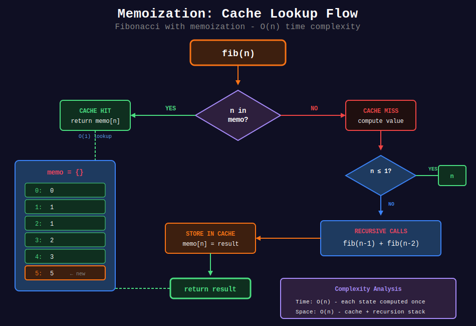
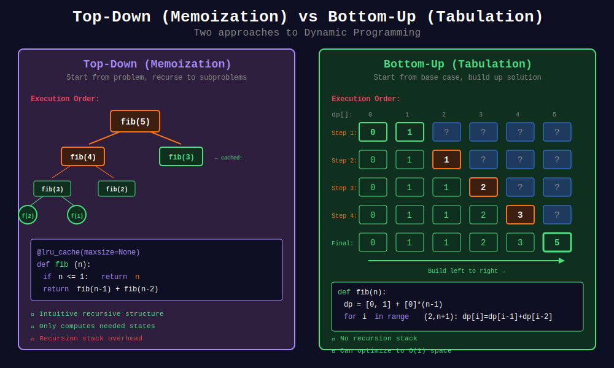
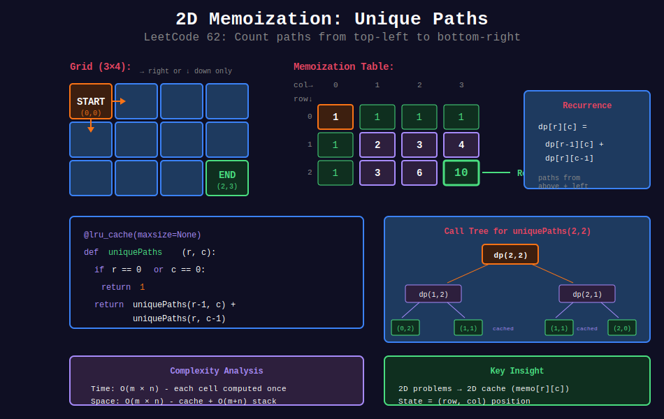

<div align="center">

# 💾 Memoization

<p>
  
  
</p>

</div>

---

## 🧭 Navigation

| ⬅️ Previous | 📂 Current | ➡️ Next |
|:------------|:----------:|--------:|
| [← 02. Tree Recursion](../02_tree_recursion/README.md) | **03. Memoization** | [04. Permutations & Combinations →](../04_permutation_combination/README.md) |

---

## 📊 Visual Diagrams

<p align="center">
  
</p>

<p align="center">
  
</p>

<p align="center">
  
</p>

---

## 📐 Mathematical Foundations

### 1️⃣ Memoization Definition

**Cache** results of expensive function calls:

```math
\text{memo}[args] = f(args)
```

Return cached result on repeated calls.

---

### 2️⃣ When to Use Memoization

✅ **Overlapping subproblems:** Same inputs computed multiple times

✅ **Optimal substructure:** Solution built from subproblem solutions

✅ **Pure function:** Same inputs → same output

---

### 3️⃣ Complexity Improvement

| Problem | Without Memo | With Memo |
|---------|:------------:|:---------:|
| Fibonacci | O(2ⁿ) | O(n) |
| Climbing Stairs | O(2ⁿ) | O(n) |
| Coin Change | O(amount^n) | O(amount × n) |

---

### 4️⃣ Top-Down vs Bottom-Up

| Approach | Description | Trade-offs |
|----------|-------------|------------|
| **Memoization** | Top-down with cache | Easier to write, may have stack overhead |
| **Tabulation** | Bottom-up iteration | No stack, may compute unnecessary states |

---

## 💻 Code Implementations

```python
from functools import lru_cache

def fibMemo(n: int, memo: dict = None) -> int:
    """
    Fibonacci with explicit memoization.
    
    Time: O(n), Space: O(n)
    """
    if memo is None:
        memo = {}
    
    if n in memo:
        return memo[n]
    
    if n <= 1:
        return n
    
    memo[n] = fibMemo(n - 1, memo) + fibMemo(n - 2, memo)
    return memo[n]

@lru_cache(maxsize=None)
def fibLRU(n: int) -> int:
    """
    Fibonacci using Python's built-in cache.
    
    Time: O(n), Space: O(n)
    """
    if n <= 1:
        return n
    return fibLRU(n - 1) + fibLRU(n - 2)

def climbStairs(n: int) -> int:
    """
    Climbing Stairs (LeetCode 70) with memo.
    
    Time: O(n), Space: O(n)
    """
    memo = {}
    
    def dp(i):
        if i in memo:
            return memo[i]
        if i <= 2:
            return i
        memo[i] = dp(i - 1) + dp(i - 2)
        return memo[i]
    
    return dp(n)

def coinChange(coins: list[int], amount: int) -> int:
    """
    Coin Change (LeetCode 322) with memo.
    
    Minimum coins to make amount.
    
    Time: O(amount × n), Space: O(amount)
    """
    @lru_cache(maxsize=None)
    def dp(remaining):
        if remaining == 0:
            return 0
        if remaining < 0:
            return float('inf')
        
        min_coins = float('inf')
        for coin in coins:
            min_coins = min(min_coins, dp(remaining - coin) + 1)
        
        return min_coins
    
    result = dp(amount)
    return result if result != float('inf') else -1

def longestCommonSubsequence(text1: str, text2: str) -> int:
    """
    Longest Common Subsequence (LeetCode 1143).
    
    Time: O(m × n), Space: O(m × n)
    """
    @lru_cache(maxsize=None)
    def dp(i, j):
        if i == len(text1) or j == len(text2):
            return 0
        
        if text1[i] == text2[j]:
            return 1 + dp(i + 1, j + 1)
        
        return max(dp(i + 1, j), dp(i, j + 1))
    
    return dp(0, 0)

def uniquePaths(m: int, n: int) -> int:
    """
    Unique Paths (LeetCode 62).
    
    Time: O(m × n), Space: O(m × n)
    """
    @lru_cache(maxsize=None)
    def dp(r, c):
        if r == m - 1 and c == n - 1:
            return 1
        if r >= m or c >= n:
            return 0
        
        return dp(r + 1, c) + dp(r, c + 1)
    
    return dp(0, 0)

def minPathSum(grid: list[list[int]]) -> int:
    """
    Minimum Path Sum (LeetCode 64).
    
    Time: O(m × n), Space: O(m × n)
    """
    m, n = len(grid), len(grid[0])
    
    @lru_cache(maxsize=None)
    def dp(r, c):
        if r == m - 1 and c == n - 1:
            return grid[r][c]
        if r >= m or c >= n:
            return float('inf')
        
        return grid[r][c] + min(dp(r + 1, c), dp(r, c + 1))
    
    return dp(0, 0)
```

---

## 🏆 LeetCode Problems

### 🟢 Easy

| # | Problem | Pattern | Time | Space |
|:-:|---------|---------|:----:|:-----:|
| 70 | [Climbing Stairs](https://leetcode.com/problems/climbing-stairs/) | 1D Memo | O(n) | O(n) |
| 509 | [Fibonacci Number](https://leetcode.com/problems/fibonacci-number/) | 1D Memo | O(n) | O(n) |
| 746 | [Min Cost Climbing Stairs](https://leetcode.com/problems/min-cost-climbing-stairs/) | 1D Memo | O(n) | O(n) |

### 🟡 Medium

| # | Problem | Pattern | Time | Space |
|:-:|---------|---------|:----:|:-----:|
| 62 | [Unique Paths](https://leetcode.com/problems/unique-paths/) | 2D Memo | O(mn) | O(mn) |
| 64 | [Minimum Path Sum](https://leetcode.com/problems/minimum-path-sum/) | 2D Memo | O(mn) | O(mn) |
| 322 | [Coin Change](https://leetcode.com/problems/coin-change/) | 1D Memo | O(n×amount) | O(amount) |
| 1143 | [Longest Common Subsequence](https://leetcode.com/problems/longest-common-subsequence/) | 2D Memo | O(mn) | O(mn) |

---

## 📊 Memoization Template

```python
from functools import lru_cache

@lru_cache(maxsize=None)
def solve(state):

    # Base case
    if is_base_case(state):
        return base_value
    
    # Check all transitions
    result = initial_value
    for next_state in get_transitions(state):
        result = combine(result, solve(next_state))
    
    return result
```

---

## 📚 References

| Resource | Link |
|----------|------|
| **Memoization** | [Wikipedia](https://en.wikipedia.org/wiki/Memoization) |
| **lru_cache** | [Python Docs](https://docs.python.org/3/library/functools.html#functools.lru_cache) |

---

<div align="center">

**Made with ❤️ by [Gaurav Goswami](https://github.com/Gaurav14cs17)**

</div>

---

## 🧭 Navigation

| ⬅️ Previous | 📂 Current | ➡️ Next |
|:------------|:----------:|--------:|
| [← 02. Tree Recursion](../02_tree_recursion/README.md) | **03. Memoization** | [04. Permutations & Combinations →](../04_permutation_combination/README.md) |
