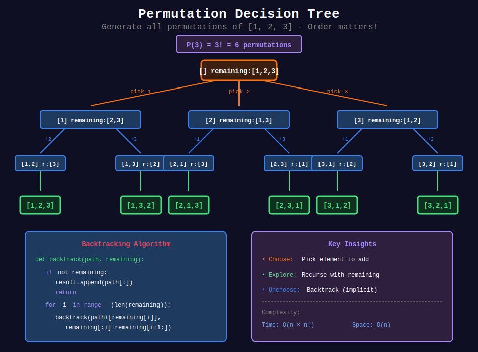
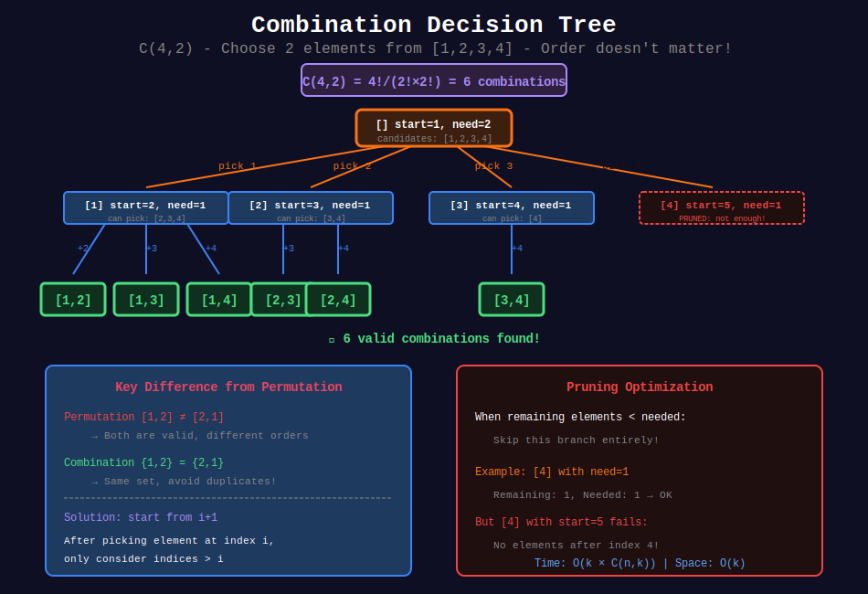
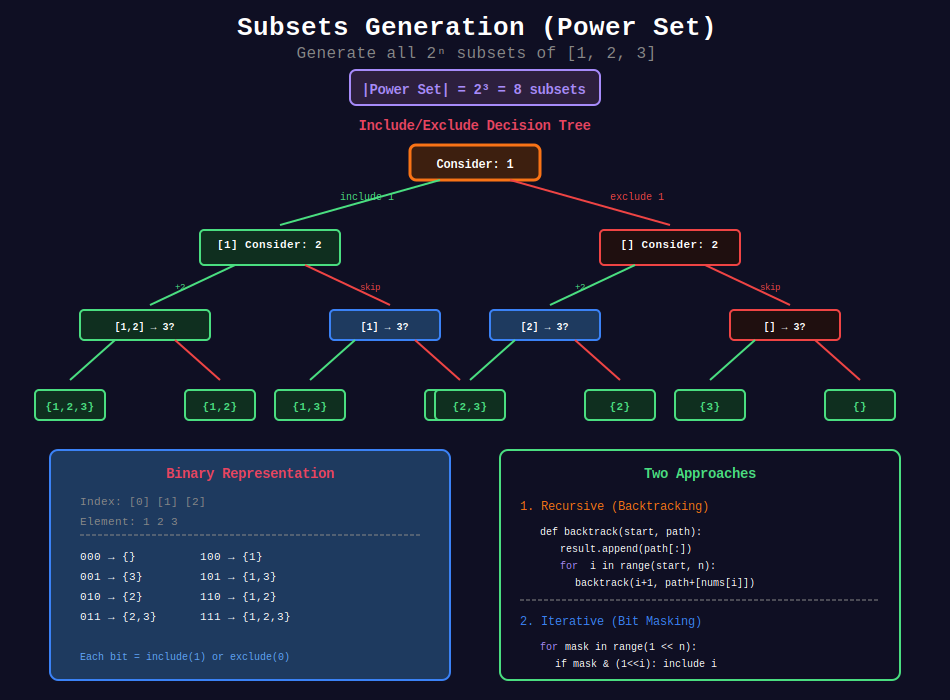

<div align="center">

# 🔀 Permutations & Combinations

<p>
  
  
</p>

</div>

---

## 🧭 Navigation

| ⬅️ Previous | 📂 Current | ➡️ Next |
|:------------|:----------:|--------:|
| [← 03. Memoization](../03_memoization/README.md) | **04. Permutations & Combinations** | [05. String Recursion →](../05_string_recursion/README.md) |

---

## 📊 Visual Diagrams

<p align="center">
  
</p>

<p align="center">
  
</p>

<p align="center">
  
</p>

---

## 📐 Mathematical Foundations

### 1️⃣ Permutations

**Definition:** All possible arrangements of n elements.

$$
P(n) = n!
$$

**Permutations of r elements from n:**

$$
P(n, r) = \frac{n!}{(n-r)!}
$$

---

### 2️⃣ Combinations

**Definition:** Selection of r elements from n (order doesn't matter).

$$
C(n, r) = \binom{n}{r} = \frac{n!}{r!(n-r)!}
$$

**Pascal's Triangle Recurrence:**

$$
C(n, r) = C(n-1, r-1) + C(n-1, r)
$$

---

### 3️⃣ Subsets (Power Set)

**Definition:** All possible subsets of a set.

$$
|\text{Power Set}| = 2^n
$$

Each element has 2 choices: include or exclude.

---

### 4️⃣ Key Differences

| Concept | Order Matters? | Formula | Example [1,2,3] |
|---------|:--------------:|---------|-----------------|
| Permutation | ✅ Yes | n! | [1,2,3], [1,3,2], [2,1,3]... (6 total) |
| Combination | ❌ No | C(n,r) | {1,2}, {1,3}, {2,3} for r=2 |
| Subset | ❌ No | 2^n | {}, {1}, {2}, {3}, {1,2}... (8 total) |

---

## 💻 Code Implementations

```python
def permute(nums: list[int]) -> list[list[int]]:
    """
    Permutations (LeetCode 46).
    
    Generate all permutations of nums.
    
    Time: O(n × n!), Space: O(n)
    """
    result = []
    
    def backtrack(path, remaining):
        if not remaining:
            result.append(path[:])
            return
        
        for i in range(len(remaining)):
            path.append(remaining[i])
            backtrack(path, remaining[:i] + remaining[i+1:])
            path.pop()
    
    backtrack([], nums)
    return result

def permuteUnique(nums: list[int]) -> list[list[int]]:
    """
    Permutations II (LeetCode 47).
    
    Handle duplicates by sorting and skipping.
    
    Time: O(n × n!), Space: O(n)
    """
    result = []
    nums.sort()
    used = [False] * len(nums)
    
    def backtrack(path):
        if len(path) == len(nums):
            result.append(path[:])
            return
        
        for i in range(len(nums)):
            if used[i]:
                continue

            # Skip duplicates
            if i > 0 and nums[i] == nums[i-1] and not used[i-1]:
                continue
            
            used[i] = True
            path.append(nums[i])
            backtrack(path)
            path.pop()
            used[i] = False
    
    backtrack([])
    return result

def combine(n: int, k: int) -> list[list[int]]:
    """
    Combinations (LeetCode 77).
    
    All combinations of k numbers from [1, n].
    
    Time: O(k × C(n,k)), Space: O(k)
    """
    result = []
    
    def backtrack(start, path):
        if len(path) == k:
            result.append(path[:])
            return
        
        # Pruning: need k-len(path) more elements
        for i in range(start, n - (k - len(path)) + 2):
            path.append(i)
            backtrack(i + 1, path)
            path.pop()
    
    backtrack(1, [])
    return result

def subsets(nums: list[int]) -> list[list[int]]:
    """
    Subsets (LeetCode 78).
    
    Generate all subsets (power set).
    
    Time: O(n × 2^n), Space: O(n)
    """
    result = []
    
    def backtrack(start, path):
        result.append(path[:])  # Add current subset
        
        for i in range(start, len(nums)):
            path.append(nums[i])
            backtrack(i + 1, path)
            path.pop()
    
    backtrack(0, [])
    return result

def subsetsWithDup(nums: list[int]) -> list[list[int]]:
    """
    Subsets II (LeetCode 90).
    
    Handle duplicates in subsets.
    
    Time: O(n × 2^n), Space: O(n)
    """
    result = []
    nums.sort()
    
    def backtrack(start, path):
        result.append(path[:])
        
        for i in range(start, len(nums)):

            # Skip duplicates at same level
            if i > start and nums[i] == nums[i-1]:
                continue
            path.append(nums[i])
            backtrack(i + 1, path)
            path.pop()
    
    backtrack(0, [])
    return result

def combinationSum(candidates: list[int], target: int) -> list[list[int]]:
    """
    Combination Sum (LeetCode 39).
    
    Find combinations that sum to target (can reuse elements).
    
    Time: O(n^(target/min)), Space: O(target/min)
    """
    result = []
    
    def backtrack(start, path, remaining):
        if remaining == 0:
            result.append(path[:])
            return
        if remaining < 0:
            return
        
        for i in range(start, len(candidates)):
            path.append(candidates[i])
            backtrack(i, path, remaining - candidates[i])  # i not i+1: can reuse
            path.pop()
    
    backtrack(0, [], target)
    return result

def letterCombinations(digits: str) -> list[str]:
    """
    Letter Combinations of Phone Number (LeetCode 17).
    
    Time: O(4^n × n), Space: O(n)
    """
    if not digits:
        return []
    
    phone = {
        '2': 'abc', '3': 'def', '4': 'ghi', '5': 'jkl',
        '6': 'mno', '7': 'pqrs', '8': 'tuv', '9': 'wxyz'
    }
    
    result = []
    
    def backtrack(index, path):
        if index == len(digits):
            result.append(''.join(path))
            return
        
        for char in phone[digits[index]]:
            path.append(char)
            backtrack(index + 1, path)
            path.pop()
    
    backtrack(0, [])
    return result
```

---

## 🏆 LeetCode Problems

### 🟡 Medium

| # | Problem | Pattern | Time | Space |
|:-:|---------|---------|:----:|:-----:|
| 17 | [Letter Combinations](https://leetcode.com/problems/letter-combinations-of-a-phone-number/) | Combination | O(4ⁿ) | O(n) |
| 22 | [Generate Parentheses](https://leetcode.com/problems/generate-parentheses/) | Combination | O(4ⁿ/√n) | O(n) |
| 39 | [Combination Sum](https://leetcode.com/problems/combination-sum/) | Combination | O(nᵗ) | O(t) |
| 40 | [Combination Sum II](https://leetcode.com/problems/combination-sum-ii/) | Combination | O(2ⁿ) | O(n) |
| 46 | [Permutations](https://leetcode.com/problems/permutations/) | Permutation | O(n×n!) | O(n) |
| 47 | [Permutations II](https://leetcode.com/problems/permutations-ii/) | Permutation | O(n×n!) | O(n) |
| 77 | [Combinations](https://leetcode.com/problems/combinations/) | Combination | O(k×C(n,k)) | O(k) |
| 78 | [Subsets](https://leetcode.com/problems/subsets/) | Subset | O(n×2ⁿ) | O(n) |
| 90 | [Subsets II](https://leetcode.com/problems/subsets-ii/) | Subset | O(n×2ⁿ) | O(n) |

### 🔴 Hard

| # | Problem | Pattern | Time | Space |
|:-:|---------|---------|:----:|:-----:|
| 51 | [N-Queens](https://leetcode.com/problems/n-queens/) | Permutation | O(n!) | O(n²) |
| 52 | [N-Queens II](https://leetcode.com/problems/n-queens-ii/) | Permutation | O(n!) | O(n) |

---

## 📊 Pattern Decision Tree

```
Combinatorial Problem
       |
       +-- Order matters? --YES--→ PERMUTATION
       |                           +-- Has duplicates? → Use visited + sort
       |
       +-- Order matters? --NO---→ COMBINATION / SUBSET
       |                           +-- Fixed size k? → Combination C(n,k)
       |                           +-- All sizes? → Subset (Power Set)
       |
       +-- Can reuse elements?
           +-- YES → start from i (not i+1)
           +-- NO  → start from i+1
```

---

## 🔧 Templates

### Permutation Template

```python
def permutation_template(nums):
    result = []
    used = [False] * len(nums)
    
    def backtrack(path):
        if len(path) == len(nums):
            result.append(path[:])
            return
        
        for i in range(len(nums)):
            if used[i]:
                continue
            used[i] = True
            path.append(nums[i])
            backtrack(path)
            path.pop()
            used[i] = False
    
    backtrack([])
    return result
```

### Combination/Subset Template

```python
def combination_template(nums, k=None):
    result = []
    
    def backtrack(start, path):
        if k is None or len(path) == k:
            result.append(path[:])
            if k is not None:
                return
        
        for i in range(start, len(nums)):
            path.append(nums[i])
            backtrack(i + 1, path)  # i+1 to avoid reuse
            path.pop()
    
    backtrack(0, [])
    return result
```

---

## 📚 References

| Resource | Link |
|----------|------|
| **Permutation** | [Wikipedia](https://en.wikipedia.org/wiki/Permutation) |
| **Combination** | [Wikipedia](https://en.wikipedia.org/wiki/Combination) |
| **Power Set** | [Wikipedia](https://en.wikipedia.org/wiki/Power_set) |

---

<div align="center">

**Made with ❤️ by [Gaurav Goswami](https://github.com/Gaurav14cs17)**

</div>

---

## 🧭 Navigation

| ⬅️ Previous | 📂 Current | ➡️ Next |
|:------------|:----------:|--------:|
| [← 03. Memoization](../03_memoization/README.md) | **04. Permutations & Combinations** | [05. String Recursion →](../05_string_recursion/README.md) |

