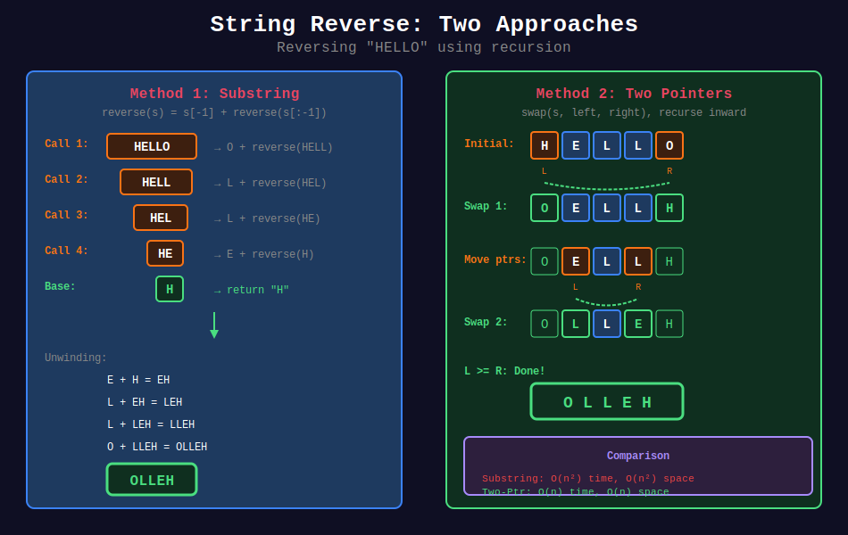
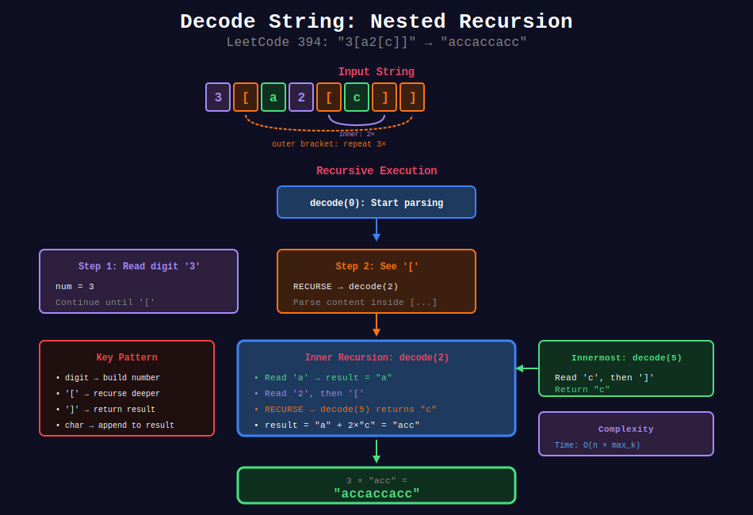

<div align="center">

# 🔤 String Recursion

<p>
  
  
</p>

**Processing strings character by character using recursion**

</div>

---

## 🧭 Navigation

| ⬅️ Previous | 📂 Current | ➡️ Next |
|:------------|:----------:|--------:|
| [← 04. Permutations](../04_permutation_combination/README.md) | **05. String Recursion** | [06. Array Recursion →](../06_array_recursion/README.md) |

---

## 📊 Visual Diagrams

<p align="center">
  
</p>

<p align="center">
  
</p>

<p align="center">
  
</p>

---

## 📐 Core Concepts

### 1️⃣ Left-to-Right Processing

Process string from index 0 to end:

```
f(s, i) → process s[i], then f(s, i+1)
```

**Pattern:** Action first, then recurse.

---

### 2️⃣ Right-to-Left Processing

Process string from end to start:

```
f(s, i) → f(s, i-1), then process s[i]
```

**Pattern:** Recurse first, then action.

---

### 3️⃣ Two-Pointer Recursion

Process from both ends:

```
f(s, left, right) → process s[left] & s[right], then f(s, left+1, right-1)
```

**Pattern:** Compare/swap ends, recurse inward.

---

### 4️⃣ Substring Recursion

Create new substrings:

```
f(s) → process s[0], then f(s[1:])
```

**Note:** Creates new strings - O(n) per call.

---

## 💻 Code Implementations

### Basic String Operations

```python
def reverseString(s: str) -> str:
    """
    Reverse a string recursively.
    
    Approach: Last char + reverse(rest)
    
    Time: O(n²) due to string concatenation
    Space: O(n) recursion depth
    """
    # Base case: empty or single char
    if len(s) <= 1:
        return s
    
    # Recursive case: last char + reverse of rest
    return s[-1] + reverseString(s[:-1])

def reverseStringOptimal(s: list) -> None:
    """
    Reverse string in-place using two pointers.
    LeetCode 344.
    
    Time: O(n), Space: O(n) stack
    """
    def helper(left: int, right: int):
        if left >= right:
            return
        
        # Swap characters
        s[left], s[right] = s[right], s[left]
        
        # Recurse inward
        helper(left + 1, right - 1)
    
    helper(0, len(s) - 1)

def isPalindrome(s: str) -> bool:
    """
    Check if string is palindrome.
    
    Time: O(n), Space: O(n)
    """
    def check(left: int, right: int) -> bool:
        # Base case: pointers crossed
        if left >= right:
            return True
        
        # Compare characters
        if s[left] != s[right]:
            return False
        
        # Recurse inward
        return check(left + 1, right - 1)
    
    return check(0, len(s) - 1)

def countOccurrences(s: str, char: str, i: int = 0) -> int:
    """
    Count occurrences of a character.
    
    Left-to-right processing.
    
    Time: O(n), Space: O(n)
    """
    # Base case
    if i == len(s):
        return 0
    
    # Count current + rest
    count = 1 if s[i] == char else 0
    return count + countOccurrences(s, char, i + 1)

def removeChar(s: str, char: str) -> str:
    """
    Remove all occurrences of a character.
    
    Time: O(n²), Space: O(n)
    """
    # Base case
    if not s:
        return ""
    
    # Process first char + recurse on rest
    if s[0] == char:
        return removeChar(s[1:], char)
    else:
        return s[0] + removeChar(s[1:], char)
```

### String Decoding

```python
def decodeString(s: str) -> str:
    """
    Decode String (LeetCode 394).
    
    Pattern: k[encoded_string]
    Example: "3[a2[c]]" → "accaccacc"
    
    Time: O(n × max_k), Space: O(n)
    """
    def decode(index: int) -> tuple:
        result = ""
        num = 0
        
        while index < len(s):
            char = s[index]
            
            if char.isdigit():
                # Build number
                num = num * 10 + int(char)
            
            elif char == '[':
                # Recurse for nested content
                decoded, index = decode(index + 1)
                result += num * decoded
                num = 0
            
            elif char == ']':
                # End of current bracket
                return result, index
            
            else:
                # Regular character
                result += char
            
            index += 1
        
        return result, index
    
    return decode(0)[0]

def countAndSay(n: int) -> str:
    """
    Count and Say (LeetCode 38).
    
    1 → "1"
    2 → "11" (one 1)
    3 → "21" (two 1s)
    4 → "1211" (one 2, one 1)
    
    Time: O(n × m), Space: O(m) where m is string length
    """
    def say(s: str) -> str:
        if not s:
            return ""
        
        # Count consecutive same chars
        count = 1
        i = 1
        while i < len(s) and s[i] == s[0]:
            count += 1
            i += 1
        
        # Return count + char + recurse on rest
        return str(count) + s[0] + say(s[i:])
    
    # Base case
    if n == 1:
        return "1"
    
    # Recurse: say the previous result
    return say(countAndSay(n - 1))

def runLengthEncode(s: str) -> str:
    """
    Run-length encoding: "aaabbc" → "a3b2c1"
    
    Time: O(n), Space: O(n)
    """
    def encode(s: str, i: int = 0) -> str:
        if i >= len(s):
            return ""
        
        # Count consecutive chars
        char = s[i]
        count = 1
        j = i + 1
        while j < len(s) and s[j] == char:
            count += 1
            j += 1
        
        return char + str(count) + encode(s, j)
    
    return encode(s)

def runLengthDecode(s: str) -> str:
    """
    Run-length decoding: "a3b2c1" → "aaabbc"
    
    Time: O(n × max_count), Space: O(n)
    """
    def decode(i: int = 0) -> str:
        if i >= len(s):
            return ""
        
        char = s[i]
        # Extract number (could be multiple digits)
        j = i + 1
        num_str = ""
        while j < len(s) and s[j].isdigit():
            num_str += s[j]
            j += 1
        
        count = int(num_str) if num_str else 1
        return char * count + decode(j)
    
    return decode()
```

### Advanced String Recursion

```python
def generateParenthesis(n: int) -> list:
    """
    Generate Parentheses (LeetCode 22).
    
    Generate all valid combinations of n pairs.
    
    Time: O(4^n / √n), Space: O(n)
    """
    result = []
    
    def generate(current: str, open_count: int, close_count: int):
        # Base case: used all parentheses
        if len(current) == 2 * n:
            result.append(current)
            return
        
        # Can add open if haven't used all
        if open_count < n:
            generate(current + '(', open_count + 1, close_count)
        
        # Can add close if it won't exceed open
        if close_count < open_count:
            generate(current + ')', open_count, close_count + 1)
    
    generate("", 0, 0)
    return result

def isMatch(s: str, p: str) -> bool:
    """
    Wildcard Matching (LeetCode 44).
    
    '?' matches any single char
    '*' matches any sequence (including empty)
    
    Time: O(2^(m+n)) without memo, O(mn) with memo
    Space: O(m+n)
    """
    def match(i: int, j: int) -> bool:
        # Both exhausted
        if i == len(s) and j == len(p):
            return True
        
        # Pattern exhausted but string remains
        if j == len(p):
            return False
        
        # String exhausted - pattern must be all '*'
        if i == len(s):
            return all(c == '*' for c in p[j:])
        
        # Current pattern char
        if p[j] == '*':
            # '*' matches empty or one+ chars
            return match(i, j + 1) or match(i + 1, j)
        
        elif p[j] == '?' or p[j] == s[i]:
            # Match single char
            return match(i + 1, j + 1)
        
        else:
            return False
    
    return match(0, 0)

def letterCasePermutation(s: str) -> list:
    """
    Letter Case Permutation (LeetCode 784).
    
    Generate all case permutations.
    "a1b2" → ["a1b2", "a1B2", "A1b2", "A1B2"]
    
    Time: O(2^n × n), Space: O(n)
    """
    result = []
    
    def generate(index: int, current: str):
        if index == len(s):
            result.append(current)
            return
        
        char = s[index]
        
        if char.isalpha():
            # Two choices: lowercase and uppercase
            generate(index + 1, current + char.lower())
            generate(index + 1, current + char.upper())
        else:
            # Digit: only one choice
            generate(index + 1, current + char)
    
    generate(0, "")
    return result

def addStrings(num1: str, num2: str) -> str:
    """
    Add Strings (LeetCode 415).
    
    Add two numbers represented as strings.
    
    Time: O(max(m,n)), Space: O(max(m,n))
    """
    def add(i: int, j: int, carry: int) -> str:
        # Base case: both exhausted
        if i < 0 and j < 0:
            return "1" if carry else ""
        
        # Get digits (0 if exhausted)
        d1 = int(num1[i]) if i >= 0 else 0
        d2 = int(num2[j]) if j >= 0 else 0
        
        # Calculate sum and new carry
        total = d1 + d2 + carry
        digit = total % 10
        new_carry = total // 10
        
        # Recurse for more significant digits + current digit
        return add(i - 1, j - 1, new_carry) + str(digit)
    
    return add(len(num1) - 1, len(num2) - 1, 0)
```

### String Comparison

```python
def compareVersion(version1: str, version2: str) -> int:
    """
    Compare Version Numbers (LeetCode 165).
    
    Time: O(n + m), Space: O(n + m)
    """
    def compare(v1: list, v2: list, i: int) -> int:
        # Both exhausted
        if i >= len(v1) and i >= len(v2):
            return 0
        
        # Get current revision (0 if missing)
        r1 = int(v1[i]) if i < len(v1) else 0
        r2 = int(v2[i]) if i < len(v2) else 0
        
        if r1 < r2:
            return -1
        elif r1 > r2:
            return 1
        else:
            return compare(v1, v2, i + 1)
    
    parts1 = version1.split('.')
    parts2 = version2.split('.')
    return compare(parts1, parts2, 0)

def longestCommonPrefix(strs: list) -> str:
    """
    Longest Common Prefix (LeetCode 14).
    
    Divide and conquer approach.
    
    Time: O(S) where S = sum of all chars
    Space: O(m × log n) where m = prefix length
    """
    def commonPrefix(left: str, right: str) -> str:
        min_len = min(len(left), len(right))
        for i in range(min_len):
            if left[i] != right[i]:
                return left[:i]
        return left[:min_len]
    
    def lcp(start: int, end: int) -> str:
        if start == end:
            return strs[start]
        
        mid = (start + end) // 2
        left_lcp = lcp(start, mid)
        right_lcp = lcp(mid + 1, end)
        
        return commonPrefix(left_lcp, right_lcp)
    
    if not strs:
        return ""
    return lcp(0, len(strs) - 1)
```

---

## 🏆 LeetCode Problems

### 🟢 Easy

| # | Problem | Pattern | Time | Space |
|:-:|---------|---------|:----:|:-----:|
| 14 | [Longest Common Prefix](https://leetcode.com/problems/longest-common-prefix/) | Divide Conquer | O(S) | O(m log n) |
| 344 | [Reverse String](https://leetcode.com/problems/reverse-string/) | Two Pointer | O(n) | O(n) |
| 415 | [Add Strings](https://leetcode.com/problems/add-strings/) | Right-to-Left | O(n) | O(n) |

### 🟡 Medium

| # | Problem | Pattern | Time | Space |
|:-:|---------|---------|:----:|:-----:|
| 22 | [Generate Parentheses](https://leetcode.com/problems/generate-parentheses/) | Build String | O(4ⁿ/√n) | O(n) |
| 38 | [Count and Say](https://leetcode.com/problems/count-and-say/) | Process & Build | O(n×m) | O(m) |
| 165 | [Compare Version Numbers](https://leetcode.com/problems/compare-version-numbers/) | Left-to-Right | O(n+m) | O(n+m) |
| 394 | [Decode String](https://leetcode.com/problems/decode-string/) | Nested Recursion | O(n×k) | O(n) |
| 784 | [Letter Case Permutation](https://leetcode.com/problems/letter-case-permutation/) | Binary Choice | O(2ⁿ×n) | O(n) |

### 🔴 Hard

| # | Problem | Pattern | Time | Space |
|:-:|---------|---------|:----:|:-----:|
| 44 | [Wildcard Matching](https://leetcode.com/problems/wildcard-matching/) | Two Pointer | O(mn) | O(mn) |
| 10 | [Regular Expression Matching](https://leetcode.com/problems/regular-expression-matching/) | Two Pointer | O(mn) | O(mn) |

---

## 📊 Pattern Summary

```
String Recursion Patterns
         |
         +-- Left-to-Right
         |   +-- Process s[i], recurse on i+1
         |
         +-- Right-to-Left  
         |   +-- Recurse first, then process
         |
         +-- Two-Pointer
         |   +-- Process both ends, recurse inward
         |
         +-- Substring Creation
         |   +-- f(s[1:]) - creates new string
         |
         +-- Nested/Bracket
             +-- Handle [...] with recursive call
```

---

## 📚 References

| Resource | Link |
|----------|------|
| **String Algorithms** | [GeeksforGeeks](https://www.geeksforgeeks.org/string-data-structure/) |
| **Recursion on Strings** | [Programiz](https://www.programiz.com/python-programming/recursion) |

---

<div align="center">

**Made with ❤️ by [Gaurav Goswami](https://github.com/Gaurav14cs17)**

</div>

---

## 🧭 Navigation

| ⬅️ Previous | 📂 Current | ➡️ Next |
|:------------|:----------:|--------:|
| [← 04. Permutations](../04_permutation_combination/README.md) | **05. String Recursion** | [06. Array Recursion →](../06_array_recursion/README.md) |

