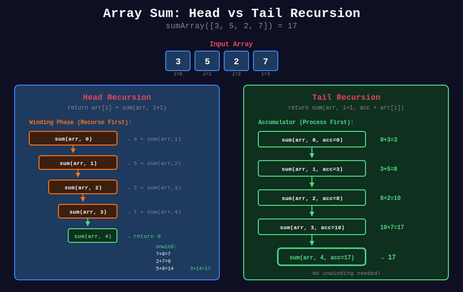
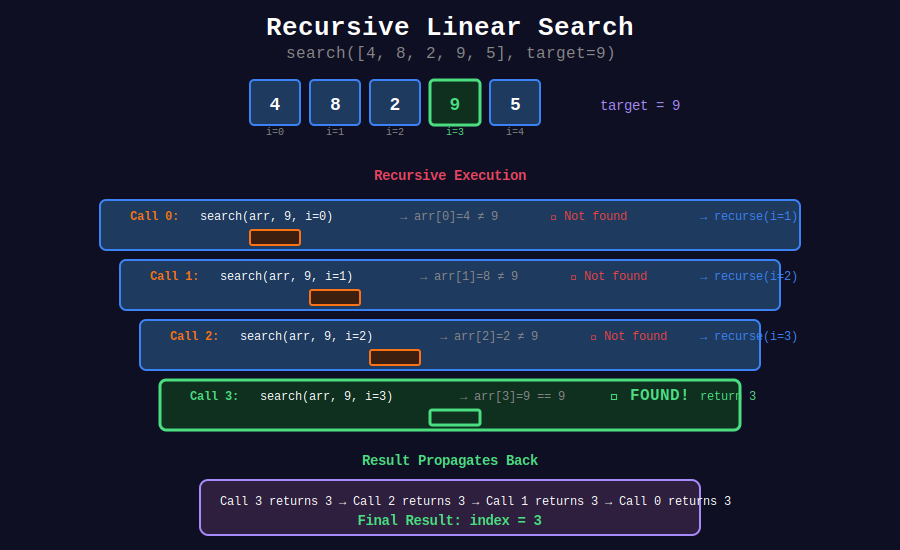
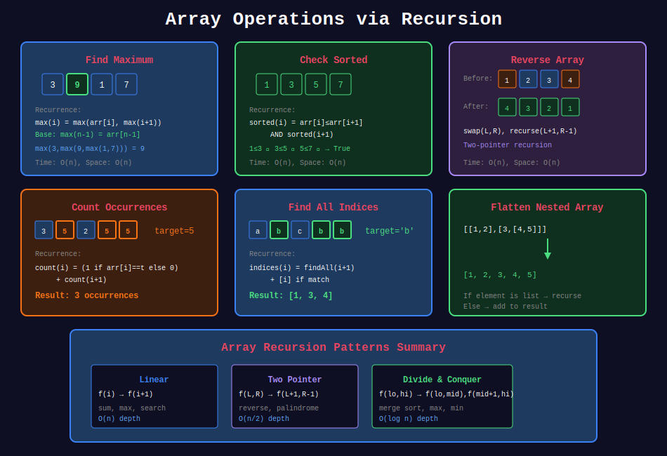

<div align="center">

# 📚 Array Recursion

<p>
  
  
</p>

**Processing arrays element by element using recursion**

</div>

---

## 🧭 Navigation

| ⬅️ Previous | 📂 Current | ➡️ Next |
|:------------|:----------:|--------:|
| [← 05. String Recursion](../05_string_recursion/README.md) | **06. Array Recursion** | [07. Divide & Conquer →](../07_divide_conquer/README.md) |

---

## 📊 Visual Diagrams

<p align="center">
  
</p>

<p align="center">
  
</p>

<p align="center">
  
</p>

---

## 📐 Core Concepts

### 1️⃣ Head Recursion (Process After)

Recurse first, then process:

```python
def process(arr, i):
    if i == len(arr):
        return base_value
    
    result = process(arr, i + 1)  # Recurse first
    return combine(arr[i], result)  # Then process

```

**Effect:** Processes right-to-left (last element first).

---

### 2️⃣ Tail Recursion (Process Before)

Process first, then recurse:

```python
def process(arr, i, acc):
    if i == len(arr):
        return acc
    
    new_acc = combine(acc, arr[i])  # Process first
    return process(arr, i + 1, new_acc)  # Then recurse

```

**Effect:** Processes left-to-right (first element first).

---

### 3️⃣ Two-Pointer Recursion

Process from both ends:

```python
def process(arr, left, right):
    if left >= right:
        return base_value
    
    # Process arr[left] and arr[right]
    return process(arr, left + 1, right - 1)

```

**Effect:** Good for reversing, palindrome check.

---

### 4️⃣ Divide and Conquer

Split array, process halves:

```python
def process(arr, low, high):
    if low == high:
        return arr[low]
    
    mid = (low + high) // 2
    left = process(arr, low, mid)
    right = process(arr, mid + 1, high)
    return combine(left, right)

```

**Effect:** O(log n) depth, good for max/min/search.

---

## 💻 Code Implementations

### Basic Array Operations

```python
def sumArray(arr: list, i: int = 0) -> int:
    """
    Sum all elements recursively.
    
    Left-to-right using head recursion.
    
    Time: O(n), Space: O(n)
    """
    # Base case: end of array
    if i == len(arr):
        return 0
    
    # Current + sum of rest
    return arr[i] + sumArray(arr, i + 1)

def sumArrayTail(arr: list, i: int = 0, acc: int = 0) -> int:
    """
    Sum using tail recursion with accumulator.
    
    Time: O(n), Space: O(n) [O(1) with TCO]
    """
    if i == len(arr):
        return acc
    
    return sumArrayTail(arr, i + 1, acc + arr[i])

def productArray(arr: list, i: int = 0) -> int:
    """
    Product of all elements.
    
    Time: O(n), Space: O(n)
    """
    if i == len(arr):
        return 1
    
    return arr[i] * productArray(arr, i + 1)

def findMax(arr: list, i: int = 0) -> int:
    """
    Find maximum element.
    
    Time: O(n), Space: O(n)
    """
    # Base case: last element
    if i == len(arr) - 1:
        return arr[i]
    
    # Compare current with max of rest
    max_rest = findMax(arr, i + 1)
    return arr[i] if arr[i] > max_rest else max_rest

def findMin(arr: list, i: int = 0) -> int:
    """
    Find minimum element.
    
    Time: O(n), Space: O(n)
    """
    if i == len(arr) - 1:
        return arr[i]
    
    min_rest = findMin(arr, i + 1)
    return arr[i] if arr[i] < min_rest else min_rest

def findMaxDivideConquer(arr: list, low: int, high: int) -> int:
    """
    Find maximum using divide and conquer.
    
    Time: O(n), Space: O(log n)
    """
    # Base case: single element
    if low == high:
        return arr[low]
    
    # Divide
    mid = (low + high) // 2
    
    # Conquer
    left_max = findMaxDivideConquer(arr, low, mid)
    right_max = findMaxDivideConquer(arr, mid + 1, high)
    
    # Combine
    return max(left_max, right_max)

```

### Search Operations

```python
def linearSearch(arr: list, target: int, i: int = 0) -> int:
    """
    Linear search for target.
    
    Returns index or -1 if not found.
    
    Time: O(n), Space: O(n)
    """
    # Base case: not found
    if i == len(arr):
        return -1
    
    # Found
    if arr[i] == target:
        return i
    
    # Search rest
    return linearSearch(arr, target, i + 1)

def linearSearchAll(arr: list, target: int, i: int = 0) -> list:
    """
    Find ALL indices of target.
    
    Time: O(n), Space: O(n)
    """
    if i == len(arr):
        return []
    
    # Get indices from rest
    rest = linearSearchAll(arr, target, i + 1)
    
    # Add current index if matches
    if arr[i] == target:
        return [i] + rest
    
    return rest

def countOccurrences(arr: list, target: int, i: int = 0) -> int:
    """
    Count occurrences of target.
    
    Time: O(n), Space: O(n)
    """
    if i == len(arr):
        return 0
    
    count = 1 if arr[i] == target else 0
    return count + countOccurrences(arr, target, i + 1)

def firstOccurrence(arr: list, target: int, i: int = 0) -> int:
    """
    First index of target (left to right).
    
    Time: O(n), Space: O(n)
    """
    if i == len(arr):
        return -1
    
    if arr[i] == target:
        return i
    
    return firstOccurrence(arr, target, i + 1)

def lastOccurrence(arr: list, target: int, i: int = 0) -> int:
    """
    Last index of target.
    
    Time: O(n), Space: O(n)
    """
    if i == len(arr):
        return -1
    
    # Search rest first
    later = lastOccurrence(arr, target, i + 1)
    
    # If found later, return that; else check current
    if later != -1:
        return later
    
    return i if arr[i] == target else -1

```

### Array Modification

```python
def reverseArray(arr: list, left: int = 0, right: int = None) -> None:
    """
    Reverse array in-place.
    
    Two-pointer recursion.
    
    Time: O(n), Space: O(n)
    """
    if right is None:
        right = len(arr) - 1
    
    # Base case: pointers crossed
    if left >= right:
        return
    
    # Swap
    arr[left], arr[right] = arr[right], arr[left]
    
    # Recurse inward
    reverseArray(arr, left + 1, right - 1)

def rotateRight(arr: list, k: int) -> list:
    """
    Rotate array right by k positions.
    
    Time: O(n), Space: O(n)
    """
    if not arr or k == 0:
        return arr
    
    k = k % len(arr)
    
    def rotate_once(arr, i=0):
        if i == len(arr):
            return []
        
        new_pos = (i + k) % len(arr)
        result = rotate_once(arr, i + 1)
        # This creates new array - not ideal
        return result
    
    # Better: use slicing with recursion
    if k == 0:
        return arr
    
    # Move last element to front
    return [arr[-1]] + rotateRight(arr[:-1], k - 1)

def removeDuplicates(arr: list, i: int = 0) -> list:
    """
    Remove consecutive duplicates.
    
    Time: O(n), Space: O(n)
    """
    if i >= len(arr):
        return []
    
    # Get result from rest
    rest = removeDuplicates(arr, i + 1)
    
    # Skip if duplicate of next
    if rest and arr[i] == rest[0]:
        return rest
    
    return [arr[i]] + rest

```

### Check Properties

```python
def isSorted(arr: list, i: int = 0) -> bool:
    """
    Check if array is sorted ascending.
    
    Time: O(n), Space: O(n)
    """
    # Base case: reached second-to-last or empty
    if i >= len(arr) - 1:
        return True
    
    # Check current pair
    if arr[i] > arr[i + 1]:
        return False
    
    # Check rest
    return isSorted(arr, i + 1)

def isPalindrome(arr: list, left: int = 0, right: int = None) -> bool:
    """
    Check if array is palindrome.
    
    Time: O(n), Space: O(n)
    """
    if right is None:
        right = len(arr) - 1
    
    if left >= right:
        return True
    
    if arr[left] != arr[right]:
        return False
    
    return isPalindrome(arr, left + 1, right - 1)

def allPositive(arr: list, i: int = 0) -> bool:
    """
    Check if all elements are positive.
    
    Time: O(n), Space: O(n)
    """
    if i == len(arr):
        return True
    
    if arr[i] <= 0:
        return False
    
    return allPositive(arr, i + 1)

def anyNegative(arr: list, i: int = 0) -> bool:
    """
    Check if any element is negative.
    
    Time: O(n), Space: O(n)
    """
    if i == len(arr):
        return False
    
    if arr[i] < 0:
        return True
    
    return anyNegative(arr, i + 1)

```

### Advanced Array Operations

```python
def mergeArrays(arr1: list, arr2: list, i: int = 0, j: int = 0) -> list:
    """
    Merge two sorted arrays.
    
    Time: O(m+n), Space: O(m+n)
    """
    # Base cases
    if i == len(arr1):
        return arr2[j:]
    if j == len(arr2):
        return arr1[i:]
    
    # Compare and merge
    if arr1[i] <= arr2[j]:
        return [arr1[i]] + mergeArrays(arr1, arr2, i + 1, j)
    else:
        return [arr2[j]] + mergeArrays(arr1, arr2, i, j + 1)

def filterArray(arr: list, predicate, i: int = 0) -> list:
    """
    Filter array based on predicate function.
    
    Time: O(n), Space: O(n)
    """
    if i == len(arr):
        return []
    
    rest = filterArray(arr, predicate, i + 1)
    
    if predicate(arr[i]):
        return [arr[i]] + rest
    
    return rest

def mapArray(arr: list, func, i: int = 0) -> list:
    """
    Apply function to each element.
    
    Time: O(n), Space: O(n)
    """
    if i == len(arr):
        return []
    
    return [func(arr[i])] + mapArray(arr, func, i + 1)

def reduceArray(arr: list, func, initial, i: int = 0):
    """
    Reduce array to single value.
    
    Time: O(n), Space: O(n)
    """
    if i == len(arr):
        return initial
    
    new_acc = func(initial, arr[i])
    return reduceArray(arr, func, new_acc, i + 1)

def flattenArray(arr: list) -> list:
    """
    Flatten nested array.
    
    [[1, 2], [3, [4, 5]]] → [1, 2, 3, 4, 5]
    
    Time: O(n), Space: O(depth)
    """
    if not arr:
        return []
    
    first = arr[0]
    rest = flattenArray(arr[1:])
    
    if isinstance(first, list):
        return flattenArray(first) + rest
    else:
        return [first] + rest

```

---

## 🏆 LeetCode Problems

### 🟢 Easy

| # | Problem | Pattern | Time | Space |
|:-:|---------|---------|:----:|:-----:|
| 35 | [Search Insert Position](https://leetcode.com/problems/search-insert-position/) | Binary Search | O(log n) | O(log n) |
| 53 | [Maximum Subarray](https://leetcode.com/problems/maximum-subarray/) | Divide Conquer | O(n log n) | O(log n) |
| 88 | [Merge Sorted Array](https://leetcode.com/problems/merge-sorted-array/) | Two Pointer | O(m+n) | O(m+n) |
| 283 | [Move Zeroes](https://leetcode.com/problems/move-zeroes/) | Two Pointer | O(n) | O(n) |

### 🟡 Medium

| # | Problem | Pattern | Time | Space |
|:-:|---------|---------|:----:|:-----:|
| 33 | [Search in Rotated Array](https://leetcode.com/problems/search-in-rotated-sorted-array/) | Binary Search | O(log n) | O(log n) |
| 153 | [Find Minimum in Rotated Array](https://leetcode.com/problems/find-minimum-in-rotated-sorted-array/) | Binary Search | O(log n) | O(log n) |
| 215 | [Kth Largest Element](https://leetcode.com/problems/kth-largest-element-in-an-array/) | Quick Select | O(n) | O(n) |

---

## 📊 Pattern Summary

```
Array Recursion Patterns
         |
         +-- Linear (Index-based)
         |   +-- Left-to-Right: f(i) → f(i+1)
         |   +-- Right-to-Left: f(i) → f(i-1)
         |
         +-- Two-Pointer
         |   +-- f(left, right) → f(left+1, right-1)
         |
         +-- Divide & Conquer
         |   +-- f(low, high) → combine(f(low,mid), f(mid+1,high))
         |
         +-- Accumulator
             +-- f(i, acc) → f(i+1, combine(acc, arr[i]))

```

---

## 📚 References

| Resource | Link |
|----------|------|
| **Array Algorithms** | [GeeksforGeeks](https://www.geeksforgeeks.org/array-data-structure/) |
| **Recursion Patterns** | [Programiz](https://www.programiz.com/python-programming/recursion) |

---

<div align="center">

**Made with ❤️ by [Gaurav Goswami](https://github.com/Gaurav14cs17)**

</div>

---

## 🧭 Navigation

| ⬅️ Previous | 📂 Current | ➡️ Next |
|:------------|:----------:|--------:|
| [← 05. String Recursion](../05_string_recursion/README.md) | **06. Array Recursion** | [07. Divide & Conquer →](../07_divide_conquer/README.md) |

