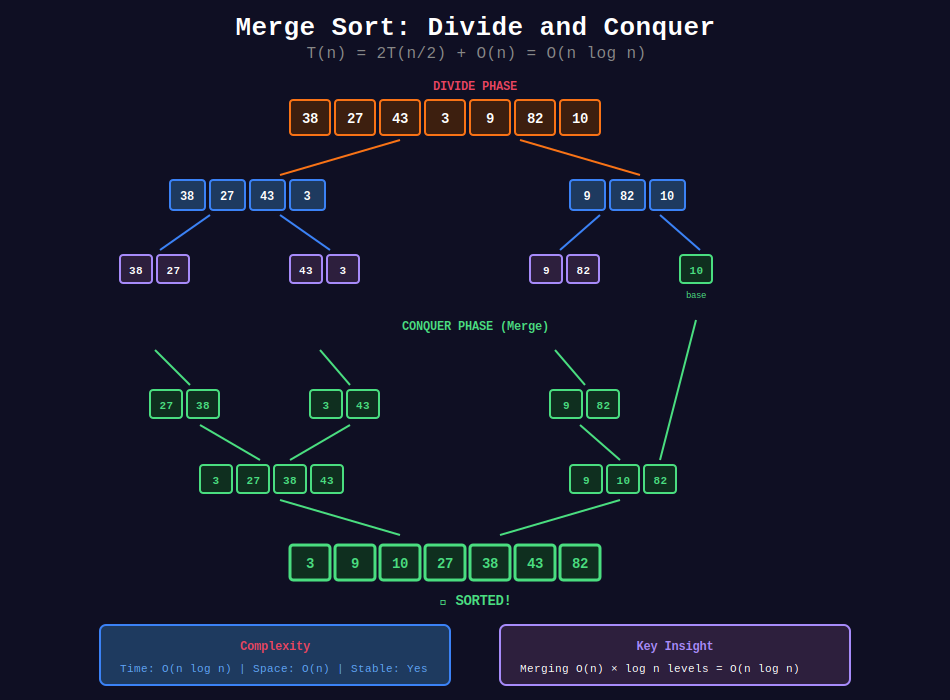
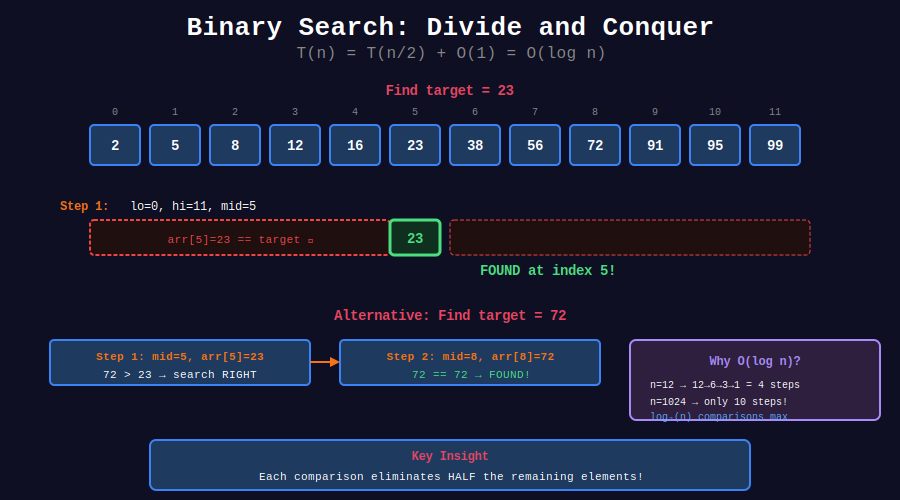
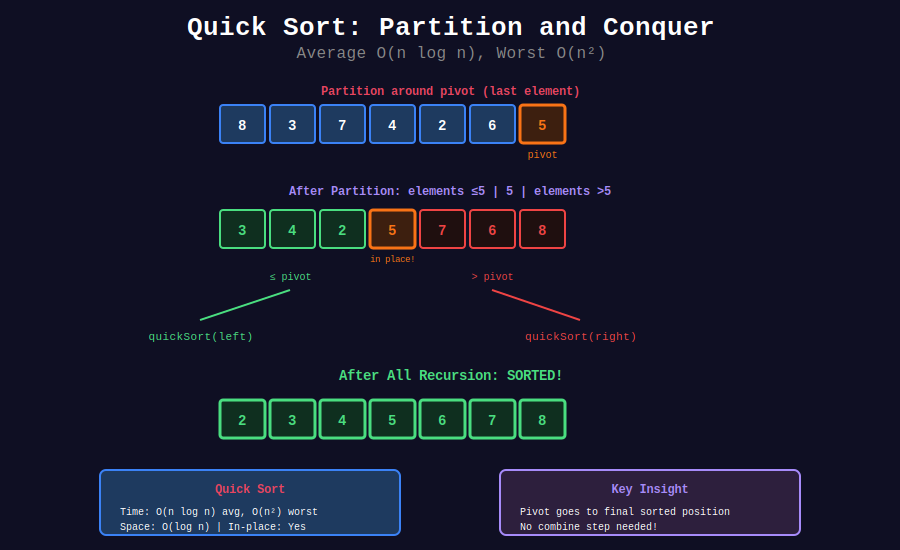

<div align="center">

# ⚔️ Divide and Conquer

<p>
  
  
</p>

**Break problem into subproblems, solve recursively, combine results**

</div>

---

## 🧭 Navigation

| ⬅️ Previous | 📂 Current | ➡️ Next |
|:------------|:----------:|--------:|
| [← 06. Array Recursion](../06_array_recursion/README.md) | **07. Divide & Conquer** | [08. Mathematical Recursion →](../08_mathematical_recursion/README.md) |

---

## 📊 Visual Diagrams

<p align="center">
  
</p>

<p align="center">
  
</p>

<p align="center">
  
</p>

---

## 📐 Core Concepts

### 1️⃣ Divide and Conquer Paradigm

Three steps:

```
1. DIVIDE:   Split problem into smaller subproblems
2. CONQUER:  Solve subproblems recursively
3. COMBINE:  Merge subproblem solutions
```

---

### 2️⃣ Master Theorem

For recurrence $T(n) = aT(n/b) + f(n)$:

| Case | Condition | Result |
|------|-----------|--------|
| 1 | $f(n) = O(n^{\log\_b a - ε})$ | $T(n) = Θ(n^{\log\_b a})$ |
| 2 | $f(n) = Θ(n^{\log\_b a})$ | $T(n) = Θ(n^{\log\_b a} \log n)$ |
| 3 | $f(n) = Ω(n^{\log\_b a + ε})$ | $T(n) = Θ(f(n))$ |

---

### 3️⃣ Common Recurrences

| Algorithm | Recurrence | Time |
|-----------|------------|------|
| Binary Search | $T(n) = T(n/2) + O(1)$ | O(log n) |
| Merge Sort | $T(n) = 2T(n/2) + O(n)$ | O(n log n) |
| Quick Sort (avg) | $T(n) = 2T(n/2) + O(n)$ | O(n log n) |
| Strassen's | $T(n) = 7T(n/2) + O(n^2)$ | O(n^2.81) |

---

## 💻 Code Implementations

### Binary Search

```python
def binarySearch(arr: list, target: int, low: int = 0, high: int = None) -> int:
    """
    Binary Search - find target index.
    
    Divide: Compare with middle
    Conquer: Search left or right half
    Combine: Return found index
    
    Time: O(log n), Space: O(log n)
    """
    if high is None:
        high = len(arr) - 1
    
    # Base case: not found
    if low > high:
        return -1
    
    mid = (low + high) // 2
    
    if arr[mid] == target:
        return mid
    elif arr[mid] > target:
        return binarySearch(arr, target, low, mid - 1)
    else:
        return binarySearch(arr, target, mid + 1, high)

def binarySearchFirst(arr: list, target: int, low: int = 0, high: int = None) -> int:
    """
    Find first occurrence of target.
    
    Time: O(log n), Space: O(log n)
    """
    if high is None:
        high = len(arr) - 1
    
    if low > high:
        return -1
    
    mid = (low + high) // 2
    
    # Found, but check if there's earlier occurrence
    if arr[mid] == target:
        if mid == 0 or arr[mid - 1] != target:
            return mid
        return binarySearchFirst(arr, target, low, mid - 1)
    elif arr[mid] > target:
        return binarySearchFirst(arr, target, low, mid - 1)
    else:
        return binarySearchFirst(arr, target, mid + 1, high)

def binarySearchLast(arr: list, target: int, low: int = 0, high: int = None) -> int:
    """
    Find last occurrence of target.
    
    Time: O(log n), Space: O(log n)
    """
    if high is None:
        high = len(arr) - 1
    
    if low > high:
        return -1
    
    mid = (low + high) // 2
    
    if arr[mid] == target:
        if mid == len(arr) - 1 or arr[mid + 1] != target:
            return mid
        return binarySearchLast(arr, target, mid + 1, high)
    elif arr[mid] > target:
        return binarySearchLast(arr, target, low, mid - 1)
    else:
        return binarySearchLast(arr, target, mid + 1, high)
```

### Merge Sort

```python
def mergeSort(arr: list) -> list:
    """
    Merge Sort - stable O(n log n) sort.
    
    Divide: Split array in half
    Conquer: Sort each half
    Combine: Merge sorted halves
    
    Time: O(n log n), Space: O(n)
    """
    # Base case
    if len(arr) <= 1:
        return arr
    
    # Divide
    mid = len(arr) // 2
    left = arr[:mid]
    right = arr[mid:]
    
    # Conquer
    left_sorted = mergeSort(left)
    right_sorted = mergeSort(right)
    
    # Combine
    return merge(left_sorted, right_sorted)

def merge(left: list, right: list) -> list:
    """
    Merge two sorted arrays.
    
    Time: O(n), Space: O(n)
    """
    result = []
    i = j = 0
    
    while i < len(left) and j < len(right):
        if left[i] <= right[j]:
            result.append(left[i])
            i += 1
        else:
            result.append(right[j])
            j += 1
    
    # Add remaining elements
    result.extend(left[i:])
    result.extend(right[j:])
    
    return result

def mergeSortRecursiveMerge(arr: list, left: int = 0, right: int = None) -> None:
    """
    Merge sort with recursive merge (in-place concept).
    
    Time: O(n log n), Space: O(n)
    """
    if right is None:
        right = len(arr) - 1
    
    if left >= right:
        return
    
    mid = (left + right) // 2
    
    # Sort both halves
    mergeSortRecursiveMerge(arr, left, mid)
    mergeSortRecursiveMerge(arr, mid + 1, right)
    
    # Merge using recursive merge
    mergeRecursive(arr, left, mid, right)

def mergeRecursive(arr: list, left: int, mid: int, right: int) -> None:
    """
    Recursive merge helper (conceptual - uses O(n) temp space).
    """
    # Create temp arrays
    L = arr[left:mid + 1]
    R = arr[mid + 1:right + 1]
    
    def merge_helper(i, j, k):
        if i >= len(L) and j >= len(R):
            return
        
        if i >= len(L):
            arr[k] = R[j]
            merge_helper(i, j + 1, k + 1)
        elif j >= len(R):
            arr[k] = L[i]
            merge_helper(i + 1, j, k + 1)
        elif L[i] <= R[j]:
            arr[k] = L[i]
            merge_helper(i + 1, j, k + 1)
        else:
            arr[k] = R[j]
            merge_helper(i, j + 1, k + 1)
    
    merge_helper(0, 0, left)
```

### Quick Sort

```python
def quickSort(arr: list, low: int = 0, high: int = None) -> None:
    """
    Quick Sort - in-place O(n log n) average.
    
    Divide: Partition around pivot
    Conquer: Sort left and right of pivot
    Combine: Already in place!
    
    Time: O(n log n) avg, O(n²) worst
    Space: O(log n)
    """
    if high is None:
        high = len(arr) - 1
    
    if low < high:
        # Partition and get pivot position
        pivot_idx = partition(arr, low, high)
        
        # Sort left and right of pivot
        quickSort(arr, low, pivot_idx - 1)
        quickSort(arr, pivot_idx + 1, high)

def partition(arr: list, low: int, high: int) -> int:
    """
    Lomuto partition scheme.
    
    Choose last element as pivot.
    """
    pivot = arr[high]
    i = low - 1
    
    for j in range(low, high):
        if arr[j] <= pivot:
            i += 1
            arr[i], arr[j] = arr[j], arr[i]
    
    arr[i + 1], arr[high] = arr[high], arr[i + 1]
    return i + 1

def quickSelect(arr: list, k: int, low: int = 0, high: int = None) -> int:
    """
    Quick Select - find k-th smallest element.
    
    Only recurse on one side!
    
    Time: O(n) average, O(n²) worst
    Space: O(log n)
    """
    if high is None:
        high = len(arr) - 1
    
    if low == high:
        return arr[low]
    
    pivot_idx = partition(arr, low, high)
    
    if k == pivot_idx:
        return arr[k]
    elif k < pivot_idx:
        return quickSelect(arr, k, low, pivot_idx - 1)
    else:
        return quickSelect(arr, k, pivot_idx + 1, high)
```

### Power and Exponentiation

```python
def power(x: float, n: int) -> float:
    """
    Fast exponentiation (LeetCode 50).
    
    x^n = (x^(n/2))² × x^(n mod 2)
    
    Time: O(log n), Space: O(log n)
    """
    # Base cases
    if n == 0:
        return 1
    if n < 0:
        return 1 / power(x, -n)
    
    # Divide and conquer
    half = power(x, n // 2)
    
    if n % 2 == 0:
        return half * half
    else:
        return half * half * x

def matrixPower(matrix: list, n: int) -> list:
    """
    Matrix exponentiation.
    
    Useful for Fibonacci in O(log n).
    
    Time: O(k³ log n), Space: O(k² log n)
    """
    if n == 1:
        return matrix
    
    if n % 2 == 0:
        half = matrixPower(matrix, n // 2)
        return matrixMultiply(half, half)
    else:
        return matrixMultiply(matrix, matrixPower(matrix, n - 1))

def matrixMultiply(A: list, B: list) -> list:
    """
    2x2 matrix multiplication.
    """
    return [
        [A[0][0]*B[0][0] + A[0][1]*B[1][0], A[0][0]*B[0][1] + A[0][1]*B[1][1]],
        [A[1][0]*B[0][0] + A[1][1]*B[1][0], A[1][0]*B[0][1] + A[1][1]*B[1][1]]
    ]

def fibMatrix(n: int) -> int:
    """
    Fibonacci using matrix exponentiation.
    
    [[1,1],[1,0]]^n = [[F(n+1),F(n)],[F(n),F(n-1)]]
    
    Time: O(log n), Space: O(log n)
    """
    if n <= 1:
        return n
    
    base = [[1, 1], [1, 0]]
    result = matrixPower(base, n)
    return result[0][1]
```

### Other Divide and Conquer

```python
def maxSubarrayDC(arr: list, low: int = 0, high: int = None) -> int:
    """
    Maximum Subarray (LeetCode 53) - D&C approach.
    
    Time: O(n log n), Space: O(log n)
    """
    if high is None:
        high = len(arr) - 1
    
    # Base case
    if low == high:
        return arr[low]
    
    mid = (low + high) // 2
    
    # Max in left half, right half, or crossing middle
    left_max = maxSubarrayDC(arr, low, mid)
    right_max = maxSubarrayDC(arr, mid + 1, high)
    cross_max = maxCrossingSum(arr, low, mid, high)
    
    return max(left_max, right_max, cross_max)

def maxCrossingSum(arr: list, low: int, mid: int, high: int) -> int:
    """
    Find max sum crossing the midpoint.
    """
    # Max sum going left from mid
    left_sum = float('-inf')
    curr_sum = 0
    for i in range(mid, low - 1, -1):
        curr_sum += arr[i]
        left_sum = max(left_sum, curr_sum)
    
    # Max sum going right from mid+1
    right_sum = float('-inf')
    curr_sum = 0
    for i in range(mid + 1, high + 1):
        curr_sum += arr[i]
        right_sum = max(right_sum, curr_sum)
    
    return left_sum + right_sum

def countInversions(arr: list) -> int:
    """
    Count inversions using modified merge sort.
    
    Inversion: i < j but arr[i] > arr[j]
    
    Time: O(n log n), Space: O(n)
    """
    def mergeSortCount(arr):
        if len(arr) <= 1:
            return arr, 0
        
        mid = len(arr) // 2
        left, left_inv = mergeSortCount(arr[:mid])
        right, right_inv = mergeSortCount(arr[mid:])
        merged, split_inv = mergeCount(left, right)
        
        return merged, left_inv + right_inv + split_inv
    
    def mergeCount(left, right):
        result = []
        inversions = 0
        i = j = 0
        
        while i < len(left) and j < len(right):
            if left[i] <= right[j]:
                result.append(left[i])
                i += 1
            else:
                result.append(right[j])
                # All remaining elements in left are inversions
                inversions += len(left) - i
                j += 1
        
        result.extend(left[i:])
        result.extend(right[j:])
        return result, inversions
    
    _, count = mergeSortCount(arr)
    return count
```

---

## 🏆 LeetCode Problems

### 🟢 Easy

| # | Problem | Pattern | Time | Space |
|:-:|---------|---------|:----:|:-----:|
| 35 | [Search Insert Position](https://leetcode.com/problems/search-insert-position/) | Binary Search | O(log n) | O(log n) |
| 704 | [Binary Search](https://leetcode.com/problems/binary-search/) | Binary Search | O(log n) | O(log n) |

### 🟡 Medium

| # | Problem | Pattern | Time | Space |
|:-:|---------|---------|:----:|:-----:|
| 33 | [Search Rotated Array](https://leetcode.com/problems/search-in-rotated-sorted-array/) | Binary Search | O(log n) | O(log n) |
| 50 | [Pow(x, n)](https://leetcode.com/problems/powx-n/) | Fast Power | O(log n) | O(log n) |
| 53 | [Maximum Subarray](https://leetcode.com/problems/maximum-subarray/) | D&C | O(n log n) | O(log n) |
| 148 | [Sort List](https://leetcode.com/problems/sort-list/) | Merge Sort | O(n log n) | O(log n) |
| 215 | [Kth Largest](https://leetcode.com/problems/kth-largest-element-in-an-array/) | Quick Select | O(n) | O(log n) |
| 912 | [Sort an Array](https://leetcode.com/problems/sort-an-array/) | Merge/Quick | O(n log n) | O(n) |

### 🔴 Hard

| # | Problem | Pattern | Time | Space |
|:-:|---------|---------|:----:|:-----:|
| 4 | [Median of Two Sorted](https://leetcode.com/problems/median-of-two-sorted-arrays/) | Binary Search | O(log min(m,n)) | O(1) |
| 315 | [Count Smaller](https://leetcode.com/problems/count-of-smaller-numbers-after-self/) | Merge Sort | O(n log n) | O(n) |

---

## 📊 Pattern Summary

```
Divide and Conquer
         |
         +-- Binary Search
         |   +-- T(n) = T(n/2) + O(1) = O(log n)
         |
         +-- Merge Sort
         |   +-- T(n) = 2T(n/2) + O(n) = O(n log n)
         |
         +-- Quick Sort
         |   +-- T(n) = 2T(n/2) + O(n) = O(n log n) avg
         |
         +-- Fast Power
             +-- T(n) = T(n/2) + O(1) = O(log n)
```

---

## 📚 References

| Resource | Link |
|----------|------|
| **Divide & Conquer** | [Wikipedia](https://en.wikipedia.org/wiki/Divide-and-conquer_algorithm) |
| **Master Theorem** | [Wikipedia](https://en.wikipedia.org/wiki/Master_theorem) |

---

<div align="center">

**Made with ❤️ by [Gaurav Goswami](https://github.com/Gaurav14cs17)**

</div>

---

## 🧭 Navigation

| ⬅️ Previous | 📂 Current | ➡️ Next |
|:------------|:----------:|--------:|
| [← 06. Array Recursion](../06_array_recursion/README.md) | **07. Divide & Conquer** | [08. Mathematical Recursion →](../08_mathematical_recursion/README.md) |

