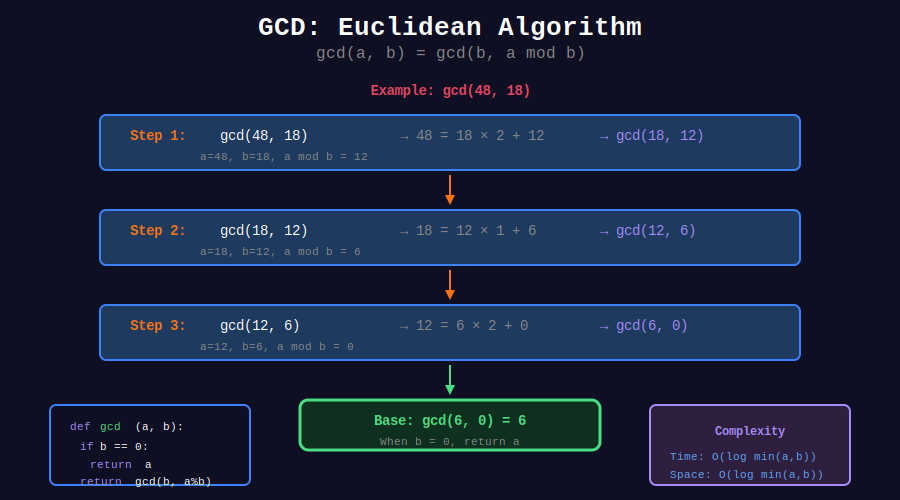
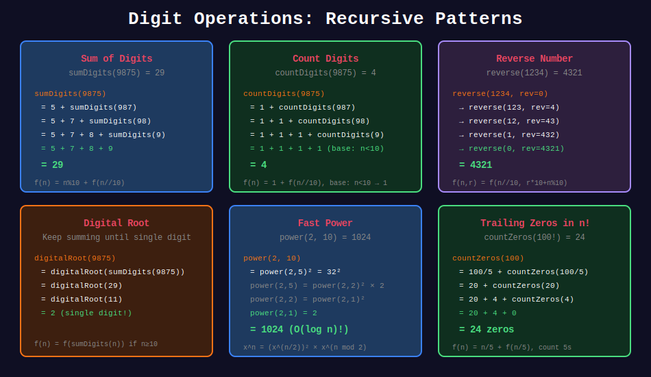

<div align="center">

# 🔢 Mathematical Recursion

<p>
  
  
</p>

**Solving mathematical problems using recursive definitions**

</div>

---

## 🧭 Navigation

| ⬅️ Previous | 📂 Current | ➡️ Next |
|:------------|:----------:|--------:|
| [← 07. Divide & Conquer](../07_divide_conquer/README.md) | **08. Mathematical Recursion** | [09. Linked List Recursion →](../09_linked_list_recursion/README.md) |

---

## 📊 Visual Diagrams

<p align="center">
  
</p>

<p align="center">
  
</p>

---

## 📐 Core Concepts

### 1️⃣ Number Theory Recursions

| Function | Recurrence | Base Case |
|----------|------------|-----------|
| Factorial | n! = n × (n-1)! | 0! = 1 |
| GCD | gcd(a,b) = gcd(b, a%b) | gcd(a,0) = a |
| Power | x^n = x × x^(n-1) | x^0 = 1 |
| Fibonacci | F(n) = F(n-1) + F(n-2) | F(0)=0, F(1)=1 |

---

### 2️⃣ Digit Manipulation

| Operation | Approach |
|-----------|----------|
| Count digits | f(n) = 1 + f(n/10), base: n<10 → 1 |
| Sum digits | f(n) = (n%10) + f(n/10), base: n<10 → n |
| Reverse digits | Build using 10^k + recurse |

---

## 💻 Code Implementations

### Number Theory

```python
def gcd(a: int, b: int) -> int:
    """
    Greatest Common Divisor (Euclidean).
    
    gcd(a, b) = gcd(b, a mod b)
    
    Time: O(log(min(a,b))), Space: O(log(min(a,b)))
    """
    if b == 0:
        return a
    return gcd(b, a % b)


def lcm(a: int, b: int) -> int:
    """
    Least Common Multiple.
    
    lcm(a,b) = a × b / gcd(a,b)
    """
    return (a * b) // gcd(a, b)


def factorial(n: int) -> int:
    """
    n! = n × (n-1) × ... × 1
    
    Time: O(n), Space: O(n)
    """
    if n <= 1:
        return 1
    return n * factorial(n - 1)


def power(x: float, n: int) -> float:
    """
    x^n using fast exponentiation.
    
    Time: O(log n), Space: O(log n)
    """
    if n == 0:
        return 1
    if n < 0:
        return 1 / power(x, -n)
    
    half = power(x, n // 2)
    if n % 2 == 0:
        return half * half
    return half * half * x


def isPrime(n: int, divisor: int = 2) -> bool:
    """
    Check if n is prime.
    
    Time: O(√n), Space: O(√n)
    """
    if n < 2:
        return False
    if divisor * divisor > n:
        return True
    if n % divisor == 0:
        return False
    return isPrime(n, divisor + 1)


def fibonacci(n: int) -> int:
    """
    Fibonacci number.
    
    Time: O(2^n) naive, O(n) with memo
    """
    if n <= 1:
        return n
    return fibonacci(n - 1) + fibonacci(n - 2)
```

### Digit Operations

```python
def countDigits(n: int) -> int:
    """
    Count number of digits.
    
    Time: O(d), Space: O(d) where d = digits
    """
    n = abs(n)
    if n < 10:
        return 1
    return 1 + countDigits(n // 10)


def sumDigits(n: int) -> int:
    """
    Sum of all digits.
    
    Time: O(d), Space: O(d)
    """
    n = abs(n)
    if n < 10:
        return n
    return (n % 10) + sumDigits(n // 10)


def productDigits(n: int) -> int:
    """
    Product of all digits.
    
    Time: O(d), Space: O(d)
    """
    n = abs(n)
    if n < 10:
        return n
    return (n % 10) * productDigits(n // 10)


def reverseNumber(n: int, rev: int = 0) -> int:
    """
    Reverse digits of number.
    
    Time: O(d), Space: O(d)
    """
    if n == 0:
        return rev
    return reverseNumber(n // 10, rev * 10 + n % 10)


def isPalindromeNumber(n: int) -> bool:
    """
    Check if number is palindrome.
    """
    if n < 0:
        return False
    return n == reverseNumber(n)


def digitalRoot(n: int) -> int:
    """
    Repeatedly sum digits until single digit.
    
    Example: 9875 → 29 → 11 → 2
    """
    n = abs(n)
    if n < 10:
        return n
    return digitalRoot(sumDigits(n))


def countZeros(n: int) -> int:
    """
    Count trailing zeros in n!
    
    = floor(n/5) + floor(n/25) + floor(n/125) + ...
    
    Time: O(log n), Space: O(log n)
    """
    if n < 5:
        return 0
    return n // 5 + countZeros(n // 5)
```

### Series and Sequences

```python
def nthTriangular(n: int) -> int:
    """
    n-th triangular number: 1 + 2 + ... + n
    
    Time: O(n), Space: O(n)
    """
    if n <= 0:
        return 0
    return n + nthTriangular(n - 1)


def harmonicSum(n: int) -> float:
    """
    Harmonic series: 1 + 1/2 + 1/3 + ... + 1/n
    
    Time: O(n), Space: O(n)
    """
    if n == 1:
        return 1.0
    return 1/n + harmonicSum(n - 1)


def geometricSum(a: float, r: float, n: int) -> float:
    """
    Geometric series: a + ar + ar² + ... + ar^(n-1)
    
    Time: O(n), Space: O(n)
    """
    if n == 0:
        return 0
    if n == 1:
        return a
    return a + geometricSum(a * r, r, n - 1)


def exponentialSum(x: float, n: int) -> float:
    """
    Taylor series for e^x: 1 + x + x²/2! + x³/3! + ...
    
    Time: O(n), Space: O(n)
    """
    def term(x, k, fact=1):
        if k == 0:
            return 1
        new_fact = fact * k
        return (x ** k) / new_fact + term(x, k - 1, new_fact // k if k > 1 else 1)
    
    return term(x, n)


def catalan(n: int) -> int:
    """
    n-th Catalan number.
    
    C(n) = sum(C(i) × C(n-1-i)) for i in 0..n-1
    
    Time: O(4^n / n^(3/2)) without memo
    """
    if n <= 1:
        return 1
    
    result = 0
    for i in range(n):
        result += catalan(i) * catalan(n - 1 - i)
    return result
```

### Combinatorics

```python
def nCr(n: int, r: int) -> int:
    """
    Combinations: C(n, r) = n! / (r! × (n-r)!)
    
    Pascal's Triangle: C(n,r) = C(n-1,r-1) + C(n-1,r)
    
    Time: O(2^n) without memo, O(n²) with memo
    """
    if r == 0 or r == n:
        return 1
    if r > n:
        return 0
    return nCr(n - 1, r - 1) + nCr(n - 1, r)


def nPr(n: int, r: int) -> int:
    """
    Permutations: P(n, r) = n! / (n-r)!
    
    Time: O(r), Space: O(r)
    """
    if r == 0:
        return 1
    return n * nPr(n - 1, r - 1)


def derangements(n: int) -> int:
    """
    Number of derangements (permutations with no fixed points).
    
    D(n) = (n-1) × (D(n-1) + D(n-2))
    
    Time: O(n), Space: O(n)
    """
    if n == 0:
        return 1
    if n == 1:
        return 0
    return (n - 1) * (derangements(n - 1) + derangements(n - 2))
```

---

## 🏆 LeetCode Problems

### 🟢 Easy

| # | Problem | Pattern | Time | Space |
|:-:|---------|---------|:----:|:-----:|
| 50 | [Pow(x, n)](https://leetcode.com/problems/powx-n/) | Fast Power | O(log n) | O(log n) |
| 509 | [Fibonacci Number](https://leetcode.com/problems/fibonacci-number/) | Sequence | O(n) | O(n) |
| 1342 | [Steps to Zero](https://leetcode.com/problems/number-of-steps-to-reduce-a-number-to-zero/) | Digit | O(log n) | O(log n) |

### 🟡 Medium

| # | Problem | Pattern | Time | Space |
|:-:|---------|---------|:----:|:-----:|
| 7 | [Reverse Integer](https://leetcode.com/problems/reverse-integer/) | Digit | O(log n) | O(log n) |
| 9 | [Palindrome Number](https://leetcode.com/problems/palindrome-number/) | Digit | O(log n) | O(log n) |
| 172 | [Factorial Trailing Zeros](https://leetcode.com/problems/factorial-trailing-zeroes/) | Factor | O(log n) | O(log n) |
| 258 | [Add Digits](https://leetcode.com/problems/add-digits/) | Digital Root | O(log n) | O(log n) |

---

## 📚 References

| Resource | Link |
|----------|------|
| **Euclidean Algorithm** | [Wikipedia](https://en.wikipedia.org/wiki/Euclidean_algorithm) |
| **Catalan Numbers** | [Wikipedia](https://en.wikipedia.org/wiki/Catalan_number) |

---

<div align="center">

**Made with ❤️ by [Gaurav Goswami](https://github.com/Gaurav14cs17)**

</div>

---

## 🧭 Navigation

| ⬅️ Previous | 📂 Current | ➡️ Next |
|:------------|:----------:|--------:|
| [← 07. Divide & Conquer](../07_divide_conquer/README.md) | **08. Mathematical Recursion** | [09. Linked List Recursion →](../09_linked_list_recursion/README.md) |

