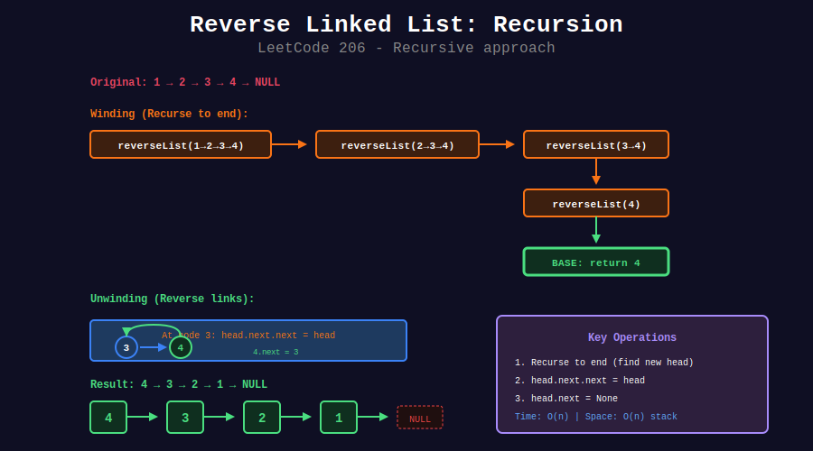
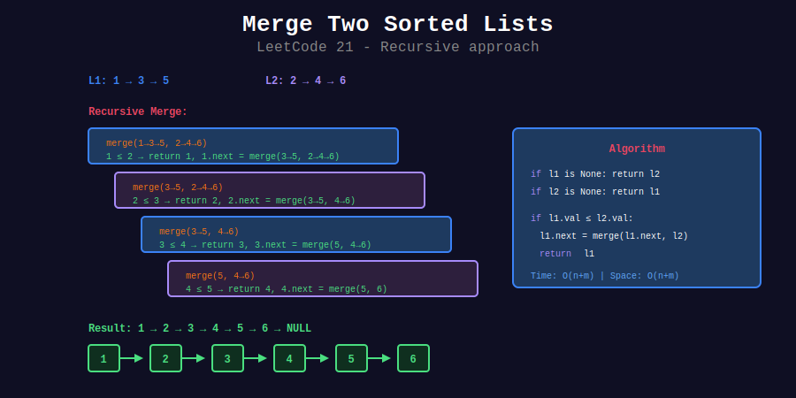

<div align="center">

# 🔗 Linked List Recursion

<p>
  
  
</p>

**Traversing and manipulating linked lists recursively**

</div>

---

## 🧭 Navigation

| ⬅️ Previous | 📂 Current | ➡️ Next |
|:------------|:----------:|--------:|
| [← 08. Mathematical Recursion](../08_mathematical_recursion/README.md) | **09. Linked List Recursion** | [10. Advanced Recursion →](../10_advanced_recursion/README.md) |

---

## 📊 Visual Diagrams

<p align="center">
  
</p>

<p align="center">
  
</p>

---

## 📐 Core Concepts

### 1️⃣ Linked List Node

```python
class ListNode:
    def __init__(self, val=0, next=None):
        self.val = val
        self.next = next
```

### 2️⃣ Recursion Pattern

```
Base Case: head is None or head.next is None
Recursive Case: Process head, recurse on head.next
```

---

## 💻 Code Implementations

### Basic Traversal

```python
def printList(head: ListNode) -> None:
    """
    Print all nodes.
    
    Time: O(n), Space: O(n)
    """
    if head is None:
        return
    
    print(head.val)
    printList(head.next)

def printReverse(head: ListNode) -> None:
    """
    Print nodes in reverse order.
    
    Time: O(n), Space: O(n)
    """
    if head is None:
        return
    
    printReverse(head.next)  # Recurse first
    print(head.val)  # Then print

def getLength(head: ListNode) -> int:
    """
    Get length of list.
    
    Time: O(n), Space: O(n)
    """
    if head is None:
        return 0
    return 1 + getLength(head.next)

def search(head: ListNode, target: int) -> bool:
    """
    Search for target value.
    
    Time: O(n), Space: O(n)
    """
    if head is None:
        return False
    if head.val == target:
        return True
    return search(head.next, target)

def getNth(head: ListNode, n: int) -> ListNode:
    """
    Get n-th node (0-indexed).
    
    Time: O(n), Space: O(n)
    """
    if head is None or n < 0:
        return None
    if n == 0:
        return head
    return getNth(head.next, n - 1)
```

### Reverse Operations

```python
def reverseList(head: ListNode) -> ListNode:
    """
    Reverse Linked List (LeetCode 206).
    
    Time: O(n), Space: O(n)
    """

    # Base case: empty or single node
    if head is None or head.next is None:
        return head
    
    # Recurse to get new head
    new_head = reverseList(head.next)
    
    # Reverse the link
    head.next.next = head
    head.next = None
    
    return new_head

def reverseBetween(head: ListNode, left: int, right: int) -> ListNode:
    """
    Reverse Linked List II (LeetCode 92).
    
    Reverse nodes from position left to right.
    
    Time: O(n), Space: O(n)
    """
    if left == 1:
        return reverseN(head, right)
    
    head.next = reverseBetween(head.next, left - 1, right - 1)
    return head

def reverseN(head: ListNode, n: int) -> ListNode:
    """
    Reverse first n nodes.
    """
    if n == 1:
        return head
    
    # Successor is the node after reversed portion
    new_head = reverseN(head.next, n - 1)
    
    successor = head.next.next
    head.next.next = head
    head.next = successor
    
    return new_head

def reverseKGroup(head: ListNode, k: int) -> ListNode:
    """
    Reverse Nodes in k-Group (LeetCode 25).
    
    Time: O(n), Space: O(n/k)
    """

    # Check if k nodes exist
    curr = head
    count = 0
    while curr and count < k:
        curr = curr.next
        count += 1
    
    if count < k:
        return head  # Not enough nodes
    
    # Reverse k nodes
    prev, curr = None, head
    for _ in range(k):
        next_node = curr.next
        curr.next = prev
        prev = curr
        curr = next_node
    
    # Recurse for remaining list
    head.next = reverseKGroup(curr, k)
    
    return prev
```

### Merge and Combine

```python
def mergeTwoLists(l1: ListNode, l2: ListNode) -> ListNode:
    """
    Merge Two Sorted Lists (LeetCode 21).
    
    Time: O(n+m), Space: O(n+m)
    """
    if l1 is None:
        return l2
    if l2 is None:
        return l1
    
    if l1.val <= l2.val:
        l1.next = mergeTwoLists(l1.next, l2)
        return l1
    else:
        l2.next = mergeTwoLists(l1, l2.next)
        return l2

def sortList(head: ListNode) -> ListNode:
    """
    Sort List (LeetCode 148) - Merge Sort.
    
    Time: O(n log n), Space: O(log n)
    """
    if head is None or head.next is None:
        return head
    
    # Find middle
    slow, fast = head, head.next
    while fast and fast.next:
        slow = slow.next
        fast = fast.next.next
    
    # Split
    mid = slow.next
    slow.next = None
    
    # Sort each half
    left = sortList(head)
    right = sortList(mid)
    
    # Merge
    return mergeTwoLists(left, right)

def addTwoNumbers(l1: ListNode, l2: ListNode, carry: int = 0) -> ListNode:
    """
    Add Two Numbers (LeetCode 2).
    
    Numbers stored in reverse order.
    
    Time: O(max(m,n)), Space: O(max(m,n))
    """
    if l1 is None and l2 is None and carry == 0:
        return None
    
    val1 = l1.val if l1 else 0
    val2 = l2.val if l2 else 0
    
    total = val1 + val2 + carry
    new_carry = total // 10
    digit = total % 10
    
    node = ListNode(digit)
    node.next = addTwoNumbers(
        l1.next if l1 else None,
        l2.next if l2 else None,
        new_carry
    )
    
    return node
```

### Delete and Remove

```python
def removeElements(head: ListNode, val: int) -> ListNode:
    """
    Remove Linked List Elements (LeetCode 203).
    
    Remove all nodes with given value.
    
    Time: O(n), Space: O(n)
    """
    if head is None:
        return None
    
    head.next = removeElements(head.next, val)
    
    if head.val == val:
        return head.next
    return head

def deleteDuplicates(head: ListNode) -> ListNode:
    """
    Remove Duplicates from Sorted List (LeetCode 83).
    
    Time: O(n), Space: O(n)
    """
    if head is None or head.next is None:
        return head
    
    head.next = deleteDuplicates(head.next)
    
    if head.val == head.next.val:
        return head.next
    return head

def removeNthFromEnd(head: ListNode, n: int) -> ListNode:
    """
    Remove Nth Node From End (LeetCode 19).
    
    Time: O(n), Space: O(n)
    """
    def remove(node):
        if node is None:
            return 0, None
        
        count, node.next = remove(node.next)
        count += 1
        
        if count == n:
            return count, node.next
        return count, node
    
    _, result = remove(head)
    return result
```

### Check Properties

```python
def isPalindrome(head: ListNode) -> bool:
    """
    Palindrome Linked List (LeetCode 234).
    
    Time: O(n), Space: O(n)
    """
    front = head
    
    def check(curr):
        nonlocal front
        if curr is None:
            return True
        
        # Check rest first
        if not check(curr.next):
            return False
        
        # Compare front with current (from back)
        if front.val != curr.val:
            return False
        
        front = front.next
        return True
    
    return check(head)

def hasCycle(head: ListNode, visited: set = None) -> bool:
    """
    Check for cycle (not recommended - modifies or uses O(n) space).
    
    Use Floyd's algorithm for O(1) space.
    """
    if visited is None:
        visited = set()
    
    if head is None:
        return False
    
    if id(head) in visited:
        return True
    
    visited.add(id(head))
    return hasCycle(head.next, visited)
```

---

## 🏆 LeetCode Problems

### 🟢 Easy

| # | Problem | Pattern | Time | Space |
|:-:|---------|---------|:----:|:-----:|
| 21 | [Merge Two Sorted Lists](https://leetcode.com/problems/merge-two-sorted-lists/) | Merge | O(n+m) | O(n+m) |
| 83 | [Remove Duplicates](https://leetcode.com/problems/remove-duplicates-from-sorted-list/) | Delete | O(n) | O(n) |
| 203 | [Remove Elements](https://leetcode.com/problems/remove-linked-list-elements/) | Delete | O(n) | O(n) |
| 206 | [Reverse Linked List](https://leetcode.com/problems/reverse-linked-list/) | Reverse | O(n) | O(n) |
| 234 | [Palindrome List](https://leetcode.com/problems/palindrome-linked-list/) | Check | O(n) | O(n) |

### 🟡 Medium

| # | Problem | Pattern | Time | Space |
|:-:|---------|---------|:----:|:-----:|
| 2 | [Add Two Numbers](https://leetcode.com/problems/add-two-numbers/) | Combine | O(n) | O(n) |
| 19 | [Remove Nth From End](https://leetcode.com/problems/remove-nth-node-from-end-of-list/) | Delete | O(n) | O(n) |
| 24 | [Swap Nodes in Pairs](https://leetcode.com/problems/swap-nodes-in-pairs/) | Reverse | O(n) | O(n) |
| 92 | [Reverse List II](https://leetcode.com/problems/reverse-linked-list-ii/) | Reverse | O(n) | O(n) |
| 148 | [Sort List](https://leetcode.com/problems/sort-list/) | Merge Sort | O(n log n) | O(log n) |

### 🔴 Hard

| # | Problem | Pattern | Time | Space |
|:-:|---------|---------|:----:|:-----:|
| 25 | [Reverse in K-Group](https://leetcode.com/problems/reverse-nodes-in-k-group/) | Reverse | O(n) | O(n/k) |

---

## 📚 References

| Resource | Link |
|----------|------|
| **Linked List** | [GeeksforGeeks](https://www.geeksforgeeks.org/linked-list-data-structure/) |

---

<div align="center">

**Made with ❤️ by [Gaurav Goswami](https://github.com/Gaurav14cs17)**

</div>

---

## 🧭 Navigation

| ⬅️ Previous | 📂 Current | ➡️ Next |
|:------------|:----------:|--------:|
| [← 08. Mathematical Recursion](../08_mathematical_recursion/README.md) | **09. Linked List Recursion** | [10. Advanced Recursion →](../10_advanced_recursion/README.md) |

