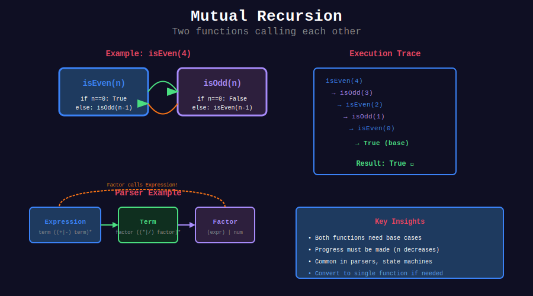
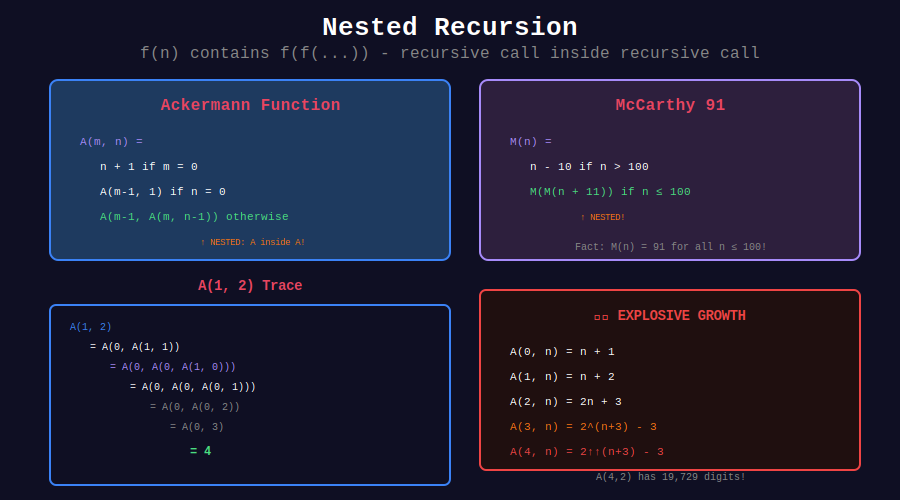

<div align="center">

# 🚀 Advanced Recursion

<p>
  
  
</p>

**Advanced recursion patterns: mutual, indirect, nested, and generative**

</div>

---

## 🧭 Navigation

| ⬅️ Previous | 📂 Current | ➡️ Next |
|:------------|:----------:|--------:|
| [← 09. Linked List Recursion](../09_linked_list_recursion/README.md) | **10. Advanced Recursion** | [11. Parser Recursion →](../11_parser_recursion/README.md) |

---

## 📊 Visual Diagrams

<p align="center">
  
</p>

<p align="center">
  
</p>

---

## 📐 Core Concepts

### 1️⃣ Mutual Recursion

Two or more functions call each other:

```
f(n) → g(n-1)
g(n) → f(n-1)
```

**Example:** isEven/isOdd, parser for grammar.

---

### 2️⃣ Indirect Recursion

Function calls itself through chain of other functions:

```
f → g → h → f
```

---

### 3️⃣ Nested Recursion

Recursive call as argument to recursive call:

```
f(n) = f(f(n-1))
```

**Example:** Ackermann function.

---

### 4️⃣ Generative Recursion

Creates new subproblems (not just decomposition):

```
Problem → Generate new subproblems
```

**Example:** Quick sort (pivot creates new partitions).

---

## 💻 Code Implementations

### Mutual Recursion

```python
def isEven(n: int) -> bool:
    """
    Check if n is even using mutual recursion.
    
    isEven(n) calls isOdd(n-1)
    isOdd(n) calls isEven(n-1)
    
    Time: O(n), Space: O(n)
    """
    if n == 0:
        return True
    return isOdd(n - 1)

def isOdd(n: int) -> bool:
    """
    Check if n is odd using mutual recursion.
    """
    if n == 0:
        return False
    return isEven(n - 1)

def feminine(n: int) -> int:
    """
    Hofstadter Female sequence.
    
    F(n) = n - M(F(n-1)) if n > 0 else 1
    M(n) = n - F(M(n-1)) if n > 0 else 0
    """
    if n == 0:
        return 1
    return n - masculine(feminine(n - 1))

def masculine(n: int) -> int:
    """
    Hofstadter Male sequence.
    """
    if n == 0:
        return 0
    return n - feminine(masculine(n - 1))

# Parser mutual recursion
def parseExpression(tokens: list, pos: int) -> tuple:
    """
    Parse expression: term (('+' | '-') term)*
    
    Expression → Term
    Term → Factor
    Factor → '(' Expression ')' | number
    """
    left, pos = parseTerm(tokens, pos)
    
    while pos < len(tokens) and tokens[pos] in ['+', '-']:
        op = tokens[pos]
        pos += 1
        right, pos = parseTerm(tokens, pos)
        if op == '+':
            left = left + right
        else:
            left = left - right
    
    return left, pos

def parseTerm(tokens: list, pos: int) -> tuple:
    """Parse term: factor (('*' | '/') factor)*"""
    left, pos = parseFactor(tokens, pos)
    
    while pos < len(tokens) and tokens[pos] in ['*', '/']:
        op = tokens[pos]
        pos += 1
        right, pos = parseFactor(tokens, pos)
        if op == '*':
            left = left * right
        else:
            left = left / right
    
    return left, pos

def parseFactor(tokens: list, pos: int) -> tuple:
    """Parse factor: number | '(' expression ')'"""
    if tokens[pos] == '(':
        pos += 1  # skip '('
        result, pos = parseExpression(tokens, pos)
        pos += 1  # skip ')'
        return result, pos
    else:
        return float(tokens[pos]), pos + 1
```

### Nested Recursion

```python
def ackermann(m: int, n: int) -> int:
    """
    Ackermann function - grows EXTREMELY fast.
    
    A(0, n) = n + 1
    A(m, 0) = A(m-1, 1)
    A(m, n) = A(m-1, A(m, n-1))  ← Nested!
    
    Time: Super-exponential, Space: Same
    
    WARNING: A(4, 2) = 2^65536 - 3 (HUGE!)
    """
    if m == 0:
        return n + 1
    elif n == 0:
        return ackermann(m - 1, 1)
    else:
        return ackermann(m - 1, ackermann(m, n - 1))

def mccarthy91(n: int) -> int:
    """
    McCarthy 91 function.
    
    M(n) = n - 10 if n > 100
    M(n) = M(M(n + 11)) if n ≤ 100  ← Nested!
    
    Interesting: M(n) = 91 for all n ≤ 100!
    
    Time: O(1) for n > 100, O(n) otherwise
    """
    if n > 100:
        return n - 10
    return mccarthy91(mccarthy91(n + 11))

def tarai(x: int, y: int, z: int) -> int:
    """
    Takeuchi function (Tarai).
    
    T(x,y,z) = y if x ≤ y
    T(x,y,z) = T(T(x-1,y,z), T(y-1,z,x), T(z-1,x,y))
    
    Triple nested recursion!
    """
    if x <= y:
        return y
    return tarai(
        tarai(x - 1, y, z),
        tarai(y - 1, z, x),
        tarai(z - 1, x, y)
    )
```

### Generative Recursion

```python
def quickSortGenerative(arr: list) -> list:
    """
    Quick sort as generative recursion.
    
    Generates NEW subproblems (partitions) each time.
    Not structural decomposition of input.
    
    Time: O(n log n) avg, O(n²) worst
    """
    if len(arr) <= 1:
        return arr
    
    # GENERATE new subproblems
    pivot = arr[len(arr) // 2]
    left = [x for x in arr if x < pivot]      # Generated!
    middle = [x for x in arr if x == pivot]
    right = [x for x in arr if x > pivot]     # Generated!
    
    # Solve and combine
    return quickSortGenerative(left) + middle + quickSortGenerative(right)

def gcdGenerative(a: int, b: int) -> int:
    """
    GCD as generative recursion.
    
    Generates new subproblem (b, a mod b).
    """
    if b == 0:
        return a
    return gcdGenerative(b, a % b)  # Generated subproblem

def fractal(n: int, x: float, y: float, size: float) -> list:
    """
    Sierpinski triangle as generative recursion.
    
    Generates 3 new triangles at each level.
    
    Returns list of triangle coordinates.
    """
    if n == 0:
        return [(x, y, size)]
    
    half = size / 2
    
    # Generate 3 new subproblems
    top = fractal(n - 1, x, y, half)
    left = fractal(n - 1, x - half/2, y + half, half)
    right = fractal(n - 1, x + half/2, y + half, half)
    
    return top + left + right
```

### Indirect Recursion

```python
def funcA(n: int) -> int:
    """
    Indirect recursion: A → B → C → A
    """
    if n <= 0:
        return 1
    return funcB(n - 1) + 1

def funcB(n: int) -> int:
    if n <= 0:
        return 1
    return funcC(n - 1) + 1

def funcC(n: int) -> int:
    if n <= 0:
        return 1
    return funcA(n - 1) + 1  # Completes the cycle!

# State machine using indirect recursion
def stateA(input_str: str, pos: int) -> bool:
    """
    DFA for pattern: (ab)+
    
    States: A (start) → B → A
    Accept only from state A when input exhausted.
    """
    if pos >= len(input_str):
        return True  # Accept
    
    if input_str[pos] == 'a':
        return stateB(input_str, pos + 1)
    return False

def stateB(input_str: str, pos: int) -> bool:
    if pos >= len(input_str):
        return False  # Reject (incomplete pattern)
    
    if input_str[pos] == 'b':
        return stateA(input_str, pos + 1)  # Back to A
    return False
```

### Tower of Hanoi Variants

```python
def hanoi(n: int, source: str, target: str, auxiliary: str) -> list:
    """
    Classic Tower of Hanoi.
    
    Move n disks from source to target using auxiliary.
    
    Time: O(2^n), Space: O(n)
    """
    moves = []
    
    if n == 1:
        moves.append(f"Move disk from {source} to {target}")
        return moves
    
    # Move n-1 disks to auxiliary
    moves.extend(hanoi(n - 1, source, auxiliary, target))
    
    # Move largest disk to target
    moves.append(f"Move disk from {source} to {target}")
    
    # Move n-1 disks from auxiliary to target
    moves.extend(hanoi(n - 1, auxiliary, target, source))
    
    return moves

def frameStewartHanoi(n: int, pegs: int = 4) -> int:
    """
    Frame-Stewart algorithm for Tower of Hanoi with 4+ pegs.
    
    Minimizes number of moves.
    
    For 4 pegs: O(n^0.5 * 2^(n^0.5))
    """
    if pegs < 3:
        return float('inf')
    if n == 0:
        return 0
    if n == 1:
        return 1
    if pegs == 3:
        return 2**n - 1  # Classic formula
    
    # Try all possible k values
    min_moves = float('inf')
    for k in range(1, n):
        # Move k disks to auxiliary using all pegs
        # Move n-k disks using 3 pegs
        # Move k disks to target using all pegs
        moves = (2 * frameStewartHanoi(k, pegs) + 
                 frameStewartHanoi(n - k, pegs - 1))
        min_moves = min(min_moves, moves)
    
    return min_moves
```

---

## 🏆 LeetCode Problems

### 🟡 Medium

| # | Problem | Pattern | Time | Space |
|:-:|---------|---------|:----:|:-----:|
| 91 | [Decode Ways](https://leetcode.com/problems/decode-ways/) | Generative | O(n) | O(n) |
| 394 | [Decode String](https://leetcode.com/problems/decode-string/) | Nested | O(n×k) | O(n) |
| 736 | [Parse Lisp Expression](https://leetcode.com/problems/parse-lisp-expression/) | Mutual | O(n) | O(n) |

### 🔴 Hard

| # | Problem | Pattern | Time | Space |
|:-:|---------|---------|:----:|:-----:|
| 224 | [Basic Calculator](https://leetcode.com/problems/basic-calculator/) | Mutual | O(n) | O(n) |
| 770 | [Basic Calculator IV](https://leetcode.com/problems/basic-calculator-iv/) | Mutual | O(n) | O(n) |
| 761 | [Special Binary String](https://leetcode.com/problems/special-binary-string/) | Nested | O(n²) | O(n) |

---

## 📊 Pattern Comparison

| Pattern | Definition | Example | Complexity |
|---------|------------|---------|------------|
| **Direct** | f calls f | Factorial | Varies |
| **Mutual** | f calls g, g calls f | isEven/isOdd | O(n) |
| **Indirect** | f→g→h→f cycle | State machine | Varies |
| **Nested** | f(f(n)) | Ackermann | Super-exp |
| **Generative** | Creates new subproblems | Quick sort | Varies |

---

## 📚 References

| Resource | Link |
|----------|------|
| **Ackermann Function** | [Wikipedia](https://en.wikipedia.org/wiki/Ackermann_function) |
| **Mutual Recursion** | [Wikipedia](https://en.wikipedia.org/wiki/Mutual_recursion) |
| **Tower of Hanoi** | [Wikipedia](https://en.wikipedia.org/wiki/Tower_of_Hanoi) |

---

<div align="center">

**Made with ❤️ by [Gaurav Goswami](https://github.com/Gaurav14cs17)**

</div>

---

## 🧭 Navigation

| ⬅️ Previous | 📂 Current | ➡️ Next |
|:------------|:----------:|--------:|
| [← 09. Linked List Recursion](../09_linked_list_recursion/README.md) | **10. Advanced Recursion** | [11. Parser Recursion →](../11_parser_recursion/README.md) |

