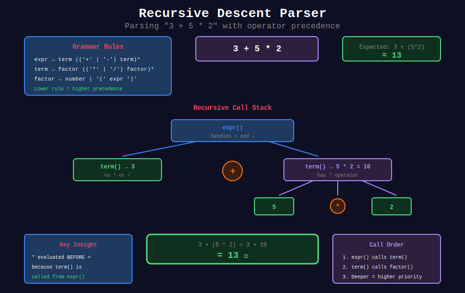
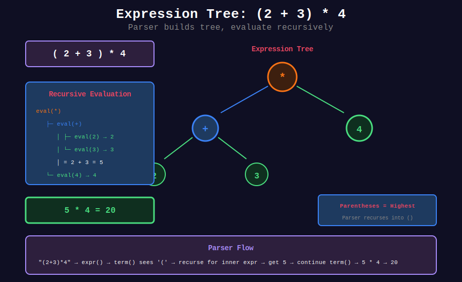
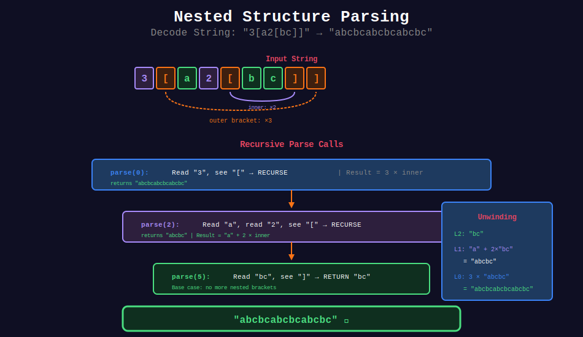
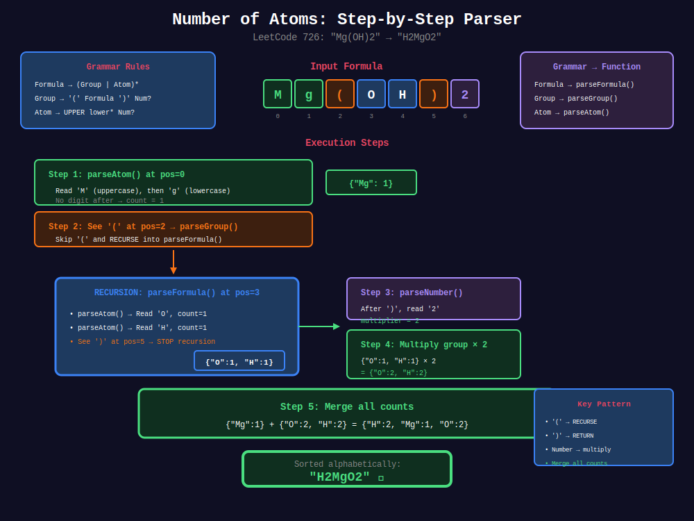
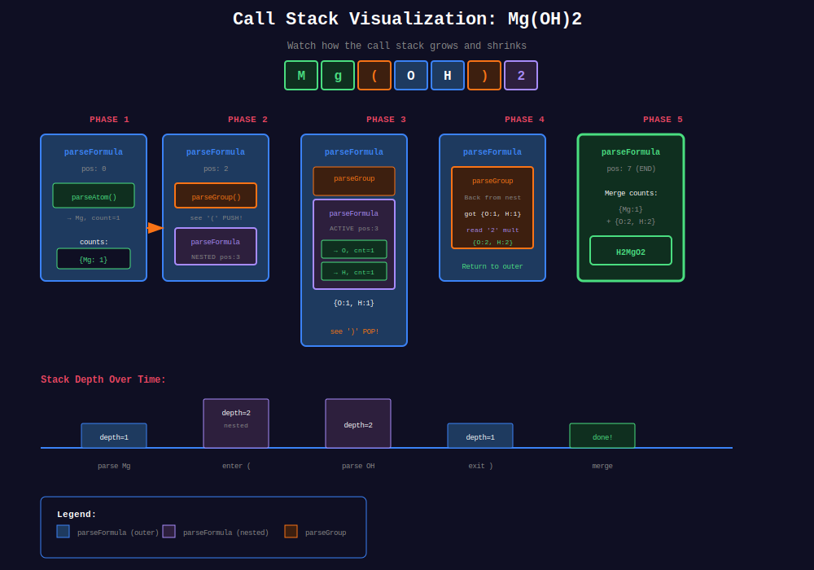
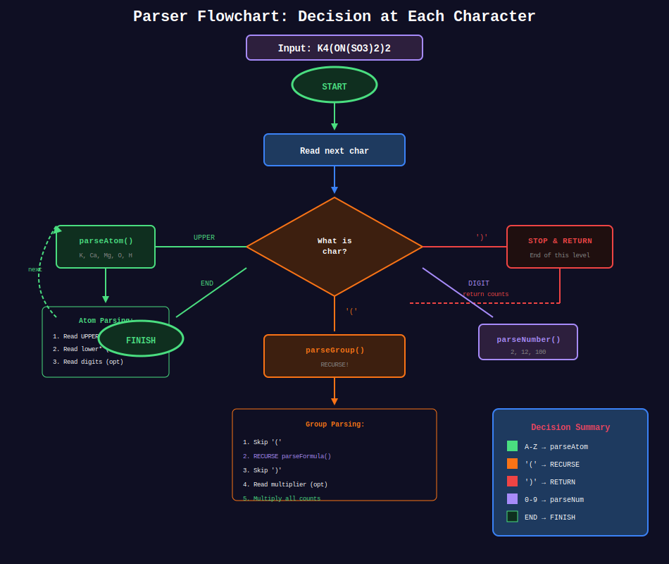
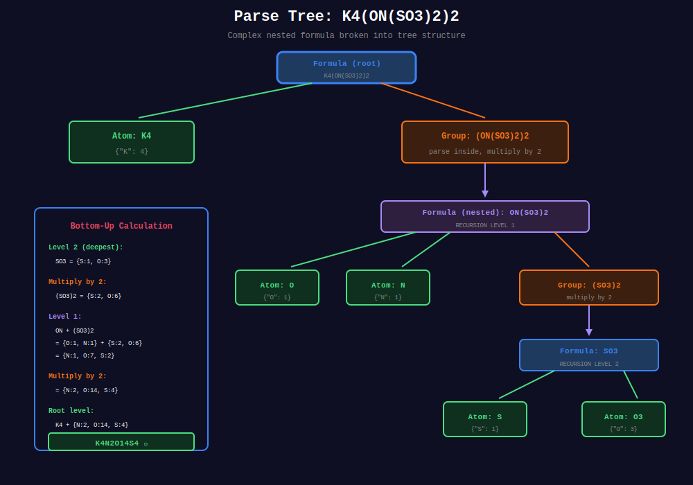
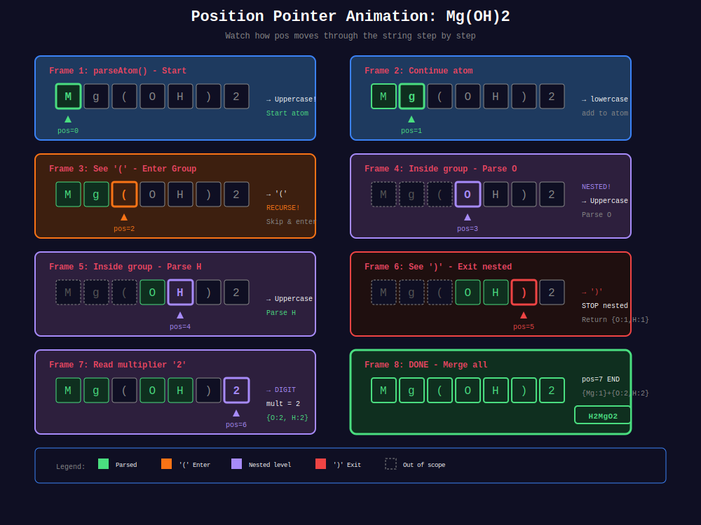

<div align="center">

# 🔍 Parser Recursion

<p>
  
  
</p>

**Recursive descent parsing for expressions, grammars, and nested structures**

</div>

---

## 🧭 Navigation

| ⬅️ Previous | 📂 Current | ➡️ Next |
|:------------|:----------:|--------:|
| [← 10. Advanced Recursion](../10_advanced_recursion/README.md) | **11. Parser Recursion** | [🏠 Recursion Home](../README.md) → [Backtracking](../../17_backtracking/README.md) |

---

## 📊 Visual Diagrams

### 1. Recursive Descent Parser

<p align="center">
  
</p>

### 2. Expression Tree Parsing

<p align="center">
  
</p>

### 3. Nested Structure Parsing

<p align="center">
  
</p>

### 4. Number of Atoms Parser

<p align="center">
  
</p>

---

> 📖 **Detailed Examples:** See the [examples folder](./examples/) for step-by-step walkthroughs.

### 📚 Detailed Walkthroughs

| Problem | Difficulty | Description | Link |
|---------|:----------:|-------------|------|
| **Number of Atoms** (LC 726) | 🔴 Hard | Nested chemical formulas | [📖 View](./examples/number_of_atoms_explained.md) |
| **Decode String** (LC 394) | 🟡 Medium | Pattern `k[string]` | [📖 View](./examples/decode_string_explained.md) |
| **Basic Calculator** (LC 224) | 🔴 Hard | Expression with `( )` | [📖 View](./examples/basic_calculator_explained.md) |

---

### 📊 Multiple Diagram Styles for Number of Atoms (LeetCode 726)

<details>
<summary>🔍 Click to view all diagrams</summary>

#### 1. Call Stack Visualization

<p align="center">
  
</p>

#### 2. Decision Flowchart

<p align="center">
  
</p>

#### 3. Parse Tree (Complex Nested)

<p align="center">
  
</p>

#### 4. Position Pointer Animation

<p align="center">
  
</p>

</details>

---

## 📐 Core Concepts

### 1️⃣ Recursive Descent Parsing

A top-down parsing technique where:
- Each grammar rule becomes a function
- Functions call each other based on grammar
- Recursion handles nesting

```
Grammar:
  Expression → Term (('+' | '-') Term)*
  Term       → Factor (('*' | '/') Factor)*
  Factor     → Number | '(' Expression ')'
```

---

### 2️⃣ Grammar Rules to Code

| Grammar Symbol | Code Pattern |
|----------------|--------------|
| `A → B C` | Call B(), then C() |
| `A → B \| C` | if-else or try B, fallback C |
| `A → B*` | while loop calling B() |
| `A → B?` | Optional: if can_match then B() |
| `A → (B)` | Recursive call for nesting |

---

### 3️⃣ Operator Precedence

Handle by grammar structure:

```
Lowest precedence  → outermost rule (evaluated last)
Highest precedence → innermost rule (evaluated first)

1 + 2 * 3 = 1 + (2 * 3) = 7  ✓
            NOT (1 + 2) * 3 = 9  ✗
```

---

## 💻 Code Implementations

### Basic Expression Evaluator

```python
class ExpressionParser:
    """
    Basic Calculator II (LeetCode 227).
    
    Handles: + - * / with correct precedence.
    
    Grammar:
        expr   → term (('+' | '-') term)*
        term   → factor (('*' | '/') factor)*
        factor → number
    
    Time: O(n), Space: O(1) for this simple case
    """
    
    def __init__(self, s: str):
        self.s = s
        self.pos = 0
    
    def parse(self) -> int:
        """Entry point: parse expression."""
        return self.expression()
    
    def expression(self) -> int:
        """expr → term (('+' | '-') term)*"""
        result = self.term()
        
        while self.pos < len(self.s):
            self.skip_spaces()
            if self.pos >= len(self.s):
                break
            
            op = self.s[self.pos]
            if op not in '+-':
                break
            
            self.pos += 1
            right = self.term()
            
            if op == '+':
                result += right
            else:
                result -= right
        
        return result
    
    def term(self) -> int:
        """term → factor (('*' | '/') factor)*"""
        result = self.factor()
        
        while self.pos < len(self.s):
            self.skip_spaces()
            if self.pos >= len(self.s):
                break
            
            op = self.s[self.pos]
            if op not in '*/':
                break
            
            self.pos += 1
            right = self.factor()
            
            if op == '*':
                result *= right
            else:
                result = int(result / right)  # Truncate toward zero
        
        return result
    
    def factor(self) -> int:
        """factor → number"""
        self.skip_spaces()
        
        num = 0
        while self.pos < len(self.s) and self.s[self.pos].isdigit():
            num = num * 10 + int(self.s[self.pos])
            self.pos += 1
        
        return num
    
    def skip_spaces(self):
        while self.pos < len(self.s) and self.s[self.pos] == ' ':
            self.pos += 1

def calculate(s: str) -> int:
    """Wrapper function."""
    parser = ExpressionParser(s)
    return parser.parse()
```

### Full Calculator with Parentheses

```python
class FullCalculator:
    """
    Basic Calculator (LeetCode 224).
    
    Handles: + - ( ) with unary minus.
    
    Grammar:
        expr   → term (('+' | '-') term)*
        term   → factor
        factor → number | '(' expr ')' | '-' factor
    
    Time: O(n), Space: O(depth of nesting)
    """
    
    def __init__(self, s: str):
        self.s = s
        self.pos = 0
    
    def calculate(self) -> int:
        return self.expression()
    
    def expression(self) -> int:
        """expr → term (('+' | '-') term)*"""
        result = self.term()
        
        while self.pos < len(self.s):
            self.skip_spaces()
            if self.pos >= len(self.s):
                break
            
            op = self.s[self.pos]
            if op not in '+-':
                break
            
            self.pos += 1
            right = self.term()
            
            if op == '+':
                result += right
            else:
                result -= right
        
        return result
    
    def term(self) -> int:
        """term → factor (handle * / if needed)"""
        return self.factor()
    
    def factor(self) -> int:
        """factor → number | '(' expr ')' | '-' factor"""
        self.skip_spaces()
        
        if self.pos >= len(self.s):
            return 0
        
        char = self.s[self.pos]
        
        # Unary minus
        if char == '-':
            self.pos += 1
            return -self.factor()
        
        # Unary plus
        if char == '+':
            self.pos += 1
            return self.factor()
        
        # Parenthesized expression
        if char == '(':
            self.pos += 1  # Skip '('
            result = self.expression()
            self.skip_spaces()
            self.pos += 1  # Skip ')'
            return result
        
        # Number
        return self.number()
    
    def number(self) -> int:
        """Parse integer."""
        self.skip_spaces()
        num = 0
        while self.pos < len(self.s) and self.s[self.pos].isdigit():
            num = num * 10 + int(self.s[self.pos])
            self.pos += 1
        return num
    
    def skip_spaces(self):
        while self.pos < len(self.s) and self.s[self.pos] == ' ':
            self.pos += 1
```

### Decode String Parser

```python
def decodeString(s: str) -> str:
    """
    Decode String (LeetCode 394).
    
    "3[a2[c]]" → "accaccacc"
    
    Grammar:
        string → (letters | number '[' string ']')*
        number → digit+
        letters → letter+
    
    Time: O(output length), Space: O(nesting depth)
    """
    
    def parse(pos: int) -> tuple:
        """Returns (decoded_string, new_position)"""
        result = ""
        num = 0
        
        while pos < len(s):
            char = s[pos]
            
            if char.isdigit():

                # Accumulate number
                num = num * 10 + int(char)
                pos += 1
            
            elif char == '[':

                # Recurse for nested content
                pos += 1  # Skip '['
                nested, pos = parse(pos)
                result += num * nested
                num = 0
            
            elif char == ']':

                # End of current nesting level
                pos += 1  # Skip ']'
                return result, pos
            
            else:

                # Regular letter
                result += char
                pos += 1
        
        return result, pos
    
    decoded, _ = parse(0)
    return decoded
```

### Lisp Expression Parser

```python
def parseLisp(expression: str) -> int:
    """
    Parse Lisp Expression (LeetCode 736).
    
    (let x 2 (mult x (let x 3 y 4 (add x y))))
    
    Grammar:
        expr → number | variable | '(' operation args ')'
        operation → 'let' | 'add' | 'mult'
    
    Time: O(n), Space: O(depth × variables)
    """
    
    def parse(pos: int, scope: dict) -> tuple:
        """Returns (value, new_position)"""
        
        if expression[pos] == '(':
            pos += 1  # Skip '('
            
            # Read operation
            op_end = pos
            while expression[op_end] not in ' )':
                op_end += 1
            op = expression[pos:op_end]
            pos = op_end
            
            if op == 'let':

                # Create new scope
                new_scope = scope.copy()
                
                while True:
                    pos = skip_space(pos)
                    
                    # Check if next is expression (last element)
                    if expression[pos] == '(' or expression[pos].lstrip('-').isdigit():
                        val, pos = parse(pos, new_scope)
                        pos = skip_space(pos)
                        pos += 1  # Skip ')'
                        return val, pos
                    
                    # Read variable name
                    var_end = pos
                    while expression[var_end] not in ' )':
                        var_end += 1
                    var_name = expression[pos:var_end]
                    pos = var_end
                    
                    # Check if this is the last expression
                    pos = skip_space(pos)
                    if expression[pos] == ')':

                        # var_name is actually the final expression (variable lookup)
                        pos += 1
                        return new_scope.get(var_name, 0), pos
                    
                    # Read value
                    val, pos = parse(pos, new_scope)
                    new_scope[var_name] = val
            
            elif op == 'add':
                pos = skip_space(pos)
                val1, pos = parse(pos, scope)
                pos = skip_space(pos)
                val2, pos = parse(pos, scope)
                pos = skip_space(pos)
                pos += 1  # Skip ')'
                return val1 + val2, pos
            
            elif op == 'mult':
                pos = skip_space(pos)
                val1, pos = parse(pos, scope)
                pos = skip_space(pos)
                val2, pos = parse(pos, scope)
                pos = skip_space(pos)
                pos += 1  # Skip ')'
                return val1 * val2, pos
        
        else:

            # Number or variable
            end = pos
            while end < len(expression) and expression[end] not in ' )':
                end += 1
            token = expression[pos:end]
            
            if token.lstrip('-').isdigit():
                return int(token), end
            else:
                return scope.get(token, 0), end
    
    def skip_space(pos: int) -> int:
        while pos < len(expression) and expression[pos] == ' ':
            pos += 1
        return pos
    
    result, _ = parse(0, {})
    return result
```

### Nested List Parser

```python
def deserializeNestedList(s: str) -> 'NestedInteger':
    """
    Mini Parser (LeetCode 385).
    
    "[123,[456,[789]]]" → nested structure
    
    Grammar:
        item → number | '[' list ']'
        list → item (',' item)*
    
    Time: O(n), Space: O(depth)
    """
    
    class NestedInteger:
        def __init__(self, value=None):
            self.value = value
            self.list = [] if value is None else None
        
        def add(self, ni):
            self.list.append(ni)
        
        def isInteger(self):
            return self.value is not None
    
    def parse(pos: int) -> tuple:
        """Returns (NestedInteger, new_position)"""
        
        if s[pos] == '[':
            pos += 1  # Skip '['
            result = NestedInteger()
            
            # Empty list
            if s[pos] == ']':
                return result, pos + 1
            
            # Parse items
            while True:
                item, pos = parse(pos)
                result.add(item)
                
                if s[pos] == ']':
                    pos += 1
                    break
                elif s[pos] == ',':
                    pos += 1
            
            return result, pos
        
        else:

            # Parse number
            end = pos
            if s[end] == '-':
                end += 1
            while end < len(s) and s[end].isdigit():
                end += 1
            
            num = int(s[pos:end])
            return NestedInteger(num), end
    
    result, _ = parse(0)
    return result
```

### S-Expression Parser

```python
def parseAtom(s: str) -> list:
    """
    Parse S-expression into nested list.
    
    "(a (b c) d)" → ['a', ['b', 'c'], 'd']
    
    Time: O(n), Space: O(depth)
    """
    
    def parse(pos: int) -> tuple:
        """Returns (parsed_element, new_position)"""
        
        while pos < len(s) and s[pos] == ' ':
            pos += 1
        
        if pos >= len(s):
            return None, pos
        
        if s[pos] == '(':

            # Start of list
            pos += 1  # Skip '('
            result = []
            
            while pos < len(s) and s[pos] != ')':
                while pos < len(s) and s[pos] == ' ':
                    pos += 1
                
                if pos < len(s) and s[pos] != ')':
                    item, pos = parse(pos)
                    if item is not None:
                        result.append(item)
            
            if pos < len(s):
                pos += 1  # Skip ')'
            
            return result, pos
        
        elif s[pos] == ')':
            return None, pos
        
        else:

            # Atom (symbol or number)
            end = pos
            while end < len(s) and s[end] not in ' ()':
                end += 1
            
            atom = s[pos:end]
            
            # Try to convert to number
            try:
                if '.' in atom:
                    return float(atom), end
                return int(atom), end
            except ValueError:
                return atom, end
    
    result, _ = parse(0)
    return result
```

### JSON Parser

```python
def parseJSON(s: str) -> any:
    """
    Simplified JSON parser.
    
    Grammar:
        value  → object | array | string | number | bool | null
        object → '{' (pair (',' pair)*)? '}'
        array  → '[' (value (',' value)*)? ']'
        pair   → string ':' value
    
    Time: O(n), Space: O(depth)
    """
    
    def parse(pos: int) -> tuple:
        pos = skip_ws(pos)
        
        if s[pos] == '{':
            return parse_object(pos)
        elif s[pos] == '[':
            return parse_array(pos)
        elif s[pos] == '"':
            return parse_string(pos)
        elif s[pos:pos+4] == 'true':
            return True, pos + 4
        elif s[pos:pos+5] == 'false':
            return False, pos + 5
        elif s[pos:pos+4] == 'null':
            return None, pos + 4
        else:
            return parse_number(pos)
    
    def parse_object(pos: int) -> tuple:
        pos += 1  # Skip '{'
        result = {}
        pos = skip_ws(pos)
        
        if s[pos] == '}':
            return result, pos + 1
        
        while True:
            pos = skip_ws(pos)
            key, pos = parse_string(pos)
            pos = skip_ws(pos)
            pos += 1  # Skip ':'
            value, pos = parse(pos)
            result[key] = value
            
            pos = skip_ws(pos)
            if s[pos] == '}':
                return result, pos + 1
            pos += 1  # Skip ','
    
    def parse_array(pos: int) -> tuple:
        pos += 1  # Skip '['
        result = []
        pos = skip_ws(pos)
        
        if s[pos] == ']':
            return result, pos + 1
        
        while True:
            value, pos = parse(pos)
            result.append(value)
            
            pos = skip_ws(pos)
            if s[pos] == ']':
                return result, pos + 1
            pos += 1  # Skip ','
    
    def parse_string(pos: int) -> tuple:
        pos += 1  # Skip opening '"'
        end = pos
        while s[end] != '"':
            if s[end] == '\\':
                end += 2
            else:
                end += 1
        return s[pos:end], end + 1
    
    def parse_number(pos: int) -> tuple:
        end = pos
        if s[end] == '-':
            end += 1
        while end < len(s) and s[end] in '0123456789.eE+-':
            end += 1
        num_str = s[pos:end]
        if '.' in num_str or 'e' in num_str or 'E' in num_str:
            return float(num_str), end
        return int(num_str), end
    
    def skip_ws(pos: int) -> int:
        while pos < len(s) and s[pos] in ' \t\n\r':
            pos += 1
        return pos
    
    result, _ = parse(0)
    return result
```

### Valid Parentheses Variants

```python
def isValidParentheses(s: str) -> bool:
    """
    Valid Parentheses (LeetCode 20).
    
    Recursive approach (usually done with stack).
    
    Time: O(n), Space: O(n)
    """
    
    def parse(pos: int, expected_close: str) -> tuple:
        """
        Parse from pos until expected_close or end.
        Returns (is_valid, new_position).
        """
        while pos < len(s):
            char = s[pos]
            
            if char in '([{':

                # Opening bracket - recurse
                close_map = {'(': ')', '[': ']', '{': '}'}
                expected = close_map[char]
                valid, pos = parse(pos + 1, expected)
                
                if not valid:
                    return False, pos
            
            elif char in ')]}':

                # Closing bracket
                if char == expected_close:
                    return True, pos + 1
                else:
                    return False, pos
            
            else:
                pos += 1
        
        # Reached end - valid only if no close expected
        return expected_close == '', pos
    
    valid, final_pos = parse(0, '')
    return valid and final_pos == len(s)

def longestValidParentheses(s: str) -> int:
    """
    Longest Valid Parentheses (LeetCode 32).
    
    Parser approach with matching tracking.
    
    Time: O(n), Space: O(n)
    """
    n = len(s)
    
    def parse(pos: int) -> int:
        """Returns length of valid sequence starting at pos."""
        if pos >= n or s[pos] != '(':
            return 0
        
        # Try to match this '('
        inner_pos = pos + 1
        inner_len = 0
        
        # Match nested valid sequences
        while inner_pos < n and s[inner_pos] == '(':
            nested = parse(inner_pos)
            if nested == 0:
                break
            inner_len += nested
            inner_pos += nested
        
        # Check for matching ')'
        if inner_pos < n and s[inner_pos] == ')':
            total = 2 + inner_len

            # Continue matching after this valid group
            total += parse(inner_pos + 1)
            return total
        
        return 0
    
    max_len = 0
    for i in range(n):
        if s[i] == '(':
            max_len = max(max_len, parse(i))
    
    return max_len
```

---

## 🏆 LeetCode Problems

### 🟡 Medium

| # | Problem | Pattern | Time | Space |
|:-:|---------|---------|:----:|:-----:|
| 150 | [Evaluate Reverse Polish](https://leetcode.com/problems/evaluate-reverse-polish-notation/) | Stack/Parse | O(n) | O(n) |
| 227 | [Basic Calculator II](https://leetcode.com/problems/basic-calculator-ii/) | Expression | O(n) | O(1) |
| 385 | [Mini Parser](https://leetcode.com/problems/mini-parser/) | Nested | O(n) | O(d) |
| 394 | [Decode String](https://leetcode.com/problems/decode-string/) | Nested | O(n×k) | O(d) |
| 439 | [Ternary Expression Parser](https://leetcode.com/problems/ternary-expression-parser/) | Conditional | O(n) | O(d) |
| 726 | [Number of Atoms](https://leetcode.com/problems/number-of-atoms/) | Nested | O(n) | O(d) |

### 🔴 Hard

| # | Problem | Pattern | Time | Space |
|:-:|---------|---------|:----:|:-----:|
| 32 | [Longest Valid Parentheses](https://leetcode.com/problems/longest-valid-parentheses/) | Matching | O(n) | O(n) |
| 224 | [Basic Calculator](https://leetcode.com/problems/basic-calculator/) | Expression | O(n) | O(d) |
| 282 | [Expression Add Operators](https://leetcode.com/problems/expression-add-operators/) | Generate | O(4ⁿ) | O(n) |
| 736 | [Parse Lisp Expression](https://leetcode.com/problems/parse-lisp-expression/) | Lisp | O(n) | O(d) |
| 770 | [Basic Calculator IV](https://leetcode.com/problems/basic-calculator-iv/) | Polynomial | O(n) | O(n) |
| 772 | [Basic Calculator III](https://leetcode.com/problems/basic-calculator-iii/) | Full Expr | O(n) | O(d) |

---

## 📊 Pattern Summary

```
Parser Recursion Patterns
         |
         +-- Expression Parsing
         |   +-- Handle operator precedence
         |   +-- Grammar: expr → term → factor
         |
         +-- Nested Structure Parsing
         |   +-- [ ], ( ), { } matching
         |   +-- Recursive call on '['
         |
         +-- Token-based Parsing
         |   +-- Lex tokens first
         |   +-- Parse token stream
         |
         +-- Grammar-driven Parsing
             +-- One function per rule
             +-- Mutual recursion between rules
```

---

## 📋 Parser Template

```python
class RecursiveDescentParser:
    """Template for recursive descent parsing."""
    
    def __init__(self, input_str: str):
        self.input = input_str
        self.pos = 0
    
    def parse(self):
        """Entry point."""
        result = self.rule_start()
        if self.pos != len(self.input):
            raise SyntaxError(f"Unexpected at {self.pos}")
        return result
    
    def rule_start(self):
        """Start rule - override this."""
        pass
    
    def peek(self) -> str:
        """Look at current character."""
        if self.pos >= len(self.input):
            return ''
        return self.input[self.pos]
    
    def consume(self, expected: str = None) -> str:
        """Consume current character."""
        char = self.peek()
        if expected and char != expected:
            raise SyntaxError(f"Expected {expected}, got {char}")
        self.pos += 1
        return char
    
    def skip_whitespace(self):
        """Skip spaces."""
        while self.peek() == ' ':
            self.pos += 1
```

---

## 📚 References

| Resource | Link |
|----------|------|
| **Recursive Descent** | [Wikipedia](https://en.wikipedia.org/wiki/Recursive_descent_parser) |
| **Context-Free Grammar** | [Wikipedia](https://en.wikipedia.org/wiki/Context-free_grammar) |
| **Operator Precedence** | [Wikipedia](https://en.wikipedia.org/wiki/Operator-precedence_parser) |

---

<div align="center">

**Made with ❤️ by [Gaurav Goswami](https://github.com/Gaurav14cs17)**

</div>

---

## 🧭 Navigation

| ⬅️ Previous | 📂 Current | ➡️ Next |
|:------------|:----------:|--------:|
| [← 10. Advanced Recursion](../10_advanced_recursion/README.md) | **11. Parser Recursion** | [🏠 Recursion Home](../README.md) → [Backtracking](../../17_backtracking/README.md) |

