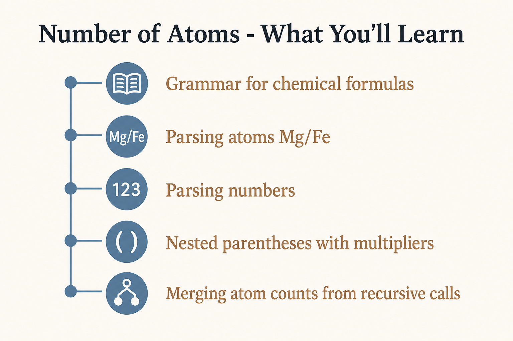
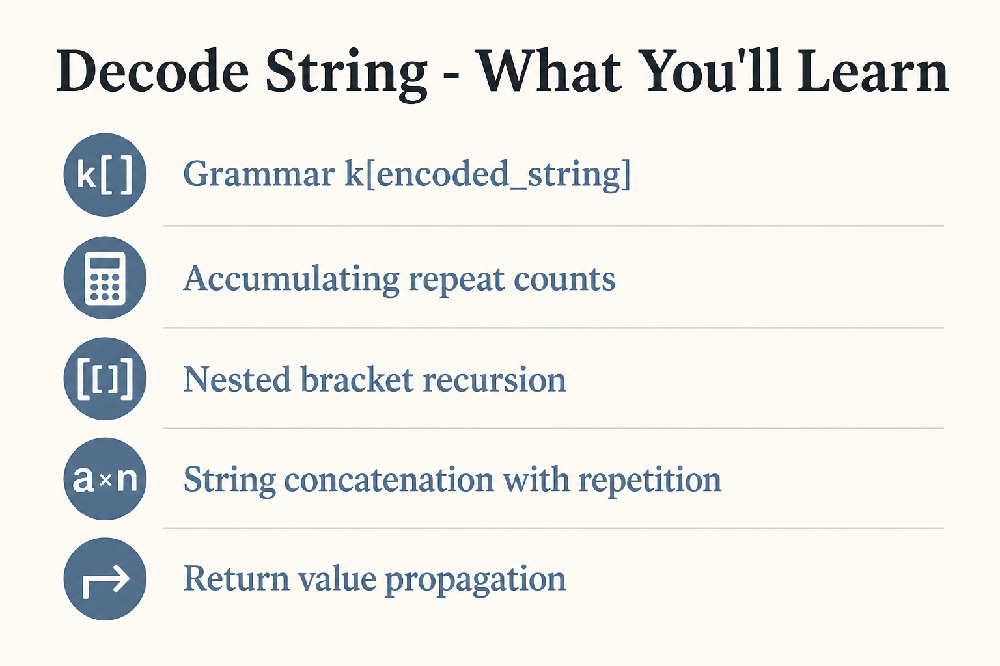
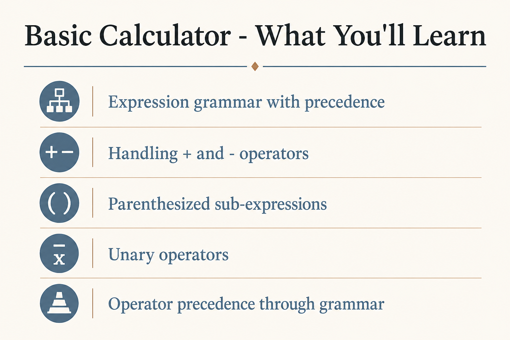
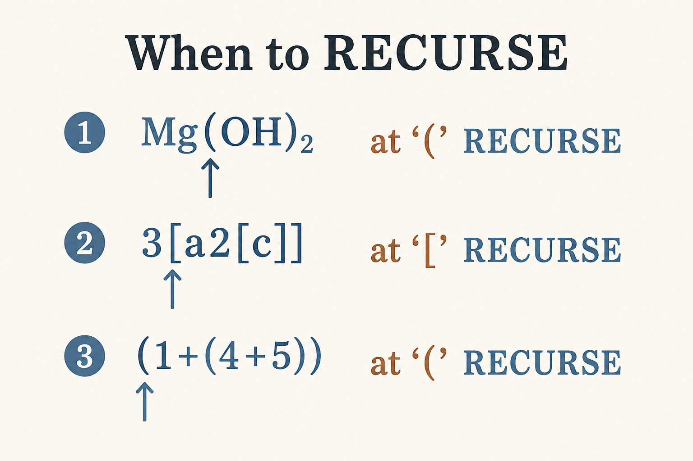
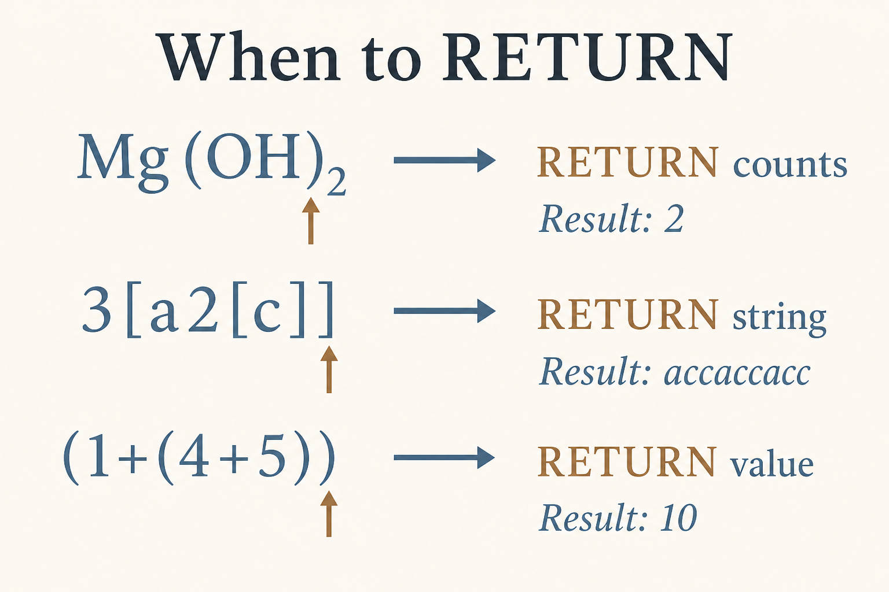
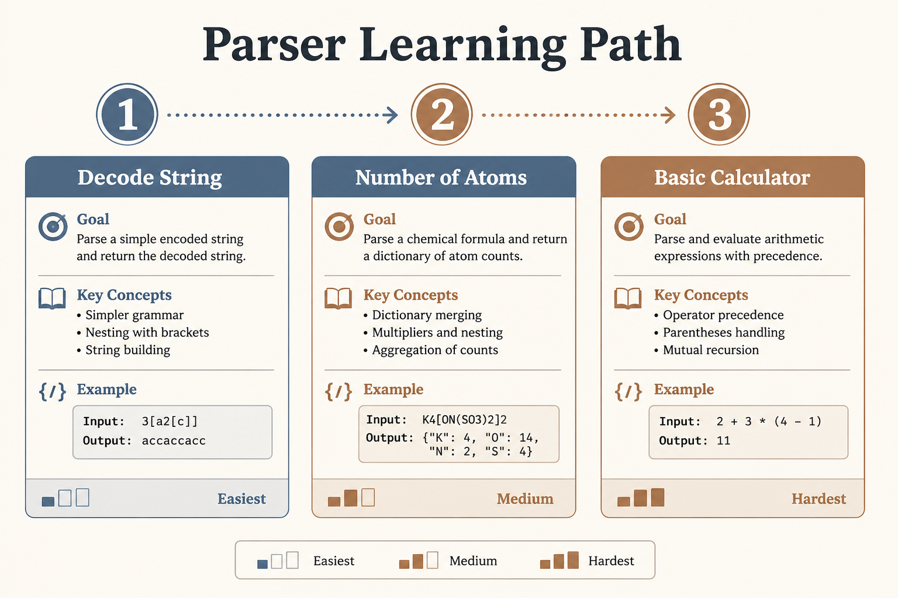
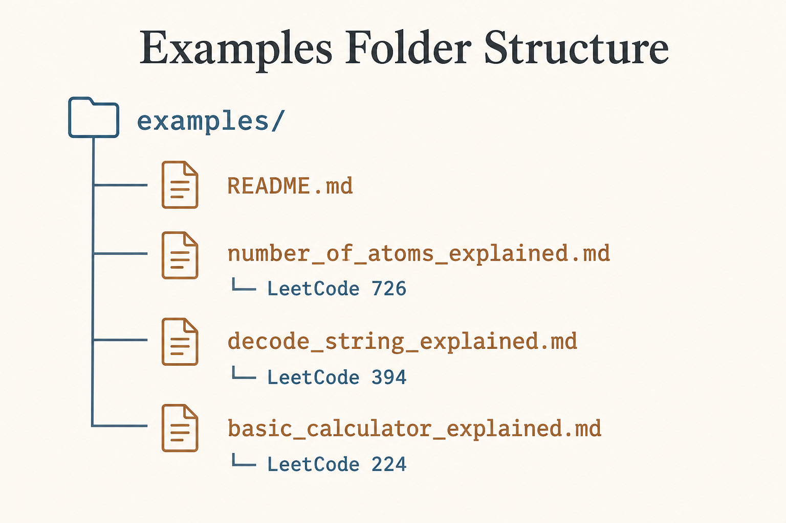

# Parser Recursion Examples

This folder contains detailed step-by-step explanations of parser recursion problems.

---

## 📚 Examples Index

| # | Problem | File | Difficulty | Key Concept |
|:-:|---------|------|:----------:|-------------|
| 1 | **Number of Atoms** (LC 726) | [📖 View](./number_of_atoms_explained.md) | 🔴 Hard | Nested groups with multipliers |
| 2 | **Decode String** (LC 394) | [📖 View](./decode_string_explained.md) | 🟡 Medium | Nested `k[string]` pattern |
| 3 | **Basic Calculator** (LC 224) | [📖 View](./basic_calculator_explained.md) | 🔴 Hard | Expression with parentheses |

---

## 🎯 What Each Example Covers

### 1. Number of Atoms (LeetCode 726)

**Input:** `"K4(ON(SO3)2)2"`  
**Output:** `"K4N2O14S4"`

<div align="center">



</div>


**Diagrams Included:**

- Call Stack Visualization

- Decision Flowchart

- Parse Tree

- Position Pointer Animation

---

### 2. Decode String (LeetCode 394)

**Input:** `"3[a2[c]]"`  
**Output:** `"accaccacc"`

<div align="center">



</div>


---

### 3. Basic Calculator (LeetCode 224)

**Input:** `"(1+(4+5+2)-3)+(6+8)"`  
**Output:** `23`

<div align="center">



</div>


---

## 📊 Visual Comparison

### When to RECURSE:

<div align="center">



</div>


### When to RETURN:

<div align="center">



</div>


---

## 📐 Common Parser Pattern

All three problems follow the same structure:

```python
class Parser:
    def __init__(self, s: str):
        self.s = s
        self.pos = 0
    
    def parse(self):
        """Entry point."""
        return self.parseRule()
    
    def parseRule(self):
        """Main parsing rule."""
        result = initial_value
        
        while self.pos < len(self.s):
            char = self.s[self.pos]
            
            if is_trigger_for_recursion(char):
                # ★ RECURSE ★
                nested = self.parseRule()
                result = combine(result, nested)
            
            elif is_end_condition(char):
                # RETURN to parent
                return result
            
            else:
                # Process current character
                result = process(result, char)
                self.pos += 1
        
        return result

```

---

## 🔄 Comparison Table

| Aspect | Number of Atoms | Decode String | Basic Calculator |
|--------|:---------------:|:-------------:|:----------------:|
| **Nesting Trigger** | `(` | `[` | `(` |
| **Nesting End** | `)` | `]` | `)` |
| **Number Follows** | After `)` or Atom | Before `[` | N/A |
| **Returns** | `dict` | `str` | `int` |
| **Merge Operation** | Add counts | Concatenate × k | Evaluate operators |

---

## 🎓 Learning Path

**Recommended order:**

<div align="center">



</div>


---

## 📁 Folder Structure

<div align="center">



</div>


---

## 🔗 Back to Main

- [← Parser Recursion README](../)

- [← Recursion Main](../../)

---

<div align="center">

**Made with ❤️ for understanding Parser Recursion**

</div>

