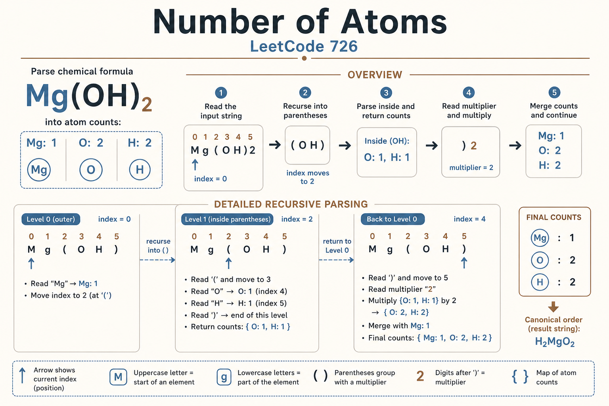
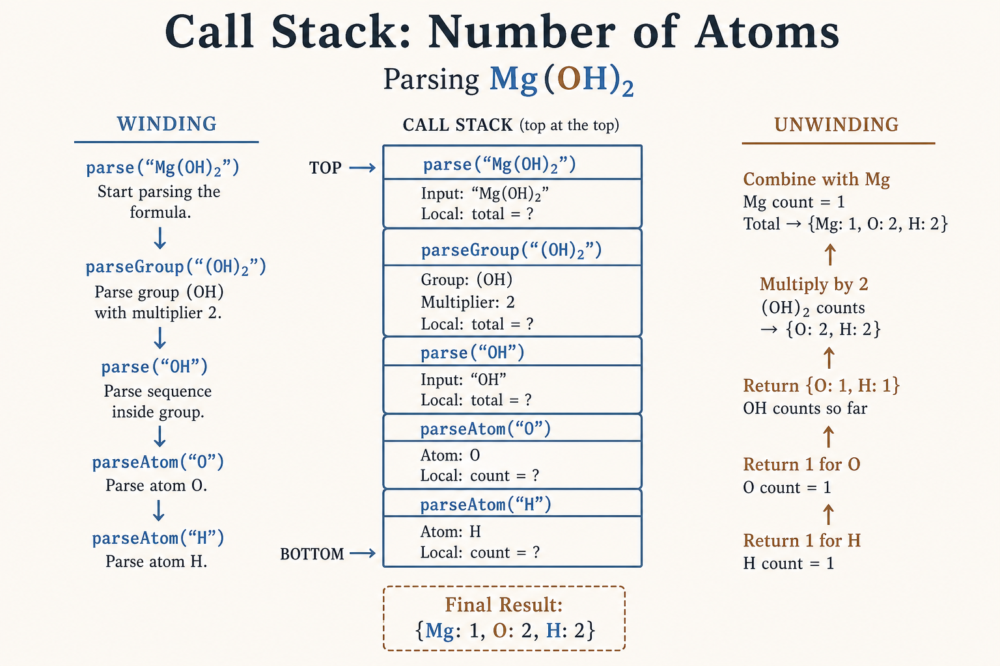
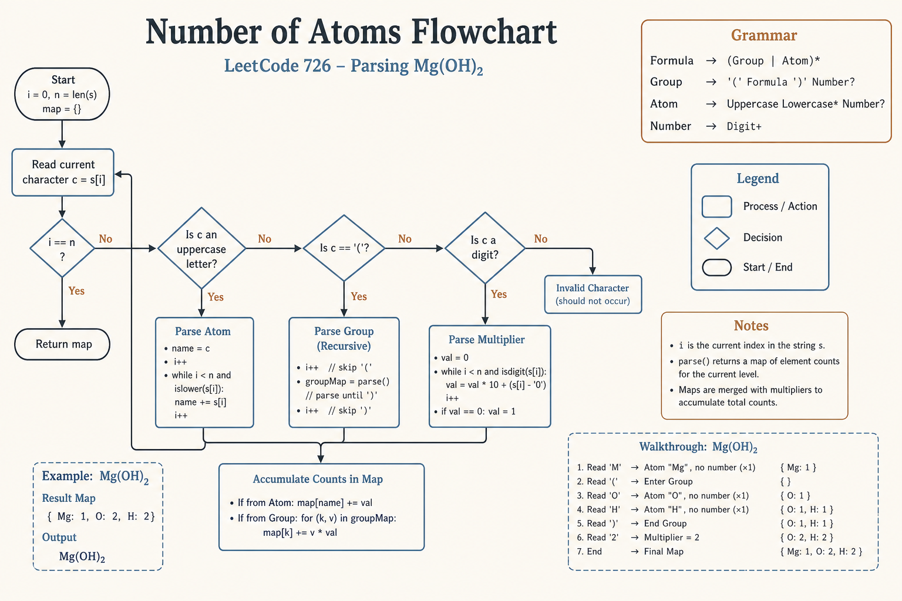
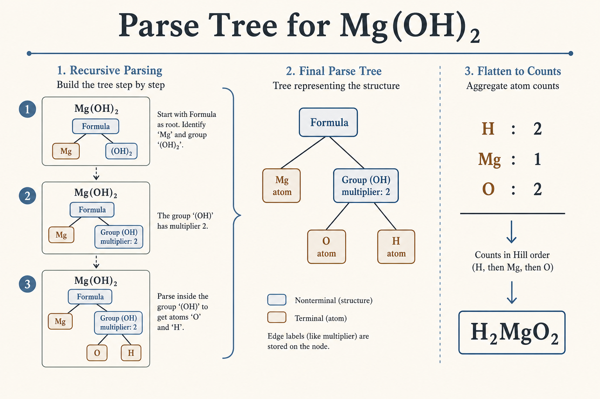
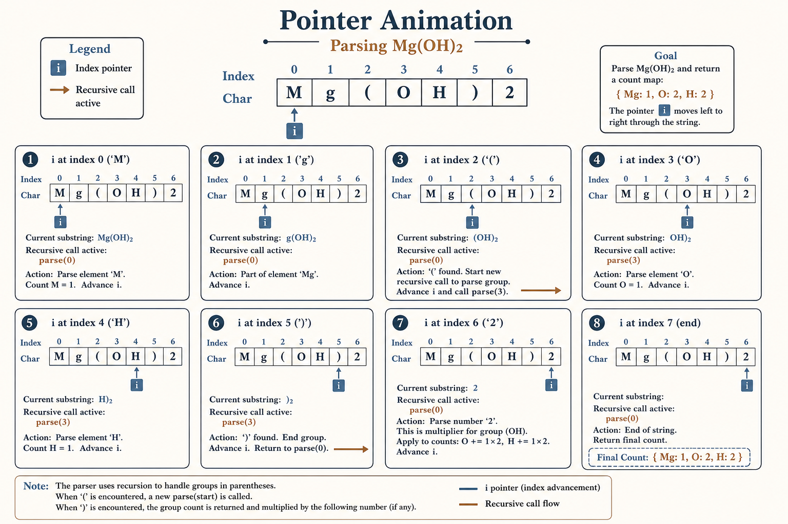

# Parser Recursion: Number of Atoms (LeetCode 726)

## 📊 Visual Overview

<p align="center">
  
</p>

> **See more diagrams below** for call stack, flowchart, parse tree, and pointer animation.

---

## 🎯 Problem Statement

Given a chemical formula, return the count of each atom sorted alphabetically.

### Examples:

| Input | Output | Explanation |
|-------|--------|-------------|
| `"H2O"` | `"H2O"` | H: 2, O: 1 |
| `"Mg(OH)2"` | `"H2MgO2"` | H: 2, Mg: 1, O: 2 |
| `"K4(ON(SO3)2)2"` | `"K4N2O14S4"` | Complex nested! |

---

## 📐 Step 1: Understand the Grammar

Before coding, define the **grammar** (rules for valid formulas):

```
Formula  →  (Group | Atom)*
Group    →  '(' Formula ')' Number?
Atom     →  UPPER LOWER* Number?
Number   →  DIGIT+

```

### Grammar Rules Explained:

| Rule | Pattern | Meaning | Example |
|------|---------|---------|---------|
| **Formula** | `(Group \| Atom)*` | Zero or more atoms or groups | `H2O`, `Mg(OH)2` |
| **Group** | `'(' Formula ')' Number?` | Parentheses with optional multiplier | `(OH)2` → OH repeated 2× |
| **Atom** | `UPPER LOWER* Number?` | Element name with optional count | `H`, `Mg`, `Ca2`, `Fe3` |
| **Number** | `DIGIT+` | One or more digits | `2`, `12`, `100` |

### Grammar to Code Mapping:

```
Grammar Rule          →    Python Function
---------------------------------------------
Formula               →    parseFormula()
Group                 →    parseGroup()  
Atom                  →    parseAtom()
Number                →    parseNumber()

```

---

## 📐 Step 2: Understand the Recursion

### Why Recursion?

```
K4(ON(SO3)2)2
      ↑
   Nested parentheses!
   
When we see '(' we must RECURSE to handle what's inside.

```

### The Key Insight:

```
'('  →  PUSH (enter new recursion level)
')'  →  POP  (exit current level, return counts)

```

### Recursion Pattern Visualization:

```
parse("K4(ON(SO3)2)2")

|
+-- parse atom "K4" → {K: 4}
|
+-- see '(' → RECURSE!
    |
    +-- parse("ON(SO3)2")
        |
        +-- parse atom "O" → {O: 1}
        +-- parse atom "N" → {N: 1}
        |
        +-- see '(' → RECURSE DEEPER!
            |
            +-- parse("SO3")
                +-- parse atom "S" → {S: 1}
                +-- parse atom "O3" → {O: 3}
                +-- see ')' → RETURN {S: 1, O: 3}
            |
            multiply by 2 → {S: 2, O: 6}
        |
        combine → {O: 1, N: 1} + {S: 2, O: 6} = {N: 1, O: 7, S: 2}
        +-- see ')' → RETURN {N: 1, O: 7, S: 2}
    |
    multiply by 2 → {N: 2, O: 14, S: 4}

|
combine with K4 → {K: 4, N: 2, O: 14, S: 4}

FINAL OUTPUT: K4N2O14S4

```

---

## 💻 Step 3: Complete Code with Detailed Comments

```python
from collections import defaultdict

class Solution:
    def countOfAtoms(self, formula: str) -> str:
        """
        Parse chemical formula and count atoms.
        
        Grammar:
            Formula → (Group | Atom)*
            Group   → '(' Formula ')' Number?
            Atom    → UPPER LOWER* Number?
        
        Time:  O(n²) - sorting + string building
        Space: O(n)  - recursion depth + hash map
        """
        self.formula = formula
        self.pos = 0  # Current position in formula
        self.n = len(formula)
        
        # Parse the entire formula
        counts = self.parseFormula()
        
        # Build result string (sorted alphabetically)
        result = []
        for atom in sorted(counts.keys()):
            result.append(atom)
            if counts[atom] > 1:
                result.append(str(counts[atom]))
        
        return ''.join(result)
    
    def parseFormula(self) -> dict:
        """
        Parse: Formula → (Group | Atom)*
        
        Returns: Dictionary of atom counts
        
        WHEN TO STOP: 
          - End of string (pos >= n)
          - See ')' (end of current group)
        """
        counts = defaultdict(int)
        
        # Keep parsing until end or closing ')'
        while self.pos < self.n and self.formula[self.pos] != ')':
            
            if self.formula[self.pos] == '(':
                # +---------------------------------+
                # | It's a Group → parse recursively |
                # +---------------------------------+
                group_counts = self.parseGroup()
                
                # Merge group counts into our counts
                for atom, count in group_counts.items():
                    counts[atom] += count
            
            else:
                # +-------------------------+
                # | It's an Atom → parse it |
                # +-------------------------+
                atom, count = self.parseAtom()
                counts[atom] += count
        
        return counts
    
    def parseGroup(self) -> dict:
        """
        Parse: Group → '(' Formula ')' Number?
        
        Returns: Dictionary of atom counts (multiplied by number)
        
        STEPS:
          1. Skip '('
          2. RECURSE to parse inside
          3. Skip ')'
          4. Read optional multiplier
          5. Multiply all counts
        """
        # Step 1: Skip the '('
        self.pos += 1  # Move past '('
        
        # Step 2: ★ RECURSE ★ to parse the formula inside
        inner_counts = self.parseFormula()
        
        # Step 3: Skip the ')'
        self.pos += 1  # Move past ')'
        
        # Step 4: Check for number after ')'
        multiplier = self.parseNumber()
        
        # Step 5: Multiply all counts by the multiplier
        if multiplier > 1:
            for atom in inner_counts:
                inner_counts[atom] *= multiplier
        
        return inner_counts
    
    def parseAtom(self) -> tuple:
        """
        Parse: Atom → UPPER LOWER* Number?
        
        Returns: (atom_name, count)
        
        Examples:
          "H"   → ("H", 1)
          "Mg"  → ("Mg", 1)  
          "Ca2" → ("Ca", 2)
          "Fe3" → ("Fe", 3)
        """
        # Step 1: Read uppercase letter (required)
        atom = self.formula[self.pos]
        self.pos += 1
        
        # Step 2: Read lowercase letters (optional)
        while self.pos < self.n and self.formula[self.pos].islower():
            atom += self.formula[self.pos]
            self.pos += 1
        
        # Step 3: Read number (optional, default = 1)
        count = self.parseNumber()
        
        return atom, count
    
    def parseNumber(self) -> int:
        """
        Parse: Number → DIGIT+
        
        Returns: The number (default 1 if no digits)
        
        Examples:
          "2abc"  → 2 (pos moves past '2')
          "12xyz" → 12 (pos moves past '12')
          "abc"   → 1 (no digits, return default)
        """
        if self.pos >= self.n or not self.formula[self.pos].isdigit():
            return 1  # No number means count of 1
        
        num = 0
        while self.pos < self.n and self.formula[self.pos].isdigit():
            num = num * 10 + int(self.formula[self.pos])
            self.pos += 1
        
        return num

```

---

## 🔍 Step 4: Detailed Trace Through "Mg(OH)2"

### Initial State:

```
formula = "Mg(OH)2"
pos = 0
n = 7

```

### Execution Trace:

```
parseFormula() starts at pos=0

|
+-► pos=0: char='M' is UPPERCASE → call parseAtom()
|   |
|   +-- Read 'M', pos becomes 1

|   +-- pos=1: char='g' is lowercase → add to atom
|   +-- atom = "Mg", pos becomes 2
|   +-- pos=2: char='(' is NOT digit → count = 1

|   +-- Returns ("Mg", 1)
|
|   counts = {"Mg": 1}

|
+-► pos=2: char='(' → call parseGroup()
|   |
|   +-- Step 1: Skip '(', pos becomes 3

|   |
|   +-- Step 2: ★ RECURSE ★ parseFormula() at pos=3

|   |   |
|   |   +-► pos=3: char='O' is UPPERCASE → parseAtom()

|   |   |   +-- atom = "O", count = 1

|   |   |   +-- pos becomes 4

|   |   |   inner_counts = {"O": 1}

|   |   |
|   |   +-► pos=4: char='H' is UPPERCASE → parseAtom()

|   |   |   +-- atom = "H", count = 1

|   |   |   +-- pos becomes 5

|   |   |   inner_counts = {"O": 1, "H": 1}

|   |   |
|   |   +-► pos=5: char=')' → STOP LOOP

|   |   +-- Returns {"O": 1, "H": 1}
|   |
|   +-- Step 3: Skip ')', pos becomes 6

|   |
|   +-- Step 4: parseNumber() at pos=6

|   |   +-- char='2' is digit
|   |   +-- num = 2, pos becomes 7

|   |   +-- Returns 2
|   |
|   +-- Step 5: Multiply {"O": 1, "H": 1} × 2

|   |   = {"O": 2, "H": 2}
|   |
|   +-- Returns {"O": 2, "H": 2}

|
|   Merge: {"Mg": 1} + {"O": 2, "H": 2}
|   counts = {"Mg": 1, "O": 2, "H": 2}

|
+-► pos=7: pos >= n → STOP LOOP
|
+-- Returns {"Mg": 1, "O": 2, "H": 2}

FINAL: Sort keys → "H2MgO2"

```

---

## 📊 Step-by-Step Position Diagram

```
Position:   0    1    2    3    4    5    6
          +----+----+----+----+----+----+----+
Character:| M  | g  | (  | O  | H  | )  | 2  |
          +----+----+----+----+----+----+----+
            ▲
           pos=0  Start here

Step 1: Parse atom "Mg"
          +----+----+----+----+----+----+----+
          | M  | g  | (  | O  | H  | )  | 2  |
          +----+----+----+----+----+----+----+
            +----+
            Atom: Mg
                       ▲
                      pos=2

Step 2: See '(' → Enter group (RECURSE)
          +----+----+----+----+----+----+----+
          | M  | g  | (  | O  | H  | )  | 2  |
          +----+----+----+----+----+----+----+
            ✓    ✓    ▼
                     ENTER
                            ▲
                           pos=3

Step 3: Inside group - Parse "O"
          +----+----+----+----+----+----+----+
          | M  | g  | (  | O  | H  | )  | 2  |
          +----+----+----+----+----+----+----+
                     [    +--
                          Atom: O
                               ▲
                              pos=4

Step 4: Parse "H"  
          +----+----+----+----+----+----+----+
          | M  | g  | (  | O  | H  | )  | 2  |
          +----+----+----+----+----+----+----+
                     [    ✓    +--
                               Atom: H
                                    ▲
                                   pos=5

Step 5: See ')' → Exit group (RETURN)
          +----+----+----+----+----+----+----+
          | M  | g  | (  | O  | H  | )  | 2  |
          +----+----+----+----+----+----+----+
                     [------------]
                     inner = {O:1, H:1}
                                         ▲
                                        pos=6

Step 6: Parse multiplier "2"
          +----+----+----+----+----+----+----+
          | M  | g  | (  | O  | H  | )  | 2  |
          +----+----+----+----+----+----+----+
                     [------------] × 2
                     = {O:2, H:2}
                                              ▲
                                             pos=7 (END)

Step 7: Merge all counts
  {Mg: 1} + {O: 2, H: 2} = {H: 2, Mg: 1, O: 2}
  
  Sorted alphabetically → "H2MgO2" ✓

```

---

## 🎓 Key Insights Summary

### 1. Grammar → Functions (One-to-One Mapping)

| Grammar Rule | Python Function | What it does |
|--------------|-----------------|--------------|
| `Formula → (Group \| Atom)*` | `parseFormula()` | Main loop, decides Group or Atom |
| `Group → '(' Formula ')' Number?` | `parseGroup()` | Handles `(...)` with multiplier |
| `Atom → UPPER LOWER* Number?` | `parseAtom()` | Parses element like `Mg`, `Fe2` |
| `Number → DIGIT+` | `parseNumber()` | Parses count like `2`, `12` |

### 2. The Recursion Pattern

```python
def parseGroup(self):
    self.pos += 1              # 1. Skip '('
    inner = self.parseFormula()  # 2. ★ RECURSE ★
    self.pos += 1              # 3. Skip ')'
    mult = self.parseNumber()  # 4. Get multiplier
    # 5. Multiply all inner counts
    for atom in inner:
        inner[atom] *= mult
    return inner

```

### 3. When to Recurse vs Stop

| See this | Action |
|----------|--------|
| `A-Z` (uppercase) | Parse atom |
| `(` | **RECURSE** into group |
| `)` | **STOP** current level, return |
| `0-9` | Parse number (multiplier) |
| `END` | Stop, return counts |

---

## ⏱️ Complexity Analysis

| Aspect | Complexity | Explanation |
|--------|------------|-------------|
| **Time** | O(n²) | Sorting atoms + string concatenation |
| **Space** | O(n) | Recursion depth + hash map storage |

Where n = length of formula string.

---

## 🏆 Practice Problems (Similar Pattern)

| # | Problem | Pattern | Similarity |
|:-:|---------|---------|------------|
| 394 | [Decode String](https://leetcode.com/problems/decode-string/) | `3[a2[bc]]` | Same nested pattern! |
| 385 | [Mini Parser](https://leetcode.com/problems/mini-parser/) | `[1,[2,3]]` | Nested lists |
| 224 | [Basic Calculator](https://leetcode.com/problems/basic-calculator/) | `(1+(2+3))` | Nested expressions |
| 772 | [Basic Calculator III](https://leetcode.com/problems/basic-calculator-iii/) | Full expr | All operators + parens |

---

## 🔗 Related Diagrams

For visual learners, check these SVG diagrams:

### 1. Call Stack Visualization

<p align="center">
  
</p>

See how the call stack grows when entering `(` and shrinks when hitting `)`

### 2. Decision Flowchart

<p align="center">
  
</p>

Decision flowchart for each character type

### 3. Parse Tree (Complex Formula)

<p align="center">
  
</p>

Complex formula `K4(ON(SO3)2)2` as a tree

### 4. Position Pointer Animation

<p align="center">
  
</p>

Frame-by-frame animation of `pos` moving through string

---

<div align="center">

**Made with ❤️ for understanding Parser Recursion**

</div>
