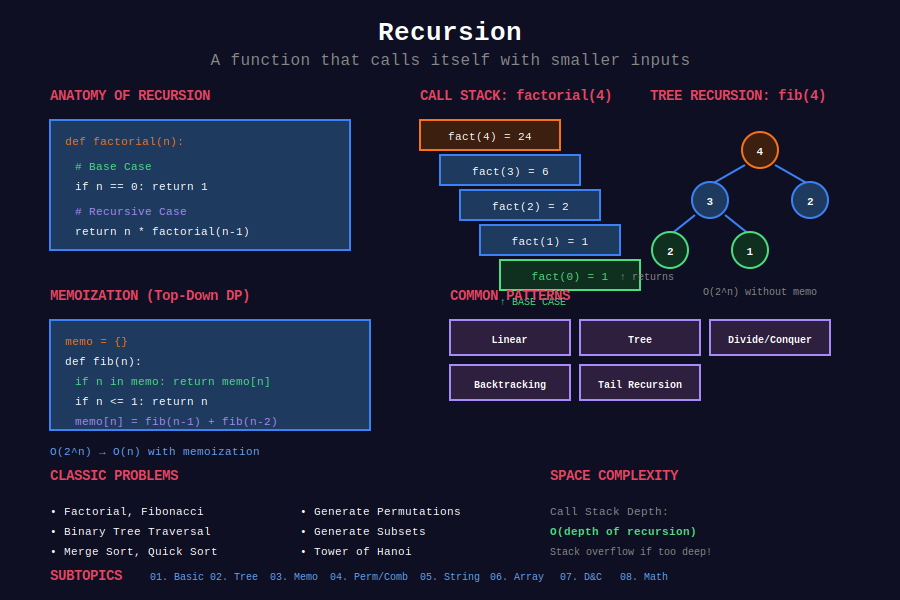

<div align="center">

# 🔄 Recursion



<p>
  
  
  
</p>

**Solving problems by breaking them into smaller subproblems**

[⬅️ Previous: Searching](../15_searching/README.md) | [🏠 Home](../README.md) | [Next: Backtracking ➡️](../17_backtracking/README.md)

</div>

---

## 📊 Visual Overview

<p align="center">
  
</p>

---

## 📐 Mathematical Foundation

### 1️⃣ Recursion Definition

A function that calls itself with a smaller input:

```math
f(n) = g(f(n-1), n)
```

**Requirements:**
1. **Base case:** Termination condition
2. **Recursive case:** Problem reduction
3. **Progress:** Each call moves toward base case

---

### 2️⃣ Recurrence Relations

| Problem | Recurrence | Solution |
|---------|------------|----------|
| Factorial | $f(n) = n \cdot f(n-1)$ | O(n) |
| Fibonacci | $f(n) = f(n-1) + f(n-2)$ | O(2ⁿ) naive, O(n) memo |
| Binary Search | $T(n) = T(n/2) + O(1)$ | O(log n) |
| Merge Sort | $T(n) = 2T(n/2) + O(n)$ | O(n log n) |

---

### 3️⃣ Master Theorem

For recurrence $T(n) = aT(n/b) + f(n)$:

| Case | Condition | Result |
|------|-----------|--------|
| 1 | $f(n) = O(n^{\log\_b a - \epsilon})$ | $T(n) = \Theta(n^{\log\_b a})$ |
| 2 | $f(n) = \Theta(n^{\log\_b a})$ | $T(n) = \Theta(n^{\log\_b a} \log n)$ |
| 3 | $f(n) = \Omega(n^{\log\_b a + \epsilon})$ | $T(n) = \Theta(f(n))$ |

---

### 4️⃣ Stack Space

**Recursive depth:** Maximum number of active frames.

```math
\text{Space} = O(\text{depth} \times \text{frame size})
```

**Tail recursion:** Can be optimized to O(1) space (in some languages).

---

### 5️⃣ Tree Recursion

When function calls itself multiple times:

```math
T(n) = T(n-1) + T(n-2) + \ldots
```

**Example:** Fibonacci without memoization → O(2ⁿ)

---

## 📂 Subtopics Navigation

### Core Recursion Concepts

| # | Topic | Description | Problems | Link |
|:-:|-------|-------------|:--------:|------|
| 1 | **Basic Recursion** | Factorial, tail recursion, call stack | 8+ | [📖 Go →](./01_basic_recursion/README.md) |
| 2 | **Tree Recursion** | Fibonacci, exponential growth | 6+ | [📖 Go →](./02_tree_recursion/README.md) |
| 3 | **Memoization** | Top-down DP, caching | 8+ | [📖 Go →](./03_memoization/README.md) |
| 4 | **Permutations & Combinations** | Generate all possibilities | 10+ | [📖 Go →](./04_permutation_combination/README.md) |

### Recursion by Data Type

| # | Topic | Description | Problems | Link |
|:-:|-------|-------------|:--------:|------|
| 5 | **String Recursion** | Reverse, decode, palindrome | 12+ | [📖 Go →](./05_string_recursion/README.md) |
| 6 | **Array Recursion** | Sum, search, reverse, max/min | 15+ | [📖 Go →](./06_array_recursion/README.md) |
| 7 | **Divide & Conquer** | Merge sort, quick sort, binary search | 12+ | [📖 Go →](./07_divide_conquer/README.md) |
| 8 | **Mathematical Recursion** | GCD, power, digit operations | 15+ | [📖 Go →](./08_mathematical_recursion/README.md) |
| 9 | **Linked List Recursion** | Reverse, merge, operations | 10+ | [📖 Go →](./09_linked_list_recursion/README.md) |

### Advanced Patterns

| # | Topic | Description | Problems | Link |
|:-:|-------|-------------|:--------:|------|
| 10 | **Advanced Recursion** | Mutual, nested, indirect, generative | 10+ | [📖 Go →](./10_advanced_recursion/README.md) |
| 11 | **Parser Recursion** | Expression parsing, grammars, decode string | 15+ | [📖 Go →](./11_parser_recursion/README.md) |

---

## 🎯 Recursion Types Overview

```
                           RECURSION TYPES
                                 |
        +------------------------+------------------------+
        |                        |                        |
   +----▼----+            +------▼------+           +-----▼-----+
   | LINEAR  |            |    TREE     |           | ADVANCED  |
   +----+----+            +------+------+           +-----+-----+
        |                        |                        |
   +----▼------------+    +------▼----------+      +------▼----------+
   | • Factorial     |    | • Fibonacci     |      | • Mutual        |
   | • String ops    |    | • Subset sum    |      | • Nested        |
   | • Linked list   |    | • Permutations  |      | • Indirect      |
   | • Tail recursion|    | • Combinations  |      | • Generative    |
   +-----------------+    +-----------------+      +-----------------+
```

---

## 🎯 Key Patterns

### Linear Recursion

```python
def factorial(n: int) -> int:
    """
    Calculate n!
    
    Recurrence: f(n) = n × f(n-1)
    Base case: f(0) = 1
    
    Time: O(n), Space: O(n)
    """
    if n <= 1:
        return 1
    return n * factorial(n - 1)

def sumArray(arr: list[int], i: int = 0) -> int:
    """
    Sum array elements recursively.
    
    Time: O(n), Space: O(n)
    """
    if i == len(arr):
        return 0
    return arr[i] + sumArray(arr, i + 1)
```

### Tail Recursion

```python
def factorialTail(n: int, acc: int = 1) -> int:
    """
    Tail-recursive factorial.
    
    Accumulator carries result.
    Can be optimized to O(1) space.
    """
    if n <= 1:
        return acc
    return factorialTail(n - 1, n * acc)
```

### String Recursion

```python
def decodeString(s: str) -> str:
    """
    Decode String (LeetCode 394).
    
    "3[a2[c]]" → "accaccacc"
    """
    def decode(index: int) -> tuple:
        result, num = "", 0
        
        while index < len(s):
            char = s[index]
            
            if char.isdigit():
                num = num * 10 + int(char)
            elif char == '[':
                decoded, index = decode(index + 1)
                result += num * decoded
                num = 0
            elif char == ']':
                return result, index
            else:
                result += char
            
            index += 1
        
        return result, index
    
    return decode(0)[0]
```

### Divide and Conquer

```python
def power(x: float, n: int) -> float:
    """
    Calculate x^n using fast exponentiation.
    
    Recurrence: x^n = (x^(n/2))² × x^(n%2)
    
    Time: O(log n), Space: O(log n)
    """
    if n == 0:
        return 1
    if n < 0:
        return 1 / power(x, -n)
    
    half = power(x, n // 2)
    if n % 2 == 0:
        return half * half
    return half * half * x
```

---

## 🏆 LeetCode Problems

### 🟢 Easy

| # | Problem | Pattern | Time | Space |
|:-:|---------|---------|:----:|:-----:|
| 21 | [Merge Two Sorted Lists](https://leetcode.com/problems/merge-two-sorted-lists/) | Linear | O(n+m) | O(n+m) |
| 206 | [Reverse Linked List](https://leetcode.com/problems/reverse-linked-list/) | Linear | O(n) | O(n) |
| 231 | [Power of Two](https://leetcode.com/problems/power-of-two/) | Divide | O(log n) | O(log n) |
| 344 | [Reverse String](https://leetcode.com/problems/reverse-string/) | Two-Ptr | O(n) | O(n) |
| 509 | [Fibonacci Number](https://leetcode.com/problems/fibonacci-number/) | Tree/Memo | O(n) | O(n) |
| 700 | [Search in a BST](https://leetcode.com/problems/search-in-a-binary-search-tree/) | Binary | O(h) | O(h) |
| 704 | [Binary Search](https://leetcode.com/problems/binary-search/) | Divide | O(log n) | O(log n) |

### 🟡 Medium

| # | Problem | Pattern | Time | Space |
|:-:|---------|---------|:----:|:-----:|
| 22 | [Generate Parentheses](https://leetcode.com/problems/generate-parentheses/) | String | O(4ⁿ/√n) | O(n) |
| 24 | [Swap Nodes in Pairs](https://leetcode.com/problems/swap-nodes-in-pairs/) | Linear | O(n) | O(n) |
| 50 | [Pow(x, n)](https://leetcode.com/problems/powx-n/) | Divide | O(log n) | O(log n) |
| 148 | [Sort List](https://leetcode.com/problems/sort-list/) | Merge Sort | O(n log n) | O(log n) |
| 215 | [Kth Largest Element](https://leetcode.com/problems/kth-largest-element-in-an-array/) | Quick Select | O(n) | O(log n) |
| 394 | [Decode String](https://leetcode.com/problems/decode-string/) | Nested | O(n×k) | O(n) |
| 779 | [K-th Symbol in Grammar](https://leetcode.com/problems/k-th-symbol-in-grammar/) | Divide | O(n) | O(n) |
| 894 | [All Possible Full Binary Trees](https://leetcode.com/problems/all-possible-full-binary-trees/) | Tree | O(2ⁿ) | O(2ⁿ) |

### 🔴 Hard

| # | Problem | Pattern | Time | Space |
|:-:|---------|---------|:----:|:-----:|
| 4 | [Median of Two Sorted](https://leetcode.com/problems/median-of-two-sorted-arrays/) | Binary Search | O(log min(m,n)) | O(1) |
| 25 | [Reverse Nodes in k-Group](https://leetcode.com/problems/reverse-nodes-in-k-group/) | Linear | O(n) | O(n/k) |
| 224 | [Basic Calculator](https://leetcode.com/problems/basic-calculator/) | Mutual | O(n) | O(n) |
| 273 | [Integer to English Words](https://leetcode.com/problems/integer-to-english-words/) | Divide | O(1) | O(1) |
| 315 | [Count Smaller](https://leetcode.com/problems/count-of-smaller-numbers-after-self/) | Merge Sort | O(n log n) | O(n) |

---

## 📊 Recursion Pattern Decision

```
Recursion Problem
       |
       +-- Single subproblem → Linear recursion O(n)
       |   +-- Examples: factorial, linked list ops
       |
       +-- Two subproblems (same size) → Divide & Conquer
       |   +-- Examples: merge sort, binary search
       |
       +-- Multiple overlapping subproblems → Add memoization
       |   +-- Examples: Fibonacci, coin change
       |
       +-- Process string char by char → String recursion
       |   +-- Examples: reverse, decode, palindrome
       |
       +-- Explore all possibilities → Backtracking
       |   +-- Examples: permutations, subsets
       |
       +-- Functions call each other → Mutual recursion
       |   +-- Examples: parser, state machine
       |
       +-- Deep recursion → Consider iterative + stack
```

---

## 📈 Recursion vs Iteration

| Aspect | Recursion | Iteration |
|--------|-----------|-----------|
| Readability | Often cleaner | Can be verbose |
| Space | O(depth) stack | O(1) possible |
| Performance | Function call overhead | Generally faster |
| Stack overflow | Risk with deep recursion | No risk |
| When to use | Tree structures, divide & conquer | Simple loops |

---

## 📚 References

| Resource | Link |
|----------|------|
| **Recursion** | [Wikipedia](https://en.wikipedia.org/wiki/Recursion_(computer_science)) |
| **Master Theorem** | [Wikipedia](https://en.wikipedia.org/wiki/Master_theorem_(analysis_of_algorithms)) |
| **Tail Recursion** | [Wikipedia](https://en.wikipedia.org/wiki/Tail_call) |
| **Divide and Conquer** | [Wikipedia](https://en.wikipedia.org/wiki/Divide-and-conquer_algorithm) |

---

<div align="center">

**Made with ❤️ by [Gaurav Goswami](https://github.com/Gaurav14cs17)**

[⬅️ Previous: Searching](../15_searching/README.md) | [🏠 Home](../README.md) | [Next: Backtracking ➡️](../17_backtracking/README.md)

</div>
