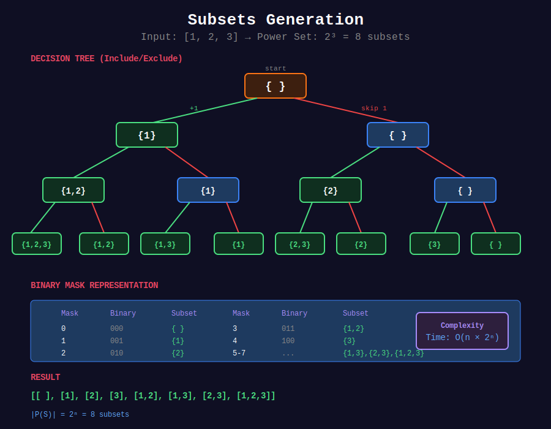

<div align="center">

# 📦 Subsets



<p>
  
  
</p>

</div>

---

## 🧭 Navigation

| ⬅️ Previous | 📂 Current | ➡️ Next |
|:------------|:----------:|--------:|
| [🏠 Backtracking Home](../README.md) | **01. Subsets** | [02. Permutations →](../02_permutations/README.md) |

---

## 📐 Mathematical Foundations

### 1️⃣ Power Set

Set of all subsets of $S$:

```math
|P(S)| = 2^n

```

Each element has 2 choices: include or exclude.

---

### 2️⃣ Binary Representation

Subset can be represented as $n$-bit binary number:

```math
\text{bit } i = 1 \Leftrightarrow \text{element } i \text{ included}

```

---

### 3️⃣ Subsets with Duplicates

Sort first, skip consecutive duplicates at same level.

---

## 💻 Code Implementations

```python
def subsets(nums: list[int]) -> list[list[int]]:
    """
    Subsets (LeetCode 78).
    
    Generate all 2^n subsets.
    
    Time: O(n × 2ⁿ), Space: O(n)
    """
    result = []
    
    def backtrack(start, current):
        result.append(current[:])
        
        for i in range(start, len(nums)):
            current.append(nums[i])
            backtrack(i + 1, current)
            current.pop()
    
    backtrack(0, [])
    return result

def subsetsWithDup(nums: list[int]) -> list[list[int]]:
    """
    Subsets II (LeetCode 90).
    
    Handle duplicates by skipping at same level.
    
    Time: O(n × 2ⁿ), Space: O(n)
    """
    result = []
    nums.sort()
    
    def backtrack(start, current):
        result.append(current[:])
        
        for i in range(start, len(nums)):
            # Skip duplicates at same level
            if i > start and nums[i] == nums[i - 1]:
                continue
            
            current.append(nums[i])
            backtrack(i + 1, current)
            current.pop()
    
    backtrack(0, [])
    return result

def subsetsBitmask(nums: list[int]) -> list[list[int]]:
    """
    Subsets using bitmask.
    
    Each number from 0 to 2^n-1 represents a subset.
    
    Time: O(n × 2ⁿ), Space: O(n)
    """
    n = len(nums)
    result = []
    
    for mask in range(1 << n):  # 0 to 2^n - 1
        subset = []
        for i in range(n):
            if mask & (1 << i):
                subset.append(nums[i])
        result.append(subset)
    
    return result

def findSubsequences(nums: list[int]) -> list[list[int]]:
    """
    Non-decreasing Subsequences (LeetCode 491).
    
    Find all non-decreasing subsequences of length >= 2.
    
    Time: O(n × 2ⁿ), Space: O(n)
    """
    result = []
    
    def backtrack(start, current):
        if len(current) >= 2:
            result.append(current[:])
        
        seen = set()  # Avoid duplicates at same level
        for i in range(start, len(nums)):
            if nums[i] in seen:
                continue
            if current and nums[i] < current[-1]:
                continue
            
            seen.add(nums[i])
            current.append(nums[i])
            backtrack(i + 1, current)
            current.pop()
    
    backtrack(0, [])
    return result

```

---

## 🏆 LeetCode Problems

### 🟡 Medium

| # | Problem | Pattern | Time | Space |
|:-:|---------|---------|:----:|:-----:|
| 78 | [Subsets](https://leetcode.com/problems/subsets/) | Basic | O(n×2ⁿ) | O(n) |
| 90 | [Subsets II](https://leetcode.com/problems/subsets-ii/) | Skip Dups | O(n×2ⁿ) | O(n) |
| 491 | [Non-decreasing Subsequences](https://leetcode.com/problems/non-decreasing-subsequences/) | Constrained | O(n×2ⁿ) | O(n) |

---

## 📚 References

| Resource | Link |
|----------|------|
| **Power Set** | [Wikipedia](https://en.wikipedia.org/wiki/Power_set) |

---

<div align="center">

**Made with ❤️ by [Gaurav Goswami](https://github.com/Gaurav14cs17)**

</div>

---

## 🧭 Navigation

| ⬅️ Previous | 📂 Current | ➡️ Next |
|:------------|:----------:|--------:|
| [🏠 Backtracking Home](../README.md) | **01. Subsets** | [02. Permutations →](../02_permutations/README.md) |
