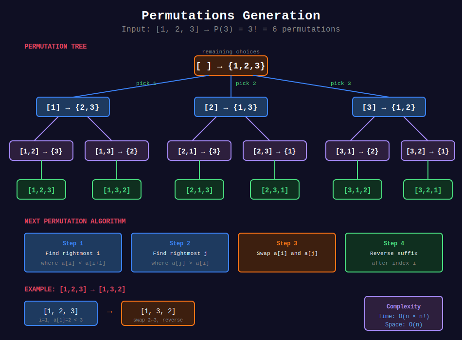

<div align="center">

# 🔀 Permutations



<p>
  
  
</p>

</div>

---

## 🧭 Navigation

| ⬅️ Previous | 📂 Current | ➡️ Next |
|:------------|:----------:|--------:|
| [← 01. Subsets](../01_subsets/README.md) | **02. Permutations** | [03. Combinations →](../03_combinations/README.md) |

---

## 📐 Mathematical Foundations

### 1️⃣ Permutation Count

```math
P(n) = n!
P(n, k) = \frac{n!}{(n-k)!}
```

---

### 2️⃣ With Duplicates

If elements repeat with frequencies $f\_1, f\_2, \ldots, f\_k$:

```math
\text{Permutations} = \frac{n!}{f_1! \times f_2! \times \ldots \times f_k!}
```

---

### 3️⃣ Next Permutation

Find next lexicographically greater permutation:
1. Find largest $i$ where $a[i] < a[i+1]$
2. Find largest $j$ where $a[j] > a[i]$
3. Swap $a[i]$ and $a[j]$
4. Reverse suffix after $i$

---

## 💻 Code Implementations

```python
def permute(nums: list[int]) -> list[list[int]]:
    """
    Permutations (LeetCode 46).
    
    Generate all n! permutations.
    
    Time: O(n × n!), Space: O(n)
    """
    result = []
    
    def backtrack(current, remaining):
        if not remaining:
            result.append(current[:])
            return
        
        for i in range(len(remaining)):
            current.append(remaining[i])
            backtrack(current, remaining[:i] + remaining[i+1:])
            current.pop()
    
    backtrack([], nums)
    return result

def permuteUnique(nums: list[int]) -> list[list[int]]:
    """
    Permutations II (LeetCode 47).
    
    Handle duplicates.
    
    Time: O(n × n!), Space: O(n)
    """
    result = []
    nums.sort()
    used = [False] * len(nums)
    
    def backtrack(current):
        if len(current) == len(nums):
            result.append(current[:])
            return
        
        for i in range(len(nums)):
            if used[i]:
                continue
            # Skip duplicates: only use first of consecutive equals
            if i > 0 and nums[i] == nums[i-1] and not used[i-1]:
                continue
            
            used[i] = True
            current.append(nums[i])
            backtrack(current)
            current.pop()
            used[i] = False
    
    backtrack([])
    return result

def nextPermutation(nums: list[int]) -> None:
    """
    Next Permutation (LeetCode 31).
    
    Time: O(n), Space: O(1)
    """
    n = len(nums)
    
    # Step 1: Find first decreasing element from right
    i = n - 2
    while i >= 0 and nums[i] >= nums[i + 1]:
        i -= 1
    
    if i >= 0:
        # Step 2: Find element just larger than nums[i]
        j = n - 1
        while nums[j] <= nums[i]:
            j -= 1
        # Step 3: Swap
        nums[i], nums[j] = nums[j], nums[i]
    
    # Step 4: Reverse suffix
    left, right = i + 1, n - 1
    while left < right:
        nums[left], nums[right] = nums[right], nums[left]
        left += 1
        right -= 1

def getPermutation(n: int, k: int) -> str:
    """
    Permutation Sequence (LeetCode 60).
    
    Get kth permutation directly using factorial.
    
    Time: O(n²), Space: O(n)
    """
    import math
    
    numbers = list(range(1, n + 1))
    result = []
    k -= 1  # 0-indexed
    
    for i in range(n, 0, -1):
        factorial = math.factorial(i - 1)
        idx = k // factorial
        result.append(str(numbers[idx]))
        numbers.pop(idx)
        k %= factorial
    
    return ''.join(result)
```

---

## 🏆 LeetCode Problems

### 🟡 Medium

| # | Problem | Pattern | Time | Space |
|:-:|---------|---------|:----:|:-----:|
| 31 | [Next Permutation](https://leetcode.com/problems/next-permutation/) | In-place | O(n) | O(1) |
| 46 | [Permutations](https://leetcode.com/problems/permutations/) | Basic | O(n×n!) | O(n) |
| 47 | [Permutations II](https://leetcode.com/problems/permutations-ii/) | Skip Dups | O(n×n!) | O(n) |
| 60 | [Permutation Sequence](https://leetcode.com/problems/permutation-sequence/) | Factorial | O(n²) | O(n) |
| 567 | [Permutation in String](https://leetcode.com/problems/permutation-in-string/) | Sliding Window | O(n) | O(1) |

---

## 📚 References

| Resource | Link |
|----------|------|
| **Permutation** | [Wikipedia](https://en.wikipedia.org/wiki/Permutation) |

---

<div align="center">

**Made with ❤️ by [Gaurav Goswami](https://github.com/Gaurav14cs17)**

</div>

---

## 🧭 Navigation

| ⬅️ Previous | 📂 Current | ➡️ Next |
|:------------|:----------:|--------:|
| [← 01. Subsets](../01_subsets/README.md) | **02. Permutations** | [03. Combinations →](../03_combinations/README.md) |
