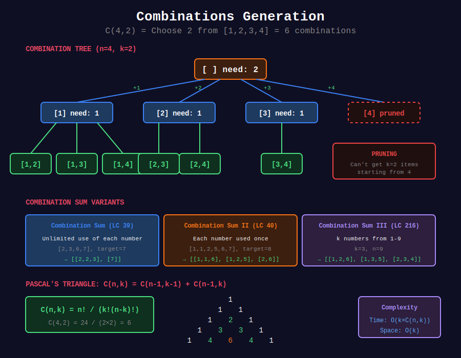

<div align="center">

# 🎯 Combinations



<p>
  
  
</p>

</div>

---

## 🧭 Navigation

| ⬅️ Previous | 📂 Current | ➡️ Next |
|:------------|:----------:|--------:|
| [← 02. Permutations](../02_permutations/README.md) | **03. Combinations** | [04. Grid Backtracking →](../04_grid_backtracking/README.md) |

---

## 📐 Mathematical Foundations

### 1️⃣ Combination Formula

```math
C(n, k) = \binom{n}{k} = \frac{n!}{k!(n-k)!}
```

---

### 2️⃣ Pascal's Triangle

```math
C(n, k) = C(n-1, k-1) + C(n-1, k)
```

---

### 3️⃣ Properties

```math
C(n, k) = C(n, n-k)
\sum_{k=0}^{n} C(n, k) = 2^n
```

---

## 💻 Code Implementations

```python
def combine(n: int, k: int) -> list[list[int]]:
    """
    Combinations (LeetCode 77).
    
    All ways to choose k from [1, n].
    
    Time: O(k × C(n,k)), Space: O(k)
    """
    result = []
    
    def backtrack(start, current):
        if len(current) == k:
            result.append(current[:])
            return
        
        # Pruning: need k - len(current) more elements
        need = k - len(current)
        for i in range(start, n - need + 2):
            current.append(i)
            backtrack(i + 1, current)
            current.pop()
    
    backtrack(1, [])
    return result

def combinationSum(candidates: list[int], target: int) -> list[list[int]]:
    """
    Combination Sum (LeetCode 39).
    
    Each number can be used unlimited times.
    
    Time: O(n^target), Space: O(target)
    """
    result = []
    
    def backtrack(start, current, remaining):
        if remaining == 0:
            result.append(current[:])
            return
        if remaining < 0:
            return
        
        for i in range(start, len(candidates)):
            current.append(candidates[i])
            backtrack(i, current, remaining - candidates[i])  # i, not i+1
            current.pop()
    
    backtrack(0, [], target)
    return result

def combinationSum2(candidates: list[int], target: int) -> list[list[int]]:
    """
    Combination Sum II (LeetCode 40).
    
    Each number used at most once. Handle duplicates.
    
    Time: O(2^n), Space: O(n)
    """
    result = []
    candidates.sort()
    
    def backtrack(start, current, remaining):
        if remaining == 0:
            result.append(current[:])
            return
        if remaining < 0:
            return
        
        for i in range(start, len(candidates)):

            # Skip duplicates at same level
            if i > start and candidates[i] == candidates[i - 1]:
                continue
            
            current.append(candidates[i])
            backtrack(i + 1, current, remaining - candidates[i])
            current.pop()
    
    backtrack(0, [], target)
    return result

def combinationSum3(k: int, n: int) -> list[list[int]]:
    """
    Combination Sum III (LeetCode 216).
    
    K numbers from [1-9] that sum to n.
    
    Time: O(C(9,k)), Space: O(k)
    """
    result = []
    
    def backtrack(start, current, remaining):
        if len(current) == k:
            if remaining == 0:
                result.append(current[:])
            return
        
        for i in range(start, 10):
            if i > remaining:
                break
            
            current.append(i)
            backtrack(i + 1, current, remaining - i)
            current.pop()
    
    backtrack(1, [], n)
    return result

def letterCombinations(digits: str) -> list[str]:
    """
    Letter Combinations of Phone Number (LeetCode 17).
    
    Time: O(4^n), Space: O(n)
    """
    if not digits:
        return []
    
    phone = {
        '2': 'abc', '3': 'def', '4': 'ghi', '5': 'jkl',
        '6': 'mno', '7': 'pqrs', '8': 'tuv', '9': 'wxyz'
    }
    
    result = []
    
    def backtrack(idx, current):
        if idx == len(digits):
            result.append(''.join(current))
            return
        
        for char in phone[digits[idx]]:
            current.append(char)
            backtrack(idx + 1, current)
            current.pop()
    
    backtrack(0, [])
    return result
```

---

## 🏆 LeetCode Problems

### 🟡 Medium

| # | Problem | Pattern | Time | Space |
|:-:|---------|---------|:----:|:-----:|
| 17 | [Letter Combinations](https://leetcode.com/problems/letter-combinations-of-a-phone-number/) | Cartesian | O(4ⁿ) | O(n) |
| 39 | [Combination Sum](https://leetcode.com/problems/combination-sum/) | Unlimited | O(nⁿ) | O(t) |
| 40 | [Combination Sum II](https://leetcode.com/problems/combination-sum-ii/) | Once + Dups | O(2ⁿ) | O(n) |
| 77 | [Combinations](https://leetcode.com/problems/combinations/) | Basic | O(C(n,k)) | O(k) |
| 216 | [Combination Sum III](https://leetcode.com/problems/combination-sum-iii/) | Fixed Size | O(C(9,k)) | O(k) |

---

## 📚 References

| Resource | Link |
|----------|------|
| **Combination** | [Wikipedia](https://en.wikipedia.org/wiki/Combination) |

---

<div align="center">

**Made with ❤️ by [Gaurav Goswami](https://github.com/Gaurav14cs17)**

</div>

---

## 🧭 Navigation

| ⬅️ Previous | 📂 Current | ➡️ Next |
|:------------|:----------:|--------:|
| [← 02. Permutations](../02_permutations/README.md) | **03. Combinations** | [04. Grid Backtracking →](../04_grid_backtracking/README.md) |
