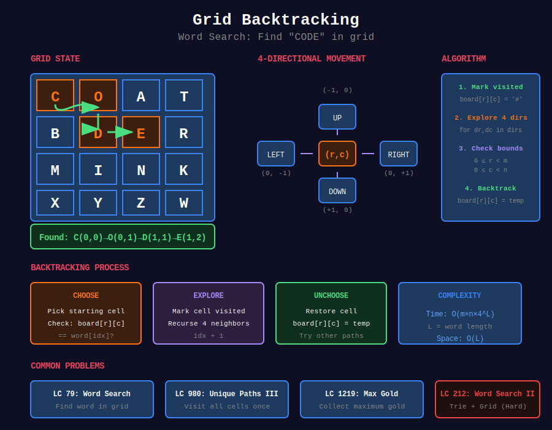

<div align="center">

# 🗺️ Grid Backtracking



<p>
  
  
</p>

</div>

---

## 🧭 Navigation

| ⬅️ Previous | 📂 Current | ➡️ Next |
|:------------|:----------:|--------:|
| [← 03. Combinations](../03_combinations/README.md) | **04. Grid Backtracking** | [05. Constraint Satisfaction →](../05_constraint_satisfaction/README.md) |

---

## 📐 Mathematical Foundations

### 1️⃣ Grid Exploration

4-directional movement:

```math
\text{directions} = [(0,1), (0,-1), (1,0), (-1,0)]

```

8-directional adds diagonals.

---

### 2️⃣ Path Complexity

Worst case for path of length $L$:

```math
T = O(4^L)

```

With pruning, typically much better.

---

### 3️⃣ Visited Tracking

Mark cells to avoid cycles:

```python
board[r][c] = '#'  # Mark
# ... explore ...
board[r][c] = original  # Restore

```

---

## 💻 Code Implementations

```python
def exist(board: list[list[str]], word: str) -> bool:
    """
    Word Search (LeetCode 79).
    
    Find word in grid using adjacent cells.
    
    Time: O(m×n×4^L), Space: O(L)
    """
    m, n = len(board), len(board[0])
    
    def backtrack(r, c, idx):
        if idx == len(word):
            return True
        
        if (r < 0 or r >= m or c < 0 or c >= n or
            board[r][c] != word[idx]):
            return False
        
        # Mark visited
        temp = board[r][c]
        board[r][c] = '#'
        
        # Explore 4 directions
        found = (backtrack(r + 1, c, idx + 1) or
                 backtrack(r - 1, c, idx + 1) or
                 backtrack(r, c + 1, idx + 1) or
                 backtrack(r, c - 1, idx + 1))
        
        # Restore
        board[r][c] = temp
        return found
    
    for i in range(m):
        for j in range(n):
            if backtrack(i, j, 0):
                return True
    return False

def uniquePathsIII(grid: list[list[int]]) -> int:
    """
    Unique Paths III (LeetCode 980).
    
    Walk through every non-obstacle cell exactly once.
    
    Time: O(4^(m×n)), Space: O(m×n)
    """
    m, n = len(grid), len(grid[0])
    start_r, start_c = 0, 0
    empty_count = 1  # Include start
    
    for r in range(m):
        for c in range(n):
            if grid[r][c] == 1:
                start_r, start_c = r, c
            elif grid[r][c] == 0:
                empty_count += 1
    
    def backtrack(r, c, remaining):
        if grid[r][c] == 2:
            return 1 if remaining == 0 else 0
        
        count = 0
        temp = grid[r][c]
        grid[r][c] = -2  # Mark visited
        
        for dr, dc in [(0, 1), (0, -1), (1, 0), (-1, 0)]:
            nr, nc = r + dr, c + dc
            if (0 <= nr < m and 0 <= nc < n and 
                grid[nr][nc] != -1 and grid[nr][nc] != -2):
                count += backtrack(nr, nc, remaining - 1)
        
        grid[r][c] = temp
        return count
    
    return backtrack(start_r, start_c, empty_count)

def longestIncreasingPath(matrix: list[list[int]]) -> int:
    """
    Longest Increasing Path (LeetCode 329).
    
    DFS with memoization.
    
    Time: O(m×n), Space: O(m×n)
    """
    m, n = len(matrix), len(matrix[0])
    memo = {}
    
    def dfs(r, c):
        if (r, c) in memo:
            return memo[(r, c)]
        
        result = 1
        for dr, dc in [(0, 1), (0, -1), (1, 0), (-1, 0)]:
            nr, nc = r + dr, c + dc
            if (0 <= nr < m and 0 <= nc < n and 
                matrix[nr][nc] > matrix[r][c]):
                result = max(result, 1 + dfs(nr, nc))
        
        memo[(r, c)] = result
        return result
    
    return max(dfs(r, c) for r in range(m) for c in range(n))

def getMaximumGold(grid: list[list[int]]) -> int:
    """
    Path with Maximum Gold (LeetCode 1219).
    
    Collect maximum gold, can't visit same cell twice.
    
    Time: O(4^(m×n)), Space: O(m×n)
    """
    m, n = len(grid), len(grid[0])
    
    def backtrack(r, c):
        if (r < 0 or r >= m or c < 0 or c >= n or grid[r][c] == 0):
            return 0
        
        gold = grid[r][c]
        grid[r][c] = 0  # Mark visited
        
        max_gold = 0
        for dr, dc in [(0, 1), (0, -1), (1, 0), (-1, 0)]:
            max_gold = max(max_gold, backtrack(r + dr, c + dc))
        
        grid[r][c] = gold  # Restore
        return gold + max_gold
    
    return max(backtrack(r, c) 
               for r in range(m) for c in range(n) 
               if grid[r][c] > 0)

```

---

## 🏆 LeetCode Problems

### 🟡 Medium

| # | Problem | Pattern | Time | Space |
|:-:|---------|---------|:----:|:-----:|
| 79 | [Word Search](https://leetcode.com/problems/word-search/) | Path Match | O(mn×4^L) | O(L) |
| 329 | [Longest Increasing Path](https://leetcode.com/problems/longest-increasing-path-in-a-matrix/) | DFS+Memo | O(mn) | O(mn) |
| 980 | [Unique Paths III](https://leetcode.com/problems/unique-paths-iii/) | Hamilton | O(4^mn) | O(mn) |
| 1219 | [Path with Maximum Gold](https://leetcode.com/problems/path-with-maximum-gold/) | Max Path | O(4^mn) | O(mn) |

### 🔴 Hard

| # | Problem | Pattern | Time | Space |
|:-:|---------|---------|:----:|:-----:|
| 212 | [Word Search II](https://leetcode.com/problems/word-search-ii/) | Trie + Grid | O(mn×4^L) | O(dict) |

---

## 📚 References

| Resource | Link |
|----------|------|
| **DFS on Grid** | [GeeksforGeeks](https://www.geeksforgeeks.org/depth-first-search-or-dfs-for-a-graph/) |

---

<div align="center">

**Made with ❤️ by [Gaurav Goswami](https://github.com/Gaurav14cs17)**

</div>

---

## 🧭 Navigation

| ⬅️ Previous | 📂 Current | ➡️ Next |
|:------------|:----------:|--------:|
| [← 03. Combinations](../03_combinations/README.md) | **04. Grid Backtracking** | [05. Constraint Satisfaction →](../05_constraint_satisfaction/README.md) |
