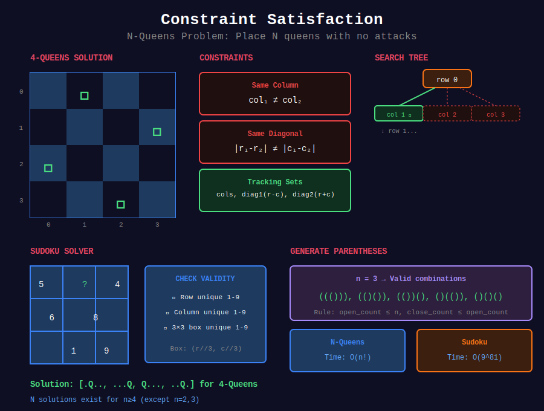

<div align="center">

# 🧩 Constraint Satisfaction



<p>
  
  
</p>

</div>

---

## 🧭 Navigation

| ⬅️ Previous | 📂 Current | ➡️ Next Topic |
|:------------|:----------:|--------:|
| [← 04. Grid Backtracking](../04_grid_backtracking/README.md) | **05. Constraint Satisfaction** | [🏠 Backtracking Home](../README.md) → [DP](../../18_dynamic_programming/README.md) |

---

## 📐 Mathematical Foundations

### 1️⃣ CSP Definition

**Constraint Satisfaction Problem:**
- Variables: $X\_1, X\_2, \ldots, X\_n$
- Domains: $D\_1, D\_2, \ldots, D\_n$
- Constraints: Relations between variables

---

### 2️⃣ N-Queens Constraints

For queens at positions $(r\_1, c\_1)$ and $(r\_2, c\_2)$:

```math
c_1 \neq c_2 \quad \text{(same column)}
|r_1 - r_2| \neq |c_1 - c_2| \quad \text{(same diagonal)}

```

---

### 3️⃣ Sudoku Constraints

Each row, column, and 3×3 box contains digits 1-9 exactly once.

---

### 4️⃣ Pruning Efficiency

Good constraint checking eliminates branches early:

```math
\text{Pruned complexity} \ll \text{Naive complexity}

```

---

## 💻 Code Implementations

```python
def solveNQueens(n: int) -> list[list[str]]:
    """
    N-Queens (LeetCode 51).
    
    Place n queens on n×n board with no attacks.
    
    Time: O(n!), Space: O(n)
    """
    result = []
    cols = set()
    diag1 = set()  # r - c
    diag2 = set()  # r + c
    
    def backtrack(row, board):
        if row == n:
            result.append([''.join(r) for r in board])
            return
        
        for col in range(n):
            if col in cols or (row - col) in diag1 or (row + col) in diag2:
                continue
            
            # Place queen
            cols.add(col)
            diag1.add(row - col)
            diag2.add(row + col)
            board[row][col] = 'Q'
            
            backtrack(row + 1, board)
            
            # Remove queen
            cols.remove(col)
            diag1.remove(row - col)
            diag2.remove(row + col)
            board[row][col] = '.'
    
    board = [['.' for _ in range(n)] for _ in range(n)]
    backtrack(0, board)
    return result

def solveSudoku(board: list[list[str]]) -> None:
    """
    Sudoku Solver (LeetCode 37).
    
    Fill 9×9 board with valid sudoku solution.
    
    Time: O(9^81), Space: O(1)
    """
    def is_valid(row, col, num):
        # Check row
        if num in board[row]:
            return False
        
        # Check column
        for r in range(9):
            if board[r][col] == num:
                return False
        
        # Check 3×3 box
        box_r, box_c = 3 * (row // 3), 3 * (col // 3)
        for r in range(box_r, box_r + 3):
            for c in range(box_c, box_c + 3):
                if board[r][c] == num:
                    return False
        
        return True
    
    def solve():
        for r in range(9):
            for c in range(9):
                if board[r][c] == '.':
                    for num in '123456789':
                        if is_valid(r, c, num):
                            board[r][c] = num
                            if solve():
                                return True
                            board[r][c] = '.'
                    return False
        return True
    
    solve()

def generateParenthesis(n: int) -> list[str]:
    """
    Generate Parentheses (LeetCode 22).
    
    Generate all valid combinations of n pairs.
    
    Time: O(4^n / √n), Space: O(n)
    """
    result = []
    
    def backtrack(current, open_count, close_count):
        if len(current) == 2 * n:
            result.append(''.join(current))
            return
        
        # Can add '(' if we haven't used all
        if open_count < n:
            current.append('(')
            backtrack(current, open_count + 1, close_count)
            current.pop()
        
        # Can add ')' if it doesn't exceed '('
        if close_count < open_count:
            current.append(')')
            backtrack(current, open_count, close_count + 1)
            current.pop()
    
    backtrack([], 0, 0)
    return result

def partition(s: str) -> list[list[str]]:
    """
    Palindrome Partitioning (LeetCode 131).
    
    All ways to partition into palindromes.
    
    Time: O(n × 2^n), Space: O(n)
    """
    result = []
    
    def is_palindrome(start, end):
        while start < end:
            if s[start] != s[end]:
                return False
            start += 1
            end -= 1
        return True
    
    def backtrack(start, current):
        if start == len(s):
            result.append(current[:])
            return
        
        for end in range(start, len(s)):
            if is_palindrome(start, end):
                current.append(s[start:end + 1])
                backtrack(end + 1, current)
                current.pop()
    
    backtrack(0, [])
    return result

def canPartitionKSubsets(nums: list[int], k: int) -> bool:
    """
    Partition to K Equal Sum Subsets (LeetCode 698).
    
    Time: O(k × 2^n), Space: O(n)
    """
    total = sum(nums)
    if total % k != 0:
        return False
    
    target = total // k
    nums.sort(reverse=True)
    used = [False] * len(nums)
    
    def backtrack(groups, current_sum, start):
        if groups == 0:
            return True
        if current_sum == target:
            return backtrack(groups - 1, 0, 0)
        
        for i in range(start, len(nums)):
            if used[i] or current_sum + nums[i] > target:
                continue
            # Skip duplicates
            if i > 0 and nums[i] == nums[i-1] and not used[i-1]:
                continue
            
            used[i] = True
            if backtrack(groups, current_sum + nums[i], i + 1):
                return True
            used[i] = False
        
        return False
    
    return backtrack(k, 0, 0)

```

---

## 🏆 LeetCode Problems

### 🟡 Medium

| # | Problem | Pattern | Time | Space |
|:-:|---------|---------|:----:|:-----:|
| 22 | [Generate Parentheses](https://leetcode.com/problems/generate-parentheses/) | Valid Count | O(4ⁿ/√n) | O(n) |
| 131 | [Palindrome Partitioning](https://leetcode.com/problems/palindrome-partitioning/) | Partition | O(n×2ⁿ) | O(n) |
| 698 | [Partition to K Equal Sum](https://leetcode.com/problems/partition-to-k-equal-sum-subsets/) | K Buckets | O(k×2ⁿ) | O(n) |

### 🔴 Hard

| # | Problem | Pattern | Time | Space |
|:-:|---------|---------|:----:|:-----:|
| 37 | [Sudoku Solver](https://leetcode.com/problems/sudoku-solver/) | CSP | O(9^81) | O(1) |
| 51 | [N-Queens](https://leetcode.com/problems/n-queens/) | CSP | O(n!) | O(n) |
| 52 | [N-Queens II](https://leetcode.com/problems/n-queens-ii/) | CSP Count | O(n!) | O(n) |

---

## 📚 References

| Resource | Link |
|----------|------|
| **CSP** | [Wikipedia](https://en.wikipedia.org/wiki/Constraint_satisfaction_problem) |
| **N-Queens** | [Wikipedia](https://en.wikipedia.org/wiki/Eight_queens_puzzle) |

---

<div align="center">

**Made with ❤️ by [Gaurav Goswami](https://github.com/Gaurav14cs17)**

</div>

---

## 🧭 Navigation

| ⬅️ Previous | 📂 Current | ➡️ Next Topic |
|:------------|:----------:|--------:|
| [← 04. Grid Backtracking](../04_grid_backtracking/README.md) | **05. Constraint Satisfaction** | [🏠 Backtracking Home](../README.md) → [DP](../../18_dynamic_programming/README.md) |
