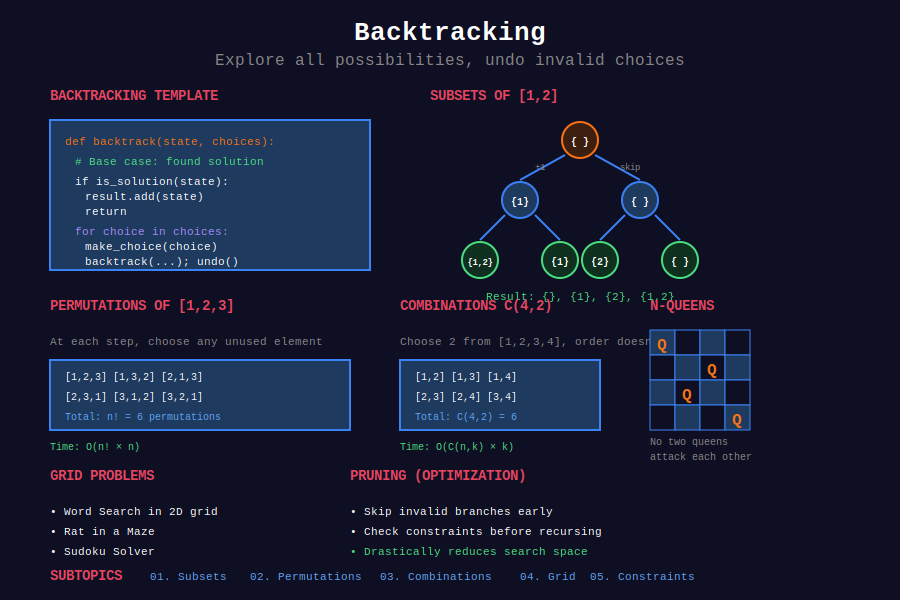

<div align="center">

# 🔙 Backtracking



<p>
  
  
  
</p>

**Explore all possibilities systematically, prune invalid paths**

[⬅️ Previous: Recursion](../16_recursion/README.md) | [🏠 Home](../README.md) | [Next: Dynamic Programming ➡️](../18_dynamic_programming/README.md)

</div>

---

## 📐 Mathematical Foundation

### 1️⃣ Backtracking Definition

**Systematic exploration** of solution space:

1. **Choose:** Make a decision
2. **Explore:** Recurse with that decision
3. **Unchoose:** Undo decision (backtrack)

---

### 2️⃣ Time Complexity

| Problem | Complexity | States |
|---------|:----------:|:------:|
| Subsets | O(2ⁿ) | Include/exclude each |
| Permutations | O(n!) | n choices, then n-1, ... |
| Combinations C(n,k) | O(C(n,k)) | Choose k from n |
| N-Queens | O(n!) | Pruned permutations |

---

### 3️⃣ Pruning

**Cut branches early** when constraint violated:

```math
\text{If state invalid} \Rightarrow \text{return immediately}

```

**Example:** N-Queens - don't continue if queens attack.

---

### 4️⃣ State Space Tree

```
                    []
         /     |     |     \
       [1]    [2]   [3]    [4]
      / | \   / \    |
   [1,2][1,3][1,4]...

```

Each path = one solution candidate.

---

### 5️⃣ Subset Formula

Number of subsets of set with $n$ elements:

```math
|P(S)| = 2^n

```

---

### 6️⃣ Permutation Formula

Number of permutations of $n$ elements:

```math
P(n) = n!

```

Permutations of $k$ elements from $n$:

```math
P(n, k) = \frac{n!}{(n-k)!}

```

---

### 7️⃣ Combination Formula

Number of ways to choose $k$ from $n$:

```math
C(n, k) = \binom{n}{k} = \frac{n!}{k!(n-k)!}

```

---

## 📂 Subtopics Navigation

| # | Topic | Problems | Link |
|:-:|-------|:--------:|------|
| 1 | Subsets | 6+ | [📖 Go →](./01_subsets/README.md) |
| 2 | Permutations | 6+ | [📖 Go →](./02_permutations/README.md) |
| 3 | Combinations | 6+ | [📖 Go →](./03_combinations/README.md) |
| 4 | Grid Backtracking | 6+ | [📖 Go →](./04_grid_backtracking/README.md) |
| 5 | Constraint Satisfaction | 6+ | [📖 Go →](./05_constraint_satisfaction/README.md) |

---

## 🎯 Key Patterns

### Backtracking Template

```python
def backtrack(state, choices):
    if is_solution(state):
        result.append(state.copy())
        return
    
    for choice in choices:
        if is_valid(choice, state):
            # Choose
            state.append(choice)
            
            # Explore
            backtrack(state, remaining_choices)
            
            # Unchoose (backtrack)
            state.pop()

```

### Subsets Pattern

```python
def subsets(nums: list[int]) -> list[list[int]]:
    """
    Generate all subsets (power set).
    
    Time: O(n × 2ⁿ), Space: O(n)
    """
    result = []
    
    def backtrack(start, current):
        result.append(current[:])
        
        for i in range(start, len(nums)):
            current.append(nums[i])
            backtrack(i + 1, current)
            current.pop()
    
    backtrack(0, [])
    return result

```

### Permutations Pattern

```python
def permute(nums: list[int]) -> list[list[int]]:
    """
    Generate all permutations.
    
    Time: O(n × n!), Space: O(n)
    """
    result = []
    
    def backtrack(current, remaining):
        if not remaining:
            result.append(current[:])
            return
        
        for i in range(len(remaining)):
            current.append(remaining[i])
            backtrack(current, remaining[:i] + remaining[i+1:])
            current.pop()
    
    backtrack([], nums)
    return result

```

---

## 🏆 LeetCode Problems

### 🟡 Medium

| # | Problem | Pattern | Time | Space |
|:-:|---------|---------|:----:|:-----:|
| 17 | [Letter Combinations of Phone](https://leetcode.com/problems/letter-combinations-of-a-phone-number/) | Combinations | O(4ⁿ) | O(n) |
| 22 | [Generate Parentheses](https://leetcode.com/problems/generate-parentheses/) | Pruned BT | O(4ⁿ/√n) | O(n) |
| 39 | [Combination Sum](https://leetcode.com/problems/combination-sum/) | Combinations | O(nⁿ) | O(target) |
| 40 | [Combination Sum II](https://leetcode.com/problems/combination-sum-ii/) | Combinations | O(2ⁿ) | O(n) |
| 46 | [Permutations](https://leetcode.com/problems/permutations/) | Permutations | O(n!) | O(n) |
| 47 | [Permutations II](https://leetcode.com/problems/permutations-ii/) | Permutations | O(n!) | O(n) |
| 77 | [Combinations](https://leetcode.com/problems/combinations/) | Combinations | O(C(n,k)) | O(k) |
| 78 | [Subsets](https://leetcode.com/problems/subsets/) | Subsets | O(2ⁿ) | O(n) |
| 79 | [Word Search](https://leetcode.com/problems/word-search/) | Grid BT | O(mn×4ⁿ) | O(n) |
| 90 | [Subsets II](https://leetcode.com/problems/subsets-ii/) | Subsets | O(2ⁿ) | O(n) |
| 93 | [Restore IP Addresses](https://leetcode.com/problems/restore-ip-addresses/) | Partitioning | O(1) | O(1) |
| 131 | [Palindrome Partitioning](https://leetcode.com/problems/palindrome-partitioning/) | Partitioning | O(n×2ⁿ) | O(n) |
| 216 | [Combination Sum III](https://leetcode.com/problems/combination-sum-iii/) | Combinations | O(C(9,k)) | O(k) |
| 698 | [Partition to K Equal Sum Subsets](https://leetcode.com/problems/partition-to-k-equal-sum-subsets/) | Constraint | O(k×2ⁿ) | O(n) |

### 🔴 Hard

| # | Problem | Pattern | Time | Space |
|:-:|---------|---------|:----:|:-----:|
| 37 | [Sudoku Solver](https://leetcode.com/problems/sudoku-solver/) | Constraint | O(9^81) | O(1) |
| 51 | [N-Queens](https://leetcode.com/problems/n-queens/) | Constraint | O(n!) | O(n) |
| 52 | [N-Queens II](https://leetcode.com/problems/n-queens-ii/) | Constraint | O(n!) | O(n) |
| 212 | [Word Search II](https://leetcode.com/problems/word-search-ii/) | Trie + Grid | O(mn×4ⁿ) | O(dict) |
| 301 | [Remove Invalid Parentheses](https://leetcode.com/problems/remove-invalid-parentheses/) | BFS/BT | O(2ⁿ) | O(n) |

---

## 📊 Backtracking Pattern Decision

```
Backtracking Problem
        |
        +-- All subsets → Include/exclude each element
        |
        +-- All permutations → Swap or use remaining
        |
        +-- Combinations of size k → Track count
        |
        +-- Grid path → 4-directional with visited
        |
        +-- Constraint satisfaction → Prune invalid states

```

---

## 📚 References

| Resource | Link |
|----------|------|
| **Backtracking** | [Wikipedia](https://en.wikipedia.org/wiki/Backtracking) |
| **N-Queens** | [Wikipedia](https://en.wikipedia.org/wiki/Eight_queens_puzzle) |
| **Constraint Satisfaction** | [Wikipedia](https://en.wikipedia.org/wiki/Constraint_satisfaction_problem) |

---

<div align="center">

**Made with ❤️ by [Gaurav Goswami](https://github.com/Gaurav14cs17)**

[⬅️ Previous: Recursion](../16_recursion/README.md) | [🏠 Home](../README.md) | [Next: Dynamic Programming ➡️](../18_dynamic_programming/README.md)

</div>
