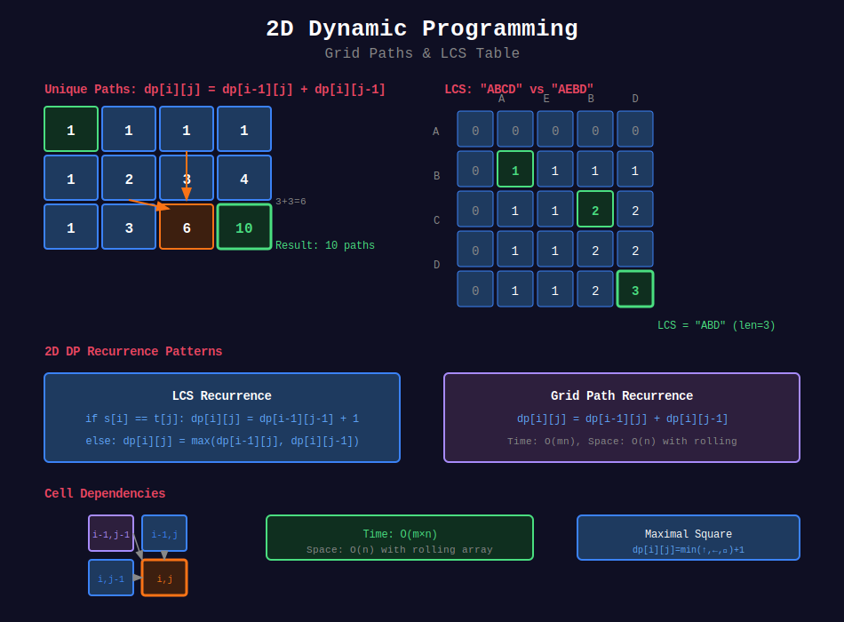

<div align="center">

# 📊 2D Dynamic Programming

<p>
  
  
</p>

</div>

---

## 🧭 Navigation

| ⬅️ Previous | 📂 Current | ➡️ Next |
|:------------|:----------:|--------:|
| [← 01. 1D DP](../01_1d_dp/README.md) | **02. 2D DP** | [03. Knapsack →](../03_knapsack/README.md) |

---

## 📊 Visual Guide

<div align="center">
  
</div>

---

## 📐 Mathematical Foundations

### 1️⃣ General Form

```math
dp[i][j] = f(dp[i-1][j], dp[i][j-1], dp[i-1][j-1], \ldots)

```

---

### 2️⃣ Grid DP

Path counting / min cost paths:

```math
dp[i][j] = dp[i-1][j] + dp[i][j-1]

```

---

### 3️⃣ LCS Recurrence

```math
dp[i][j] = \begin{cases}
dp[i-1][j-1] + 1 & \text{if } s[i] = t[j] \\
\max(dp[i-1][j], dp[i][j-1]) & \text{otherwise}
\end{cases}

```

---

## 💻 Code Implementations

```python
def uniquePaths(m: int, n: int) -> int:
    """
    Unique Paths (LeetCode 62).
    
    Count paths from top-left to bottom-right.
    
    Time: O(mn), Space: O(n)
    """
    dp = [1] * n
    for _ in range(1, m):
        for j in range(1, n):
            dp[j] += dp[j - 1]
    return dp[-1]

def minPathSum(grid: list[list[int]]) -> int:
    """
    Minimum Path Sum (LeetCode 64).
    
    Time: O(mn), Space: O(n)
    """
    m, n = len(grid), len(grid[0])
    dp = [float('inf')] * n
    dp[0] = 0
    
    for i in range(m):
        dp[0] += grid[i][0]
        for j in range(1, n):
            dp[j] = min(dp[j], dp[j - 1]) + grid[i][j]
    
    return dp[-1]

def longestCommonSubsequence(text1: str, text2: str) -> int:
    """
    LCS (LeetCode 1143).
    
    Time: O(mn), Space: O(mn)
    """
    m, n = len(text1), len(text2)
    dp = [[0] * (n + 1) for _ in range(m + 1)]
    
    for i in range(1, m + 1):
        for j in range(1, n + 1):
            if text1[i - 1] == text2[j - 1]:
                dp[i][j] = dp[i - 1][j - 1] + 1
            else:
                dp[i][j] = max(dp[i - 1][j], dp[i][j - 1])
    
    return dp[m][n]

def maximalSquare(matrix: list[list[str]]) -> int:
    """
    Maximal Square (LeetCode 221).
    
    dp[i][j] = side length of largest square ending at (i,j)
    
    Time: O(mn), Space: O(n)
    """
    if not matrix:
        return 0
    
    m, n = len(matrix), len(matrix[0])
    dp = [0] * (n + 1)
    max_side = 0
    prev = 0
    
    for i in range(1, m + 1):
        for j in range(1, n + 1):
            temp = dp[j]
            if matrix[i - 1][j - 1] == '1':
                dp[j] = min(dp[j], dp[j - 1], prev) + 1
                max_side = max(max_side, dp[j])
            else:
                dp[j] = 0
            prev = temp
    
    return max_side * max_side

def longestPalindromeSubseq(s: str) -> int:
    """
    Longest Palindromic Subsequence (LeetCode 516).
    
    Time: O(n²), Space: O(n²)
    """
    n = len(s)
    dp = [[0] * n for _ in range(n)]
    
    for i in range(n - 1, -1, -1):
        dp[i][i] = 1
        for j in range(i + 1, n):
            if s[i] == s[j]:
                dp[i][j] = dp[i + 1][j - 1] + 2
            else:
                dp[i][j] = max(dp[i + 1][j], dp[i][j - 1])
    
    return dp[0][n - 1]

```

---

## 🏆 LeetCode Problems

### 🟡 Medium

| # | Problem | Pattern | Time | Space |
|:-:|---------|---------|:----:|:-----:|
| 62 | [Unique Paths](https://leetcode.com/problems/unique-paths/) | Grid | O(mn) | O(n) |
| 63 | [Unique Paths II](https://leetcode.com/problems/unique-paths-ii/) | Grid + Obstacle | O(mn) | O(n) |
| 64 | [Minimum Path Sum](https://leetcode.com/problems/minimum-path-sum/) | Grid | O(mn) | O(n) |
| 221 | [Maximal Square](https://leetcode.com/problems/maximal-square/) | Square DP | O(mn) | O(n) |
| 516 | [Longest Palindromic Subseq](https://leetcode.com/problems/longest-palindromic-subsequence/) | Interval | O(n²) | O(n²) |
| 1143 | [LCS](https://leetcode.com/problems/longest-common-subsequence/) | Two Sequence | O(mn) | O(mn) |

---

## 📚 References

| Resource | Link |
|----------|------|
| **2D DP** | [GeeksforGeeks](https://www.geeksforgeeks.org/longest-common-subsequence-dp-4/) |

---

<div align="center">

**Made with ❤️ by [Gaurav Goswami](https://github.com/Gaurav14cs17)**

</div>

---

## 🧭 Navigation

| ⬅️ Previous | 📂 Current | ➡️ Next |
|:------------|:----------:|--------:|
| [← 01. 1D DP](../01_1d_dp/README.md) | **02. 2D DP** | [03. Knapsack →](../03_knapsack/README.md) |
