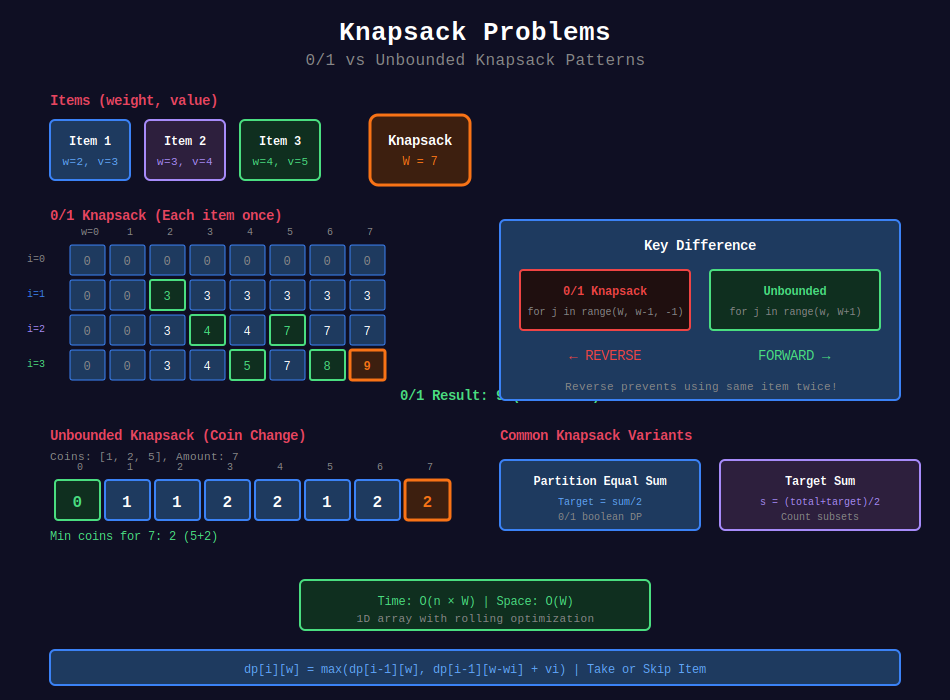

<div align="center">

# 🎒 Knapsack Problems

<p>
  
  
</p>

</div>

---

## 🧭 Navigation

| ⬅️ Previous | 📂 Current | ➡️ Next |
|:------------|:----------:|--------:|
| [← 02. 2D DP](../02_2d_dp/README.md) | **03. Knapsack** | [04. String DP →](../04_string_dp/README.md) |

---

## 📊 Visual Guide

<div align="center">
  
</div>

---

## 📐 Mathematical Foundations

### 1️⃣ 0/1 Knapsack

Each item used at most once:

$$
dp[i][w] = \max(dp[i-1][w], dp[i-1][w-w_i] + v_i)
$$

**Time:** O(nW), **Space:** O(W)

---

### 2️⃣ Unbounded Knapsack

Each item can be used unlimited times:

$$
dp[w] = \max(dp[w], dp[w-w_i] + v_i)
$$

---

### 3️⃣ Bounded Knapsack

Each item has limited quantity $q\_i$:

$$
dp[i][w] = \max_{k=0}^{q_i}(dp[i-1][w-k \cdot w_i] + k \cdot v_i)
$$

---

## 💻 Code Implementations

```python
def canPartition(nums: list[int]) -> bool:
    """
    Partition Equal Subset Sum (LeetCode 416).
    
    0/1 Knapsack: can we select subset summing to total/2?
    
    Time: O(n × sum), Space: O(sum)
    """
    total = sum(nums)
    if total % 2 == 1:
        return False
    
    target = total // 2
    dp = [False] * (target + 1)
    dp[0] = True
    
    for num in nums:
        for j in range(target, num - 1, -1):  # Reverse!
            dp[j] = dp[j] or dp[j - num]
    
    return dp[target]

def coinChange(coins: list[int], amount: int) -> int:
    """
    Coin Change (LeetCode 322).
    
    Unbounded Knapsack: minimum coins.
    
    Time: O(n × amount), Space: O(amount)
    """
    dp = [float('inf')] * (amount + 1)
    dp[0] = 0
    
    for coin in coins:
        for a in range(coin, amount + 1):  # Forward!
            dp[a] = min(dp[a], dp[a - coin] + 1)
    
    return dp[amount] if dp[amount] != float('inf') else -1

def change(amount: int, coins: list[int]) -> int:
    """
    Coin Change II (LeetCode 518).
    
    Unbounded Knapsack: count ways.
    
    Time: O(n × amount), Space: O(amount)
    """
    dp = [0] * (amount + 1)
    dp[0] = 1
    
    for coin in coins:
        for a in range(coin, amount + 1):
            dp[a] += dp[a - coin]
    
    return dp[amount]

def findTargetSumWays(nums: list[int], target: int) -> int:
    """
    Target Sum (LeetCode 494).
    
    0/1 Knapsack variant: count subsets with sum = (total + target) / 2
    
    Time: O(n × sum), Space: O(sum)
    """
    total = sum(nums)
    if (total + target) % 2 != 0 or abs(target) > total:
        return 0
    
    s = (total + target) // 2
    dp = [0] * (s + 1)
    dp[0] = 1
    
    for num in nums:
        for j in range(s, num - 1, -1):
            dp[j] += dp[j - num]
    
    return dp[s]

def numSquares(n: int) -> int:
    """
    Perfect Squares (LeetCode 279).
    
    Unbounded Knapsack with squares.
    
    Time: O(n√n), Space: O(n)
    """
    dp = [float('inf')] * (n + 1)
    dp[0] = 0
    
    for i in range(1, n + 1):
        j = 1
        while j * j <= i:
            dp[i] = min(dp[i], dp[i - j * j] + 1)
            j += 1
    
    return dp[n]

def lastStoneWeightII(stones: list[int]) -> int:
    """
    Last Stone Weight II (LeetCode 1049).
    
    Minimize |sum1 - sum2| = minimize 2*sum2 from total.
    
    Time: O(n × sum), Space: O(sum)
    """
    total = sum(stones)
    target = total // 2
    
    dp = [False] * (target + 1)
    dp[0] = True
    
    for stone in stones:
        for j in range(target, stone - 1, -1):
            dp[j] = dp[j] or dp[j - stone]
    
    # Find largest achievable sum <= target
    for j in range(target, -1, -1):
        if dp[j]:
            return total - 2 * j
    
    return total
```

---

## 🏆 LeetCode Problems

### 🟡 Medium

| # | Problem | Type | Time | Space |
|:-:|---------|------|:----:|:-----:|
| 279 | [Perfect Squares](https://leetcode.com/problems/perfect-squares/) | Unbounded | O(n√n) | O(n) |
| 322 | [Coin Change](https://leetcode.com/problems/coin-change/) | Unbounded | O(n×a) | O(a) |
| 377 | [Combination Sum IV](https://leetcode.com/problems/combination-sum-iv/) | Unbounded | O(n×t) | O(t) |
| 416 | [Partition Equal Subset](https://leetcode.com/problems/partition-equal-subset-sum/) | 0/1 | O(n×s) | O(s) |
| 494 | [Target Sum](https://leetcode.com/problems/target-sum/) | 0/1 | O(n×s) | O(s) |
| 518 | [Coin Change II](https://leetcode.com/problems/coin-change-ii/) | Unbounded | O(n×a) | O(a) |
| 1049 | [Last Stone Weight II](https://leetcode.com/problems/last-stone-weight-ii/) | 0/1 | O(n×s) | O(s) |

---

## 📊 Knapsack Pattern

```
0/1 Knapsack: for j in range(target, num-1, -1)  # Reverse
Unbounded:    for j in range(num, target+1)      # Forward
```

---

## 📚 References

| Resource | Link |
|----------|------|
| **Knapsack** | [Wikipedia](https://en.wikipedia.org/wiki/Knapsack_problem) |

---

<div align="center">

**Made with ❤️ by [Gaurav Goswami](https://github.com/Gaurav14cs17)**

</div>

---

## 🧭 Navigation

| ⬅️ Previous | 📂 Current | ➡️ Next |
|:------------|:----------:|--------:|
| [← 02. 2D DP](../02_2d_dp/README.md) | **03. Knapsack** | [04. String DP →](../04_string_dp/README.md) |
