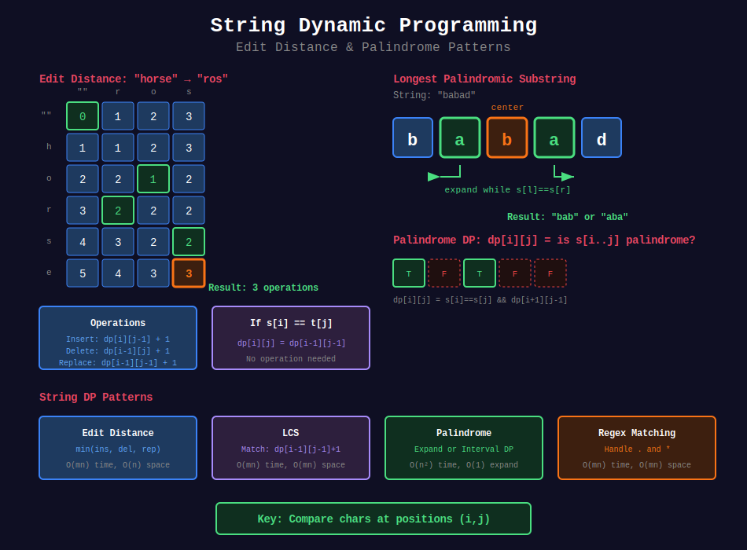

<div align="center">

# 🔤 String DP

<p>
  
  
</p>

</div>

---

## 🧭 Navigation

| ⬅️ Previous | 📂 Current | ➡️ Next |
|:------------|:----------:|--------:|
| [← 03. Knapsack](../03_knapsack/README.md) | **04. String DP** | [05. Tree DP →](../05_tree_dp/README.md) |

---

## 📊 Visual Guide

<div align="center">
  
</div>

---

## 📐 Mathematical Foundations

### 1️⃣ Edit Distance

$$dp[i][j] = \begin{cases}
dp[i-1][j-1] & \text{if } s[i] = t[j] \\
1 + \min(dp[i-1][j], dp[i][j-1], dp[i-1][j-1]) & \text{otherwise}
\end{cases}$$

---

### 2️⃣ Palindrome DP

$$dp[i][j] = \begin{cases}
\text{true} & \text{if } i \geq j \\
s[i] = s[j] \land dp[i+1][j-1] & \text{otherwise}
\end{cases}$$

---

## 💻 Code Implementations

```python
def minDistance(word1: str, word2: str) -> int:
    """
    Edit Distance (LeetCode 72).
    
    Time: O(mn), Space: O(n)
    """
    m, n = len(word1), len(word2)
    dp = list(range(n + 1))
    
    for i in range(1, m + 1):
        prev = dp[0]
        dp[0] = i
        for j in range(1, n + 1):
            temp = dp[j]
            if word1[i - 1] == word2[j - 1]:
                dp[j] = prev
            else:
                dp[j] = 1 + min(prev, dp[j], dp[j - 1])
            prev = temp
    
    return dp[n]

def longestPalindrome(s: str) -> str:
    """
    Longest Palindromic Substring (LeetCode 5).
    
    Expand around center approach.
    
    Time: O(n²), Space: O(1)
    """
    def expand(left, right):
        while left >= 0 and right < len(s) and s[left] == s[right]:
            left -= 1
            right += 1
        return left + 1, right - 1
    
    start, end = 0, 0
    for i in range(len(s)):
        l1, r1 = expand(i, i)      # Odd length
        l2, r2 = expand(i, i + 1)  # Even length
        
        if r1 - l1 > end - start:
            start, end = l1, r1
        if r2 - l2 > end - start:
            start, end = l2, r2
    
    return s[start:end + 1]

def isMatch(s: str, p: str) -> bool:
    """
    Regular Expression Matching (LeetCode 10).
    
    Time: O(mn), Space: O(mn)
    """
    m, n = len(s), len(p)
    dp = [[False] * (n + 1) for _ in range(m + 1)]
    dp[0][0] = True
    
    # Handle patterns like a*, a*b*, etc.
    for j in range(2, n + 1):
        if p[j - 1] == '*':
            dp[0][j] = dp[0][j - 2]
    
    for i in range(1, m + 1):
        for j in range(1, n + 1):
            if p[j - 1] == '*':
                # Zero match or one+ match
                dp[i][j] = dp[i][j - 2] or (
                    dp[i - 1][j] and (p[j - 2] == '.' or p[j - 2] == s[i - 1])
                )
            elif p[j - 1] == '.' or p[j - 1] == s[i - 1]:
                dp[i][j] = dp[i - 1][j - 1]
    
    return dp[m][n]

def numDistinct(s: str, t: str) -> int:
    """
    Distinct Subsequences (LeetCode 115).
    
    Count subsequences of s equal to t.
    
    Time: O(mn), Space: O(n)
    """
    m, n = len(s), len(t)
    dp = [0] * (n + 1)
    dp[0] = 1
    
    for i in range(1, m + 1):
        for j in range(min(i, n), 0, -1):
            if s[i - 1] == t[j - 1]:
                dp[j] += dp[j - 1]
    
    return dp[n]

```

---

## 🏆 LeetCode Problems

### 🟡 Medium

| # | Problem | Pattern | Time | Space |
|:-:|---------|---------|:----:|:-----:|
| 5 | [Longest Palindromic Substring](https://leetcode.com/problems/longest-palindromic-substring/) | Expand | O(n²) | O(1) |
| 516 | [Longest Palindromic Subseq](https://leetcode.com/problems/longest-palindromic-subsequence/) | 2D DP | O(n²) | O(n²) |
| 647 | [Palindromic Substrings](https://leetcode.com/problems/palindromic-substrings/) | Expand | O(n²) | O(1) |
| 1143 | [LCS](https://leetcode.com/problems/longest-common-subsequence/) | 2D DP | O(mn) | O(mn) |

### 🔴 Hard

| # | Problem | Pattern | Time | Space |
|:-:|---------|---------|:----:|:-----:|
| 10 | [Regular Expression Matching](https://leetcode.com/problems/regular-expression-matching/) | 2D DP | O(mn) | O(mn) |
| 44 | [Wildcard Matching](https://leetcode.com/problems/wildcard-matching/) | 2D DP | O(mn) | O(mn) |
| 72 | [Edit Distance](https://leetcode.com/problems/edit-distance/) | 2D DP | O(mn) | O(n) |
| 115 | [Distinct Subsequences](https://leetcode.com/problems/distinct-subsequences/) | 2D DP | O(mn) | O(n) |

---

## 📚 References

| Resource | Link |
|----------|------|
| **Edit Distance** | [Wikipedia](https://en.wikipedia.org/wiki/Edit_distance) |

---

<div align="center">

**Made with ❤️ by [Gaurav Goswami](https://github.com/Gaurav14cs17)**

</div>

---

## 🧭 Navigation

| ⬅️ Previous | 📂 Current | ➡️ Next |
|:------------|:----------:|--------:|
| [← 03. Knapsack](../03_knapsack/README.md) | **04. String DP** | [05. Tree DP →](../05_tree_dp/README.md) |
