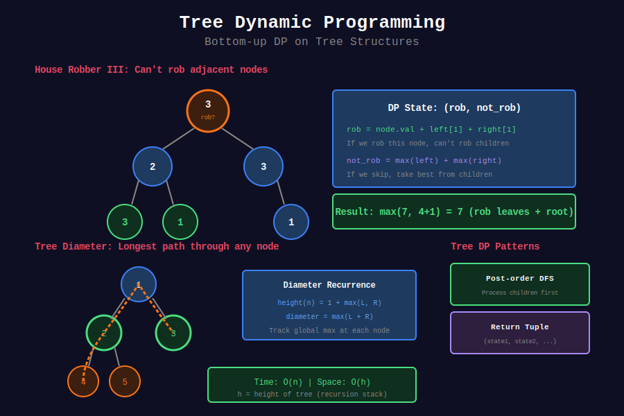

<div align="center">

# 🌲 Tree DP

<p>
  
  
</p>

</div>

---

## 🧭 Navigation

| ⬅️ Previous | 📂 Current | ➡️ Next |
|:------------|:----------:|--------:|
| [← 04. String DP](../04_string_dp/README.md) | **05. Tree DP** | [06. State Machine DP →](../06_state_machine_dp/README.md) |

---

## 📊 Visual Guide

<div align="center">
  
</div>

---

## 📐 Mathematical Foundations

### 1️⃣ Tree DP Pattern

Compute DP values bottom-up (post-order):

```math
dp[node] = f(dp[left], dp[right], node.val)

```

---

### 2️⃣ House Robber III

```math
dp[node] = (\text{rob}, \text{not\_rob})
\text{rob} = node.val + \text{not\_rob}_{left} + \text{not\_rob}_{right}
\text{not\_rob} = \max(dp_{left}) + \max(dp_{right})

```

---

## 💻 Code Implementations

```python
def rob(root: TreeNode) -> int:
    """
    House Robber III (LeetCode 337).
    
    Can't rob adjacent (parent-child) nodes.
    
    Time: O(n), Space: O(h)
    """
    def dfs(node):
        if not node:
            return (0, 0)  # (rob, not_rob)
        
        left = dfs(node.left)
        right = dfs(node.right)
        
        rob = node.val + left[1] + right[1]
        not_rob = max(left) + max(right)
        
        return (rob, not_rob)
    
    return max(dfs(root))

def maxPathSum(root: TreeNode) -> int:
    """
    Binary Tree Maximum Path Sum (LeetCode 124).
    
    Time: O(n), Space: O(h)
    """
    result = [float('-inf')]
    
    def dfs(node):
        if not node:
            return 0
        
        left = max(0, dfs(node.left))
        right = max(0, dfs(node.right))
        
        # Path through this node
        result[0] = max(result[0], left + right + node.val)
        
        # Return max single path from this node
        return node.val + max(left, right)
    
    dfs(root)
    return result[0]

def diameterOfBinaryTree(root: TreeNode) -> int:
    """
    Diameter of Binary Tree (LeetCode 543).
    
    Time: O(n), Space: O(h)
    """
    result = [0]
    
    def height(node):
        if not node:
            return 0
        
        left = height(node.left)
        right = height(node.right)
        
        result[0] = max(result[0], left + right)
        return 1 + max(left, right)
    
    height(root)
    return result[0]

def longestUnivaluePath(root: TreeNode) -> int:
    """
    Longest Univalue Path (LeetCode 687).
    
    Time: O(n), Space: O(h)
    """
    result = [0]
    
    def dfs(node):
        if not node:
            return 0
        
        left = dfs(node.left)
        right = dfs(node.right)
        
        left_path = left + 1 if node.left and node.left.val == node.val else 0
        right_path = right + 1 if node.right and node.right.val == node.val else 0
        
        result[0] = max(result[0], left_path + right_path)
        return max(left_path, right_path)
    
    dfs(root)
    return result[0]

```

---

## 🏆 LeetCode Problems

### 🟢 Easy

| # | Problem | Pattern | Time | Space |
|:-:|---------|---------|:----:|:-----:|
| 543 | [Diameter of Binary Tree](https://leetcode.com/problems/diameter-of-binary-tree/) | Max Path | O(n) | O(h) |

### 🟡 Medium

| # | Problem | Pattern | Time | Space |
|:-:|---------|---------|:----:|:-----:|
| 337 | [House Robber III](https://leetcode.com/problems/house-robber-iii/) | Rob/Not Rob | O(n) | O(h) |
| 687 | [Longest Univalue Path](https://leetcode.com/problems/longest-univalue-path/) | Path | O(n) | O(h) |

### 🔴 Hard

| # | Problem | Pattern | Time | Space |
|:-:|---------|---------|:----:|:-----:|
| 124 | [Binary Tree Max Path Sum](https://leetcode.com/problems/binary-tree-maximum-path-sum/) | Max Path | O(n) | O(h) |

---

## 📚 References

| Resource | Link |
|----------|------|
| **Tree DP** | [CP-Algorithms](https://cp-algorithms.com/graph/tree_dp.html) |

---

<div align="center">

**Made with ❤️ by [Gaurav Goswami](https://github.com/Gaurav14cs17)**

</div>

---

## 🧭 Navigation

| ⬅️ Previous | 📂 Current | ➡️ Next |
|:------------|:----------:|--------:|
| [← 04. String DP](../04_string_dp/README.md) | **05. Tree DP** | [06. State Machine DP →](../06_state_machine_dp/README.md) |
