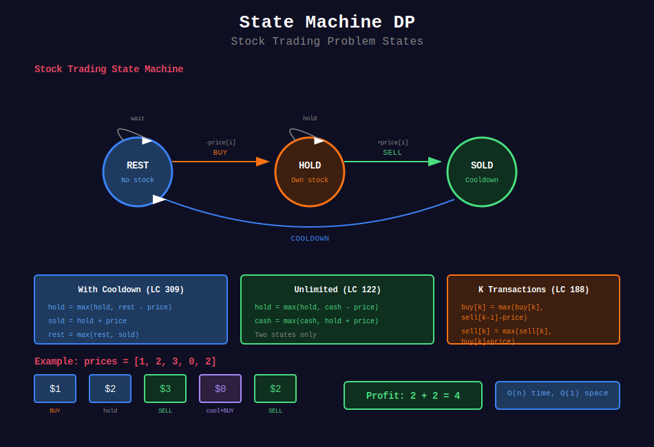

<div align="center">

# 🔄 State Machine DP

<p>
  
  
</p>

</div>

---

## 🧭 Navigation

| ⬅️ Previous | 📂 Current | ➡️ Next |
|:------------|:----------:|--------:|
| [← 05. Tree DP](../05_tree_dp/README.md) | **06. State Machine DP** | [07. Bitmask DP →](../07_bitmask_dp/README.md) |

---

## 📊 Visual Guide

<div align="center">
  
</div>

---

## 📐 Mathematical Foundations

### 1️⃣ State Machine Pattern

Track multiple states at each position:

$$dp[i][\text{state}] = \text{optimal value at position } i \text{ in state}$$

---

### 2️⃣ Stock Trading States

```
        buy          sell
[rest] -----> [hold] -----> [sold]
  ^                            |
  |____________________________|
              rest

```

---

### 3️⃣ General Stock Formula

$$\text{hold}[i] = \max(\text{hold}[i-1], \text{rest}[i-1] - \text{price}[i])
\text{sold}[i] = \text{hold}[i-1] + \text{price}[i]
\text{rest}[i] = \max(\text{rest}[i-1], \text{sold}[i-1])$$

---

## 💻 Code Implementations

```python
def maxProfit(prices: list[int]) -> int:
    """
    Best Time to Buy and Sell Stock II (LeetCode 122).
    
    Unlimited transactions.
    
    Time: O(n), Space: O(1)
    """
    hold = float('-inf')
    cash = 0
    
    for price in prices:
        hold = max(hold, cash - price)
        cash = max(cash, hold + price)
    
    return cash

def maxProfitWithCooldown(prices: list[int]) -> int:
    """
    Best Time with Cooldown (LeetCode 309).
    
    Must wait 1 day after selling.
    
    Time: O(n), Space: O(1)
    """
    hold = float('-inf')
    sold = 0
    rest = 0
    
    for price in prices:
        prev_hold = hold
        hold = max(hold, rest - price)
        rest = max(rest, sold)
        sold = prev_hold + price
    
    return max(sold, rest)

def maxProfitWithFee(prices: list[int], fee: int) -> int:
    """
    Best Time with Transaction Fee (LeetCode 714).
    
    Pay fee on each sell.
    
    Time: O(n), Space: O(1)
    """
    hold = float('-inf')
    cash = 0
    
    for price in prices:
        hold = max(hold, cash - price)
        cash = max(cash, hold + price - fee)
    
    return cash

def maxProfitIII(prices: list[int]) -> int:
    """
    Best Time III (LeetCode 123).
    
    At most 2 transactions.
    
    Time: O(n), Space: O(1)
    """
    buy1 = buy2 = float('-inf')
    sell1 = sell2 = 0
    
    for price in prices:
        buy1 = max(buy1, -price)
        sell1 = max(sell1, buy1 + price)
        buy2 = max(buy2, sell1 - price)
        sell2 = max(sell2, buy2 + price)
    
    return sell2

def maxProfitIV(k: int, prices: list[int]) -> int:
    """
    Best Time IV (LeetCode 188).
    
    At most k transactions.
    
    Time: O(nk), Space: O(k)
    """
    if not prices:
        return 0
    
    if k >= len(prices) // 2:
        # Unlimited transactions
        return sum(max(0, prices[i+1] - prices[i]) 
                   for i in range(len(prices) - 1))
    
    buy = [float('-inf')] * (k + 1)
    sell = [0] * (k + 1)
    
    for price in prices:
        for i in range(1, k + 1):
            buy[i] = max(buy[i], sell[i-1] - price)
            sell[i] = max(sell[i], buy[i] + price)
    
    return sell[k]

```

---

## 🏆 LeetCode Problems

### 🟢 Easy

| # | Problem | States | Time | Space |
|:-:|---------|--------|:----:|:-----:|
| 121 | [Best Time I](https://leetcode.com/problems/best-time-to-buy-and-sell-stock/) | min track | O(n) | O(1) |

### 🟡 Medium

| # | Problem | States | Time | Space |
|:-:|---------|--------|:----:|:-----:|
| 122 | [Best Time II](https://leetcode.com/problems/best-time-to-buy-and-sell-stock-ii/) | hold/cash | O(n) | O(1) |
| 309 | [With Cooldown](https://leetcode.com/problems/best-time-to-buy-and-sell-stock-with-cooldown/) | hold/sold/rest | O(n) | O(1) |
| 714 | [With Transaction Fee](https://leetcode.com/problems/best-time-to-buy-and-sell-stock-with-transaction-fee/) | hold/cash | O(n) | O(1) |

### 🔴 Hard

| # | Problem | States | Time | Space |
|:-:|---------|--------|:----:|:-----:|
| 123 | [Best Time III](https://leetcode.com/problems/best-time-to-buy-and-sell-stock-iii/) | 2 trans | O(n) | O(1) |
| 188 | [Best Time IV](https://leetcode.com/problems/best-time-to-buy-and-sell-stock-iv/) | k trans | O(nk) | O(k) |

---

## 📚 References

| Resource | Link |
|----------|------|
| **State Machine DP** | [LeetCode Guide](https://leetcode.com/problems/best-time-to-buy-and-sell-stock-with-transaction-fee/solutions/108870/) |

---

<div align="center">

**Made with ❤️ by [Gaurav Goswami](https://github.com/Gaurav14cs17)**

</div>

---

## 🧭 Navigation

| ⬅️ Previous | 📂 Current | ➡️ Next |
|:------------|:----------:|--------:|
| [← 05. Tree DP](../05_tree_dp/README.md) | **06. State Machine DP** | [07. Bitmask DP →](../07_bitmask_dp/README.md) |
