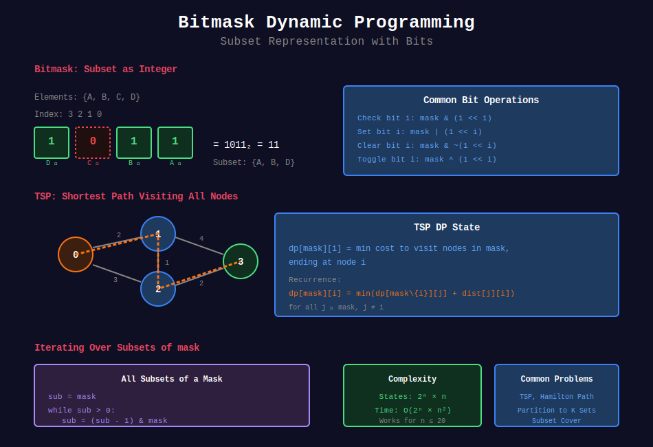

<div align="center">

# 🎭 Bitmask DP

<p>
  
  
</p>

</div>

---

## 🧭 Navigation

| ⬅️ Previous | 📂 Current | ➡️ Next |
|:------------|:----------:|--------:|
| [← 06. State Machine DP](../06_state_machine_dp/README.md) | **07. Bitmask DP** | [08. Digit DP →](../08_digit_dp/README.md) |

---

## 📊 Visual Guide

<div align="center">
  
</div>

---

## 📐 Mathematical Foundations

### 1️⃣ Bitmask Representation

Subset of $n$ elements as $n$-bit integer:

```math
\text{bit } i = 1 \Leftrightarrow \text{element } i \in \text{subset}
```

**States:** $2^n$

---

### 2️⃣ Common Operations

| Operation | Code |
|-----------|------|
| Check bit i | `mask & (1 << i)` |
| Set bit i | `mask \| (1 << i)` |
| Clear bit i | `mask & ~(1 << i)` |
| Toggle bit i | `mask ^ (1 << i)` |
| Count bits | `bin(mask).count('1')` |

---

### 3️⃣ TSP Recurrence

```math
dp[\text{mask}][i] = \min_{j \in \text{mask}} (dp[\text{mask} \setminus \{i\}][j] + dist[j][i])
```

---

## 💻 Code Implementations

```python
def shortestPathLength(graph: list[list[int]]) -> int:
    """
    Shortest Path Visiting All Nodes (LeetCode 847).
    
    BFS with bitmask state.
    
    Time: O(2^n × n²), Space: O(2^n × n)
    """
    from collections import deque
    
    n = len(graph)
    target = (1 << n) - 1
    
    # (node, visited_mask)
    queue = deque([(i, 1 << i, 0) for i in range(n)])
    visited = {(i, 1 << i) for i in range(n)}
    
    while queue:
        node, mask, dist = queue.popleft()
        
        if mask == target:
            return dist
        
        for neighbor in graph[node]:
            new_mask = mask | (1 << neighbor)
            if (neighbor, new_mask) not in visited:
                visited.add((neighbor, new_mask))
                queue.append((neighbor, new_mask, dist + 1))
    
    return -1

def countArrangement(n: int) -> int:
    """
    Beautiful Arrangement (LeetCode 526).
    
    Count permutations where i divides a[i] or vice versa.
    
    Time: O(2^n × n), Space: O(2^n)
    """
    @lru_cache(maxsize=None)
    def dp(mask, pos):
        if pos > n:
            return 1
        
        count = 0
        for i in range(1, n + 1):
            if not (mask & (1 << i)) and (i % pos == 0 or pos % i == 0):
                count += dp(mask | (1 << i), pos + 1)
        
        return count
    
    from functools import lru_cache
    return dp(0, 1)

def canPartitionKSubsets(nums: list[int], k: int) -> bool:
    """
    Partition to K Equal Sum Subsets (LeetCode 698).
    
    Time: O(k × 2^n), Space: O(2^n)
    """
    total = sum(nums)
    if total % k != 0:
        return False
    
    target = total // k
    n = len(nums)
    
    @lru_cache(maxsize=None)
    def dp(mask, current_sum):
        if mask == (1 << n) - 1:
            return True
        
        for i in range(n):
            if mask & (1 << i):
                continue
            
            new_sum = current_sum + nums[i]
            if new_sum > target:
                continue
            
            new_mask = mask | (1 << i)
            if new_sum == target:
                if dp(new_mask, 0):
                    return True
            else:
                if dp(new_mask, new_sum):
                    return True
        
        return False
    
    from functools import lru_cache
    nums.sort(reverse=True)
    return dp(0, 0)

def minStickers(stickers: list[str], target: str) -> int:
    """
    Stickers to Spell Word (LeetCode 691).
    
    Time: O(2^n × m × L), Space: O(2^n)
    """
    from functools import lru_cache
    from collections import Counter
    
    n = len(target)
    sticker_counts = [Counter(s) for s in stickers]
    
    @lru_cache(maxsize=None)
    def dp(mask):
        if mask == (1 << n) - 1:
            return 0
        
        result = float('inf')
        
        for sticker in sticker_counts:

            # Use sticker only if it helps
            remaining = dict(sticker)
            new_mask = mask
            
            for i in range(n):
                if not (mask & (1 << i)) and target[i] in remaining and remaining[target[i]] > 0:
                    remaining[target[i]] -= 1
                    new_mask |= (1 << i)
            
            if new_mask != mask:
                result = min(result, 1 + dp(new_mask))
        
        return result
    
    ans = dp(0)
    return ans if ans != float('inf') else -1
```

---

## 🏆 LeetCode Problems

### 🟡 Medium

| # | Problem | Pattern | Time | Space |
|:-:|---------|---------|:----:|:-----:|
| 526 | [Beautiful Arrangement](https://leetcode.com/problems/beautiful-arrangement/) | Permutation | O(2^n×n) | O(2^n) |
| 698 | [Partition to K Equal Sum](https://leetcode.com/problems/partition-to-k-equal-sum-subsets/) | Subset | O(k×2^n) | O(2^n) |

### 🔴 Hard

| # | Problem | Pattern | Time | Space |
|:-:|---------|---------|:----:|:-----:|
| 691 | [Stickers to Spell Word](https://leetcode.com/problems/stickers-to-spell-word/) | Subset Cover | O(2^n×mL) | O(2^n) |
| 847 | [Shortest Path All Nodes](https://leetcode.com/problems/shortest-path-visiting-all-nodes/) | TSP | O(2^n×n²) | O(2^n×n) |
| 943 | [Shortest Superstring](https://leetcode.com/problems/find-the-shortest-superstring/) | TSP | O(2^n×n²) | O(2^n×n) |

---

## 📚 References

| Resource | Link |
|----------|------|
| **Bitmask DP** | [CP-Algorithms](https://cp-algorithms.com/algebra/all-submasks.html) |
| **TSP** | [Wikipedia](https://en.wikipedia.org/wiki/Travelling_salesman_problem) |

---

<div align="center">

**Made with ❤️ by [Gaurav Goswami](https://github.com/Gaurav14cs17)**

</div>

---

## 🧭 Navigation

| ⬅️ Previous | 📂 Current | ➡️ Next |
|:------------|:----------:|--------:|
| [← 06. State Machine DP](../06_state_machine_dp/README.md) | **07. Bitmask DP** | [08. Digit DP →](../08_digit_dp/README.md) |
