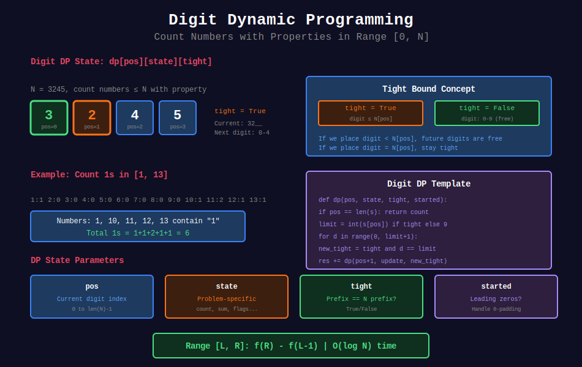

<div align="center">

# 🔢 Digit DP

<p>
  
  
</p>

</div>

---

## 🧭 Navigation

| ⬅️ Previous | 📂 Current | ➡️ Next Topic |
|:------------|:----------:|--------:|
| [← 07. Bitmask DP](../07_bitmask_dp/README.md) | **08. Digit DP** | [🏠 DP Home](../README.md) → [Greedy](../../19_greedy_algorithms/README.md) |

---

## 📊 Visual Guide

<div align="center">
  
</div>

---

## 📐 Mathematical Foundations

### 1️⃣ Digit DP Pattern

Count numbers in range $[0, N]$ satisfying property:

```math
dp[\text{pos}][\text{state}][\text{tight}]
```

- **pos:** Current digit position
- **state:** Problem-specific state
- **tight:** Is current prefix equal to N's prefix?

---

### 2️⃣ Range Query

```math
\text{count}[L, R] = f(R) - f(L-1)
```

---

### 3️⃣ Tight Bound

If tight = true, next digit can be 0 to N[pos].
If tight = false, next digit can be 0 to 9.

---

## 💻 Code Implementations

```python
def countDigitOne(n: int) -> int:
    """
    Number of Digit One (LeetCode 233).
    
    Count 1s in all numbers from 1 to n.
    
    Time: O(log n), Space: O(log n)
    """
    if n <= 0:
        return 0
    
    s = str(n)
    
    @lru_cache(maxsize=None)
    def dp(pos, count, tight, started):
        if pos == len(s):
            return count
        
        limit = int(s[pos]) if tight else 9
        result = 0
        
        for digit in range(0, limit + 1):
            new_tight = tight and digit == limit
            new_started = started or digit > 0
            new_count = count + (1 if digit == 1 else 0)
            
            result += dp(pos + 1, new_count, new_tight, new_started)
        
        return result
    
    from functools import lru_cache
    return dp(0, 0, True, False)

def countNumbersWithUniqueDigits(n: int) -> int:
    """
    Count Numbers with Unique Digits (LeetCode 357).
    
    Time: O(n), Space: O(1)
    """
    if n == 0:
        return 1
    
    result = 10  # 0-9
    unique = 9
    available = 9
    
    for i in range(2, min(n + 1, 11)):
        unique *= available
        result += unique
        available -= 1
    
    return result

def atMostNGivenDigitSet(digits: list[str], n: int) -> int:
    """
    Numbers At Most N Given Digit Set (LeetCode 902).
    
    Time: O(log n), Space: O(log n)
    """
    s = str(n)
    k = len(s)
    d = len(digits)
    
    # Count numbers with fewer digits
    result = sum(d ** i for i in range(1, k))
    
    # Count numbers with same number of digits
    for i, c in enumerate(s):

        # Count digits smaller than current
        smaller = sum(1 for digit in digits if digit < c)
        result += smaller * (d ** (k - i - 1))
        
        # If current digit not in set, stop
        if c not in digits:
            break
        
        # If we reach the end, add 1 for n itself
        if i == k - 1:
            result += 1
    
    return result

def digitsCount(d: int, low: int, high: int) -> int:
    """
    Digit Count in Range (LeetCode 1067).
    
    Count occurrences of digit d in [low, high].
    
    Time: O(log n), Space: O(log n)
    """
    def count(n, d):
        if n < 0:
            return 0
        
        s = str(n)
        
        @lru_cache(maxsize=None)
        def dp(pos, cnt, tight, started):
            if pos == len(s):
                return cnt
            
            limit = int(s[pos]) if tight else 9
            result = 0
            
            for digit in range(0, limit + 1):
                new_cnt = cnt + (1 if (started or digit > 0) and digit == d else 0)
                new_tight = tight and digit == limit
                new_started = started or digit > 0
                
                result += dp(pos + 1, new_cnt, new_tight, new_started)
            
            return result
        
        from functools import lru_cache
        return dp(0, 0, True, False)
    
    return count(high, d) - count(low - 1, d)
```

---

## 🏆 LeetCode Problems

### 🟡 Medium

| # | Problem | Pattern | Time | Space |
|:-:|---------|---------|:----:|:-----:|
| 357 | [Count Unique Digits](https://leetcode.com/problems/count-numbers-with-unique-digits/) | Counting | O(n) | O(1) |
| 902 | [Numbers At Most N Given Digit Set](https://leetcode.com/problems/numbers-at-most-n-given-digit-set/) | Digit DP | O(log n) | O(log n) |

### 🔴 Hard

| # | Problem | Pattern | Time | Space |
|:-:|---------|---------|:----:|:-----:|
| 233 | [Number of Digit One](https://leetcode.com/problems/number-of-digit-one/) | Digit DP | O(log n) | O(log n) |
| 1067 | [Digit Count in Range](https://leetcode.com/problems/digit-count-in-range/) | Digit DP | O(log n) | O(log n) |

---

## 📊 Digit DP Template

```python
def count(n: int) -> int:
    s = str(n)
    
    @lru_cache(maxsize=None)
    def dp(pos, state, tight, started):
        if pos == len(s):
            return base_case(state)
        
        limit = int(s[pos]) if tight else 9
        result = 0
        
        for digit in range(0, limit + 1):
            new_state = update(state, digit, started)
            new_tight = tight and digit == limit
            new_started = started or digit > 0
            
            result += dp(pos + 1, new_state, new_tight, new_started)
        
        return result
    
    return dp(0, initial_state, True, False)
```

---

## 📚 References

| Resource | Link |
|----------|------|
| **Digit DP** | [GeeksforGeeks](https://www.geeksforgeeks.org/digit-dp-introduction/) |

---

<div align="center">

**Made with ❤️ by [Gaurav Goswami](https://github.com/Gaurav14cs17)**

</div>

---

## 🧭 Navigation

| ⬅️ Previous | 📂 Current | ➡️ Next Topic |
|:------------|:----------:|--------:|
| [← 07. Bitmask DP](../07_bitmask_dp/README.md) | **08. Digit DP** | [🏠 DP Home](../README.md) → [Greedy](../../19_greedy_algorithms/README.md) |
