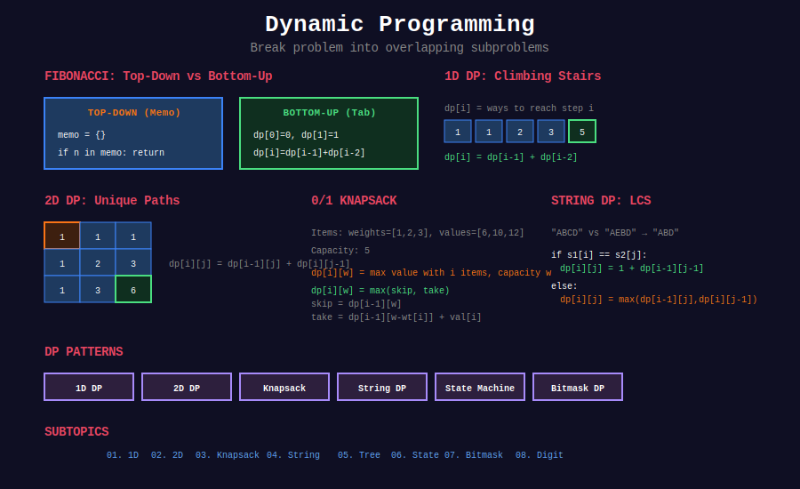

<div align="center">

# 📊 Dynamic Programming



<p>
  
  
  
</p>

**Optimal substructure + overlapping subproblems = DP**

[⬅️ Previous: Backtracking](../17_backtracking/README.md) | [🏠 Home](../README.md) | [Next: Greedy ➡️](../19_greedy_algorithms/README.md)

</div>

---

## 📐 Mathematical Foundation

### 1️⃣ DP Requirements

1. **Optimal Substructure:** Optimal solution contains optimal solutions to subproblems
2. **Overlapping Subproblems:** Same subproblems solved multiple times

---

### 2️⃣ Top-Down vs Bottom-Up

| Approach | Description | Pros | Cons |
|----------|-------------|------|------|
| **Memoization** | Recursion + cache | Natural, computes only needed | Stack overhead |
| **Tabulation** | Iterative, fill table | No stack, often faster | May compute unused states |

---

### 3️⃣ Classic Recurrences

| Problem | Recurrence |
|---------|------------|
| Fibonacci | $F(n) = F(n-1) + F(n-2)$ |
| Climbing Stairs | $dp[i] = dp[i-1] + dp[i-2]$ |
| Coin Change | $dp[a] = \min(dp[a], dp[a-c] + 1)$ |
| LCS | $dp[i][j] = dp[i-1][j-1] + 1$ if match |
| Edit Distance | $dp[i][j] = \min(dp[i-1][j], dp[i][j-1], dp[i-1][j-1]) + 1$ |
| 0/1 Knapsack | $dp[i][w] = \max(dp[i-1][w], dp[i-1][w-w_i] + v_i)$ |
| LIS | $dp[i] = \max(dp[j] + 1)$ for $j < i, a[j] < a[i]$ |

---

### 4️⃣ State Space Complexity

$$\text{Time} = O(\text{states} \times \text{transition cost})$$

$$\text{Space} = O(\text{states})$$

---

### 5️⃣ Space Optimization

Many 2D DP can be reduced to 1D:

$$\text{If } dp[i] \text{ only depends on } dp[i-1] \Rightarrow O(n) \text{ space}$$

---

## 📂 Subtopics Navigation

| # | Topic | Problems | Link |
|:-:|-------|:--------:|------|
| 1 | 1D DP | 15+ | [📖 Go →](./01_1d_dp/README.md) |
| 2 | 2D DP | 12+ | [📖 Go →](./02_2d_dp/README.md) |
| 3 | Knapsack | 10+ | [📖 Go →](./03_knapsack/README.md) |
| 4 | String DP | 12+ | [📖 Go →](./04_string_dp/README.md) |
| 5 | Tree DP | 8+ | [📖 Go →](./05_tree_dp/README.md) |
| 6 | State Machine DP | 8+ | [📖 Go →](./06_state_machine_dp/README.md) |
| 7 | Bitmask DP | 8+ | [📖 Go →](./07_bitmask_dp/README.md) |
| 8 | Digit DP | 6+ | [📖 Go →](./08_digit_dp/README.md) |

---

## 🎯 Key Patterns

### DP Template

```python
def solve(input):
    # 1. Define state: what information do we need?
    # 2. Define recurrence: how do states relate?
    # 3. Define base cases
    # 4. Define answer: which state(s) contain the answer?
    
    # Initialize
    dp = [base_value] * (n + 1)
    
    # Fill table
    for state in states:
        dp[state] = recurrence(dp, state)
    
    return dp[answer_state]
```

### Fibonacci (1D DP)

```python
def fib(n: int) -> int:
    if n <= 1:
        return n
    dp = [0, 1]
    for i in range(2, n + 1):
        dp.append(dp[-1] + dp[-2])
    return dp[n]
```

### LCS (2D DP)

```python
def longestCommonSubsequence(text1: str, text2: str) -> int:
    m, n = len(text1), len(text2)
    dp = [[0] * (n + 1) for _ in range(m + 1)]
    
    for i in range(1, m + 1):
        for j in range(1, n + 1):
            if text1[i-1] == text2[j-1]:
                dp[i][j] = dp[i-1][j-1] + 1
            else:
                dp[i][j] = max(dp[i-1][j], dp[i][j-1])
    
    return dp[m][n]
```

---

## 🏆 LeetCode Problems

### 🟢 Easy

| # | Problem | Pattern | Time | Space |
|:-:|---------|---------|:----:|:-----:|
| 70 | [Climbing Stairs](https://leetcode.com/problems/climbing-stairs/) | 1D | O(n) | O(1) |
| 121 | [Best Time to Buy Stock](https://leetcode.com/problems/best-time-to-buy-and-sell-stock/) | 1D | O(n) | O(1) |
| 198 | [House Robber](https://leetcode.com/problems/house-robber/) | 1D | O(n) | O(1) |
| 746 | [Min Cost Climbing Stairs](https://leetcode.com/problems/min-cost-climbing-stairs/) | 1D | O(n) | O(1) |

### 🟡 Medium

| # | Problem | Pattern | Time | Space |
|:-:|---------|---------|:----:|:-----:|
| 5 | [Longest Palindromic Substring](https://leetcode.com/problems/longest-palindromic-substring/) | 2D/Expand | O(n²) | O(n²) |
| 62 | [Unique Paths](https://leetcode.com/problems/unique-paths/) | 2D | O(mn) | O(n) |
| 64 | [Minimum Path Sum](https://leetcode.com/problems/minimum-path-sum/) | 2D | O(mn) | O(n) |
| 91 | [Decode Ways](https://leetcode.com/problems/decode-ways/) | 1D | O(n) | O(1) |
| 139 | [Word Break](https://leetcode.com/problems/word-break/) | 1D | O(n²) | O(n) |
| 152 | [Maximum Product Subarray](https://leetcode.com/problems/maximum-product-subarray/) | 1D | O(n) | O(1) |
| 213 | [House Robber II](https://leetcode.com/problems/house-robber-ii/) | 1D | O(n) | O(1) |
| 221 | [Maximal Square](https://leetcode.com/problems/maximal-square/) | 2D | O(mn) | O(n) |
| 279 | [Perfect Squares](https://leetcode.com/problems/perfect-squares/) | Unbounded Knapsack | O(n√n) | O(n) |
| 300 | [LIS](https://leetcode.com/problems/longest-increasing-subsequence/) | 1D/Binary | O(n log n) | O(n) |
| 322 | [Coin Change](https://leetcode.com/problems/coin-change/) | Unbounded Knapsack | O(n×a) | O(a) |
| 377 | [Combination Sum IV](https://leetcode.com/problems/combination-sum-iv/) | 1D | O(n×t) | O(t) |
| 416 | [Partition Equal Subset Sum](https://leetcode.com/problems/partition-equal-subset-sum/) | 0/1 Knapsack | O(n×s) | O(s) |
| 494 | [Target Sum](https://leetcode.com/problems/target-sum/) | 0/1 Knapsack | O(n×s) | O(s) |
| 516 | [Longest Palindromic Subseq](https://leetcode.com/problems/longest-palindromic-subsequence/) | 2D | O(n²) | O(n²) |
| 518 | [Coin Change II](https://leetcode.com/problems/coin-change-ii/) | Unbounded Knapsack | O(n×a) | O(a) |
| 1143 | [Longest Common Subsequence](https://leetcode.com/problems/longest-common-subsequence/) | 2D | O(mn) | O(mn) |

### 🔴 Hard

| # | Problem | Pattern | Time | Space |
|:-:|---------|---------|:----:|:-----:|
| 10 | [Regular Expression Matching](https://leetcode.com/problems/regular-expression-matching/) | 2D | O(mn) | O(mn) |
| 32 | [Longest Valid Parentheses](https://leetcode.com/problems/longest-valid-parentheses/) | 1D | O(n) | O(n) |
| 44 | [Wildcard Matching](https://leetcode.com/problems/wildcard-matching/) | 2D | O(mn) | O(mn) |
| 72 | [Edit Distance](https://leetcode.com/problems/edit-distance/) | 2D | O(mn) | O(mn) |
| 85 | [Maximal Rectangle](https://leetcode.com/problems/maximal-rectangle/) | Stack/DP | O(mn) | O(n) |
| 123 | [Best Time III](https://leetcode.com/problems/best-time-to-buy-and-sell-stock-iii/) | State Machine | O(n) | O(1) |
| 188 | [Best Time IV](https://leetcode.com/problems/best-time-to-buy-and-sell-stock-iv/) | State Machine | O(nk) | O(k) |
| 312 | [Burst Balloons](https://leetcode.com/problems/burst-balloons/) | Interval DP | O(n³) | O(n²) |
| 354 | [Russian Doll Envelopes](https://leetcode.com/problems/russian-doll-envelopes/) | LIS | O(n log n) | O(n) |
| 1235 | [Maximum Profit in Job Scheduling](https://leetcode.com/problems/maximum-profit-in-job-scheduling/) | 1D + Binary | O(n log n) | O(n) |

---

## 📊 DP Pattern Decision

```
DP Problem
    │
    ├── Single sequence → 1D DP
    │
    ├── Two sequences → 2D DP (LCS, Edit Distance)
    │
    ├── Items with weight/value → Knapsack
    │
    ├── String matching → String DP
    │
    ├── Tree structure → Tree DP
    │
    ├── Multiple states (buy/sell) → State Machine
    │
    ├── Subset selection → Bitmask DP
    │
    └── Counting with constraints → Digit DP
```

---

## 📚 References

| Resource | Link |
|----------|------|
| **Dynamic Programming** | [Wikipedia](https://en.wikipedia.org/wiki/Dynamic_programming) |
| **DP Patterns** | [LeetCode Guide](https://leetcode.com/discuss/study-guide/458695/) |

---

<div align="center">

**Made with ❤️ by [Gaurav Goswami](https://github.com/Gaurav14cs17)**

[⬅️ Previous: Backtracking](../17_backtracking/README.md) | [🏠 Home](../README.md) | [Next: Greedy ➡️](../19_greedy_algorithms/README.md)

</div>
