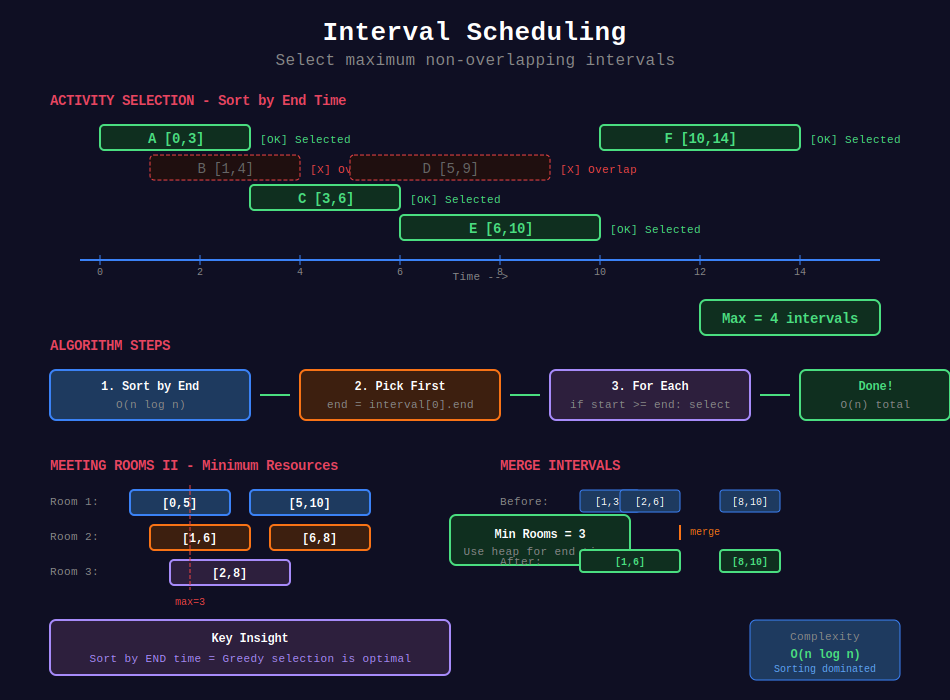

<div align="center">

# 📅 Interval Scheduling



<p>
  
  
</p>

</div>

---

## 🧭 Navigation

| ⬅️ Previous | 📂 Current | ➡️ Next |
|:------------|:----------:|--------:|
| [🏠 Greedy Home](../README.md) | **01. Interval Scheduling** | [02. Task Scheduling →](../02_task_scheduling/README.md) |

---

## 📐 Mathematical Foundations

### 1️⃣ Activity Selection

**Goal:** Select maximum non-overlapping intervals.

**Greedy Strategy:** Always pick interval with earliest end time.

```math
\text{Sort by } end_i, \text{ select if } start_i \geq \text{last\_end}

```

---

### 2️⃣ Interval Partitioning

**Goal:** Minimum rooms/resources to schedule all.

```math
\text{rooms} = \max(\text{concurrent intervals at any time})

```

---

### 3️⃣ Interval Covering

**Goal:** Minimum intervals to cover a range.

**Greedy:** Pick interval that extends coverage furthest.

---

## 💻 Code Implementations

```python
def eraseOverlapIntervals(intervals: list[list[int]]) -> int:
    """
    Non-overlapping Intervals (LeetCode 435).
    
    Minimum removals to make non-overlapping.
    
    Time: O(n log n), Space: O(1)
    """
    if not intervals:
        return 0
    
    # Sort by end time
    intervals.sort(key=lambda x: x[1])
    
    end = intervals[0][1]
    removals = 0
    
    for i in range(1, len(intervals)):
        if intervals[i][0] < end:
            # Overlaps - remove this one
            removals += 1
        else:
            # No overlap - update end
            end = intervals[i][1]
    
    return removals

def findMinArrowShots(points: list[list[int]]) -> int:
    """
    Minimum Arrows to Burst Balloons (LeetCode 452).
    
    Minimum arrows to hit all balloons.
    
    Time: O(n log n), Space: O(1)
    """
    if not points:
        return 0
    
    points.sort(key=lambda x: x[1])
    
    arrows = 1
    end = points[0][1]
    
    for start, finish in points[1:]:
        if start > end:
            arrows += 1
            end = finish
    
    return arrows

def merge(intervals: list[list[int]]) -> list[list[int]]:
    """
    Merge Intervals (LeetCode 56).
    
    Time: O(n log n), Space: O(n)
    """
    intervals.sort()
    merged = [intervals[0]]
    
    for start, end in intervals[1:]:
        if start <= merged[-1][1]:
            merged[-1][1] = max(merged[-1][1], end)
        else:
            merged.append([start, end])
    
    return merged

def minMeetingRooms(intervals: list[list[int]]) -> int:
    """
    Meeting Rooms II (LeetCode 253).
    
    Minimum rooms needed.
    
    Time: O(n log n), Space: O(n)
    """
    import heapq
    
    if not intervals:
        return 0
    
    intervals.sort()
    heap = []  # End times of ongoing meetings
    
    for start, end in intervals:
        if heap and heap[0] <= start:
            heapq.heappop(heap)
        heapq.heappush(heap, end)
    
    return len(heap)

def partitionLabels(s: str) -> list[int]:
    """
    Partition Labels (LeetCode 763).
    
    Partition so each letter appears in one part.
    
    Time: O(n), Space: O(1)
    """
    # Find last occurrence of each character
    last = {c: i for i, c in enumerate(s)}
    
    result = []
    start = end = 0
    
    for i, c in enumerate(s):
        end = max(end, last[c])
        
        if i == end:
            result.append(end - start + 1)
            start = end + 1
    
    return result

```

---

## 🏆 LeetCode Problems

### 🟢 Easy

| # | Problem | Pattern | Time | Space |
|:-:|---------|---------|:----:|:-----:|
| 252 | [Meeting Rooms](https://leetcode.com/problems/meeting-rooms/) | Sort + Check | O(n log n) | O(1) |

### 🟡 Medium

| # | Problem | Pattern | Time | Space |
|:-:|---------|---------|:----:|:-----:|
| 56 | [Merge Intervals](https://leetcode.com/problems/merge-intervals/) | Sort + Merge | O(n log n) | O(n) |
| 253 | [Meeting Rooms II](https://leetcode.com/problems/meeting-rooms-ii/) | Heap | O(n log n) | O(n) |
| 435 | [Non-overlapping Intervals](https://leetcode.com/problems/non-overlapping-intervals/) | Sort by End | O(n log n) | O(1) |
| 452 | [Minimum Arrows](https://leetcode.com/problems/minimum-number-of-arrows-to-burst-balloons/) | Sort by End | O(n log n) | O(1) |
| 763 | [Partition Labels](https://leetcode.com/problems/partition-labels/) | Last Occurrence | O(n) | O(1) |

---

## 📚 References

| Resource | Link |
|----------|------|
| **Interval Scheduling** | [Wikipedia](https://en.wikipedia.org/wiki/Interval_scheduling) |

---

<div align="center">

**Made with ❤️ by [Gaurav Goswami](https://github.com/Gaurav14cs17)**

</div>

---

## 🧭 Navigation

| ⬅️ Previous | 📂 Current | ➡️ Next |
|:------------|:----------:|--------:|
| [🏠 Greedy Home](../README.md) | **01. Interval Scheduling** | [02. Task Scheduling →](../02_task_scheduling/README.md) |
